# Legacy-Harness-Modernization-System

**A 9-agent AI pipeline that turns legacy COBOL into a validated Business Requirements Document (BRD).**

It produces a plain-English explanation of what a mainframe system does, backed by a data dictionary, a business-rules catalogue, and architecture diagrams, so a modernization team can rebuild the system *without reading COBOL*.

### How it works

The nine agents work across four phases:

1. **Parse:** Deterministic parsers extract program structure, data fields, and call relationships directly from the source code. Facts come from code, not from the LLM.
2. **Understand:** AI agents interpret those facts into business logic, rules, and data meaning.
3. **Document:** The pipeline assembles the BRD, data dictionary, business-rules catalogue, and Mermaid architecture diagrams.
4. **Validate:** Every output is checked against the original source, and each business rule is traced back to the code it came from.


Deterministic where possible, LLM only where needed, and it runs **with no API key**. Proven end-to-end on two different codebases: a 21-program Portfolio system and the full 44-program **AWS CardDemo**.

---

## Table of Contents

- [1. Overview](#1-overview)
- [2. End-to-End Workflow](#2-end-to-end-workflow)
- [3. Control-Flow and Run States](#3-control-flow-and-run-states)
- [4. Artifact Dependency Graph](#4-artifact-dependency-graph)
- [5. Design Principles](#5-design-principles)
- [6. Agent Catalog (per-agent flow)](#6-agent-catalog-per-agent-flow)
  - [Agent 1 — Discovery](#agent-1--discovery)
  - [Agent 2 — Parser](#agent-2--parser)
  - [Agent 3 — Topology](#agent-3--topology)
  - [Agent 4 — Context](#agent-4--context)
  - [Agent 5 — Data](#agent-5--data)
  - [Agent 6 — Logic](#agent-6--logic)
  - [Agent 7 — Rules](#agent-7--rules)
  - [Agent 8 — Diagram + BRD](#agent-8--diagram--brd)
  - [Agent 9 — Judge](#agent-9--judge)
- [7. Responsibility Matrix](#7-responsibility-matrix)
- [8. Proven on Two Codebases](#8-proven-on-two-codebases)
- [9. How to Run](#9-how-to-run)
- [10. Repository Layout](#10-repository-layout)
- [11. Notes and Credits](#11-notes-and-credits)

---

## 1. Overview

You point the harness at a folder of COBOL. It reads the code, understands it, and produces:

- 📇 an **inventory** of every program, copybook, and JCL job + a dependency graph
- 📖 a **data dictionary** (every field decoded — PIC, REDEFINES, OCCURS, 88-levels)
- 🧠 **plain-English pseudocode** for every paragraph
- 📋 a **business-rules catalogue** (validation / calculation / limit / routing rules, each traced to a real source line)
- 📊 **diagrams** (component map, ER diagram, per-program flows)
- 📄 a complete **Business Requirements Document** (`brd.md`)
- ✅ a **judge verdict** (PASS / REVISE) that validates and scores the BRD

The whole thing runs from a single orchestrator, `run_pipeline.py`, which chains nine agents in order.

---

## 2. End-to-End Workflow

The pipeline is a linear spine: raw COBOL enters at the top, and each agent enriches the picture until a validated BRD comes out the bottom.

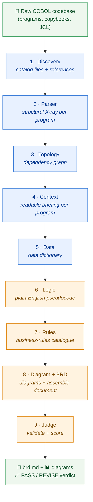

> 🔵 **Blue = deterministic** (pure Python, no LLM). 🟠 **Amber = hybrid** (Python + an LLM step for the *meaning*).

---

## 3. Control-Flow and Run States

`run_pipeline.py` is **interactive and resumable**. Before each phase it asks `[y/n/s]` — run it, stop, or skip to the next phase (reusing existing output). Deterministic phases are cheap to re-run; the LLM phases default to **skip** so you never spend tokens by accident.

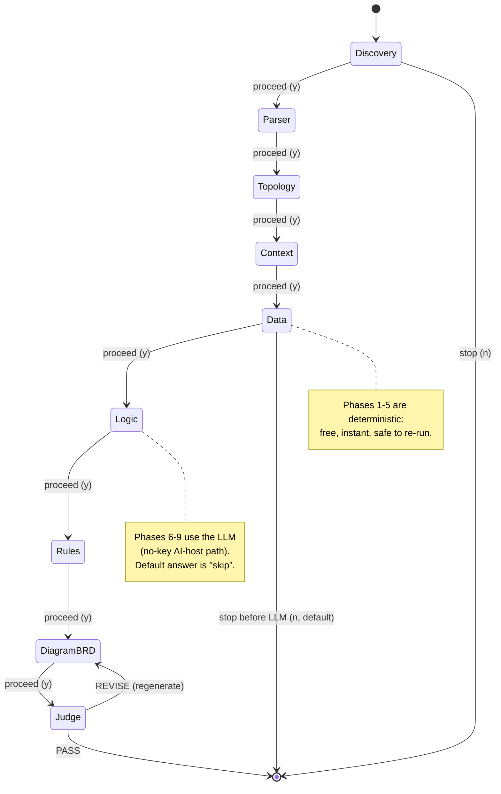

Each phase also self-checks: if its output already exists it offers **skip vs re-run**, and if an upstream artifact is missing it stops with a clear error instead of producing garbage.

---

## 4. Artifact Dependency Graph

Every agent writes a JSON/Markdown artifact that later agents read. This is *how* the groundedness discipline works — nothing is invented; each stage consumes the verified output of the last.

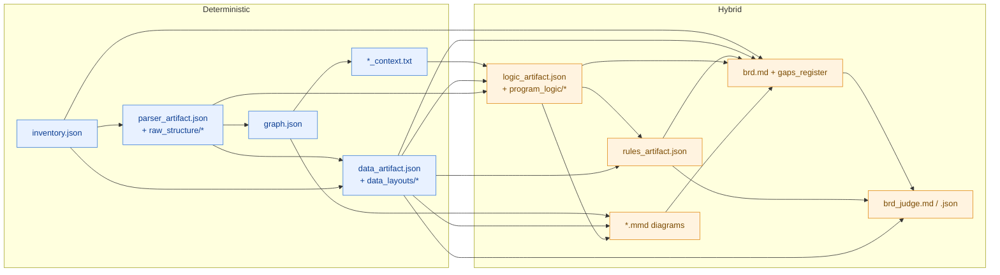

---

## 5. Design Principles

| Principle | What it means |
|---|---|
| **Deterministic where we can** | Facts (file lists, structure, field types, rule *existence*) come from plain Python — free, instant, identical every run, and impossible to hallucinate. |
| **LLM only where we must** | Only *meaning* (turning cryptic COBOL into readable English) uses an LLM. |
| **Groundedness gate** | Every `BR-`/`GAP-`/`RS-` id and program the BRD cites must exist in the artifacts. An invented reference hard-floors the accuracy score — caught by code, not by the model. |
| **No API key needed** | LLM steps run through a no-key "AI-host" path, so the whole pipeline works offline. |

> **In one line:** *Facts → Python. Meaning → LLM. And the closer a step gets to a claim someone will trust, the less we let the LLM near it.*

---

## 6. Agent Catalog (per-agent flow)

Each agent below shows its **inputs → process → outputs** and a one-line "why."

### Agent 1 — Discovery
Scans the repo and catalogs every source file, then resolves `COPY`/`CALL`/`CICS`/`SQL` references into a dependency graph. *Discovery only — it does not interpret logic.*

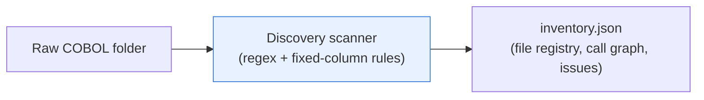

### Agent 2 — Parser
Opens each program and extracts its structural skeleton — divisions, sections, paragraphs, WORKING-STORAGE, and the PERFORM/GO TO control flow. Flags every `GO TO` for review.

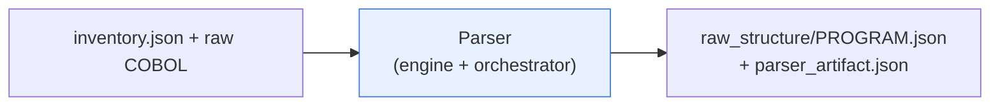

### Agent 3 — Topology
Merges the inventory edges + parsed structure into one system graph of nodes (programs, copybooks, DB2) and relationships. A **local, file-based replacement for Neo4j**.

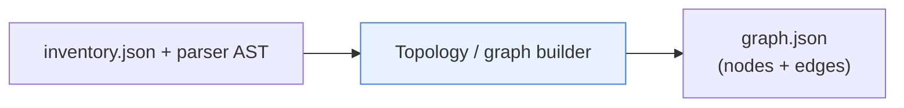

### Agent 4 — Context
Pre-digests each program's raw AST into a compact, **human-readable briefing sheet** — data structures, entry points, paragraph shape — so the later Logic step (and you) get the essentials, not raw JSON.

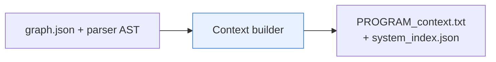

### Agent 5 — Data
Turns the cryptic DATA DIVISION into a clean data dictionary: expands `COPY` stubs, decodes `PIC` clauses, resolves `REDEFINES`/`OCCURS`, and surfaces `88-level` condition names (the seeds of business rules).

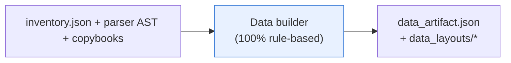

### Agent 6 — Logic
**First hybrid agent.** Python gathers the clues (context + data + AST + source) into one bounded message; a single LLM step turns each paragraph into plain-English pseudocode (flagging `ambiguous` logic and branches); Python writes the files.

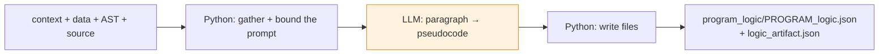

### Agent 7 — Rules
Python collects every branch + `88-level`, classifies each (category, pattern, signal strength), de-duplicates across programs, and groups them into rule sets. The LLM only writes the human-readable **name + description** (with a templated fallback).

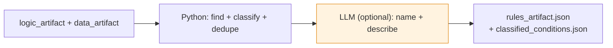

### Agent 8 — Diagram + BRD
The **Diagram** part is deterministic — it redraws the graph/data/logic into Mermaid (component overview, ERD, per-program flows). The **BRD** part assembles every chapter from the artifacts (facts, tables, rules catalogue, gaps) with Python; the LLM writes only the connecting narrative.

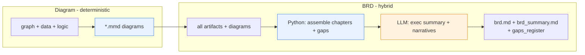

### Agent 9 — Judge
The quality gate. **Validation** (deterministic): the groundedness gate + consistency checks. **Judge** (LLM): scores 5 weighted dimensions. Then Python applies the gate, computes the weighted score, and rules **PASS / REVISE**.

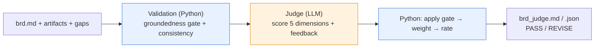

---

## 7. Responsibility Matrix

| # | Agent | Responsibility | Reads | Writes | Type |
|---|---|---|---|---|---|
| 1 | **Discovery** | Catalog files + resolve references | Raw COBOL | `inventory.json` | Deterministic |
| 2 | **Parser** | Extract structural skeleton per program | inventory + source | `raw_structure/*`, `parser_artifact.json` | Deterministic |
| 3 | **Topology** | Build the system dependency graph | inventory + AST | `graph.json` | Deterministic |
| 4 | **Context** | Pre-digest each program into a briefing | graph + AST | `*_context.txt`, `system_index.json` | Deterministic |
| 5 | **Data** | Decode the full data dictionary | inventory + AST + copybooks | `data_artifact.json`, `data_layouts/*` | Deterministic |
| 6 | **Logic** | Translate paragraphs → pseudocode | context + data + AST + source | `program_logic/*`, `logic_artifact.json` | LLM + Python |
| 7 | **Rules** | Mine + classify business rules | logic + data | `rules_artifact.json`, `classified_conditions.json` | LLM + Python |
| 8 | **Diagram + BRD** | Draw diagrams + assemble the BRD | all artifacts | `*.mmd`, `brd.md`, `gaps_register` | LLM + Python |
| 9 | **Judge** | Validate groundedness + score the BRD | brd + artifacts | `brd_judge.md`, `brd_judge.json` | LLM + Python |

**Type:** *Deterministic* = pure Python (no LLM). *LLM + Python* = a hybrid agent — Python does the factual work (finding, classifying, assembling) and the LLM handles only the "soft" part (meaning, wording, narrative, or scoring), so the facts can never be hallucinated.

---

## 8. Proven on Two Codebases

The harness was **built on one system and validated on a completely different one** — proof it generalizes rather than being tuned to a single codebase.

- **Run 1 — Portfolio Management System** *(the codebase we built on)*: we started small on a **21-program sample** (about half of the 42-program system) so we could iterate on each agent quickly.
- **Run 2 — AWS CardDemo** *(a codebase it had never seen)*: we then ran the finished harness on the **full 44-program** credit-card system (accounts, cards, transactions, bill pay, authorizations). It ran end to end with **zero parse errors**.

| Metric | Portfolio *(built on)* | **AWS CardDemo** *(generalization test)* |
|---|---|---|
| Programs | 42 (ran a 21-program sample) | **44 (full)** |
| Copybooks | 20 | **62** |
| JCL jobs | — | **55** |
| Paragraphs parsed | — | **870** (0 parse errors) |
| Data records | 146 | **596** |
| **Data fields** | 823 | **10,223** |
| 88-level conditions | 200 | **909** |
| Pseudocode paragraphs | ~180 | **514** |
| **Business rules** | 110 | **324** (94 rule sets) |
| Diagrams | 23 | **46** |
| BRD size | ~26 pages | **~61 pages** |
| Gaps flagged | — | **253** (0 high-severity) |
| **Judge verdict** | ✅ PASS (4.15/5) | ✅ **PASS (3.85/5)**, groundedness PASS, 0 consistency issues |

**Takeaway:** the same pipeline documented a small custom system *and* a much larger unfamiliar one — CardDemo yielded ~3× the rules and 12× the fields — with the groundedness gate passing both times.

---

## 9. How to Run

```powershell
# from the project root
python run_pipeline.py --input <path-to-cobol> --output <path-to-outputs>
```

- Phases **1–5** are pure Python (no key, instant).
- Phases **6–9** are the LLM/hybrid steps (run via the no-key AI-host path).
- The run is interactive — answer `[y/n/s]` at each phase to run, stop, or skip.

**Example (CardDemo):**
```powershell
python run_pipeline.py --input inputs/carddemo --output outputs/carddemo
```

With no `--input` / `--output`, the pipeline defaults to `inputs/sample` → `outputs/sample`.

Then open the results (use a Mermaid preview extension in VS Code to see the diagrams):

```
outputs/carddemo/final_report/brd.md            # the Business Requirements Document
outputs/carddemo/final_report/brd_judge.md      # the PASS/REVISE verdict + scores
outputs/carddemo/final_report/gaps_register.md  # items flagged for SME review
```

---

## 10. Repository Layout

```
run_pipeline.py           # orchestrator — chains all agents with y/n/s gates
CLAUDE.md                 # project memory for Claude Code
AGENTS.md                 # agent/contributor guide (open AGENTS.md standard)
phases/                   # all pipeline agents, one folder per phase
  p01_discovery/          #   Agent 1 — inventory scanner
  p02_parser/             #   Agent 2 — parser (engine + orchestrator)
  p03_topology/           #   Agent 3 — graph builder
  p04_context/            #   Agent 4 — context sheets
  p05_data/               #   Agent 5 — data dictionary
  p06_logic/              #   Agent 6 — pseudocode (builder + agent prompt)
  p07_rules/              #   Agent 7 — business-rules miner
  p08_diagram/            #   Agent 8a — Mermaid diagram generator
  p09_brd/                #   Agent 8 — BRD builder (+ agent prompt)
  p10_judge/              #   Agent 9 — BRD validation / judge (+ agent prompt)
.claude/                  # Claude Code harness
  agents/                 #   10 subagent definitions (01-discovery … 10-judge)
  skills/                 #   10 granular skill definitions
  harness.md              #   pipeline manifest
inputs/
  carddemo/               # AWS CardDemo source (the 44-program run)
  sample/                 # Portfolio system source (default run)
  sample_mini/            # smaller Portfolio sample
outputs/
  carddemo/               # full CardDemo results (inventory → BRD → judge)
  sample/                 # Portfolio system results
comparison.md             # agent-by-agent comparison of the reference harnesses
flow.md                   # architecture / pipeline documentation
```

---

## 11. Notes and Credits

- **AWS CardDemo** (`inputs/carddemo/`) is an AWS sample codebase, Apache-2.0 licensed.
- The harness combines ideas from two reference approaches — a deterministic, code-first migrator and an LLM-agent reverse-engineering harness. `comparison.md` documents the agent-by-agent differences.
- Diagrams in this README and in the BRD are **Mermaid**, which renders natively on GitHub and in VS Code's Markdown preview.
