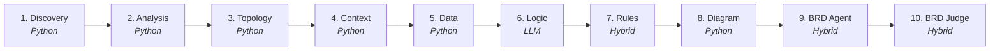

new_legacy_harness
A deterministic-first, AI-augmented pipeline that reverse-engineers legacy COBOL
systems into a complete Business Requirements Document (BRD).
This project takes a COBOL codebase — programs, copybooks, JCL, BMS screens — and,
through a ten-stage agent pipeline, produces structured artifacts (inventory, call
graphs, data dictionaries, pseudocode, business rules, diagrams) and finally
synthesizes them into a single, business-readable BRD.
---
Table of Contents
Why This Project Exists
Architecture at a Glance
Design Philosophy
The Agents
Deterministic vs. LLM — Full Pipeline View
Artifact Flow
Execution Modes
Output Directory Structure
Design Decisions
Limitations
Roadmap
---
Why This Project Exists
Legacy COBOL systems are frequently undocumented, understood only by a shrinking
pool of long-tenured engineers, and expensive to modernize blind. Before any
modernization effort can begin safely, someone has to answer: what does this
system actually do, and how is it built?
Doing that by hand — reading thousands of COBOL files, tracing call chains,
decoding copybooks, inferring business rules from nested `IF` statements — does
not scale. Doing it entirely with an LLM is expensive, slow, and prone to
hallucination on large codebases.
This project takes a third path: use plain, deterministic Python for everything
that is mechanical extraction, and reserve the LLM only for the small number of
steps that require genuine reasoning or language generation — explaining what
code means, not just what it contains.
---
Architecture at a Glance

Each stage consumes the previous stage's artifact(s) and produces its own. Only
four of the ten stages (Logic, Rules, BRD Agent, BRD Judge) touch an LLM at
all — and even those call it only after every extractable fact has already been
pulled out deterministically by the stages before them.
---
Design Philosophy
Deterministic-first. If a task can be solved with regex, file-walking, or
structured parsing, it is — no AI cost, no hallucination risk, fully
reproducible output on every run.
AI only where reasoning is required. Understanding why a paragraph exists,
writing a plain-English rule description, or synthesizing an executive summary
are language/judgment tasks — these are the only places the pipeline pays for
an LLM call.
Every AI call is grounded. Each LLM-backed stage is fed pre-extracted,
verified facts and explicitly instructed to never invent content — numbers,
thresholds, or logic not present in the source.
Graceful degradation. Every LLM-backed stage has a deterministic template
fallback, so the pipeline always produces complete output even without an API
key.
Dual execution modes. The LLM-backed stages can run either as a standalone,
cost-tracked script (good for CI/automation) or be handed to an AI coding agent
as instructions (good for interactive, in-IDE use) — see
Execution Modes.
---
The Agents
1. Discovery
Scans the entire COBOL repository and builds the master file inventory. Walks the
directory tree, classifies every file (program, copybook, JCL, BMS, SQL include)
by extension and naming patterns, extracts `PROGRAM-ID`s respecting COBOL's fixed
column format, and builds the first-pass call/dependency graph by regex-scanning
for `COPY`, `CALL`, CICS `LINK`/`XCTL`, and SQL `INCLUDE` statements. Flags
duplicate program IDs and circular copybook chains.
Deterministic — no LLM. Output: `inventory.json`.
2. Analysis
Parses every COBOL program into a structural representation. Orders programs by
call-dependency so callees are parsed before callers, extracts an AST (divisions,
sections, data items with PIC/OCCURS/REDEFINES/VALUE clauses, procedure statements),
then builds a paragraph-level control-flow graph — entry points, terminal nodes,
PERFORM/GOTO/ALTER edges, dead-code candidates, and unstructured-flow flags.
Deterministic — no LLM. Output: `parser_artifact.json` + per-program AST files.
3. Topology
Merges Discovery's inventory and Analysis's ASTs into one unified system
dependency graph. Seeds graph nodes from the file inventory, converts inventory
relationships into typed graph edges, then deep-scans each program's AST to catch
additional file-usage and dynamic call edges the first pass missed. Creates
placeholder nodes for anything referenced but never discovered, so the graph is
always complete.
Deterministic — no LLM. Output: `graph.json`.
4. Context
Builds a human-readable "cheat sheet" for every program. Walks the Topology
graph to collect each program's dependencies (files, copybooks, calls it makes),
summarizes its data structures and procedure logic from the AST, and assembles a
factual, template-driven natural-language summary — entirely from extracted
metadata, no free-form generation.
Deterministic — no LLM. Output: per-program `_context.txt` sheets + `system_index.json`.
5. Data
Reverse-engineers the complete data dictionary. Parses every copybook's field
hierarchy, decodes `PIC` clauses into type/size/decimal/sign information, flags
packed (COMP-3) fields, REDEFINES, OCCURS tables, and 88-level condition names,
recursively expands `COPY` statements, flattens everything into per-field rows,
and estimates an entity-relationship model by matching key-like field names
across records (explicitly flagged as heuristic/estimated).
Deterministic — no LLM. Output: `data_artifact.json` + per-copybook/program layouts.
6. Logic — the first LLM-backed stage
Explains what each program's code actually does, in plain-English pseudocode.
For every program, it deterministically gathers the program's context sheet
(Phase 4), relevant data fields (Phase 5), and raw paragraph source (Phase 2),
packages them into one prompt, and sends one API call per program to Claude
(`claude-opus-4-8` by default) with a strict JSON-schema output: pseudocode,
branches, calls made, field references, a complexity score, and any ambiguity
flags. The system prompt explicitly forbids inventing logic — ambiguous or
dynamic calls must be flagged, not guessed. Line ranges are reattached
deterministically afterward (never asked of the LLM).
LLM-backed (fully). Output: `logic_artifact.json` + per-program logic files, with token usage and cost tracked.
7. Rules — hybrid
Turns the branching conditions found in Logic into a formal business-rules
catalogue. Deterministically collects every condition, classifies it by keyword
tables into a category (Validation, Calculation, Routing, Limit Check, Error
Handling, Compliance) and a 1–5 signal strength, filters out low-signal noise into
a separate error-handling catalogue, deduplicates, and groups the rest into rule
sets with IDs like `BR-001`. Only then, if an API key is present, it makes
one batched LLM call covering all promoted conditions at once, asking only for
a business-readable rule name and a 2–3 sentence description — grounded strictly
in the condition, never inventing thresholds or outcomes. Falls back to a pure
string-template generator if no key is available.
Hybrid — Python classification, optional LLM descriptions. Output: `rules_artifact.json`.
8. Diagram
Renders everything discovered so far into visual diagrams. Builds a system
component flowchart from the Topology graph, an entity-relationship diagram from
the Data model's estimated entities/relationships, and a per-program call
flowchart from the Logic artifact — all as Mermaid (`.mmd`) text, which renders
natively in GitHub, VS Code, mermaid.live, and inside the BRD itself. No image
rendering, no external diagramming library.
Deterministic — explicitly "no LLM" by design. Output: `.mmd` diagram files + `diagrams_artifact.json` index.
9. BRD Agent — the final synthesis stage
Assembles everything into the actual deliverable: a Business Requirements
Document a business analyst can read without knowing COBOL. Deterministically
detects every gap across all upstream artifacts (unresolved references,
empty/truncated programs, ambiguous logic, low-confidence rules) and ranks them by
severity, then assembles 7 of 9 chapters purely by formatting upstream data
(inventory tables, data model, rules catalogue, process summaries, error
handling, embedded diagrams). Makes exactly one LLM call per run — not per
program — asking only for an executive summary and a system-context paragraph,
grounded strictly in the facts provided, with a templated fallback if no API key
is set. That one narrative result is reused across both output documents.
Hybrid — Python assembly, one LLM call for narrative prose. Output: `brd.md`, `brd_summary.md`, `gaps_register.json/.md`.
10. BRD Judge — the validation gate
Grades the BRD and gates it before sign-off. Deterministically builds a
groundedness truth set from every artifact (program IDs, `BR-###` rule IDs,
`RS-###` rule-set IDs, `GAP-###` gap IDs) and scans the BRD text for any of
those references it cites that don't actually exist — any invented reference is
a groundedness failure. Deterministically checks that all 9 BRD chapters are
present, that headline numbers (program/rule counts) match the artifacts, that
every rule and gap is referenced somewhere, and that the expected diagrams are
embedded. Only then does the LLM score five weighted dimensions —
completeness (0.25), accuracy (0.30), clarity (0.15), consistency (0.15),
actionability (0.15) — each 1–5 with a rationale, plus a list of concrete
feedback items (`{dimension, severity, suggestion, target_section}`) for the
next revision pass. Any groundedness failure hard-floors the accuracy score to
2 regardless of what the LLM gave it; any high-severity consistency issue caps
the consistency score at 2 the same way — the deterministic gate always
overrides the LLM's opinion. The weighted score maps to a rating (high /
medium / low), and the rating plus gate results produce a final PASS /
REVISE verdict. Falls back to neutral 3/5 scores on every dimension if no API
key and no `--scores-file` is supplied.
Hybrid — Python groundedness gate + consistency checks, LLM dimension scoring. Output: `brd_judge.json`, `brd_judge.md`.
---
Deterministic vs. LLM — Full Pipeline View
#	Agent	Type	LLM Calls	What the LLM Is Asked For (if any)
1	Discovery	Deterministic	0	—
2	Analysis	Deterministic	0	—
3	Topology	Deterministic	0	—
4	Context	Deterministic	0	—
5	Data	Deterministic	0	—
6	Logic	LLM-backed	1 per program	Plain-English pseudocode per paragraph
7	Rules	Hybrid	1 batched call (optional)	Business-readable rule name + description
8	Diagram	Deterministic	0	—
9	BRD Agent	Hybrid	1 per run (optional)	Executive summary + system-context paragraph
10	BRD Judge	Hybrid	1 per run (optional)	5-dimension quality scores (1-5) + revision feedback
Six of ten stages never touch an LLM. Of the four that do, only Logic runs one
call per program — Rules, the BRD Agent, and the BRD Judge each make a single
call for the entire system, regardless of size.
---
Artifact Flow
Stage	Consumes	Produces
Discovery	Raw COBOL repository	`inventory.json`
Analysis	`inventory.json`	`parser_artifact.json`, per-program ASTs
Topology	`inventory.json`, ASTs	`graph.json`
Context	`graph.json`, ASTs	per-program `_context.txt`, `system_index.json`
Data	`inventory.json`, ASTs	`data_artifact.json`, per-source data layouts
Logic	`_context.txt`, `data_artifact.json`, ASTs	`logic_artifact.json`, per-program logic files
Rules	`logic_artifact.json`, `data_artifact.json`	`rules_artifact.json`
Diagram	`graph.json`, `data_artifact.json`, `logic_artifact.json`	`.mmd` diagrams, `diagrams_artifact.json`
BRD Agent	`inventory.json`, `parser_artifact.json`, `data_artifact.json`, `logic_artifact.json`, `rules_artifact.json`, `.mmd` diagrams	`brd.md`, `brd_summary.md`, `gaps_register.json/.md`
BRD Judge	`brd.md`, `inventory.json`, `data_artifact.json`, `logic_artifact.json`, `rules_artifact.json`, `gaps_register.json`, `diagrams_artifact.json`	`brd_judge.json`, `brd_judge.md`
---
Execution Modes
The four LLM-backed stages (Logic, Rules, BRD Agent, BRD Judge) each ship
two ways to run, sharing the same input/output contract:
	Mode A — Standalone Script	Mode B — AI-Host
How it's invoked	Run the `*_builder.py` script directly (`brd_judge.py` for the Judge stage)	Hand the companion `*_agent.md` spec file to an AI coding agent (e.g. Claude Code) as its instructions
Requires an API key	Yes, for the LLM call (falls back to a deterministic template if absent)	No — the host agent already has model access
Output guarantee	Strict — JSON schema enforced on the API response	Best-effort — depends on the agent following the spec faithfully
Cost/token tracking	Yes — logs input/output tokens and estimated dollar cost	No separate metered call to track
Best suited for	Automated pipelines, CI, repeatable batch runs	Interactive, exploratory, in-IDE runs
Each `*_builder.py` script and its paired `*_agent.md` spec never call each other
at runtime — they are two independent implementations of the same documented
contract, so either path produces the same artifact shape.
---
Output Directory Structure
```
outputs/
├── discovery/
│   └── inventory.json
├── analysis/
│   ├── parser_artifact.json
│   └── raw_structure/<PROGRAM>.json
├── topology/
│   └── graph.json
├── context/
│   ├── <PROGRAM>_context.txt
│   └── system_index.json
├── data/
│   ├── data_artifact.json
│   └── data_layouts/<COPYBOOK|PROGRAM>.json
├── logic/
│   ├── logic_artifact.json
│   └── program_logic/<PROGRAM>_logic.json
├── rules/
│   ├── classified_conditions.json
│   └── rules_artifact.json
├── diagram/
│   ├── diagrams_artifact.json
│   ├── component_overview.mmd
│   ├── erd.mmd
│   └── diagrams/flow_<PROGRAM>.mmd
└── final_report/
    ├── brd.md
    ├── brd_summary.md
    ├── gaps_register.json
    ├── gaps_register.md
    ├── brd_judge.json
    └── brd_judge.md
```
---
Design Decisions
Why is the pipeline split into ten narrow stages instead of one large agent?
Each stage has a single, well-defined responsibility and a stable artifact
contract with the next. This keeps every stage independently testable,
re-runnable, and — critically — keeps the deterministic stages completely free of
AI cost, since they never need to touch an LLM to do their job correctly.
Why replace the original LLM-driven skills with Python for six of the ten
stages? File classification, regex-based structural extraction, PIC-clause
decoding, and graph merging are mechanical, rule-based problems with one correct
answer — they don't benefit from a language model's reasoning, only from its
cost and variability. Each of these stages is explicitly documented in code as a
"Python port" of an originally LLM/skill-based agent.
Why keep Logic, Rules, the BRD Agent, and the BRD Judge LLM-backed? These
are the only points in the pipeline where the task is genuinely to interpret
meaning — explaining what code does, naming a business rule, writing an
executive narrative, or judging document quality — not to extract a fact
that's already explicit in the source.
Why does every LLM prompt include a "never invent" grounding instruction?
The pipeline's outputs feed a document (the BRD) that may inform real
modernization decisions. Constraining every LLM call to restate only the facts
it was given minimizes hallucination risk in the parts of the system a human
actually reads and acts on.
Why does the Rules and BRD stage batch conditions into one call instead of one
call per item (unlike Logic)? Rule descriptions and the executive narrative
don't need per-item isolation the way per-program pseudocode does — batching
keeps cost proportional to the system as a whole, not to the number of
conditions or programs found.
Why does the BRD Judge run its groundedness/consistency checks in Python
before ever calling the LLM? Whether a cited `BR-`/`GAP-`/`RS-` reference
exists, whether all 9 chapters are present, and whether headline numbers match
the artifacts are all facts, not judgments — checking them deterministically
means the gate can never be talked out of failing a BRD that cites something
invented. The LLM is only trusted with the parts of grading that are genuinely
subjective (completeness, clarity, actionability), and even then the
deterministic gate can override its score.
---
Limitations
Estimated relationships: the Data agent's entity-relationship model is
inferred heuristically from field-naming conventions, not from authoritative
schema definitions — always flagged as an estimate requiring confirmation.
SME review required: any critical/high-severity gap, ambiguous logic
paragraph, or low-confidence business rule is explicitly flagged and must be
reviewed by a subject-matter expert before the BRD is treated as authoritative.
No image rendering: diagrams are emitted as Mermaid source only; there is
no built-in PNG/SVG export.
AI-host mode lacks strict guarantees: Mode B (running an LLM-backed stage
through an AI coding agent instead of the script) sacrifices the JSON-schema
enforcement and token/cost tracking the scripted path provides.
Downstream accuracy depends on upstream accuracy: because most later
stages format facts extracted earlier rather than re-deriving them, an error
in Discovery or Analysis can propagate all the way to the final BRD.
REVISE is not a loop: the BRD Judge produces a verdict and feedback, but
nothing in the pipeline automatically re-runs the BRD Agent on a REVISE
verdict — acting on the feedback and regenerating the BRD is a manual (or
AI-host-driven) step.
---
Roadmap
The pipeline's ten planned stages — Discovery through BRD Judge — are all now
implemented. No further stages are currently planned.
---
This README documents the pipeline architecture as established through direct
review of each agent's implementation in this repository: `discovery/scanner.py`,
`analysis/orchestrator.py` + `analysis/engine.py`, `topology/graph_builder.py`,
`context_builder/context_builder.py`, `data/data_builder.py`,
`logic/logic_builder.py` + `logic/logic_agent.md`, `rules/rules_builder.py` +
`rules/rules_agent.md`, `diagram/diagram_builder.py`, `brd/brd_builder.py` +
`brd/brd_agent.md`, and `brd/brd_judge.py` + `brd/brd_judge_agent.md`.