# Business Requirements Document
## AWS CardDemo

**Document type:** Reverse-engineered Business Requirements Document  
**Generated by:** new_legacy_harness (agents 1–8)  
**Generation date:** 2026-07-28  
**Repository analysed:** C:\Users\kaaja\Documents\Harness Repositories\new_legacy_harness\carddemo_input

> **Important:** This document was generated by automated static analysis of COBOL source code. All content is derived from the source as analysed. Confidence levels are indicated throughout; items marked ⚠ require subject-matter-expert review before the document is authoritative.

> **Gaps identified:** 253 (0 high/critical). See Chapter 9.

---

## Table of Contents

1. [Executive Summary](#1-executive-summary)
2. [System Overview](#2-system-overview)
   - [2.1 System context](#21-system-context)
   - [2.2 Program inventory summary](#22-program-inventory-summary)
   - [2.3 System component diagram](#23-system-component-diagram)
3. [System Inventory](#3-system-inventory)
   - [3.1 Copybooks (shared data definitions)](#31-copybooks-shared-data-definitions)
4. [Data Model and Definitions](#4-data-model-and-definitions)
   - [4.1 Key entities (top by field count)](#41-key-entities-top-by-field-count)
5. [Business Rules Catalogue](#5-business-rules-catalogue)
6. [Process Descriptions](#6-process-descriptions)
7. [Component Architecture](#7-component-architecture)
8. [Error Handling and Recovery](#8-error-handling-and-recovery)
9. [Gaps and Assumptions Register](#9-gaps-and-assumptions-register)
- [Appendices](#appendices)

---

## 1. Executive Summary

The AWS CardDemo is a COBOL-based application comprising 44 programs (13 batch, 27 online), 62 shared copybooks and 55 JCL jobs. It manages portfolio positions, transactions and reference data through a mix of batch processing and online CICS inquiry, backed by VSAM files and DB2.

Automated static analysis extracted 324 business rules across 94 rule sets, 596 data records with 10223 fields, and plain-English pseudocode for 514 paragraphs. 253 gaps were identified (0 high severity) that require subject-matter-expert review before this document is treated as authoritative (see Chapter 9).

## 2. System Overview

### 2.1 System context

The AWS CardDemo is a mixed batch/online system. Online inquiry transactions run under CICS (screen handlers such as the portfolio and history inquiries), while batch jobs perform bulk maintenance, reporting and data loads. Shared services provide DB2 connection management, commit control, error logging and audit trail writing. Data is held in indexed VSAM files (portfolio master, position, transaction history) and DB2 tables.

### 2.2 Program inventory summary

| Program | Type | Rules | Complexity | Summary |
|---|---|---|---|---|
| CBPAUP0C | batch | 21 | High | IMS batch purge for the authorization module: deletes expired pending-authorization messag |
| COPAUA0C | online | 21 | High | Card Authorization Decision program (CICS + IMS + MQ) |
| COPAUS0C | online | 17 | Medium | CICS online Authorization Summary View screen |
| COPAUS1C | online | 10 | Medium | CICS online Authorization Message Detail View screen |
| COPAUS2C | online | 3 | Low | CICS online 'Mark Authorization as Fraud' action program |
| DBUNLDGS | unknown | 9 | Medium | Batch database UNLOAD utility that extracts database segments/rows (e.g |
| PAUDBLOD | unknown | 11 | Medium | Batch IMS database LOAD program for the pending-authorization database |
| PAUDBUNL | unknown | 11 | Medium | Batch IMS database UNLOAD program for the pending-authorization database |
| COBTUPDT | online | 4 | Medium | Batch program that updates transaction-type reference records based on user-supplied input |
| COTRTLIC | online | 35 | Medium | CICS online Transaction-Type (reference data) List screen |
| COTRTUPC | online | 16 | High | CICS online Transaction-Type (reference data) Update screen |
| COACCT01 | online | 7 | Medium | MQ-triggered CICS account-inquiry service (VSAM-MQ variant, sibling of CODATE01) |
| CODATE01 | online | 7 | Medium | MQ-triggered CICS date service (VSAM-MQ variant) |
| CBACT01C | batch | 8 | High | Batch program that reads every record from the indexed ACCOUNT master file (ACCTFILE) and  |
| CBACT02C | batch | 5 | Medium | Batch program that sequentially reads the indexed CARD master file (CARDFILE) and displays |
| CBACT03C | batch | 5 | Medium | Batch program that sequentially reads the card-to-account cross-reference file (XREFFILE)  |
| CBACT04C | batch | 8 | High | The interest & fee posting batch |
| CBCUS01C | batch | 5 | Medium | Batch program that sequentially reads the indexed CUSTOMER master file (CUSTFILE) and disp |
| CBEXPORT | batch | 11 | Low | Batch data-export utility for branch migration |
| CBIMPORT | batch | 9 | Medium | Batch data-import counterpart of CBEXPORT |
| CBSTM03A | batch | 11 | Medium | Account statement generator |
| CBSTM03B | batch | 7 | Medium | Called I/O subroutine used by the statement generator (CBSTM03A) |
| CBTRN01C | batch | 3 | Medium | Daily-transaction verification/browse batch |
| CBTRN02C | batch | 9 | High | The daily transaction posting engine |
| CBTRN03C | batch | 11 | High | Transaction detail report batch |
| COACTUPC | online | 78 | High | CICS online Account Update screen -- the most complex online program |
| COACTVWC | online | 10 | Medium | CICS online Account View screen |
| COADM01C | online | 5 | Medium | CICS online Admin Menu for administrator users |
| COBIL00C | online | 9 | High | CICS online Bill Payment screen |
| COBSWAIT | online | 0 | Low | Small utility program that pauses execution for a specified interval |
| COCRDLIC | online | 23 | Medium | CICS online Card List screen |
| COCRDSLC | online | 10 | Medium | CICS online Card Detail (view) screen |
| COCRDUPC | online | 21 | High | CICS online Card Update screen |
| COMEN01C | online | 5 | Medium | CICS online Main Menu for regular users |
| CORPT00C | online | 8 | Medium | CICS online Transaction Reports screen |
| COSGN00C | online | 5 | Medium | CICS online Sign-on (authentication) screen -- the application's entry point |
| COTRN00C | online | 10 | Medium | CICS online Transaction List screen |
| COTRN01C | online | 5 | Medium | CICS online Transaction View screen |
| COTRN02C | online | 7 | Medium | CICS online Add Transaction screen |
| COUSR00C | online | 10 | Medium | CICS online User List screen (admin function) |
| COUSR01C | online | 4 | Medium | CICS online Add User screen (admin function) |
| COUSR02C | online | 6 | Medium | CICS online Update User screen (admin function) |
| COUSR03C | online | 6 | Medium | CICS online Delete User screen (admin function) |
| CSUTLDTC | unknown | 3 | Low | Called date-validation utility subroutine |

### 2.3 System component diagram

**Figure 2.1 — System component overview**

```mermaid
flowchart LR
  CBPAUP0C["CBPAUP0C"]
  COPAUA0C["COPAUA0C"]
  COPAUS0C["COPAUS0C"]
  COPAUS1C["COPAUS1C"]
  COPAUS2C["COPAUS2C"]
  DBUNLDGS["DBUNLDGS"]
  PAUDBLOD["PAUDBLOD"]
  PAUDBUNL["PAUDBUNL"]
  COBTUPDT["COBTUPDT"]
  COTRTLIC["COTRTLIC"]
  COTRTUPC["COTRTUPC"]
  COACCT01["COACCT01"]
  CODATE01["CODATE01"]
  CBACT01C["CBACT01C"]
  CBACT02C["CBACT02C"]
  CBACT03C["CBACT03C"]
  CBACT04C["CBACT04C"]
  CBCUS01C["CBCUS01C"]
  CBEXPORT["CBEXPORT"]
  CBIMPORT["CBIMPORT"]
  CBSTM03A["CBSTM03A"]
  CBSTM03B["CBSTM03B"]
  CBTRN01C["CBTRN01C"]
  CBTRN02C["CBTRN02C"]
  CBTRN03C["CBTRN03C"]
  COACTUPC["COACTUPC"]
  COACTVWC["COACTVWC"]
  COADM01C["COADM01C"]
  COBIL00C["COBIL00C"]
  COBSWAIT["COBSWAIT"]
  COCRDLIC["COCRDLIC"]
  COCRDSLC["COCRDSLC"]
  COCRDUPC["COCRDUPC"]
  COMEN01C["COMEN01C"]
  CORPT00C["CORPT00C"]
  COSGN00C["COSGN00C"]
  COTRN00C["COTRN00C"]
  COTRN01C["COTRN01C"]
  COTRN02C["COTRN02C"]
  COUSR00C["COUSR00C"]
  COUSR01C["COUSR01C"]
  COUSR02C["COUSR02C"]
  COUSR03C["COUSR03C"]
  CSUTLDTC["CSUTLDTC"]
  MQOPEN["MQOPEN"]
  MQGET["MQGET"]
  MQPUT1["MQPUT1"]
  MQCLOSE["MQCLOSE"]
  CBLTDLI["CBLTDLI"]
  MQPUT["MQPUT"]
  COBDATFT["COBDATFT"]
  CEE3ABD["CEE3ABD"]
  MVSWAIT["MVSWAIT"]
  CEEDAYS["CEEDAYS"]
  COPAUA0C --> MQOPEN
  COPAUA0C --> MQGET
  COPAUA0C --> MQPUT1
  COPAUA0C --> MQCLOSE
  DBUNLDGS --> CBLTDLI
  PAUDBLOD --> CBLTDLI
  PAUDBUNL --> CBLTDLI
  COACCT01 --> MQOPEN
  COACCT01 --> MQGET
  COACCT01 --> MQPUT
  COACCT01 --> MQCLOSE
  CODATE01 --> MQOPEN
  CODATE01 --> MQGET
  CODATE01 --> MQPUT
  CODATE01 --> MQCLOSE
  CBACT01C --> COBDATFT
  CBACT01C --> CEE3ABD
  CBACT02C --> CEE3ABD
  CBACT03C --> CEE3ABD
  CBACT04C --> CEE3ABD
  CBCUS01C --> CEE3ABD
  CBEXPORT --> CEE3ABD
  CBIMPORT --> CEE3ABD
  CBSTM03A --> CBSTM03B
  CBSTM03A --> CEE3ABD
  CBTRN01C --> CEE3ABD
  CBTRN02C --> CEE3ABD
  CBTRN03C --> CEE3ABD
  COBSWAIT --> MVSWAIT
  CORPT00C --> CSUTLDTC
  COTRN02C --> CSUTLDTC
  CSUTLDTC --> CEEDAYS
```

*This diagram shows the programs of the system and the calls/links between them. Each box is a program; an arrow means the source program calls or CICS-links the target. Shared helper programs (DB2, error, audit, cursor, security) appear as common call targets.*

## 3. System Inventory

Programs: **44** (13 batch, 27 online) · Copybooks: **62** · JCL jobs: **55** · Call edges: 413 (119 unresolved).

### 3.1 Copybooks (shared data definitions)

| Copybook | Used by (count) |
|---|---|
| CSSETATY | 40 — shared infrastructure |
| COCOM01Y | 21 — shared infrastructure |
| COTTL01Y | 21 — shared infrastructure |
| CSDAT01Y | 21 — shared infrastructure |
| CSMSG01Y | 21 — shared infrastructure |
| CSUSR01Y | 14 — shared infrastructure |
| CVACT01Y | 14 — shared infrastructure |
| CVACT03Y | 14 — shared infrastructure |
| CVTRA05Y | 11 — shared infrastructure |
| CVACT02Y | 10 — shared infrastructure |
| CVCUS01Y | 10 — shared infrastructure |
| CIPAUDTY | 8 — shared infrastructure |
| CIPAUSMY | 7 — shared infrastructure |
| CSMSG02Y | 7 — shared infrastructure |
| CVCRD01Y | 7 — shared infrastructure |
| IMSFUNCS | 3 |
| PAUTBPCB | 3 |
| CVEXPORT | 2 |
| CVTRA01Y | 2 |
| CVTRA06Y | 2 |
| CCPAUERY | 1 |
| CCPAURLY | 1 |
| CCPAURQY | 1 |
| PADFLPCB | 1 |
| PASFLPCB | 1 |

## 4. Data Model and Definitions

The data model comprises **334 entities** and **2 (estimated) relationships**, with **10223 fields** across **596 records**.

**Figure 4.1 — Entity-relationship diagram (key entities)**

```mermaid
erDiagram
  COPAU0AI {
    int field_count "373"
    string used_by "COPAUS0C"
  }
  COPAU0AO {
    int field_count "373"
    string used_by "COPAUS0C"
  }
  COPAU1AI {
    int field_count "163"
    string used_by "COPAUS1C"
  }
  CTRTLIAI {
    int field_count "241"
    string used_by "COTRTLIC"
  }
  CTRTLIAO {
    int field_count "241"
    string used_by "COTRTLIC"
  }
  WS_DATE_VALIDATION_RESULT {
    int field_count "15"
    string used_by "-"
  }
  TRAN_CAT_BAL_RECORD {
    int field_count "6"
    string used_by "CBACT04C, CBTRN02C"
  }
  TRAN_CAT_RECORD {
    int field_count "5"
    string used_by "CBTRN03C"
  }
  CACTUPAI {
    int field_count "325"
    string used_by "COACTUPC"
  }
  CACTUPAO {
    int field_count "325"
    string used_by "COACTUPC"
  }
  CACTVWAI {
    int field_count "223"
    string used_by "COACTVWC"
  }
  CACTVWAO {
    int field_count "223"
    string used_by "COACTVWC"
  }
  CCRDLIAI {
    int field_count "271"
    string used_by "COCRDLIC"
  }
  CCRDLIAO {
    int field_count "271"
    string used_by "COCRDLIC"
  }
  COTRN0AI {
    int field_count "355"
    string used_by "COTRN00C"
  }
  COTRN0AO {
    int field_count "355"
    string used_by "COTRN00C"
  }
  COUSR0AI {
    int field_count "355"
    string used_by "COUSR00C"
  }
  COUSR0AO {
    int field_count "355"
    string used_by "COUSR00C"
  }
  WS_MISC_STORAGE {
    int field_count "173"
    string used_by "COACTUPC"
  }
  WS_MESSAGE {
    int field_count "15"
    string used_by "CSUTLDTC"
  }
  WS_DATE_VALIDATION_RESULT ||--o{ WS_MESSAGE : "shared field WS-MSG-NO"
  TRAN_CAT_BAL_RECORD ||--o{ TRAN_CAT_RECORD : "shared field TRAN-CAT-KEY"
```

*This diagram shows the key data entities (by field count and shared usage) and their estimated relationships. Relationships are inferred from shared key-ish fields and are marked for data-architect confirmation.*

### 4.1 Key entities (top by field count)

| Entity | Source | Fields | Used by |
|---|---|---|---|
| COPAU0AI | COPAU00 | 373 | COPAUS0C |
| COPAU0AO | COPAU00 | 373 | COPAUS0C |
| COTRN0AI | COTRN00 | 355 | COTRN00C |
| COTRN0AO | COTRN00 | 355 | COTRN00C |
| COUSR0AI | COUSR00 | 355 | COUSR00C |
| COUSR0AO | COUSR00 | 355 | COUSR00C |
| CACTUPAI | COACTUP | 325 | COACTUPC |
| CACTUPAO | COACTUP | 325 | COACTUPC |
| CCRDLIAI | COCRDLI | 271 | COCRDLIC |
| CCRDLIAO | COCRDLI | 271 | COCRDLIC |
| CTRTLIAI | COTRTLI | 241 | COTRTLIC |
| CTRTLIAO | COTRTLI | 241 | COTRTLIC |
| CACTVWAI | COACTVW | 223 | COACTVWC |
| CACTVWAO | COACTVW | 223 | COACTVWC |
| WS-MISC-STORAGE | COACTUPC | 173 | COACTUPC |
| COPAU1AI | COPAU01 | 163 | COPAUS1C |
| COPAU1AO | COPAU01 | 163 | COPAUS1C |
| WS-THIS-PROGCOMMAREA | COACTUPC | 151 | COACTUPC |
| COTRN1AI | COTRN01 | 127 | COTRN01C |
| COTRN1AO | COTRN01 | 127 | COTRN01C |

## 5. Business Rules Catalogue

Rules by category: VALIDATION 300, CALCULATION 4, LIMIT_CHECK 4, ROUTING 16. Total **324** rules in 94 rule sets.

### Account validation rules

*Programs: CBACT01C, CBEXPORT, CBIMPORT, COACTUPC, COACTVWC, COCRDLIC · Rules: 11*

**BR-001 — Validate Account Credit Limit**  
Category: VALIDATION · Confidence: medium ⚠  
Validate Account Credit Limit. Condition: “IF card inactive -> decline”. Implemented in COPAUA0C, paragraph MAKE-AUTH-DECISION.  
*Source: COPAUA0C, MAKE-AUTH-DECISION*

**BR-002 — Validate Account Credit Limit**  
Category: VALIDATION · Confidence: medium ⚠  
Validate Account Credit Limit. Condition: “IF card expired -> decline”. Implemented in COPAUA0C, paragraph MAKE-AUTH-DECISION.  
*Source: COPAUA0C, MAKE-AUTH-DECISION*

**BR-003 — Validate Account Credit Limit**  
Category: VALIDATION · Confidence: medium ⚠  
Validate Account Credit Limit. Condition: “ELSE approve”. Implemented in COPAUA0C, paragraph MAKE-AUTH-DECISION.  
*Source: COPAUA0C, MAKE-AUTH-DECISION*

**BR-004 — Validate Account Id**  
Category: VALIDATION · Confidence: low ⚠ — SME review required  
Validate Account Id. Condition: “IF ACCT-CURR-CYC-DEBIT = ZERO -> MOVE 2525.00”. Implemented in CBACT01C, paragraph 1300-POPUL-ACCT-RECORD.  
*Source: CBACT01C, 1300-POPUL-ACCT-RECORD*

**BR-005 — Validate Account Id**  
Category: VALIDATION · Confidence: low ⚠ — SME review required  
Validate Account Id. Condition: “IF record matches filter -> include ELSE skip”. Implemented in COCRDLIC, paragraph 9500-FILTER-RECORDS.  
*Source: COCRDLIC, 9500-FILTER-RECORDS*

**BR-006 — Validate Account Id**  
Category: VALIDATION · Confidence: low ⚠ — SME review required  
Validate Account Id. Condition: “IF card supplied -> by acct+card ELSE by acct”. Implemented in COCRDSLC, paragraph 9000-READ-DATA.  
*Source: COCRDSLC, 9000-READ-DATA*

**BR-007 — Validate Account Master Read Flg is a recognised value**  
Category: VALIDATION · Confidence: confirmed ✓  
The Account Master Read Flg field is constrained to a fixed set of allowed values (FOUND-ACCT-IN-MSTR, NFOUND-ACCT-IN-MSTR). Used by COPAUA0C.  
*Source: COPAUA0C, line 128*

**BR-008 — Validate Account Master Read Indicator is a recognised value**  
Category: VALIDATION · Confidence: confirmed ✓  
The Account Master Read Indicator field is constrained to a fixed set of allowed values (FOUND-ACCT-IN-MASTER). Used by COACTUPC.  
*Source: COACTUPC, line 385*

**BR-009 — Validate Account Record**  
Category: VALIDATION · Confidence: low ⚠ — SME review required  
Validate Account Record. Condition: “ELSE rewrite records”. Implemented in COACTUPC, paragraph 9600-WRITE-PROCESSING.  
*Source: COACTUPC, 9600-WRITE-PROCESSING*

**BR-010 — Validate Account Records Exported**  
Category: VALIDATION · Confidence: low ⚠ — SME review required  
Validate Account Records Exported. Condition: “PERFORM UNTIL WS-ACCOUNT-EOF”. Implemented in CBEXPORT, paragraph 3000-EXPORT-ACCOUNTS.  
*Source: CBEXPORT, 3000-EXPORT-ACCOUNTS*

**BR-011 — Validate Account Status is a recognised value**  
Category: VALIDATION · Confidence: confirmed ✓  
The Account Status field is constrained to a fixed set of allowed values (WS-ACCOUNT-EOF, WS-ACCOUNT-OK). Used by CBEXPORT.  
*Source: CBEXPORT, line 103*

### Actidini validation rules

*Programs: COBIL00C · Rules: 2*

**BR-012 — Validate Actidini**  
Category: VALIDATION · Confidence: low ⚠ — SME review required  
Validate Actidini. Condition: “IF ACCT-CURR-BAL <= 0 -> 'nothing to pay'”. Implemented in COBIL00C, paragraph PROCESS-ENTER-KEY.  
*Source: COBIL00C, PROCESS-ENTER-KEY*

**BR-013 — Validate Actidini**  
Category: VALIDATION · Confidence: low ⚠ — SME review required  
Validate Actidini. Condition: “IF CONF-PAY-YES -> perform payment”. Implemented in COBIL00C, paragraph PROCESS-ENTER-KEY.  
*Source: COBIL00C, PROCESS-ENTER-KEY*

### Actions validation rules

*Programs: COTRTLIC · Rules: 1*

**BR-014 — Validate Actions Requested is a recognised value**  
Category: VALIDATION · Confidence: confirmed ✓  
The Actions Requested field is constrained to a fixed set of allowed values (WS-ONLY-1-ACTION, WS-MORETHAN1ACTION). Used by COTRTLIC.  
*Source: COTRTLIC, line 203*

### Acup validation rules

*Programs: COACTUPC · Rules: 2*

**BR-015 — Validate Acup Change Action is a recognised value**  
Category: VALIDATION · Confidence: confirmed ✓  
The Acup Change Action field is constrained to a fixed set of allowed values (ACUP-DETAILS-NOT-FETCHED, ACUP-SHOW-DETAILS, ACUP-CHANGES-MADE, ACUP-CHANGES-NOT-OK, ACUP-CHANGES-OK-NOT-CONFIRMED, ACUP-CHANGES-OKAYED-AND-DONE). Used by COACTUPC.  
*Source: COACTUPC, line 654*

**BR-016 — Validate Acup New Customer Fico Score is a recognised value**  
Category: VALIDATION · Confidence: confirmed ✓  
The Acup New Customer Fico Score field is constrained to a fixed set of allowed values (FICO-RANGE-IS-VALID). Used by COACTUPC.  
*Source: COACTUPC, line 846*

### Appl validation rules

*Programs: CBACT01C, CBACT02C, CBACT03C, CBACT04C, CBCUS01C, CBTRN01C · Rules: 1*

**BR-017 — Validate Appl Result is a recognised value**  
Category: VALIDATION · Confidence: confirmed ✓  
The Appl Result field is constrained to a fixed set of allowed values (APPL-AOK, APPL-EOF). Used by CBACT01C.  
*Source: CBACT01C, line 115*

### Array validation rules

*Programs: COTRTLIC · Rules: 1*

**BR-018 — Validate Array Description Flgs is a recognised value**  
Category: VALIDATION · Confidence: confirmed ✓  
The Array Description Flgs field is constrained to a fixed set of allowed values (FLG-ROW-DESCRIPTION-ISVALID, FLG-ROW-DESCRIPTION-NOT-OK, FLG-ROW-DESCRIPTION-BLANK). Used by COTRTLIC.  
*Source: COTRTLIC, line 133*

### Authorisation validation rules

*Programs: COPAUA0C · Rules: 1*

**BR-019 — Validate Authorisation Response Flg is a recognised value**  
Category: VALIDATION · Confidence: confirmed ✓  
The Authorisation Response Flg field is constrained to a fixed set of allowed values (AUTH-RESP-APPROVED, AUTH-RESP-DECLINED). Used by COPAUA0C.  
*Source: COPAUA0C, line 111*

### Auths validation rules

*Programs: COPAUS0C, COPAUS1C · Rules: 1*

**BR-020 — Validate Auths Eof is a recognised value**  
Category: VALIDATION · Confidence: confirmed ✓  
The Auths Eof field is constrained to a fixed set of allowed values (AUTHS-EOF, AUTHS-NOT-EOF). Used by COPAUS0C.  
*Source: COPAUS0C, line 109*

### Bad validation rules

*Programs: COTRTLIC · Rules: 1*

**BR-021 — Validate Bad Selection Action is a recognised value**  
Category: VALIDATION · Confidence: confirmed ✓  
The Bad Selection Action field is constrained to a fixed set of allowed values (FLG-BAD-ACTIONS-SELECTED-NO, FLG-BAD-ACTIONS-SELECTED-YES). Used by COTRTLIC.  
*Source: COTRTLIC, line 130*

### Ca validation rules

*Programs: COCRDLIC, COTRTLIC · Rules: 5*

**BR-022 — Validate Ca Delete Indicator is a recognised value**  
Category: VALIDATION · Confidence: confirmed ✓  
The Ca Delete Indicator field is constrained to a fixed set of allowed values (CA-DELETE-NOT-REQUESTED, CA-DELETE-REQUESTED, CA-DELETE-SUCCEEDED). Used by COTRTLIC.  
*Source: COTRTLIC, line 411*

**BR-023 — Validate Ca Last Page Displayed is a recognised value**  
Category: VALIDATION · Confidence: confirmed ✓  
The Ca Last Page Displayed field is constrained to a fixed set of allowed values (CA-LAST-PAGE-SHOWN, CA-LAST-PAGE-NOT-SHOWN). Used by COCRDLIC.  
*Source: COCRDLIC, line 239*

**BR-024 — Validate Ca Next Page Indicator is a recognised value**  
Category: VALIDATION · Confidence: confirmed ✓  
The Ca Next Page Indicator field is constrained to a fixed set of allowed values (CA-NEXT-PAGE-NOT-EXISTS, CA-NEXT-PAGE-EXISTS). Used by COCRDLIC.  
*Source: COCRDLIC, line 242*

**BR-025 — Validate Ca Screen Number is a recognised value**  
Category: VALIDATION · Confidence: confirmed ✓  
The Ca Screen Number field is constrained to a fixed set of allowed values (CA-FIRST-PAGE). Used by COCRDLIC.  
*Source: COCRDLIC, line 237*

**BR-026 — Validate Ca Update Indicator is a recognised value**  
Category: VALIDATION · Confidence: confirmed ✓  
The Ca Update Indicator field is constrained to a fixed set of allowed values (CA-UPDATE-NOT-REQUESTED, CA-UPDATE-REQUESTED, CA-UPDATE-SUCCEEDED). Used by COTRTLIC.  
*Source: COTRTLIC, line 415*

### Calculation rules

*Programs: CBACT04C, CBTRN03C · Rules: 4*

**BR-027 — Report page break**  
Category: CALCULATION · Confidence: medium ⚠  
In the transaction report, when the line counter reaches a full page, page totals are written and a fresh page header is emitted before continuing.  
*Source: CBTRN03C, 1100-WRITE-TRANSACTION-REPORT*

**BR-028 — Per-account subtotal at card break**  
Category: CALCULATION · Confidence: medium ⚠  
In the transaction report, when the card/account changes (and it is not the first record), the accumulated per-account totals are written before the next account begins.  
*Source: CBTRN03C, MAIN-PARA*

**BR-029 — Final page and grand totals at end of report**  
Category: CALCULATION · Confidence: medium ⚠  
At end-of-file, the transaction report writes the final page totals and the overall grand total.  
*Source: CBTRN03C, MAIN-PARA*

**BR-030 — Interest applied only when the rate is non-zero**  
Category: CALCULATION · Confidence: medium ⚠  
Interest (and fees) are computed for a transaction category only when its disclosure-group interest rate is non-zero.  
*Source: CBACT04C, MAIN-PARA*

### Card validation rules

*Programs: CBEXPORT, CBIMPORT, COCRDLIC, COCRDUPC · Rules: 6*

**BR-031 — Validate Card Array**  
Category: VALIDATION · Confidence: medium ⚠  
Validate Card Array. Condition: “loop over page rows”. Implemented in COCRDLIC, paragraph 1200-SCREEN-ARRAY-INIT.  
*Source: COCRDLIC, 1200-SCREEN-ARRAY-INIT*

**BR-032 — Validate Card Month Check N is a recognised value**  
Category: VALIDATION · Confidence: confirmed ✓  
The Card Month Check N field is constrained to a fixed set of allowed values (VALID-MONTH). Used by COCRDUPC.  
*Source: COCRDUPC, line 93*

**BR-033 — Validate Card Record**  
Category: VALIDATION · Confidence: low ⚠ — SME review required  
Validate Card Record. Condition: “ELSE rewrite”. Implemented in COCRDUPC, paragraph 9200-WRITE-PROCESSING.  
*Source: COCRDUPC, 9200-WRITE-PROCESSING*

**BR-034 — Validate Card Records Exported**  
Category: VALIDATION · Confidence: low ⚠ — SME review required  
Validate Card Records Exported. Condition: “PERFORM UNTIL WS-CARD-EOF”. Implemented in CBEXPORT, paragraph 5500-EXPORT-CARDS.  
*Source: CBEXPORT, 5500-EXPORT-CARDS*

**BR-035 — Validate Card Status is a recognised value**  
Category: VALIDATION · Confidence: confirmed ✓  
The Card Status field is constrained to a fixed set of allowed values (WS-CARD-EOF, WS-CARD-OK). Used by CBEXPORT.  
*Source: CBEXPORT, line 112*

**BR-036 — Validate Card Year Check N is a recognised value**  
Category: VALIDATION · Confidence: confirmed ✓  
The Card Year Check N field is constrained to a fixed set of allowed values (VALID-YEAR). Used by COCRDUPC.  
*Source: COCRDUPC, line 97*

### Ccard validation rules

*Programs: COTRTLIC · Rules: 2*

**BR-037 — Validate Ccard Aid is a recognised value**  
Category: VALIDATION · Confidence: confirmed ✓  
The Ccard Aid field is constrained to a fixed set of allowed values (CCARD-AID-ENTER, CCARD-AID-CLEAR, CCARD-AID-PA1, CCARD-AID-PA2, CCARD-AID-PFK01, CCARD-AID-PFK02). Used by COTRTLIC, COTRTUPC, COACTUPC, COACTVWC.  
*Source: COTRTLIC, line 3*

**BR-038 — Validate Ccard Return Msg is a recognised value**  
Category: VALIDATION · Confidence: confirmed ✓  
The Ccard Return Msg field is constrained to a fixed set of allowed values (CCARD-RETURN-MSG-OFF). Used by COTRTLIC, COTRTUPC, COACTUPC, COACTVWC.  
*Source: COTRTLIC, line 29*

### Ccup validation rules

*Programs: COCRDUPC · Rules: 1*

**BR-039 — Validate Ccup Change Action is a recognised value**  
Category: VALIDATION · Confidence: confirmed ✓  
The Ccup Change Action field is constrained to a fixed set of allowed values (CCUP-DETAILS-NOT-FETCHED, CCUP-SHOW-DETAILS, CCUP-CHANGES-MADE, CCUP-CHANGES-NOT-OK, CCUP-CHANGES-OK-NOT-CONFIRMED, CCUP-CHANGES-OKAYED-AND-DONE). Used by COCRDUPC.  
*Source: COCRDUPC, line 276*

### Cdemo validation rules

*Programs: COADM01C, COBIL00C, COMEN01C, COPAUS0C, COPAUS1C, COTRN00C · Rules: 13*

**BR-040 — Validate Cdemo Cb00 Next Page Flg is a recognised value**  
Category: VALIDATION · Confidence: confirmed ✓  
The Cdemo Cb00 Next Page Flg field is constrained to a fixed set of allowed values (NEXT-PAGE-YES, NEXT-PAGE-NO). Used by COBIL00C.  
*Source: COBIL00C, line 68*

**BR-041 — Validate Cdemo Cpvd Next Page Flg is a recognised value**  
Category: VALIDATION · Confidence: confirmed ✓  
The Cdemo Cpvd Next Page Flg field is constrained to a fixed set of allowed values (NEXT-PAGE-YES, NEXT-PAGE-NO). Used by COPAUS1C.  
*Source: COPAUS1C, line 116*

**BR-042 — Validate Cdemo Cpvs Next Page Flg is a recognised value**  
Category: VALIDATION · Confidence: confirmed ✓  
The Cdemo Cpvs Next Page Flg field is constrained to a fixed set of allowed values (NEXT-PAGE-YES, NEXT-PAGE-NO). Used by COPAUS0C.  
*Source: COPAUS0C, line 123*

**BR-043 — Validate Cdemo Ct00 Next Page Flg is a recognised value**  
Category: VALIDATION · Confidence: confirmed ✓  
The Cdemo Ct00 Next Page Flg field is constrained to a fixed set of allowed values (NEXT-PAGE-YES, NEXT-PAGE-NO). Used by COTRN00C.  
*Source: COTRN00C, line 66*

**BR-044 — Validate Cdemo Ct01 Next Page Flg is a recognised value**  
Category: VALIDATION · Confidence: confirmed ✓  
The Cdemo Ct01 Next Page Flg field is constrained to a fixed set of allowed values (NEXT-PAGE-YES, NEXT-PAGE-NO). Used by COTRN01C.  
*Source: COTRN01C, line 57*

**BR-045 — Validate Cdemo Ct02 Next Page Flg is a recognised value**  
Category: VALIDATION · Confidence: confirmed ✓  
The Cdemo Ct02 Next Page Flg field is constrained to a fixed set of allowed values (NEXT-PAGE-YES, NEXT-PAGE-NO). Used by COTRN02C.  
*Source: COTRN02C, line 76*

**BR-046 — Validate Cdemo Cu00 Next Page Flg is a recognised value**  
Category: VALIDATION · Confidence: confirmed ✓  
The Cdemo Cu00 Next Page Flg field is constrained to a fixed set of allowed values (NEXT-PAGE-YES, NEXT-PAGE-NO). Used by COUSR00C.  
*Source: COUSR00C, line 71*

**BR-047 — Validate Cdemo Cu02 Next Page Flg is a recognised value**  
Category: VALIDATION · Confidence: confirmed ✓  
The Cdemo Cu02 Next Page Flg field is constrained to a fixed set of allowed values (NEXT-PAGE-YES, NEXT-PAGE-NO). Used by COUSR02C.  
*Source: COUSR02C, line 54*

**BR-048 — Validate Cdemo Cu03 Next Page Flg is a recognised value**  
Category: VALIDATION · Confidence: confirmed ✓  
The Cdemo Cu03 Next Page Flg field is constrained to a fixed set of allowed values (NEXT-PAGE-YES, NEXT-PAGE-NO). Used by COUSR03C.  
*Source: COUSR03C, line 54*

**BR-049 — Validate Cdemo Menu Opt**  
Category: VALIDATION · Confidence: low ⚠ — SME review required  
Validate Cdemo Menu Opt. Condition: “loop over defined admin options”. Implemented in COADM01C, paragraph BUILD-MENU-OPTIONS.  
*Source: COADM01C, BUILD-MENU-OPTIONS*

**BR-050 — Validate Cdemo Menu Opt**  
Category: VALIDATION · Confidence: low ⚠ — SME review required  
Validate Cdemo Menu Opt. Condition: “loop over defined options”. Implemented in COMEN01C, paragraph BUILD-MENU-OPTIONS.  
*Source: COMEN01C, BUILD-MENU-OPTIONS*

**BR-051 — Validate Cdemo Pgm Context is a recognised value**  
Category: VALIDATION · Confidence: confirmed ✓  
The Cdemo Pgm Context field is constrained to a fixed set of allowed values (CDEMO-PGM-ENTER, CDEMO-PGM-REENTER). Used by COPAUS0C, COPAUS1C, COTRTLIC, COTRTUPC.  
*Source: COPAUS0C, line 29*

**BR-052 — Validate Cdemo User Type is a recognised value**  
Category: VALIDATION · Confidence: confirmed ✓  
The Cdemo User Type field is constrained to a fixed set of allowed values (CDEMO-USRTYP-ADMIN, CDEMO-USRTYP-USER). Used by COPAUS0C, COPAUS1C, COTRTLIC, COTRTUPC.  
*Source: COPAUS0C, line 26*

### Change validation rules

*Programs: COACTUPC · Rules: 1*

**BR-053 — Validate Change Flg**  
Category: VALIDATION · Confidence: low ⚠ — SME review required  
Validate Change Flg. Condition: “IF any field differs -> changes present”. Implemented in COACTUPC, paragraph 1205-COMPARE-OLD-NEW.  
*Source: COACTUPC, 1205-COMPARE-OLD-NEW*

### Codatecn validation rules

*Programs: CBACT01C · Rules: 2*

**BR-054 — Validate Codatecn Outtype is a recognised value**  
Category: VALIDATION · Confidence: confirmed ✓  
The Codatecn Outtype field is constrained to a fixed set of allowed values (YYYY-MM-DD-OP, YYYYMMDD-OP). Used by CBACT01C.  
*Source: CBACT01C, line 36*

**BR-055 — Validate Codatecn Type is a recognised value**  
Category: VALIDATION · Confidence: confirmed ✓  
The Codatecn Type field is constrained to a fixed set of allowed values (YYYYMMDD-IN, YYYY-MM-DD-IN). Used by CBACT01C.  
*Source: CBACT01C, line 19*

### Conf validation rules

*Programs: COBIL00C · Rules: 1*

**BR-056 — Validate Conf Pay Flg is a recognised value**  
Category: VALIDATION · Confidence: confirmed ✓  
The Conf Pay Flg field is constrained to a fixed set of allowed values (CONF-PAY-YES, CONF-PAY-NO). Used by COBIL00C.  
*Source: COBIL00C, line 51*

### Context validation rules

*Programs: COCRDLIC · Rules: 1*

**BR-057 — Validate Context Indicator is a recognised value**  
Category: VALIDATION · Confidence: confirmed ✓  
The Context Indicator field is constrained to a fixed set of allowed values (WS-CONTEXT-FRESH-START, WS-CONTEXT-FRESH-START-NO). Used by COCRDLIC.  
*Source: COCRDLIC, line 130*

### Current validation rules

*Programs: CBPAUP0C · Rules: 4*

**BR-058 — Validate Current Yyddd**  
Category: VALIDATION · Confidence: medium ⚠  
Validate Current Yyddd. Condition: “IF P-EXPIRY-DAYS numeric ... ELSE default 5”. Implemented in CBPAUP0C, paragraph 1000-INITIALIZE.  
*Source: CBPAUP0C, 1000-INITIALIZE*

**BR-059 — Validate Current Yyddd**  
Category: VALIDATION · Confidence: medium ⚠  
Validate Current Yyddd. Condition: “IF P-CHKP-FREQ blank/zero -> default 5”. Implemented in CBPAUP0C, paragraph 1000-INITIALIZE.  
*Source: CBPAUP0C, 1000-INITIALIZE*

**BR-060 — Validate Current Yyddd**  
Category: VALIDATION · Confidence: medium ⚠  
Validate Current Yyddd. Condition: “IF P-CHKP-DIS-FREQ blank/zero -> default 10”. Implemented in CBPAUP0C, paragraph 1000-INITIALIZE.  
*Source: CBPAUP0C, 1000-INITIALIZE*

**BR-061 — Validate Current Yyddd**  
Category: VALIDATION · Confidence: medium ⚠  
Validate Current Yyddd. Condition: “IF P-DEBUG-FLAG NOT 'Y' -> 'N'”. Implemented in CBPAUP0C, paragraph 1000-INITIALIZE.  
*Source: CBPAUP0C, 1000-INITIALIZE*

### Custid validation rules

*Programs: CBPAUP0C, DBUNLDGS, PAUDBLOD, PAUDBUNL · Rules: 1*

**BR-062 — Validate Custid Status is a recognised value**  
Category: VALIDATION · Confidence: confirmed ✓  
The Custid Status field is constrained to a fixed set of allowed values (END-OF-FILE). Used by CBPAUP0C.  
*Source: CBPAUP0C, line 72*

### Customer validation rules

*Programs: CBEXPORT, CBIMPORT, COACTUPC, COACTVWC, COPAUA0C, COPAUS0C · Rules: 4*

**BR-063 — Validate Customer Master Read Flg is a recognised value**  
Category: VALIDATION · Confidence: confirmed ✓  
The Customer Master Read Flg field is constrained to a fixed set of allowed values (FOUND-CUST-IN-MSTR, NFOUND-CUST-IN-MSTR). Used by COPAUA0C.  
*Source: COPAUA0C, line 131*

**BR-064 — Validate Customer Master Read Indicator is a recognised value**  
Category: VALIDATION · Confidence: confirmed ✓  
The Customer Master Read Indicator field is constrained to a fixed set of allowed values (FOUND-CUST-IN-MASTER). Used by COACTUPC.  
*Source: COACTUPC, line 387*

**BR-065 — Validate Customer Records Exported**  
Category: VALIDATION · Confidence: low ⚠ — SME review required  
Validate Customer Records Exported. Condition: “PERFORM UNTIL WS-CUSTOMER-EOF”. Implemented in CBEXPORT, paragraph 2000-EXPORT-CUSTOMERS.  
*Source: CBEXPORT, 2000-EXPORT-CUSTOMERS*

**BR-066 — Validate Customer Status is a recognised value**  
Category: VALIDATION · Confidence: confirmed ✓  
The Customer Status field is constrained to a fixed set of allowed values (WS-CUSTOMER-EOF, WS-CUSTOMER-OK). Used by CBEXPORT.  
*Source: CBEXPORT, line 100*

### DB2 validation rules

*Programs: ? · Rules: 1*

**BR-067 — Validate DB2 Processing Indicator is a recognised value**  
Category: VALIDATION · Confidence: confirmed ✓  
The DB2 Processing Indicator field is constrained to a fixed set of allowed values (WS-DB2-OK, WS-DB2-ERROR). Used by .  
*Source: ?, line 25*

### Datachanged validation rules

*Programs: COACTUPC, COTRTLIC, COTRTUPC · Rules: 1*

**BR-068 — Validate Datachanged Indicator is a recognised value**  
Category: VALIDATION · Confidence: confirmed ✓  
The Datachanged Indicator field is constrained to a fixed set of allowed values (NO-CHANGES-FOUND, CHANGE-HAS-OCCURRED). Used by COACTUPC.  
*Source: COACTUPC, line 168*

### Dateparm validation rules

*Programs: CBTRN03C · Rules: 1*

**BR-069 — Validate Dateparm Status**  
Category: VALIDATION · Confidence: medium ⚠  
Validate Dateparm Status. Condition: “EVALUATE DATEPARM-STATUS '00'/'10'/OTHER”. Implemented in CBTRN03C, paragraph 0550-DATEPARM-READ.  
*Source: CBTRN03C, 0550-DATEPARM-READ*

### Decline validation rules

*Programs: COPAUA0C · Rules: 2*

**BR-070 — Validate Decline Flg is a recognised value**  
Category: VALIDATION · Confidence: confirmed ✓  
The Decline Flg field is constrained to a fixed set of allowed values (APPROVE-AUTH, DECLINE-AUTH). Used by COPAUA0C.  
*Source: COPAUA0C, line 137*

**BR-071 — Validate Decline Reason Flg is a recognised value**  
Category: VALIDATION · Confidence: confirmed ✓  
The Decline Reason Flg field is constrained to a fixed set of allowed values (INSUFFICIENT-FUND, CARD-NOT-ACTIVE, ACCOUNT-CLOSED, CARD-FRAUD, MERCHANT-FRAUD). Used by COPAUA0C.  
*Source: COPAUA0C, line 140*

### Delete validation rules

*Programs: COTRTLIC · Rules: 1*

**BR-072 — Validate Delete Status is a recognised value**  
Category: VALIDATION · Confidence: confirmed ✓  
The Delete Status field is constrained to a fixed set of allowed values (FLG-DELETED-NO, FLG-DELETED-YES). Used by COTRTLIC.  
*Source: COTRTLIC, line 121*

### Descfilter validation rules

*Programs: COTRTLIC · Rules: 1*

**BR-073 — Validate Descfilter Changed is a recognised value**  
Category: VALIDATION · Confidence: confirmed ✓  
The Descfilter Changed field is constrained to a fixed set of allowed values (FLG-DESCFILTER-CHANGED-NO, FLG-DESCFILTER-CHANGED-YES). Used by COTRTLIC.  
*Source: COTRTLIC, line 114*

### Edit validation rules

*Programs: ?, COACTUPC, COACTVWC, COCRDLIC, COCRDSLC, COCRDUPC · Rules: 72*

**BR-074 — Validate Edit Account Indicator is a recognised value**  
Category: VALIDATION · Confidence: confirmed ✓  
The Edit Account Indicator field is constrained to a fixed set of allowed values (FLG-ACCTFILTER-ISVALID, FLG-ACCTFILTER-NOT-OK, FLG-ACCTFILTER-BLANK). Used by COACTUPC.  
*Source: COACTUPC, line 183*

**BR-075 — Validate Edit Account Status is a recognised value**  
Category: VALIDATION · Confidence: confirmed ✓  
The Edit Account Status field is constrained to a fixed set of allowed values (FLG-ACCT-STATUS-ISVALID, FLG-ACCT-STATUS-NOT-OK, FLG-ACCT-STATUS-BLANK). Used by COACTUPC.  
*Source: COACTUPC, line 192*

**BR-076 — Validate Edit Address Line 1 Flgs is a recognised value**  
Category: VALIDATION · Confidence: confirmed ✓  
The Edit Address Line 1 Flgs field is constrained to a fixed set of allowed values (FLG-ADDRESS-LINE-1-ISVALID, FLG-ADDRESS-LINE-1-NOT-OK, FLG-ADDRESS-LINE-1-BLANK). Used by COACTUPC.  
*Source: COACTUPC, line 291*

**BR-077 — Validate Edit Address Line 2 Flgs is a recognised value**  
Category: VALIDATION · Confidence: confirmed ✓  
The Edit Address Line 2 Flgs field is constrained to a fixed set of allowed values (FLG-ADDRESS-LINE-2-ISVALID, FLG-ADDRESS-LINE-2-NOT-OK, FLG-ADDRESS-LINE-2-BLANK). Used by COACTUPC.  
*Source: COACTUPC, line 295*

**BR-078 — Validate Edit Alpha Only Flags is a recognised value**  
Category: VALIDATION · Confidence: confirmed ✓  
The Edit Alpha Only Flags field is constrained to a fixed set of allowed values (FLG-ALPHA-ISVALID, FLG-ALPHA-NOT-OK, FLG-ALPHA-BLANK). Used by COACTUPC.  
*Source: COACTUPC, line 64*

**BR-079 — Validate Edit Alphanum Only Flags is a recognised value**  
Category: VALIDATION · Confidence: confirmed ✓  
The Edit Alphanum Only Flags field is constrained to a fixed set of allowed values (FLG-ALPHNANUM-ISVALID, FLG-ALPHNANUM-NOT-OK, FLG-ALPHNANUM-BLANK). Used by COACTUPC.  
*Source: COACTUPC, line 68*

**BR-080 — Validate Edit Card Indicator is a recognised value**  
Category: VALIDATION · Confidence: confirmed ✓  
The Edit Card Indicator field is constrained to a fixed set of allowed values (FLG-CARDFILTER-NOT-OK, FLG-CARDFILTER-ISVALID, FLG-CARDFILTER-BLANK). Used by COCRDLIC.  
*Source: COCRDLIC, line 65*

**BR-081 — Validate Edit Cardexpmon Indicator is a recognised value**  
Category: VALIDATION · Confidence: confirmed ✓  
The Edit Cardexpmon Indicator field is constrained to a fixed set of allowed values (FLG-CARDEXPMON-NOT-OK, FLG-CARDEXPMON-ISVALID, FLG-CARDEXPMON-BLANK). Used by COCRDUPC.  
*Source: COCRDUPC, line 73*

**BR-082 — Validate Edit Cardexpyear Indicator is a recognised value**  
Category: VALIDATION · Confidence: confirmed ✓  
The Edit Cardexpyear Indicator field is constrained to a fixed set of allowed values (FLG-CARDEXPYEAR-NOT-OK, FLG-CARDEXPYEAR-ISVALID, FLG-CARDEXPYEAR-BLANK). Used by COCRDUPC.  
*Source: COCRDUPC, line 77*

**BR-083 — Validate Edit Cardname Indicator is a recognised value**  
Category: VALIDATION · Confidence: confirmed ✓  
The Edit Cardname Indicator field is constrained to a fixed set of allowed values (FLG-CARDNAME-NOT-OK, FLG-CARDNAME-ISVALID, FLG-CARDNAME-BLANK). Used by COCRDUPC.  
*Source: COCRDUPC, line 65*

**BR-084 — Validate Edit Cardstatus Indicator is a recognised value**  
Category: VALIDATION · Confidence: confirmed ✓  
The Edit Cardstatus Indicator field is constrained to a fixed set of allowed values (FLG-CARDSTATUS-NOT-OK, FLG-CARDSTATUS-ISVALID, FLG-CARDSTATUS-BLANK). Used by COCRDUPC.  
*Source: COCRDUPC, line 69*

**BR-085 — Validate Edit Cash Credit Limit is a recognised value**  
Category: VALIDATION · Confidence: confirmed ✓  
The Edit Cash Credit Limit field is constrained to a fixed set of allowed values (FLG-CASH-CREDIT-LIMIT-ISVALID, FLG-CASH-CREDIT-LIMIT-NOT-OK, FLG-CASH-CREDIT-LIMIT-BLANK). Used by COACTUPC.  
*Source: COACTUPC, line 200*

**BR-086 — Validate Edit City Flgs is a recognised value**  
Category: VALIDATION · Confidence: confirmed ✓  
The Edit City Flgs field is constrained to a fixed set of allowed values (FLG-CITY-ISVALID, FLG-CITY-NOT-OK, FLG-CITY-BLANK). Used by COACTUPC.  
*Source: COACTUPC, line 299*

**BR-087 — Validate Edit Country Flgs is a recognised value**  
Category: VALIDATION · Confidence: confirmed ✓  
The Edit Country Flgs field is constrained to a fixed set of allowed values (FLG-COUNTRY-ISVALID, FLG-COUNTRY-NOT-OK, FLG-COUNTRY-BLANK). Used by COACTUPC.  
*Source: COACTUPC, line 311*

**BR-088 — Validate Edit Credit Limit is a recognised value**  
Category: VALIDATION · Confidence: confirmed ✓  
The Edit Credit Limit field is constrained to a fixed set of allowed values (FLG-CRED-LIMIT-ISVALID, FLG-CRED-LIMIT-NOT-OK, FLG-CRED-LIMIT-BLANK). Used by COACTUPC.  
*Source: COACTUPC, line 196*

**BR-089 — Validate Edit Currency Balance is a recognised value**  
Category: VALIDATION · Confidence: confirmed ✓  
The Edit Currency Balance field is constrained to a fixed set of allowed values (FLG-CURR-BAL-ISVALID, FLG-CURR-BAL-NOT-OK, FLG-CURR-BAL-BLANK). Used by COACTUPC.  
*Source: COACTUPC, line 204*

**BR-090 — Validate Edit Currency Cyc Credit is a recognised value**  
Category: VALIDATION · Confidence: confirmed ✓  
The Edit Currency Cyc Credit field is constrained to a fixed set of allowed values (FLG-CURR-CYC-CREDIT-ISVALID, FLG-CURR-CYC-CREDIT-NOT-OK, FLG-CURR-CYC-CREDIT-BLANK). Used by COACTUPC.  
*Source: COACTUPC, line 208*

**BR-091 — Validate Edit Currency Cyc Debit is a recognised value**  
Category: VALIDATION · Confidence: confirmed ✓  
The Edit Currency Cyc Debit field is constrained to a fixed set of allowed values (FLG-CURR-CYC-DEBIT-ISVALID, FLG-CURR-CYC-DEBIT-NOT-OK, FLG-CURR-CYC-DEBIT-BLANK). Used by COACTUPC.  
*Source: COACTUPC, line 212*

**BR-092 — Validate Edit Customer Indicator is a recognised value**  
Category: VALIDATION · Confidence: confirmed ✓  
The Edit Customer Indicator field is constrained to a fixed set of allowed values (FLG-CUSTFILTER-ISVALID, FLG-CUSTFILTER-NOT-OK, FLG-CUSTFILTER-BLANK). Used by COACTUPC.  
*Source: COACTUPC, line 187*

**BR-093 — Validate Edit Date Cc N is a recognised value**  
Category: VALIDATION · Confidence: confirmed ✓  
The Edit Date Cc N field is constrained to a fixed set of allowed values (THIS-CENTURY, LAST-CENTURY). Used by .  
*Source: ?, line 7*

**BR-094 — Validate Edit Date Dd N is a recognised value**  
Category: VALIDATION · Confidence: confirmed ✓  
The Edit Date Dd N field is constrained to a fixed set of allowed values (WS-VALID-DAY, WS-DAY-31, WS-DAY-30, WS-DAY-29, WS-VALID-FEB-DAY). Used by .  
*Source: ?, line 26*

**BR-095 — Validate Edit Date Flgs is a recognised value**  
Category: VALIDATION · Confidence: confirmed ✓  
The Edit Date Flgs field is constrained to a fixed set of allowed values (WS-EDIT-DATE-IS-VALID, WS-EDIT-DATE-IS-INVALID). Used by .  
*Source: ?, line 43*

**BR-096 — Validate Edit Date Mm N is a recognised value**  
Category: VALIDATION · Confidence: confirmed ✓  
The Edit Date Mm N field is constrained to a fixed set of allowed values (WS-VALID-MONTH, WS-31-DAY-MONTH, WS-FEBRUARY). Used by .  
*Source: ?, line 17*

**BR-097 — Validate Edit Date Of Birth Day is a recognised value**  
Category: VALIDATION · Confidence: confirmed ✓  
The Edit Date Of Birth Day field is constrained to a fixed set of allowed values (FLG-DT-OF-BIRTH-DAY-ISVALID, FLG-DT-OF-BIRTH-DAY-NOT-OK, FLG-DT-OF-BIRTH-DAY-BLANK). Used by COACTUPC.  
*Source: COACTUPC, line 227*

**BR-098 — Validate Edit Date Of Birth Flgs is a recognised value**  
Category: VALIDATION · Confidence: confirmed ✓  
The Edit Date Of Birth Flgs field is constrained to a fixed set of allowed values (WS-EDIT-DT-OF-BIRTH-INVALID, WS-EDIT-DT-OF-BIRTH-ISVALID). Used by COACTUPC.  
*Source: COACTUPC, line 216*

**BR-099 — Validate Edit Date Of Birth Month is a recognised value**  
Category: VALIDATION · Confidence: confirmed ✓  
The Edit Date Of Birth Month field is constrained to a fixed set of allowed values (FLG-DT-OF-BIRTH-MONTH-ISVALID, FLG-DT-OF-BIRTH-MONTH-NOT-OK, FLG-DT-OF-BIRTH-MONTH-BLANK). Used by COACTUPC.  
*Source: COACTUPC, line 223*

**BR-100 — Validate Edit Date Of Birth Year Flg is a recognised value**  
Category: VALIDATION · Confidence: confirmed ✓  
The Edit Date Of Birth Year Flg field is constrained to a fixed set of allowed values (FLG-DT-OF-BIRTH-YEAR-ISVALID, FLG-DT-OF-BIRTH-YEAR-NOT-OK, FLG-DT-OF-BIRTH-YEAR-BLANK). Used by COACTUPC.  
*Source: COACTUPC, line 219*

**BR-101 — Validate Edit Day is a recognised value**  
Category: VALIDATION · Confidence: confirmed ✓  
The Edit Day field is constrained to a fixed set of allowed values (FLG-DAY-ISVALID, FLG-DAY-NOT-OK, FLG-DAY-BLANK). Used by .  
*Source: ?, line 54*

**BR-102 — Validate Edit Desc Flags is a recognised value**  
Category: VALIDATION · Confidence: confirmed ✓  
The Edit Desc Flags field is constrained to a fixed set of allowed values (FLG-DESCRIPTION-ISVALID, FLG-DESCRIPTION-NOT-OK, FLG-DESCRIPTION-BLANK). Used by COTRTUPC.  
*Source: COTRTUPC, line 100*

**BR-103 — Validate Edit Desc Indicator is a recognised value**  
Category: VALIDATION · Confidence: confirmed ✓  
The Edit Desc Indicator field is constrained to a fixed set of allowed values (FLG-DESCFILTER-NOT-OK, FLG-DESCFILTER-ISVALID, FLG-DESCFILTER-BLANK). Used by COTRTLIC.  
*Source: COTRTLIC, line 107*

**BR-104 — Validate Edit Edit Phonec is a recognised value**  
Category: VALIDATION · Confidence: confirmed ✓  
The Edit Edit Phonec field is constrained to a fixed set of allowed values (FLG-EDIT-US-PHONEC-ISVALID, FLG-EDIT-US-PHONEC-NOT-OK, FLG-EDIT-US-PHONEC-BLANK). Used by COACTUPC.  
*Source: COACTUPC, line 112*

**BR-105 — Validate Edit Edit Us Phoneb is a recognised value**  
Category: VALIDATION · Confidence: confirmed ✓  
The Edit Edit Us Phoneb field is constrained to a fixed set of allowed values (FLG-EDIT-US-PHONEB-ISVALID, FLG-EDIT-US-PHONEB-NOT-OK, FLG-EDIT-US-PHONEB-BLANK). Used by COACTUPC.  
*Source: COACTUPC, line 108*

**BR-106 — Validate Edit Expiry Day is a recognised value**  
Category: VALIDATION · Confidence: confirmed ✓  
The Edit Expiry Day field is constrained to a fixed set of allowed values (FLG-EXPIRY-DAY-ISVALID, FLG-EXPIRY-DAY-NOT-OK, FLG-EXPIRY-DAY-BLANK). Used by COACTUPC.  
*Source: COACTUPC, line 259*

**BR-107 — Validate Edit Expiry Month is a recognised value**  
Category: VALIDATION · Confidence: confirmed ✓  
The Edit Expiry Month field is constrained to a fixed set of allowed values (FLG-EXPIRY-MONTH-ISVALID, FLG-EXPIRY-MONTH-NOT-OK, FLG-EXPIRY-MONTH-BLANK). Used by COACTUPC.  
*Source: COACTUPC, line 255*

**BR-108 — Validate Edit Expiry Year Flg is a recognised value**  
Category: VALIDATION · Confidence: confirmed ✓  
The Edit Expiry Year Flg field is constrained to a fixed set of allowed values (FLG-EXPIRY-YEAR-ISVALID, FLG-EXPIRY-YEAR-NOT-OK, FLG-EXPIRY-YEAR-BLANK). Used by COACTUPC.  
*Source: COACTUPC, line 251*

**BR-109 — Validate Edit Fico Score Flgs is a recognised value**  
Category: VALIDATION · Confidence: confirmed ✓  
The Edit Fico Score Flgs field is constrained to a fixed set of allowed values (FLG-FICO-SCORE-ISVALID, FLG-FICO-SCORE-NOT-OK, FLG-FICO-SCORE-BLANK). Used by COACTUPC.  
*Source: COACTUPC, line 231*

**BR-110 — Validate Edit First Name Flgs is a recognised value**  
Category: VALIDATION · Confidence: confirmed ✓  
The Edit First Name Flgs field is constrained to a fixed set of allowed values (FLG-FIRST-NAME-ISVALID, FLG-FIRST-NAME-NOT-OK, FLG-FIRST-NAME-BLANK). Used by COACTUPC.  
*Source: COACTUPC, line 278*

**BR-111 — Validate Edit Last Name Flgs is a recognised value**  
Category: VALIDATION · Confidence: confirmed ✓  
The Edit Last Name Flgs field is constrained to a fixed set of allowed values (FLG-LAST-NAME-ISVALID, FLG-LAST-NAME-NOT-OK, FLG-LAST-NAME-BLANK). Used by COACTUPC.  
*Source: COACTUPC, line 286*

**BR-112 — Validate Edit Mandatory Flags is a recognised value**  
Category: VALIDATION · Confidence: confirmed ✓  
The Edit Mandatory Flags field is constrained to a fixed set of allowed values (FLG-MANDATORY-ISVALID, FLG-MANDATORY-NOT-OK, FLG-MANDATORY-BLANK). Used by COACTUPC.  
*Source: COACTUPC, line 72*

**BR-113 — Validate Edit Middle Name Flgs is a recognised value**  
Category: VALIDATION · Confidence: confirmed ✓  
The Edit Middle Name Flgs field is constrained to a fixed set of allowed values (FLG-MIDDLE-NAME-ISVALID, FLG-MIDDLE-NAME-NOT-OK, FLG-MIDDLE-NAME-BLANK). Used by COACTUPC.  
*Source: COACTUPC, line 282*

**BR-114 — Validate Edit Month is a recognised value**  
Category: VALIDATION · Confidence: confirmed ✓  
The Edit Month field is constrained to a fixed set of allowed values (FLG-MONTH-ISVALID, FLG-MONTH-NOT-OK, FLG-MONTH-BLANK). Used by .  
*Source: ?, line 50*

**BR-115 — Validate Edit Open Date Flgs is a recognised value**  
Category: VALIDATION · Confidence: confirmed ✓  
The Edit Open Date Flgs field is constrained to a fixed set of allowed values (WS-EDIT-OPEN-DATE-IS-INVALID). Used by COACTUPC.  
*Source: COACTUPC, line 235*

**BR-116 — Validate Edit Open Day is a recognised value**  
Category: VALIDATION · Confidence: confirmed ✓  
The Edit Open Day field is constrained to a fixed set of allowed values (FLG-OPEN-DAY-ISVALID, FLG-OPEN-DAY-NOT-OK, FLG-OPEN-DAY-BLANK). Used by COACTUPC.  
*Source: COACTUPC, line 245*

**BR-117 — Validate Edit Open Month is a recognised value**  
Category: VALIDATION · Confidence: confirmed ✓  
The Edit Open Month field is constrained to a fixed set of allowed values (FLG-OPEN-MONTH-ISVALID, FLG-OPEN-MONTH-NOT-OK, FLG-OPEN-MONTH-BLANK). Used by COACTUPC.  
*Source: COACTUPC, line 241*

**BR-118 — Validate Edit Open Year Flg is a recognised value**  
Category: VALIDATION · Confidence: confirmed ✓  
The Edit Open Year Flg field is constrained to a fixed set of allowed values (FLG-OPEN-YEAR-ISVALID, FLG-OPEN-YEAR-NOT-OK, FLG-OPEN-YEAR-BLANK). Used by COACTUPC.  
*Source: COACTUPC, line 237*

**BR-119 — Validate Edit Phone Number 1 Flgs is a recognised value**  
Category: VALIDATION · Confidence: confirmed ✓  
The Edit Phone Number 1 Flgs field is constrained to a fixed set of allowed values (WS-EDIT-PHONE-NUM-1-IS-INVALID). Used by COACTUPC.  
*Source: COACTUPC, line 315*

**BR-120 — Validate Edit Phone Number 1a Flg is a recognised value**  
Category: VALIDATION · Confidence: confirmed ✓  
The Edit Phone Number 1a Flg field is constrained to a fixed set of allowed values (FLG-PHONE-NUM-1A-ISVALID, FLG-PHONE-NUM-1A-NOT-OK, FLG-PHONE-NUM-1A-BLANK). Used by COACTUPC.  
*Source: COACTUPC, line 318*

**BR-121 — Validate Edit Phone Number 1b is a recognised value**  
Category: VALIDATION · Confidence: confirmed ✓  
The Edit Phone Number 1b field is constrained to a fixed set of allowed values (FLG-PHONE-NUM-1B-ISVALID, FLG-PHONE-NUM-1B-NOT-OK, FLG-PHONE-NUM-1B-BLANK). Used by COACTUPC.  
*Source: COACTUPC, line 322*

**BR-122 — Validate Edit Phone Number 1c is a recognised value**  
Category: VALIDATION · Confidence: confirmed ✓  
The Edit Phone Number 1c field is constrained to a fixed set of allowed values (FLG-PHONE-NUM-1C-ISVALID, FLG-PHONE-NUM-1C-NOT-OK, FLG-PHONE-NUM-1C-BLANK). Used by COACTUPC.  
*Source: COACTUPC, line 326*

**BR-123 — Validate Edit Phone Number 2 Flgs is a recognised value**  
Category: VALIDATION · Confidence: confirmed ✓  
The Edit Phone Number 2 Flgs field is constrained to a fixed set of allowed values (WS-EDIT-PHONE-NUM-2-IS-INVALID). Used by COACTUPC.  
*Source: COACTUPC, line 330*

**BR-124 — Validate Edit Phone Number 2a Flg is a recognised value**  
Category: VALIDATION · Confidence: confirmed ✓  
The Edit Phone Number 2a Flg field is constrained to a fixed set of allowed values (FLG-PHONE-NUM-2A-ISVALID, FLG-PHONE-NUM-2A-NOT-OK, FLG-PHONE-NUM-2A-BLANK). Used by COACTUPC.  
*Source: COACTUPC, line 333*

**BR-125 — Validate Edit Phone Number 2b is a recognised value**  
Category: VALIDATION · Confidence: confirmed ✓  
The Edit Phone Number 2b field is constrained to a fixed set of allowed values (FLG-PHONE-NUM-2B-ISVALID, FLG-PHONE-NUM-2B-NOT-OK, FLG-PHONE-NUM-2B-BLANK). Used by COACTUPC.  
*Source: COACTUPC, line 337*

**BR-126 — Validate Edit Phone Number 2c is a recognised value**  
Category: VALIDATION · Confidence: confirmed ✓  
The Edit Phone Number 2c field is constrained to a fixed set of allowed values (FLG-PHONE-NUM-2C-ISVALID, FLG-PHONE-NUM-2C-NOT-OK, FLG-PHONE-NUM-2C-BLANK). Used by COACTUPC.  
*Source: COACTUPC, line 341*

**BR-127 — Validate Edit Pri Cardholder is a recognised value**  
Category: VALIDATION · Confidence: confirmed ✓  
The Edit Pri Cardholder field is constrained to a fixed set of allowed values (FLG-PRI-CARDHOLDER-ISVALID, FLG-PRI-CARDHOLDER-NOT-OK, FLG-PRI-CARDHOLDER-BLANK). Used by COACTUPC.  
*Source: COACTUPC, line 349*

**BR-128 — Validate Edit Reissue Date Flgs is a recognised value**  
Category: VALIDATION · Confidence: confirmed ✓  
The Edit Reissue Date Flgs field is constrained to a fixed set of allowed values (WS-EDIT-REISSUE-DATE-INVALID). Used by COACTUPC.  
*Source: COACTUPC, line 263*

**BR-129 — Validate Edit Reissue Day is a recognised value**  
Category: VALIDATION · Confidence: confirmed ✓  
The Edit Reissue Day field is constrained to a fixed set of allowed values (FLG-REISSUE-DAY-ISVALID, FLG-REISSUE-DAY-NOT-OK, FLG-REISSUE-DAY-BLANK). Used by COACTUPC.  
*Source: COACTUPC, line 273*

**BR-130 — Validate Edit Reissue Month is a recognised value**  
Category: VALIDATION · Confidence: confirmed ✓  
The Edit Reissue Month field is constrained to a fixed set of allowed values (FLG-REISSUE-MONTH-ISVALID, FLG-REISSUE-MONTH-NOT-OK, FLG-REISSUE-MONTH-BLANK). Used by COACTUPC.  
*Source: COACTUPC, line 269*

**BR-131 — Validate Edit Reissue Year Flg is a recognised value**  
Category: VALIDATION · Confidence: confirmed ✓  
The Edit Reissue Year Flg field is constrained to a fixed set of allowed values (FLG-REISSUE-YEAR-ISVALID, FLG-REISSUE-YEAR-NOT-OK, FLG-REISSUE-YEAR-BLANK). Used by COACTUPC.  
*Source: COACTUPC, line 265*

**BR-132 — Validate Edit Select is a recognised value**  
Category: VALIDATION · Confidence: confirmed ✓  
The Edit Select field is constrained to a fixed set of allowed values (SELECT-OK, VIEW-REQUESTED-ON, UPDATE-REQUESTED-ON, SELECT-BLANK). Used by COCRDLIC.  
*Source: COCRDLIC, line 75*

**BR-133 — Validate Edit State Flgs is a recognised value**  
Category: VALIDATION · Confidence: confirmed ✓  
The Edit State Flgs field is constrained to a fixed set of allowed values (FLG-STATE-ISVALID, FLG-STATE-NOT-OK, FLG-STATE-BLANK). Used by COACTUPC.  
*Source: COACTUPC, line 303*

**BR-134 — Validate Edit Ttyp Indicator is a recognised value**  
Category: VALIDATION · Confidence: confirmed ✓  
The Edit Ttyp Indicator field is constrained to a fixed set of allowed values (FLG-TRANFILTER-ISVALID, FLG-TRANFILTER-NOT-OK, FLG-TRANFILTER-BLANK). Used by COTRTUPC.  
*Source: COTRTUPC, line 94*

**BR-135 — Validate Edit Type Indicator is a recognised value**  
Category: VALIDATION · Confidence: confirmed ✓  
The Edit Type Indicator field is constrained to a fixed set of allowed values (FLG-TYPEFILTER-NOT-OK, FLG-TYPEFILTER-ISVALID, FLG-TYPEFILTER-BLANK). Used by COTRTLIC.  
*Source: COTRTLIC, line 103*

**BR-136 — Validate Edit Us Phone Number Flgs is a recognised value**  
Category: VALIDATION · Confidence: confirmed ✓  
The Edit Us Phone Number Flgs field is constrained to a fixed set of allowed values (WS-EDIT-US-PHONE-IS-INVALID, WS-EDIT-US-PHONE-IS-VALID). Used by COACTUPC.  
*Source: COACTUPC, line 101*

**BR-137 — Validate Edit Us Phonea Flg is a recognised value**  
Category: VALIDATION · Confidence: confirmed ✓  
The Edit Us Phonea Flg field is constrained to a fixed set of allowed values (FLG-EDIT-US-PHONEA-ISVALID, FLG-EDIT-US-PHONEA-NOT-OK, FLG-EDIT-US-PHONEA-BLANK). Used by COACTUPC.  
*Source: COACTUPC, line 104*

**BR-138 — Validate Edit Us Ssn Flgs is a recognised value**  
Category: VALIDATION · Confidence: confirmed ✓  
The Edit Us Ssn Flgs field is constrained to a fixed set of allowed values (WS-EDIT-US-SSN-IS-INVALID, WS-EDIT-US-SSN-IS-VALID). Used by COACTUPC.  
*Source: COACTUPC, line 132*

**BR-139 — Validate Edit Us Ssn Part1 Flgs is a recognised value**  
Category: VALIDATION · Confidence: confirmed ✓  
The Edit Us Ssn Part1 Flgs field is constrained to a fixed set of allowed values (FLG-EDIT-US-SSN-PART1-ISVALID, FLG-EDIT-US-SSN-PART1-NOT-OK, FLG-EDIT-US-SSN-PART1-BLANK). Used by COACTUPC.  
*Source: COACTUPC, line 135*

**BR-140 — Validate Edit Us Ssn Part1 N is a recognised value**  
Category: VALIDATION · Confidence: confirmed ✓  
The Edit Us Ssn Part1 N field is constrained to a fixed set of allowed values (INVALID-SSN-PART1). Used by COACTUPC.  
*Source: COACTUPC, line 119*

**BR-141 — Validate Edit Us Ssn Part2 Flgs is a recognised value**  
Category: VALIDATION · Confidence: confirmed ✓  
The Edit Us Ssn Part2 Flgs field is constrained to a fixed set of allowed values (FLG-EDIT-US-SSN-PART2-ISVALID, FLG-EDIT-US-SSN-PART2-NOT-OK, FLG-EDIT-US-SSN-PART2-BLANK). Used by COACTUPC.  
*Source: COACTUPC, line 139*

**BR-142 — Validate Edit Us Ssn Part3 Flgs is a recognised value**  
Category: VALIDATION · Confidence: confirmed ✓  
The Edit Us Ssn Part3 Flgs field is constrained to a fixed set of allowed values (FLG-EDIT-US-SSN-PART3-ISVALID, FLG-EDIT-US-SSN-PART3-NOT-OK, FLG-EDIT-US-SSN-PART3-BLANK). Used by COACTUPC.  
*Source: COACTUPC, line 143*

**BR-143 — Validate Edit Year Flg is a recognised value**  
Category: VALIDATION · Confidence: confirmed ✓  
The Edit Year Flg field is constrained to a fixed set of allowed values (FLG-YEAR-ISVALID, FLG-YEAR-NOT-OK, FLG-YEAR-BLANK). Used by .  
*Source: ?, line 46*

**BR-144 — Validate Edit Yes Number is a recognised value**  
Category: VALIDATION · Confidence: confirmed ✓  
The Edit Yes Number field is constrained to a fixed set of allowed values (FLG-YES-NO-ISVALID, FLG-YES-NO-NOT-OK, FLG-YES-NO-BLANK). Used by COACTUPC.  
*Source: COACTUPC, line 76*

**BR-145 — Validate Edit Zipcode Flgs is a recognised value**  
Category: VALIDATION · Confidence: confirmed ✓  
The Edit Zipcode Flgs field is constrained to a fixed set of allowed values (FLG-ZIPCODE-ISVALID, FLG-ZIPCODE-NOT-OK, FLG-ZIPCODE-BLANK). Used by COACTUPC.  
*Source: COACTUPC, line 307*

### Eft validation rules

*Programs: COACTUPC · Rules: 1*

**BR-146 — Validate Eft Account Id Flgs is a recognised value**  
Category: VALIDATION · Confidence: confirmed ✓  
The Eft Account Id Flgs field is constrained to a fixed set of allowed values (FLG-EFT-ACCOUNT-ID-ISVALID, FLG-EFT-ACCOUNT-ID-NOT-OK, FLG-EFT-ACCOUNT-ID-BLANK). Used by COACTUPC.  
*Source: COACTUPC, line 345*

### Eibcalen validation rules

*Programs: COACTUPC, COACTVWC, COADM01C, COBIL00C, COCRDLIC, COCRDSLC · Rules: 7*

**BR-147 — Validate Eibcalen**  
Category: VALIDATION · Confidence: low ⚠ — SME review required  
Validate Eibcalen. Condition: “IF EIBCALEN = 0 -> send map”. Implemented in COACTUPC, paragraph 0000-MAIN.  
*Source: COACTUPC, 0000-MAIN*

**BR-148 — Validate Eibcalen**  
Category: VALIDATION · Confidence: low ⚠ — SME review required  
Validate Eibcalen. Condition: “IF EIBCALEN = 0 (first time) -> send map”. Implemented in COACTVWC, paragraph 0000-MAIN.  
*Source: COACTVWC, 0000-MAIN*

**BR-149 — Validate Eibcalen**  
Category: VALIDATION · Confidence: low ⚠ — SME review required  
Validate Eibcalen. Condition: “IF EIBCALEN = 0 -> send menu”. Implemented in COADM01C, paragraph MAIN-PARA.  
*Source: COADM01C, MAIN-PARA*

**BR-150 — Validate Eibcalen**  
Category: VALIDATION · Confidence: low ⚠ — SME review required  
Validate Eibcalen. Condition: “IF EIBCALEN = 0 -> send screen”. Implemented in COBIL00C, paragraph MAIN-PARA.  
*Source: COBIL00C, MAIN-PARA*

**BR-151 — Validate Eibcalen**  
Category: VALIDATION · Confidence: low ⚠ — SME review required  
Validate Eibcalen. Condition: “IF EIBCALEN = 0 -> send first page”. Implemented in COCRDLIC, paragraph 0000-MAIN.  
*Source: COCRDLIC, 0000-MAIN*

**BR-152 — Validate Eibcalen**  
Category: VALIDATION · Confidence: low ⚠ — SME review required  
Validate Eibcalen. Condition: “IF EIBCALEN = 0 -> first page”. Implemented in COPAUS0C, paragraph MAIN-PARA.  
*Source: COPAUS0C, MAIN-PARA*

**BR-153 — Validate Eibcalen**  
Category: VALIDATION · Confidence: low ⚠ — SME review required  
Validate Eibcalen. Condition: “IF EIBCALEN = 0 -> read+display”. Implemented in COPAUS1C, paragraph MAIN-PARA.  
*Source: COPAUS1C, MAIN-PARA*

### End validation rules

*Programs: CBACT01C, CBACT02C, CBACT03C, CBCUS01C, CBPAUP0C, CBSTM03A · Rules: 16*

**BR-154 — Validate End Loop is a recognised value**  
Category: VALIDATION · Confidence: confirmed ✓  
The End Loop field is constrained to a fixed set of allowed values (END-LOOP-YES, END-LOOP-NO). Used by CORPT00C.  
*Source: CORPT00C, line 50*

**BR-155 — Validate End Of Authdb Indicator is a recognised value**  
Category: VALIDATION · Confidence: confirmed ✓  
The End Of Authdb Indicator field is constrained to a fixed set of allowed values (END-OF-AUTHDB, NOT-END-OF-AUTHDB). Used by CBPAUP0C.  
*Source: CBPAUP0C, line 62*

**BR-156 — Validate End Of Daily Transaction File**  
Category: VALIDATION · Confidence: medium ⚠  
Validate End Of Daily Transaction File. Condition: “PERFORM UNTIL END-OF-DAILY-TRANS-FILE = 'Y'”. Implemented in CBTRN01C, paragraph MAIN-PARA.  
*Source: CBTRN01C, MAIN-PARA*

**BR-157 — Validate End Of Db**  
Category: VALIDATION · Confidence: low ⚠ — SME review required  
Validate End Of Db. Condition: “PERFORM UNTIL end-of-db”. Implemented in DBUNLDGS, paragraph MAIN-PARA.  
*Source: DBUNLDGS, MAIN-PARA*

**BR-158 — Validate End Of Db**  
Category: VALIDATION · Confidence: low ⚠ — SME review required  
Validate End Of Db. Condition: “IF end -> END-OF-DB”. Implemented in DBUNLDGS, paragraph 2000-GET-NEXT-RECORD.  
*Source: DBUNLDGS, 2000-GET-NEXT-RECORD*

**BR-159 — Validate End Of Db**  
Category: VALIDATION · Confidence: low ⚠ — SME review required  
Validate End Of Db. Condition: “PERFORM UNTIL no-more-details”. Implemented in PAUDBUNL, paragraph MAIN-PARA.  
*Source: PAUDBUNL, MAIN-PARA*

**BR-160 — Validate End Of File**  
Category: VALIDATION · Confidence: low ⚠ — SME review required  
Validate End Of File. Condition: “PERFORM UNTIL END-OF-FILE = 'Y'”. Implemented in CBACT01C, paragraph MAIN-PARA.  
*Source: CBACT01C, MAIN-PARA*

**BR-161 — Validate End Of File**  
Category: VALIDATION · Confidence: low ⚠ — SME review required  
Validate End Of File. Condition: “IF END-OF-FILE = 'N' (guard read)”. Implemented in CBACT01C, paragraph MAIN-PARA.  
*Source: CBACT01C, MAIN-PARA*

**BR-162 — Validate End Of File**  
Category: VALIDATION · Confidence: low ⚠ — SME review required  
Validate End Of File. Condition: “IF END-OF-FILE = 'N' (guard display)”. Implemented in CBACT01C, paragraph MAIN-PARA.  
*Source: CBACT01C, MAIN-PARA*

**BR-163 — Validate End Of File**  
Category: VALIDATION · Confidence: low ⚠ — SME review required  
Validate End Of File. Condition: “IF END-OF-FILE = 'N' (guards)”. Implemented in CBSTM03A, paragraph 1000-MAINLINE.  
*Source: CBSTM03A, 1000-MAINLINE*

**BR-164 — Validate End Of File**  
Category: VALIDATION · Confidence: low ⚠ — SME review required  
Validate End Of File. Condition: “IF status ... EOF”. Implemented in CBSTM03A, paragraph 1000-XREFFILE-GET-NEXT.  
*Source: CBSTM03A, 1000-XREFFILE-GET-NEXT*

**BR-165 — Validate End Of File**  
Category: VALIDATION · Confidence: low ⚠ — SME review required  
Validate End Of File. Condition: “IF EOF -> set flag”. Implemented in COBTUPDT, paragraph READ-INPUT.  
*Source: COBTUPDT, READ-INPUT*

**BR-166 — Validate End Of File**  
Category: VALIDATION · Confidence: low ⚠ — SME review required  
Validate End Of File. Condition: “PERFORM UNTIL end-of-input”. Implemented in PAUDBLOD, paragraph MAIN-PARA.  
*Source: PAUDBLOD, MAIN-PARA*

**BR-167 — Validate End Of File**  
Category: VALIDATION · Confidence: low ⚠ — SME review required  
Validate End Of File. Condition: “IF summary record -> insert root”. Implemented in PAUDBLOD, paragraph MAIN-PARA.  
*Source: PAUDBLOD, MAIN-PARA*

**BR-168 — Validate End Of File**  
Category: VALIDATION · Confidence: low ⚠ — SME review required  
Validate End Of File. Condition: “IF detail record -> insert child”. Implemented in PAUDBLOD, paragraph MAIN-PARA.  
*Source: PAUDBLOD, MAIN-PARA*

**BR-169 — Validate End Of File**  
Category: VALIDATION · Confidence: low ⚠ — SME review required  
Validate End Of File. Condition: “IF EOF -> flag”. Implemented in PAUDBLOD, paragraph 2000-READ-INPUT.  
*Source: PAUDBLOD, 2000-READ-INPUT*

### Error validation rules

*Programs: CBIMPORT, CBPAUP0C, COACCT01, COADM01C, COBIL00C, COCRDLIC · Rules: 14*

**BR-170 — Validate Error Flg**  
Category: VALIDATION · Confidence: medium ⚠  
Validate Error Flg. Condition: “one call per field edit”. Implemented in COCRDUPC, paragraph 1200-EDIT-MAP-INPUTS.  
*Source: COCRDUPC, 1200-EDIT-MAP-INPUTS*

**BR-171 — Validate Error Flg**  
Category: VALIDATION · Confidence: low ⚠ — SME review required  
Validate Error Flg. Condition: “IF key valid AND data valid -> add”. Implemented in COTRN02C, paragraph PROCESS-ENTER-KEY.  
*Source: COTRN02C, PROCESS-ENTER-KEY*

**BR-172 — Validate Error Flg On**  
Category: VALIDATION · Confidence: low ⚠ — SME review required  
Validate Error Flg On. Condition: “PERFORM UNTIL ERR-FLG-ON OR END-OF-AUTHDB”. Implemented in CBPAUP0C, paragraph MAIN-PARA.  
*Source: CBPAUP0C, MAIN-PARA*

**BR-173 — Validate Error Flg On**  
Category: VALIDATION · Confidence: low ⚠ — SME review required  
Validate Error Flg On. Condition: “PERFORM UNTIL NO-MORE-AUTHS”. Implemented in CBPAUP0C, paragraph MAIN-PARA.  
*Source: CBPAUP0C, MAIN-PARA*

**BR-174 — Validate Error Flg On**  
Category: VALIDATION · Confidence: low ⚠ — SME review required  
Validate Error Flg On. Condition: “IF QUALIFIED-FOR-DELETE -> delete detail”. Implemented in CBPAUP0C, paragraph MAIN-PARA.  
*Source: CBPAUP0C, MAIN-PARA*

**BR-175 — Validate Error Flg On**  
Category: VALIDATION · Confidence: low ⚠ — SME review required  
Validate Error Flg On. Condition: “IF PA-APPROVED-AUTH-CNT <= 0 -> delete summary”. Implemented in CBPAUP0C, paragraph MAIN-PARA.  
*Source: CBPAUP0C, MAIN-PARA*

**BR-176 — Validate Error Flg On**  
Category: VALIDATION · Confidence: low ⚠ — SME review required  
Validate Error Flg On. Condition: “IF WS-AUTH-SMRY-PROC-CNT > P-CHKP-FREQ -> checkpoint”. Implemented in CBPAUP0C, paragraph MAIN-PARA.  
*Source: CBPAUP0C, MAIN-PARA*

**BR-177 — Validate Error Flg is a recognised value**  
Category: VALIDATION · Confidence: confirmed ✓  
The Error Flg field is constrained to a fixed set of allowed values (ERR-FLG-ON, ERR-FLG-OFF). Used by CBPAUP0C.  
*Source: CBPAUP0C, line 59*

**BR-178 — Validate Error Level is a recognised value**  
Category: VALIDATION · Confidence: confirmed ✓  
The Error Level field is constrained to a fixed set of allowed values (ERR-LOG, ERR-INFO, ERR-WARNING, ERR-CRITICAL). Used by COPAUA0C.  
*Source: COPAUA0C, line 25*

**BR-179 — Validate Error Msg is a recognised value**  
Category: VALIDATION · Confidence: confirmed ✓  
The Error Msg field is constrained to a fixed set of allowed values (WS-ERROR-MSG-OFF, WS-EXIT-MESSAGE, WS-NO-RECORDS-FOUND, WS-MORE-THAN-1-ACTION, WS-INVALID-ACTION-CODE). Used by COCRDLIC.  
*Source: COCRDLIC, line 117*

**BR-180 — Validate Error Queue Sts is a recognised value**  
Category: VALIDATION · Confidence: confirmed ✓  
The Error Queue Sts field is constrained to a fixed set of allowed values (ERR-QUEUE-OPEN). Used by COACCT01.  
*Source: COACCT01, line 19*

**BR-181 — Validate Error Record Type**  
Category: VALIDATION · Confidence: medium ⚠  
Validate Error Record Type. Condition: “EVALUATE record type -> customer / account / xref / transaction / card / WHEN OTHER (unknown)”. Implemented in CBIMPORT, paragraph 2200-PROCESS-RECORD-BY-TYPE.  
*Source: CBIMPORT, 2200-PROCESS-RECORD-BY-TYPE*

**BR-182 — Validate Error Status is a recognised value**  
Category: VALIDATION · Confidence: confirmed ✓  
The Error Status field is constrained to a fixed set of allowed values (WS-ERROR-OK). Used by CBIMPORT.  
*Source: CBIMPORT, line 130*

**BR-183 — Validate Error Subsystem is a recognised value**  
Category: VALIDATION · Confidence: confirmed ✓  
The Error Subsystem field is constrained to a fixed set of allowed values (ERR-APP, ERR-CICS, ERR-IMS, ERR-DB2, ERR-MQ, ERR-FILE). Used by COPAUA0C.  
*Source: COPAUA0C, line 30*

### Expiry validation rules

*Programs: CBPAUP0C, COACTUPC · Rules: 2*

**BR-184 — Validate Expiry Date Flgs is a recognised value**  
Category: VALIDATION · Confidence: confirmed ✓  
The Expiry Date Flgs field is constrained to a fixed set of allowed values (WS-EDIT-EXPIRY-IS-INVALID). Used by COACTUPC.  
*Source: COACTUPC, line 249*

**BR-185 — Validate Expiry Days**  
Category: VALIDATION · Confidence: medium ⚠  
Validate Expiry Days. Condition: “IF detail age > WS-EXPIRY-DAYS -> QUALIFIED-FOR-DELETE”. Implemented in CBPAUP0C, paragraph 4000-CHECK-IF-EXPIRED.  
*Source: CBPAUP0C, 4000-CHECK-IF-EXPIRED*

### Export validation rules

*Programs: CBEXPORT, CBIMPORT · Rules: 1*

**BR-186 — Validate Export Status is a recognised value**  
Category: VALIDATION · Confidence: confirmed ✓  
The Export Status field is constrained to a fixed set of allowed values (WS-EXPORT-OK). Used by CBEXPORT.  
*Source: CBEXPORT, line 115*

### Feedback validation rules

*Programs: CSUTLDTC · Rules: 1*

**BR-187 — Validate Feedback Token Value is a recognised value**  
Category: VALIDATION · Confidence: confirmed ✓  
The Feedback Token Value field is constrained to a fixed set of allowed values (FC-INVALID-DATE, FC-INSUFFICIENT-DATA, FC-BAD-DATE-VALUE, FC-INVALID-ERA, FC-UNSUPP-RANGE, FC-INVALID-MONTH). Used by CSUTLDTC.  
*Source: CSUTLDTC, line 61*

### Filler validation rules

*Programs: CBSTM03A · Rules: 1*

**BR-188 — Validate Filler is a recognised value**  
Category: VALIDATION · Confidence: confirmed ✓  
The Filler field is constrained to a fixed set of allowed values (END-OF-TIOT). Used by CBSTM03A.  
*Source: CBSTM03A, line 259*

### Filter validation rules

*Programs: COCRDLIC · Rules: 1*

**BR-189 — Validate Filter Record Indicator is a recognised value**  
Category: VALIDATION · Confidence: confirmed ✓  
The Filter Record Indicator field is constrained to a fixed set of allowed values (WS-EXCLUDE-THIS-RECORD, WS-DONOT-EXCLUDE-THIS-RECORD). Used by COCRDLIC.  
*Source: COCRDLIC, line 147*

### First validation rules

*Programs: CBTRN03C, COCRDLIC, COPAUS0C, COTRN00C, COTRTLIC, COUSR00C · Rules: 5*

**BR-190 — Validate First Key**  
Category: VALIDATION · Confidence: low ⚠ — SME review required  
Validate First Key. Condition: “STARTBR/READPREV loop until page full or BOF”. Implemented in COCRDLIC, paragraph 9100-READ-BACKWARDS.  
*Source: COCRDLIC, 9100-READ-BACKWARDS*

**BR-191 — Validate First Key**  
Category: VALIDATION · Confidence: low ⚠ — SME review required  
Validate First Key. Condition: “loop until page full or top-of-db”. Implemented in COPAUS0C, paragraph PROCESS-PAGE-BACKWARD.  
*Source: COPAUS0C, PROCESS-PAGE-BACKWARD*

**BR-192 — Validate First Key**  
Category: VALIDATION · Confidence: low ⚠ — SME review required  
Validate First Key. Condition: “READPREV loop until page full or BOF”. Implemented in COTRN00C, paragraph PROCESS-PAGE-BACKWARD.  
*Source: COTRN00C, PROCESS-PAGE-BACKWARD*

**BR-193 — Validate First Key**  
Category: VALIDATION · Confidence: low ⚠ — SME review required  
Validate First Key. Condition: “IF BOF -> message”. Implemented in COTRN00C, paragraph PROCESS-PAGE-BACKWARD.  
*Source: COTRN00C, PROCESS-PAGE-BACKWARD*

**BR-194 — Validate First Time**  
Category: VALIDATION · Confidence: low ⚠ — SME review required  
Validate First Time. Condition: “IF WS-FIRST-TIME = 'Y' -> headers”. Implemented in CBTRN03C, paragraph 1100-WRITE-TRANSACTION-REPORT.  
*Source: CBTRN03C, 1100-WRITE-TRANSACTION-REPORT*

### Flg validation rules

*Programs: COACTUPC, COCRDLIC, COCRDUPC, COTRTLIC · Rules: 3*

**BR-195 — Validate Flg Protect Select Rows is a recognised value**  
Category: VALIDATION · Confidence: confirmed ✓  
The Flg Protect Select Rows field is constrained to a fixed set of allowed values (FLG-PROTECT-SELECT-ROWS-NO, FLG-PROTECT-SELECT-ROWS-YES). Used by COCRDLIC.  
*Source: COCRDLIC, line 105*

**BR-196 — Validate Flg Signed Number Edit is a recognised value**  
Category: VALIDATION · Confidence: confirmed ✓  
The Flg Signed Number Edit field is constrained to a fixed set of allowed values (FLG-SIGNED-NUMBER-ISVALID, FLG-SIGNED-NUMBER-NOT-OK, FLG-SIGNED-NUMBER-BLANK). Used by COACTUPC.  
*Source: COACTUPC, line 56*

**BR-197 — Validate Flg Yes Number Check is a recognised value**  
Category: VALIDATION · Confidence: confirmed ✓  
The Flg Yes Number Check field is constrained to a fixed set of allowed values (FLG-YES-NO-VALID). Used by COCRDUPC.  
*Source: COCRDUPC, line 89*

### Fnamei validation rules

*Programs: COUSR01C · Rules: 1*

**BR-198 — Validate Fnamei**  
Category: VALIDATION · Confidence: low ⚠ — SME review required  
Validate Fnamei. Condition: “ELSE write user”. Implemented in COUSR01C, paragraph PROCESS-ENTER-KEY.  
*Source: COUSR01C, PROCESS-ENTER-KEY*

### Frd validation rules

*Programs: COPAUS1C, COPAUS2C · Rules: 2*

**BR-199 — Validate Frd Action is a recognised value**  
Category: VALIDATION · Confidence: confirmed ✓  
The Frd Action field is constrained to a fixed set of allowed values (WS-REPORT-FRAUD, WS-REMOVE-FRAUD). Used by COPAUS1C.  
*Source: COPAUS1C, line 98*

**BR-200 — Validate Frd Update Status is a recognised value**  
Category: VALIDATION · Confidence: confirmed ✓  
The Frd Update Status field is constrained to a fixed set of allowed values (WS-FRD-UPDT-SUCCESS, WS-FRD-UPDT-FAILED). Used by COPAUS1C.  
*Source: COPAUS1C, line 101*

### General validation rules

*Programs: COACTUPC · Rules: 1*

**BR-201 — Validate value**  
Category: VALIDATION · Confidence: medium ⚠  
Validate value. Condition: “EVALUATE state -> 3201 / 3202 / 3203”. Implemented in COACTUPC, paragraph 3200-SETUP-SCREEN-VARS.  
*Source: COACTUPC, 3200-SETUP-SCREEN-VARS*

### Html validation rules

*Programs: CBSTM03A · Rules: 1*

**BR-202 — Validate Html Fixed Ln is a recognised value**  
Category: VALIDATION · Confidence: confirmed ✓  
The Html Fixed Ln field is constrained to a fixed set of allowed values (HTML-L01, HTML-L02, HTML-L03, HTML-L04, HTML-L05, HTML-L06). Used by CBSTM03A.  
*Source: CBSTM03A, line 149*

### I validation rules

*Programs: COCRDLIC · Rules: 1*

**BR-203 — Validate I Selected is a recognised value**  
Category: VALIDATION · Confidence: confirmed ✓  
The I Selected field is constrained to a fixed set of allowed values (DETAIL-WAS-REQUESTED). Used by COCRDLIC.  
*Source: COCRDLIC, line 92*

### Ims validation rules

*Programs: CBPAUP0C, COPAUA0C, COPAUS0C, COPAUS1C, DBUNLDGS, PAUDBLOD · Rules: 2*

**BR-204 — Validate Ims Psb Schd Flg is a recognised value**  
Category: VALIDATION · Confidence: confirmed ✓  
The Ims Psb Schd Flg field is constrained to a fixed set of allowed values (IMS-PSB-SCHD, IMS-PSB-NOT-SCHD). Used by CBPAUP0C.  
*Source: CBPAUP0C, line 93*

**BR-205 — Validate Ims Return Code is a recognised value**  
Category: VALIDATION · Confidence: confirmed ✓  
The Ims Return Code field is constrained to a fixed set of allowed values (STATUS-OK, SEGMENT-NOT-FOUND, DUPLICATE-SEGMENT-FOUND, WRONG-PARENTAGE, END-OF-DB, DATABASE-UNAVAILABLE). Used by CBPAUP0C.  
*Source: CBPAUP0C, line 83*

### Info validation rules

*Programs: COACTUPC, COACTVWC, COCRDLIC, COCRDSLC, COCRDUPC, COTRTLIC · Rules: 1*

**BR-206 — Validate Info Msg is a recognised value**  
Category: VALIDATION · Confidence: confirmed ✓  
The Info Msg field is constrained to a fixed set of allowed values (WS-NO-INFO-MESSAGE, FOUND-ACCOUNT-DATA, PROMPT-FOR-SEARCH-KEYS, PROMPT-FOR-CHANGES, PROMPT-FOR-CONFIRMATION, CONFIRM-UPDATE-SUCCESS). Used by COACTUPC.  
*Source: COACTUPC, line 463*

### Input validation rules

*Programs: COACCT01, COACTUPC, COACTVWC, COCRDLIC, COCRDSLC, COCRDUPC · Rules: 2*

**BR-207 — Validate Input Indicator is a recognised value**  
Category: VALIDATION · Confidence: confirmed ✓  
The Input Indicator field is constrained to a fixed set of allowed values (INPUT-OK, INPUT-ERROR, INPUT-PENDING). Used by COACTUPC.  
*Source: COACTUPC, line 171*

**BR-208 — Validate Input Queue Name**  
Category: VALIDATION · Confidence: medium ⚠  
Validate Input Queue Name. Condition: “PERFORM UNTIL NO-MORE-MSGS”. Implemented in COACCT01, paragraph 1000-CONTROL.  
*Source: COACCT01, 1000-CONTROL*

### Last validation rules

*Programs: COCRDLIC, COPAUS0C, COTRN00C, COTRTLIC, COUSR00C · Rules: 4*

**BR-209 — Validate Last Key**  
Category: VALIDATION · Confidence: low ⚠ — SME review required  
Validate Last Key. Condition: “STARTBR/READNEXT loop until page full or EOF”. Implemented in COCRDLIC, paragraph 9000-READ-FORWARD.  
*Source: COCRDLIC, 9000-READ-FORWARD*

**BR-210 — Validate Last Key**  
Category: VALIDATION · Confidence: low ⚠ — SME review required  
Validate Last Key. Condition: “loop until page full or end-of-db”. Implemented in COPAUS0C, paragraph PROCESS-PAGE-FORWARD.  
*Source: COPAUS0C, PROCESS-PAGE-FORWARD*

**BR-211 — Validate Last Key**  
Category: VALIDATION · Confidence: low ⚠ — SME review required  
Validate Last Key. Condition: “READNEXT loop until page full or EOF”. Implemented in COTRN00C, paragraph PROCESS-PAGE-FORWARD.  
*Source: COTRN00C, PROCESS-PAGE-FORWARD*

**BR-212 — Validate Last Key**  
Category: VALIDATION · Confidence: low ⚠ — SME review required  
Validate Last Key. Condition: “IF EOF -> message”. Implemented in COTRN00C, paragraph PROCESS-PAGE-FORWARD.  
*Source: COTRN00C, PROCESS-PAGE-FORWARD*

### Limit and threshold rules

*Programs: CBTRN02C, COPAUA0C · Rules: 4*

**BR-213 — Authorization declined when over available credit**  
Category: LIMIT_CHECK · Confidence: high ✓  
A card authorization is DECLINED when the requested amount exceeds the account's available credit (credit limit minus net cycle spend) -- the over-limit rule.  
*Source: COPAUA0C, MAKE-AUTH-DECISION*

**BR-214 — Transaction posted to credit or debit cycle bucket**  
Category: LIMIT_CHECK · Confidence: high ✓  
When posting a transaction, a non-negative amount is added to the account's current-cycle CREDIT bucket and a negative amount to the current-cycle DEBIT bucket; both roll into the balance.  
*Source: CBTRN02C, 2800-UPDATE-ACCOUNT-REC*

**BR-215 — Authorization batch processes at most 500 messages**  
Category: LIMIT_CHECK · Confidence: high ✓  
The authorization program processes at most 500 authorization-request messages per invocation before stopping.  
*Source: COPAUA0C, MAIN-PARA*

**BR-216 — Daily transaction rejected when over the credit limit**  
Category: LIMIT_CHECK · Confidence: high ✓  
A daily transaction is rejected with reason 102 (OVERLIMIT) when the account's credit limit is below the projected balance = (current-cycle credit - current-cycle debit + transaction amount).  
*Source: CBTRN02C, 1500-B-LOOKUP-ACCT*

### Lk validation rules

*Programs: CBSTM03B, CSUTLDTC · Rules: 7*

**BR-217 — Validate Lk Date**  
Category: VALIDATION · Confidence: low ⚠ — SME review required  
Validate Lk Date. Condition: “IF CEEDAYS feedback severity <> 0 -> date invalid ELSE valid”. Implemented in CSUTLDTC, paragraph MAIN-PARA.  
*Source: CSUTLDTC, MAIN-PARA*

**BR-218 — Validate Lk M03b Fldt**  
Category: VALIDATION · Confidence: medium ⚠  
Validate Lk M03b Fldt. Condition: “IF M03B-OPEN -> open”. Implemented in CBSTM03B, paragraph 1000-TRNXFILE-PROC.  
*Source: CBSTM03B, 1000-TRNXFILE-PROC*

**BR-219 — Validate Lk M03b Fldt**  
Category: VALIDATION · Confidence: medium ⚠  
Validate Lk M03b Fldt. Condition: “IF M03B-READ -> read”. Implemented in CBSTM03B, paragraph 1000-TRNXFILE-PROC.  
*Source: CBSTM03B, 1000-TRNXFILE-PROC*

**BR-220 — Validate Lk M03b Fldt**  
Category: VALIDATION · Confidence: medium ⚠  
Validate Lk M03b Fldt. Condition: “IF M03B-CLOSE -> close”. Implemented in CBSTM03B, paragraph 1000-TRNXFILE-PROC.  
*Source: CBSTM03B, 1000-TRNXFILE-PROC*

**BR-221 — Validate Lk M03b Fldt**  
Category: VALIDATION · Confidence: medium ⚠  
Validate Lk M03b Fldt. Condition: “IF M03B-OPEN / M03B-READ / M03B-CLOSE”. Implemented in CBSTM03B, paragraph 2000-XREFFILE-PROC.  
*Source: CBSTM03B, 2000-XREFFILE-PROC*

**BR-222 — Validate Lk M03b Key**  
Category: VALIDATION · Confidence: medium ⚠  
Validate Lk M03b Key. Condition: “IF M03B-OPEN / M03B-READ-K (keyed) / M03B-CLOSE”. Implemented in CBSTM03B, paragraph 3000-CUSTFILE-PROC.  
*Source: CBSTM03B, 3000-CUSTFILE-PROC*

**BR-223 — Validate Lk M03b Oper is a recognised value**  
Category: VALIDATION · Confidence: confirmed ✓  
The Lk M03b Oper field is constrained to a fixed set of allowed values (M03B-OPEN, M03B-CLOSE, M03B-READ, M03B-READ-K, M03B-WRITE, M03B-REWRITE). Used by CBSTM03B.  
*Source: CBSTM03B, line 102*

### M03b validation rules

*Programs: CBSTM03A · Rules: 1*

**BR-224 — Validate M03b Oper is a recognised value**  
Category: VALIDATION · Confidence: confirmed ✓  
The M03b Oper field is constrained to a fixed set of allowed values (M03B-OPEN, M03B-CLOSE, M03B-READ, M03B-READ-K, M03B-WRITE, M03B-REWRITE). Used by CBSTM03A.  
*Source: CBSTM03A, line 73*

### More validation rules

*Programs: CBPAUP0C, DBUNLDGS, PAUDBLOD, PAUDBUNL · Rules: 1*

**BR-225 — Validate More Auths Indicator is a recognised value**  
Category: VALIDATION · Confidence: confirmed ✓  
The More Auths Indicator field is constrained to a fixed set of allowed values (MORE-AUTHS, NO-MORE-AUTHS). Used by CBPAUP0C.  
*Source: CBPAUP0C, line 65*

### Mq validation rules

*Programs: COACCT01, CODATE01 · Rules: 1*

**BR-226 — Validate Mq Msg Indicator is a recognised value**  
Category: VALIDATION · Confidence: confirmed ✓  
The Mq Msg Indicator field is constrained to a fixed set of allowed values (NO-MORE-MSGS). Used by COACCT01.  
*Source: COACCT01, line 13*

### Msg validation rules

*Programs: COPAUA0C · Rules: 2*

**BR-227 — Validate Msg Available Flg is a recognised value**  
Category: VALIDATION · Confidence: confirmed ✓  
The Msg Available Flg field is constrained to a fixed set of allowed values (NO-MORE-MSG-AVAILABLE, MORE-MSG-AVAILABLE). Used by COPAUA0C.  
*Source: COPAUA0C, line 116*

**BR-228 — Validate Msg Loop Flg is a recognised value**  
Category: VALIDATION · Confidence: confirmed ✓  
The Msg Loop Flg field is constrained to a fixed set of allowed values (WS-LOOP-END). Used by COPAUA0C.  
*Source: COPAUA0C, line 114*

### Optioni validation rules

*Programs: COADM01C, COMEN01C · Rules: 2*

**BR-229 — Validate Optioni**  
Category: VALIDATION · Confidence: low ⚠ — SME review required  
Validate Optioni. Condition: “ELSE XCTL to admin option program”. Implemented in COADM01C, paragraph PROCESS-ENTER-KEY.  
*Source: COADM01C, PROCESS-ENTER-KEY*

**BR-230 — Validate Optioni**  
Category: VALIDATION · Confidence: low ⚠ — SME review required  
Validate Optioni. Condition: “ELSE XCTL to option program”. Implemented in COMEN01C, paragraph PROCESS-ENTER-KEY.  
*Source: COMEN01C, PROCESS-ENTER-KEY*

### Original validation rules

*Programs: COACTUPC, COCRDUPC, COTRTUPC · Rules: 1*

**BR-231 — Validate Original Data**  
Category: VALIDATION · Confidence: medium ⚠  
Validate Original Data. Condition: “IF current != baseline -> changed”. Implemented in COACTUPC, paragraph 9700-CHECK-CHANGE-IN-REC.  
*Source: COACTUPC, 9700-CHECK-CHANGE-IN-REC*

### P validation rules

*Programs: CBPAUP0C, DBUNLDGS, PAUDBLOD, PAUDBUNL · Rules: 1*

**BR-232 — Validate P Debug Indicator is a recognised value**  
Category: VALIDATION · Confidence: confirmed ✓  
The P Debug Indicator field is constrained to a fixed set of allowed values (DEBUG-ON, DEBUG-OFF). Used by CBPAUP0C.  
*Source: CBPAUP0C, line 105*

### Pa validation rules

*Programs: CBPAUP0C · Rules: 3*

**BR-233 — Validate Pa Authorisation Fraud is a recognised value**  
Category: VALIDATION · Confidence: confirmed ✓  
The Pa Authorisation Fraud field is constrained to a fixed set of allowed values (PA-FRAUD-CONFIRMED, PA-FRAUD-REMOVED). Used by CBPAUP0C, COPAUA0C, COPAUS0C, COPAUS1C.  
*Source: CBPAUP0C, line 50*

**BR-234 — Validate Pa Authorisation Response Code is a recognised value**  
Category: VALIDATION · Confidence: confirmed ✓  
The Pa Authorisation Response Code field is constrained to a fixed set of allowed values (PA-AUTH-APPROVED). Used by CBPAUP0C, COPAUA0C, COPAUS0C, COPAUS1C.  
*Source: CBPAUP0C, line 30*

**BR-235 — Validate Pa Match Status is a recognised value**  
Category: VALIDATION · Confidence: confirmed ✓  
The Pa Match Status field is constrained to a fixed set of allowed values (PA-MATCH-PENDING, PA-MATCH-AUTH-DECLINED, PA-MATCH-PENDING-EXPIRED, PA-MATCHED-WITH-TRAN). Used by CBPAUP0C, COPAUA0C, COPAUS0C, COPAUS1C.  
*Source: CBPAUP0C, line 45*

### Paut validation rules

*Programs: COPAUA0C, COPAUS0C · Rules: 1*

**BR-236 — Validate Paut Smry Seg Flg is a recognised value**  
Category: VALIDATION · Confidence: confirmed ✓  
The Paut Smry Seg Flg field is constrained to a fixed set of allowed values (FOUND-PAUT-SMRY-SEG, NFOUND-PAUT-SMRY-SEG). Used by COPAUA0C.  
*Source: COPAUA0C, line 134*

### Pending validation rules

*Programs: PAUDBUNL · Rules: 2*

**BR-237 — Validate Pending Authorisation Details**  
Category: VALIDATION · Confidence: low ⚠ — SME review required  
Validate Pending Authorisation Details. Condition: “IF IMS end -> no-more-details”. Implemented in PAUDBUNL, paragraph 3000-GET-NEXT-DETAIL.  
*Source: PAUDBUNL, 3000-GET-NEXT-DETAIL*

**BR-238 — Validate Pending Authorisation Summary**  
Category: VALIDATION · Confidence: low ⚠ — SME review required  
Validate Pending Authorisation Summary. Condition: “IF IMS end -> END-OF-DB”. Implemented in PAUDBUNL, paragraph 2000-GET-NEXT-SUMMARY.  
*Source: PAUDBUNL, 2000-GET-NEXT-SUMMARY*

### Pfk validation rules

*Programs: COACTUPC, COACTVWC, COCRDLIC, COCRDSLC, COCRDUPC, COTRTLIC · Rules: 1*

**BR-239 — Validate Pfk Indicator is a recognised value**  
Category: VALIDATION · Confidence: confirmed ✓  
The Pfk Indicator field is constrained to a fixed set of allowed values (PFK-VALID, PFK-INVALID). Used by COACTUPC.  
*Source: COACTUPC, line 178*

### Psaptr validation rules

*Programs: CBSTM03A · Rules: 2*

**BR-240 — Validate Psaptr**  
Category: VALIDATION · Confidence: low ⚠ — SME review required  
Validate Psaptr. Condition: “PERFORM UNTIL END-OF-TIOT OR TIO-LEN = LOW-VALUES”. Implemented in CBSTM03A, paragraph MAIN-PARA.  
*Source: CBSTM03A, MAIN-PARA*

**BR-241 — Validate Psaptr**  
Category: VALIDATION · Confidence: low ⚠ — SME review required  
Validate Psaptr. Condition: “IF NOT NULL-UCB ... ELSE”. Implemented in CBSTM03A, paragraph MAIN-PARA.  
*Source: CBSTM03A, MAIN-PARA*

### Qualify validation rules

*Programs: CBPAUP0C · Rules: 1*

**BR-242 — Validate Qualify Delete Indicator is a recognised value**  
Category: VALIDATION · Confidence: confirmed ✓  
The Qualify Delete Indicator field is constrained to a fixed set of allowed values (QUALIFIED-FOR-DELETE, NOT-QUALIFIED-FOR-DELETE). Used by CBPAUP0C.  
*Source: CBPAUP0C, line 68*

### Records validation rules

*Programs: COCRDLIC, COTRTLIC · Rules: 1*

**BR-243 — Validate Records To Process Indicator is a recognised value**  
Category: VALIDATION · Confidence: confirmed ✓  
The Records To Process Indicator field is constrained to a fixed set of allowed values (READ-LOOP-EXIT, MORE-RECORDS-TO-READ). Used by COCRDLIC.  
*Source: COCRDLIC, line 150*

### Reply validation rules

*Programs: COACCT01, CODATE01, COPAUA0C · Rules: 2*

**BR-244 — Validate Reply Mq Flg is a recognised value**  
Category: VALIDATION · Confidence: confirmed ✓  
The Reply Mq Flg field is constrained to a fixed set of allowed values (WS-REPLY-MQ-OPEN, WS-REPLY-MQ-CLSE). Used by COPAUA0C.  
*Source: COPAUA0C, line 122*

**BR-245 — Validate Reply Queue Sts is a recognised value**  
Category: VALIDATION · Confidence: confirmed ✓  
The Reply Queue Sts field is constrained to a fixed set of allowed values (REPLY-QUEUE-OPEN). Used by COACCT01.  
*Source: COACCT01, line 22*

### Request validation rules

*Programs: COACCT01, CODATE01, COPAUA0C · Rules: 4*

**BR-246 — Validate Request Message**  
Category: VALIDATION · Confidence: medium ⚠  
Validate Request Message. Condition: “IF MQ get = no-message -> NO-MORE-MSGS”. Implemented in COACCT01, paragraph 3000-GET-MESSAGE.  
*Source: COACCT01, 3000-GET-MESSAGE*

**BR-247 — Validate Request Message**  
Category: VALIDATION · Confidence: medium ⚠  
Validate Request Message. Condition: “IF MQ get reason = no-message -> NO-MORE-MSGS”. Implemented in CODATE01, paragraph 3000-GET-MESSAGE.  
*Source: CODATE01, 3000-GET-MESSAGE*

**BR-248 — Validate Request Mq Flg is a recognised value**  
Category: VALIDATION · Confidence: confirmed ✓  
The Request Mq Flg field is constrained to a fixed set of allowed values (WS-REQUEST-MQ-OPEN, WS-REQUEST-MQ-CLSE). Used by COPAUA0C.  
*Source: COPAUA0C, line 119*

**BR-249 — Validate Request Qname**  
Category: VALIDATION · Confidence: low ⚠ — SME review required  
Validate Request Qname. Condition: “IF MQ no-message -> stop”. Implemented in COPAUA0C, paragraph GET-AUTH-REQUEST.  
*Source: COPAUA0C, GET-AUTH-REQUEST*

### Response validation rules

*Programs: COACCT01, CODATE01 · Rules: 1*

**BR-250 — Validate Response Queue Sts is a recognised value**  
Category: VALIDATION · Confidence: confirmed ✓  
The Response Queue Sts field is constrained to a fixed set of allowed values (RESP-QUEUE-OPEN). Used by COACCT01.  
*Source: COACCT01, line 16*

### Return validation rules

*Programs: COACTUPC, COACTVWC, COCRDLIC, COCRDSLC, COCRDUPC, COTRTLIC · Rules: 2*

**BR-251 — Validate Return Indicator is a recognised value**  
Category: VALIDATION · Confidence: confirmed ✓  
The Return Indicator field is constrained to a fixed set of allowed values (WS-RETURN-FLAG-OFF, WS-RETURN-FLAG-ON). Used by COACTUPC.  
*Source: COACTUPC, line 175*

**BR-252 — Validate Return Msg is a recognised value**  
Category: VALIDATION · Confidence: confirmed ✓  
The Return Msg field is constrained to a fixed set of allowed values (WS-RETURN-MSG-OFF, WS-EXIT-MESSAGE, WS-PROMPT-FOR-ACCT, WS-PROMPT-FOR-LASTNAME, WS-NAME-MUST-BE-ALPHA, NO-SEARCH-CRITERIA-RECEIVED). Used by COACTUPC.  
*Source: COACTUPC, line 479*

### Row validation rules

*Programs: COCRDLIC, COTRTLIC · Rules: 4*

**BR-253 — Validate Row Crdselect Error is a recognised value**  
Category: VALIDATION · Confidence: confirmed ✓  
The Row Crdselect Error field is constrained to a fixed set of allowed values (WS-ROW-SELECT-ERROR). Used by COCRDLIC.  
*Source: COCRDLIC, line 87*

**BR-254 — Validate Row Records Changed is a recognised value**  
Category: VALIDATION · Confidence: confirmed ✓  
The Row Records Changed field is constrained to a fixed set of allowed values (FLG-ROW-DESCR-CHANGED-NO, FLG-ROW-DESCR-CHANGED-YES). Used by COTRTLIC.  
*Source: COTRTLIC, line 117*

**BR-255 — Validate Row Selection Changed is a recognised value**  
Category: VALIDATION · Confidence: confirmed ✓  
The Row Selection Changed field is constrained to a fixed set of allowed values (FLG-ROW-SELECTION-CHANGED-NO, FLG-ROW-SELECTION-CHANGED-YES). Used by COTRTLIC.  
*Source: COTRTLIC, line 127*

**BR-256 — Validate Row Trtselect Error is a recognised value**  
Category: VALIDATION · Confidence: confirmed ✓  
The Row Trtselect Error field is constrained to a fixed set of allowed values (WS-ROW-SELECT-ERROR). Used by COTRTLIC.  
*Source: COTRTLIC, line 194*

### Rpt validation rules

*Programs: CORPT00C · Rules: 2*

**BR-257 — Validate Rpt Type**  
Category: VALIDATION · Confidence: medium ⚠  
Validate Rpt Type. Condition: “EVALUATE report type: Monthly / Yearly / Custom”. Implemented in CORPT00C, paragraph PROCESS-ENTER-KEY.  
*Source: CORPT00C, PROCESS-ENTER-KEY*

**BR-258 — Validate Rpt Type**  
Category: VALIDATION · Confidence: medium ⚠  
Validate Rpt Type. Condition: “ELSE submit job”. Implemented in CORPT00C, paragraph PROCESS-ENTER-KEY.  
*Source: CORPT00C, PROCESS-ENTER-KEY*

### Sel validation rules

*Programs: COPAUS0C, COUSR00C · Rules: 3*

**BR-259 — Validate Sel Flg**  
Category: VALIDATION · Confidence: low ⚠ — SME review required  
Validate Sel Flg. Condition: “IF row selected -> XCTL detail”. Implemented in COPAUS0C, paragraph PROCESS-ENTER-KEY.  
*Source: COPAUS0C, PROCESS-ENTER-KEY*

**BR-260 — Validate Sel Flg**  
Category: VALIDATION · Confidence: low ⚠ — SME review required  
Validate Sel Flg. Condition: “IF selection = 'U' -> XCTL update”. Implemented in COUSR00C, paragraph PROCESS-ENTER-KEY.  
*Source: COUSR00C, PROCESS-ENTER-KEY*

**BR-261 — Validate Sel Flg**  
Category: VALIDATION · Confidence: low ⚠ — SME review required  
Validate Sel Flg. Condition: “IF selection = 'D' -> XCTL delete”. Implemented in COUSR00C, paragraph PROCESS-ENTER-KEY.  
*Source: COUSR00C, PROCESS-ENTER-KEY*

### Send validation rules

*Programs: COPAUS0C, COPAUS1C, CORPT00C, COTRN00C, COUSR00C · Rules: 1*

**BR-262 — Validate Send Erase Flg is a recognised value**  
Category: VALIDATION · Confidence: confirmed ✓  
The Send Erase Flg field is constrained to a fixed set of allowed values (SEND-ERASE-YES, SEND-ERASE-NO). Used by COPAUS0C.  
*Source: COPAUS0C, line 112*

### Status validation rules

*Programs: CBACT01C, CBACT02C, CBACT03C, CBACT04C, CBCUS01C, CBTRN01C · Rules: 1*

**BR-263 — Validate Status**  
Category: VALIDATION · Confidence: medium ⚠  
Validate Status. Condition: “IF IO-STATUS NOT NUMERIC OR IO-STAT1 = '9' ... ELSE”. Implemented in CBACT01C, paragraph 9910-DISPLAY-IO-STATUS.  
*Source: CBACT01C, 9910-DISPLAY-IO-STATUS*

### Total validation rules

*Programs: CBIMPORT · Rules: 1*

**BR-264 — Validate Total Records Read**  
Category: VALIDATION · Confidence: low ⚠ — SME review required  
Validate Total Records Read. Condition: “PERFORM UNTIL WS-EXPORT-EOF”. Implemented in CBIMPORT, paragraph 2000-PROCESS-EXPORT-FILE.  
*Source: CBIMPORT, 2000-PROCESS-EXPORT-FILE*

### Tran validation rules

*Programs: CBTRN03C, COBTUPDT, COTRN02C, COTRTLIC, COTRTUPC · Rules: 7*

**BR-265 — Validate Tran Process Ts**  
Category: VALIDATION · Confidence: low ⚠ — SME review required  
Validate Tran Process Ts. Condition: “PERFORM UNTIL END-OF-FILE = 'Y'”. Implemented in CBTRN03C, paragraph MAIN-PARA.  
*Source: CBTRN03C, MAIN-PARA*

**BR-266 — Validate Tran Process Ts**  
Category: VALIDATION · Confidence: low ⚠ — SME review required  
Validate Tran Process Ts. Condition: “IF TRAN-PROC-TS date within WS-START-DATE..WS-END-DATE (else NEXT SENTENCE = skip)”. Implemented in CBTRN03C, paragraph MAIN-PARA.  
*Source: CBTRN03C, MAIN-PARA*

**BR-267 — Validate Tran Process Ts**  
Category: VALIDATION · Confidence: low ⚠ — SME review required  
Validate Tran Process Ts. Condition: “IF WS-CURR-CARD-NUM NOT = TRAN-CARD-NUM (card break)”. Implemented in CBTRN03C, paragraph MAIN-PARA.  
*Source: CBTRN03C, MAIN-PARA*

**BR-268 — Validate Tran Type Code**  
Category: VALIDATION · Confidence: medium ⚠  
Validate Tran Type Code. Condition: “IF amount not valid signed -> error”. Implemented in COTRN02C, paragraph VALIDATE-INPUT-DATA-FIELDS.  
*Source: COTRN02C, VALIDATE-INPUT-DATA-FIELDS*

**BR-269 — Validate Tran Type Code**  
Category: VALIDATION · Confidence: medium ⚠  
Validate Tran Type Code. Condition: “IF matches filter -> include ELSE skip”. Implemented in COTRTLIC, paragraph 9500-FILTER-RECORDS.  
*Source: COTRTLIC, 9500-FILTER-RECORDS*

**BR-270 — Validate Tran Type Record**  
Category: VALIDATION · Confidence: medium ⚠  
Validate Tran Type Record. Condition: “IF found -> rewrite ELSE write”. Implemented in COBTUPDT, paragraph APPLY-UPDATE.  
*Source: COBTUPDT, APPLY-UPDATE*

**BR-271 — Validate Tran Type Record**  
Category: VALIDATION · Confidence: medium ⚠  
Validate Tran Type Record. Condition: “ELSE rewrite”. Implemented in COTRTUPC, paragraph 9200-WRITE-PROCESSING.  
*Source: COTRTUPC, 9200-WRITE-PROCESSING*

### Trancat validation rules

*Programs: CBACT04C · Rules: 5*

**BR-272 — Validate Trancat Account Id**  
Category: VALIDATION · Confidence: medium ⚠  
Validate Trancat Account Id. Condition: “PERFORM UNTIL END-OF-FILE = 'Y'”. Implemented in CBACT04C, paragraph MAIN-PARA.  
*Source: CBACT04C, MAIN-PARA*

**BR-273 — Validate Trancat Account Id**  
Category: VALIDATION · Confidence: medium ⚠  
Validate Trancat Account Id. Condition: “IF END-OF-FILE = 'N'”. Implemented in CBACT04C, paragraph MAIN-PARA.  
*Source: CBACT04C, MAIN-PARA*

**BR-274 — Validate Trancat Account Id**  
Category: VALIDATION · Confidence: medium ⚠  
Validate Trancat Account Id. Condition: “IF TRANCAT-ACCT-ID NOT = WS-LAST-ACCT-NUM (account break)”. Implemented in CBACT04C, paragraph MAIN-PARA.  
*Source: CBACT04C, MAIN-PARA*

**BR-275 — Validate Trancat Account Id**  
Category: VALIDATION · Confidence: medium ⚠  
Validate Trancat Account Id. Condition: “IF WS-FIRST-TIME NOT = 'Y'”. Implemented in CBACT04C, paragraph MAIN-PARA.  
*Source: CBACT04C, MAIN-PARA*

**BR-276 — Validate Trancat Account Id**  
Category: VALIDATION · Confidence: medium ⚠  
Validate Trancat Account Id. Condition: “ELSE (EOF -> post final account)”. Implemented in CBACT04C, paragraph MAIN-PARA.  
*Source: CBACT04C, MAIN-PARA*

### Tranfile validation rules

*Programs: CBTRN03C · Rules: 1*

**BR-277 — Validate Tranfile Status**  
Category: VALIDATION · Confidence: medium ⚠  
Validate Tranfile Status. Condition: “EVALUATE TRANFILE-STATUS”. Implemented in CBTRN03C, paragraph 1000-TRANFILE-GET-NEXT.  
*Source: CBTRN03C, 1000-TRANFILE-GET-NEXT*

### Transact validation rules

*Programs: CORPT00C, COTRN00C · Rules: 1*

**BR-278 — Validate Transact Eof is a recognised value**  
Category: VALIDATION · Confidence: confirmed ✓  
The Transact Eof field is constrained to a fixed set of allowed values (TRANSACT-EOF, TRANSACT-NOT-EOF). Used by CORPT00C.  
*Source: CORPT00C, line 44*

### Transaction routing rules

*Programs: CBSTM03A, CBSTM03B, COACCT01, COACTUPC, COACTVWC, COADM01C · Rules: 16*

**BR-279 — Bill-payment confirmation routing**  
Category: ROUTING · Confidence: high ✓  
The bill-pay screen routes on the confirmation flag: 'Y' processes the full-balance payment, 'N' clears the screen, blank re-displays the current balance, and any other value is an invalid-value error.  
*Source: COBIL00C, PROCESS-ENTER-KEY*

**BR-280 — Account-update action state machine**  
Category: ROUTING · Confidence: high ✓  
The Account Update screen selects its next step -- prompt for account, show fetched values, confirm changes, or apply the update -- based on the current program state.  
*Source: COACTUPC, 2000-DECIDE-ACTION*

**BR-281 — Card/type-update action state machine**  
Category: ROUTING · Confidence: high ✓  
The Card Update and Transaction-Type Update screens select their next step -- prompt, show, confirm, or apply the update -- based on the current program state.  
*Source: COCRDUPC, 2000-DECIDE-ACTION*

**BR-282 — Account-update key-and-state routing**  
Category: ROUTING · Confidence: high ✓  
The Account Update screen routes on the pressed function key together with the program state (exit, edit, confirm, or update).  
*Source: COACTUPC, 0000-MAIN*

**BR-283 — Inquiry screen key routing (Enter/PF3)**  
Category: ROUTING · Confidence: high ✓  
Inquiry screens (account view, bill pay, card detail) route on the pressed key: Enter processes the request, PF3 returns to the menu, other keys re-display with an error.  
*Source: COACTVWC, 0000-MAIN*

**BR-284 — Simple screen key routing (Enter/PF3)**  
Category: ROUTING · Confidence: high ✓  
Menu, sign-on, report and single-action screens route on the pressed key: Enter processes the action and PF3 exits / returns.  
*Source: COADM01C, MAIN-PARA*

**BR-285 — Paged list key routing (Enter/PF3/PF7/PF8)**  
Category: ROUTING · Confidence: high ✓  
Paged list screens (card list, transaction list, user list, auth summary, type list) route on the pressed key: Enter selects, PF3 returns, PF7 pages backward, PF8 pages forward.  
*Source: COCRDLIC, 0000-MAIN*

**BR-286 — Card/type-update key-and-state routing**  
Category: ROUTING · Confidence: high ✓  
The Card/Transaction-Type Update screens route on the pressed key together with the program state (exit, process/edit, or confirm-update).  
*Source: COCRDUPC, 0000-MAIN*

**BR-287 — Auth-detail key routing (Enter/PF3/fraud)**  
Category: ROUTING · Confidence: high ✓  
The authorization-detail screen routes on the pressed key: view the detail, PF3 returns to the summary list, or trigger the mark-as-fraud action.  
*Source: COPAUS1C, MAIN-PARA*

**BR-288 — Add screen key routing (Enter/PF3/PF4)**  
Category: ROUTING · Confidence: high ✓  
Add screens (add transaction, add user) route on the pressed key: Enter processes the add, PF3 returns, PF4 clears / copies a template.  
*Source: COTRN02C, MAIN-PARA*

**BR-289 — Update-user key routing (Enter/PF3/PF4/PF5)**  
Category: ROUTING · Confidence: high ✓  
The Update User screen routes on the pressed key: Enter fetches, PF5 saves, PF4 clears, PF3 returns to the admin menu.  
*Source: COUSR02C, MAIN-PARA*

**BR-290 — Delete-user key routing (Enter/PF3/PF5)**  
Category: ROUTING · Confidence: high ✓  
The Delete User screen routes on the pressed key: Enter fetches and displays the user, PF5 confirms the delete, PF3 returns to the admin menu.  
*Source: COUSR03C, MAIN-PARA*

**BR-291 — Route processing by Feedback**  
Category: ROUTING · Confidence: high ✓  
The system selects a processing path based on the condition “EVALUATE feedback severity”. Implemented in CSUTLDTC, paragraph SET-RESULT.  
*Source: CSUTLDTC, SET-RESULT*

**BR-292 — Route processing by Fl Dd**  
Category: ROUTING · Confidence: high ✓  
The system selects a processing path based on the condition “EVALUATE WS-FL-DD: TRNXFILE / XREFFILE / CUSTFILE / ACCTFILE / READTRNX / OTHER”. Implemented in CBSTM03A, paragraph 0000-START.  
*Source: CBSTM03A, 0000-START*

**BR-293 — Route processing by Func**  
Category: ROUTING · Confidence: high ✓  
The system selects a processing path based on the condition “EVALUATE WS-FUNC”. Implemented in COACCT01, paragraph 4000-PROCESS-REQUEST.  
*Source: COACCT01, 4000-PROCESS-REQUEST*

**BR-294 — Route processing by Lk M03b Dd**  
Category: ROUTING · Confidence: high ✓  
The system selects a processing path based on the condition “EVALUATE LK-M03B-DD: TRNXFILE / XREFFILE / CUSTFILE / ACCTFILE / OTHER”. Implemented in CBSTM03B, paragraph 0000-START.  
*Source: CBSTM03B, 0000-START*

### Transaction validation rules

*Programs: CBEXPORT, CBIMPORT, CBTRN02C · Rules: 5*

**BR-295 — Validate Transaction Count**  
Category: VALIDATION · Confidence: medium ⚠  
Validate Transaction Count. Condition: “PERFORM UNTIL END-OF-FILE = 'Y'”. Implemented in CBTRN02C, paragraph MAIN-PARA.  
*Source: CBTRN02C, MAIN-PARA*

**BR-296 — Validate Transaction Count**  
Category: VALIDATION · Confidence: medium ⚠  
Validate Transaction Count. Condition: “IF END-OF-FILE = 'N'”. Implemented in CBTRN02C, paragraph MAIN-PARA.  
*Source: CBTRN02C, MAIN-PARA*

**BR-297 — Validate Transaction Count**  
Category: VALIDATION · Confidence: medium ⚠  
Validate Transaction Count. Condition: “IF WS-VALIDATION-FAIL-REASON = 0 (post) ELSE (reject)”. Implemented in CBTRN02C, paragraph MAIN-PARA.  
*Source: CBTRN02C, MAIN-PARA*

**BR-298 — Validate Transaction Records Exported**  
Category: VALIDATION · Confidence: low ⚠ — SME review required  
Validate Transaction Records Exported. Condition: “PERFORM UNTIL WS-TRANSACTION-EOF”. Implemented in CBEXPORT, paragraph 5000-EXPORT-TRANSACTIONS.  
*Source: CBEXPORT, 5000-EXPORT-TRANSACTIONS*

**BR-299 — Validate Transaction Status is a recognised value**  
Category: VALIDATION · Confidence: confirmed ✓  
The Transaction Status field is constrained to a fixed set of allowed values (WS-TRANSACTION-EOF, WS-TRANSACTION-OK). Used by CBEXPORT.  
*Source: CBEXPORT, line 109*

### Trantype validation rules

*Programs: COTRTUPC · Rules: 1*

**BR-300 — Validate Trantype Master Read Indicator is a recognised value**  
Category: VALIDATION · Confidence: confirmed ✓  
The Trantype Master Read Indicator field is constrained to a fixed set of allowed values (FOUND-TRANTYPE-IN-TABLE). Used by COTRTUPC.  
*Source: COTRTUPC, line 126*

### Trnx validation rules

*Programs: CBSTM03A · Rules: 1*

**BR-301 — Validate Trnx Table**  
Category: VALIDATION · Confidence: low ⚠ — SME review required  
Validate Trnx Table. Condition: “loop over transactions”. Implemented in CBSTM03A, paragraph 4000-TRNXFILE-GET.  
*Source: CBSTM03A, 4000-TRNXFILE-GET*

### Ttup validation rules

*Programs: COTRTUPC · Rules: 1*

**BR-302 — Validate Ttup Change Action is a recognised value**  
Category: VALIDATION · Confidence: confirmed ✓  
The Ttup Change Action field is constrained to a fixed set of allowed values (TTUP-DETAILS-NOT-FETCHED, TTUP-INVALID-SEARCH-KEYS, TTUP-DETAILS-NOT-FOUND, TTUP-SHOW-DETAILS, TTUP-CREATE-NEW-RECORD, TTUP-REVIEW-NEW-RECORD). Used by COTRTUPC.  
*Source: COTRTUPC, line 296*

### Type validation rules

*Programs: COTRTLIC · Rules: 1*

**BR-303 — Validate Type Array**  
Category: VALIDATION · Confidence: medium ⚠  
Validate Type Array. Condition: “loop over page rows”. Implemented in COTRTLIC, paragraph 1200-SCREEN-ARRAY-INIT.  
*Source: COTRTLIC, 1200-SCREEN-ARRAY-INIT*

### Typefilter validation rules

*Programs: COTRTLIC · Rules: 1*

**BR-304 — Validate Typefilter Changed is a recognised value**  
Category: VALIDATION · Confidence: confirmed ✓  
The Typefilter Changed field is constrained to a fixed set of allowed values (FLG-TYPEFILTER-CHANGED-NO, FLG-TYPEFILTER-CHANGED-YES). Used by COTRTLIC.  
*Source: COTRTLIC, line 111*

### Ucb validation rules

*Programs: CBSTM03A · Rules: 1*

**BR-305 — Validate Ucb Addr is a recognised value**  
Category: VALIDATION · Confidence: confirmed ✓  
The Ucb Addr field is constrained to a fixed set of allowed values (NULL-UCB). Used by CBSTM03A.  
*Source: CBSTM03A, line 257*

### Update validation rules

*Programs: COBTUPDT, COTRTLIC · Rules: 3*

**BR-306 — Validate Update Count**  
Category: VALIDATION · Confidence: low ⚠ — SME review required  
Validate Update Count. Condition: “PERFORM UNTIL end-of-input”. Implemented in COBTUPDT, paragraph MAIN-PARA.  
*Source: COBTUPDT, MAIN-PARA*

**BR-307 — Validate Update Count**  
Category: VALIDATION · Confidence: low ⚠ — SME review required  
Validate Update Count. Condition: “IF type exists -> update ELSE add”. Implemented in COBTUPDT, paragraph MAIN-PARA.  
*Source: COBTUPDT, MAIN-PARA*

**BR-308 — Validate Update Status is a recognised value**  
Category: VALIDATION · Confidence: confirmed ✓  
The Update Status field is constrained to a fixed set of allowed values (FLG-UPDATED-NO, FLG-UPDATE-COMPLETED). Used by COTRTLIC.  
*Source: COTRTLIC, line 124*

### Us validation rules

*Programs: COACTUPC · Rules: 3*

**BR-309 — Validate Us Phone Area Code To Edit is a recognised value**  
Category: VALIDATION · Confidence: confirmed ✓  
The Us Phone Area Code To Edit field is constrained to a fixed set of allowed values (VALID-PHONE-AREA-CODE, VALID-GENERAL-PURP-CODE, VALID-EASY-RECOG-AREA-CODE). Used by COACTUPC.  
*Source: COACTUPC, line 24*

**BR-310 — Validate Us State And First Zip2 is a recognised value**  
Category: VALIDATION · Confidence: confirmed ✓  
The Us State And First Zip2 field is constrained to a fixed set of allowed values (VALID-US-STATE-ZIP-CD2-COMBO). Used by COACTUPC.  
*Source: COACTUPC, line 1072*

**BR-311 — Validate Us State Code To Edit is a recognised value**  
Category: VALIDATION · Confidence: confirmed ✓  
The Us State Code To Edit field is constrained to a fixed set of allowed values (VALID-US-STATE-CODE). Used by COACTUPC.  
*Source: COACTUPC, line 1012*

### User validation rules

*Programs: COSGN00C, COUSR00C · Rules: 3*

**BR-312 — Validate User Id**  
Category: VALIDATION · Confidence: medium ⚠  
Validate User Id. Condition: “IF stored password != entered -> 'wrong password'”. Implemented in COSGN00C, paragraph READ-USER-SEC-FILE.  
*Source: COSGN00C, READ-USER-SEC-FILE*

**BR-313 — Validate User Id**  
Category: VALIDATION · Confidence: medium ⚠  
Validate User Id. Condition: “IF user type = Admin -> XCTL admin menu ELSE XCTL main menu”. Implemented in COSGN00C, paragraph READ-USER-SEC-FILE.  
*Source: COSGN00C, READ-USER-SEC-FILE*

**BR-314 — Validate User Security Eof is a recognised value**  
Category: VALIDATION · Confidence: confirmed ✓  
The User Security Eof field is constrained to a fixed set of allowed values (USER-SEC-EOF, USER-SEC-NOT-EOF). Used by COUSR00C.  
*Source: COUSR00C, line 43*

### Useridi validation rules

*Programs: COUSR02C, COUSR03C · Rules: 2*

**BR-315 — Validate Useridi**  
Category: VALIDATION · Confidence: low ⚠ — SME review required  
Validate Useridi. Condition: “ELSE rewrite user”. Implemented in COUSR02C, paragraph PROCESS-ENTER-KEY.  
*Source: COUSR02C, PROCESS-ENTER-KEY*

**BR-316 — Validate Useridi**  
Category: VALIDATION · Confidence: low ⚠ — SME review required  
Validate Useridi. Condition: “IF confirmed -> delete user”. Implemented in COUSR03C, paragraph PROCESS-ENTER-KEY.  
*Source: COUSR03C, PROCESS-ENTER-KEY*

### Usr validation rules

*Programs: COBIL00C, COTRN01C, COTRN02C, COUSR02C, COUSR03C · Rules: 1*

**BR-317 — Validate Usr Modified is a recognised value**  
Category: VALIDATION · Confidence: confirmed ✓  
The Usr Modified field is constrained to a fixed set of allowed values (USR-MODIFIED-YES, USR-MODIFIED-NO). Used by COBIL00C.  
*Source: COBIL00C, line 48*

### Valid validation rules

*Programs: COTRTLIC · Rules: 1*

**BR-318 — Validate Valid Actions Selected is a recognised value**  
Category: VALIDATION · Confidence: confirmed ✓  
The Valid Actions Selected field is constrained to a fixed set of allowed values (WS-ONLY-1-VALID-ACTION). Used by COTRTLIC.  
*Source: COTRTLIC, line 217*

### Xref validation rules

*Programs: CBEXPORT, CBIMPORT, CBTRN02C, COPAUA0C, COPAUS0C · Rules: 6*

**BR-319 — Validate Xref Account Id**  
Category: VALIDATION · Confidence: low ⚠ — SME review required  
Validate Xref Account Id. Condition: “IF ACCT-EXPIRAION-DATE >= tran date ... ELSE reason 103”. Implemented in CBTRN02C, paragraph 1500-B-LOOKUP-ACCT.  
*Source: CBTRN02C, 1500-B-LOOKUP-ACCT*

**BR-320 — Validate Xref Account Id**  
Category: VALIDATION · Confidence: medium ⚠  
Validate Xref Account Id. Condition: “IF WS-CREATE-TRANCAT-REC = 'Y' (create) ELSE (update)”. Implemented in CBTRN02C, paragraph 2700-UPDATE-TCATBAL.  
*Source: CBTRN02C, 2700-UPDATE-TCATBAL*

**BR-321 — Validate Xref Read Flg is a recognised value**  
Category: VALIDATION · Confidence: confirmed ✓  
The Xref Read Flg field is constrained to a fixed set of allowed values (CARD-NFOUND-XREF, CARD-FOUND-XREF). Used by COPAUA0C.  
*Source: COPAUA0C, line 125*

**BR-322 — Validate Xref Read Flg is a recognised value**  
Category: VALIDATION · Confidence: confirmed ✓  
The Xref Read Flg field is constrained to a fixed set of allowed values (ACCT-NFOUND-XREF, ACCT-FOUND-XREF). Used by COPAUS0C.  
*Source: COPAUS0C, line 94*

**BR-323 — Validate Xref Records Exported**  
Category: VALIDATION · Confidence: low ⚠ — SME review required  
Validate Xref Records Exported. Condition: “PERFORM UNTIL WS-XREF-EOF”. Implemented in CBEXPORT, paragraph 4000-EXPORT-XREFS.  
*Source: CBEXPORT, 4000-EXPORT-XREFS*

**BR-324 — Validate Xref Status is a recognised value**  
Category: VALIDATION · Confidence: confirmed ✓  
The Xref Status field is constrained to a fixed set of allowed values (WS-XREF-EOF, WS-XREF-OK). Used by CBEXPORT.  
*Source: CBEXPORT, line 106*


## 6. Process Descriptions

### CBACT01C

*Complexity: High · Rules: 8*

Batch program that reads every record from the indexed ACCOUNT master file (ACCTFILE) and writes each account out to four output files in different layouts: a flat fixed record (OUTFILE), an array/table record (ARRYFILE), and two variable-length records (VBRCFILE). For each account it reformats the reissue date by calling the assembler routine COBDATFT. Any file I/O error prints the file status and abends the program.

**Figure 6.1 — CBACT01C process/call flow**

```mermaid
flowchart TD
  MAIN_PARA["MAIN-PARA"]
  1000_ACCTFILE_GET_NEXT["1000-ACCTFILE-GET-NEXT"]
  1100_DISPLAY_ACCT_RECORD["1100-DISPLAY-ACCT-RECORD"]
  1300_POPUL_ACCT_RECORD["1300-POPUL-ACCT-RECORD"]
  1350_WRITE_ACCT_RECORD["1350-WRITE-ACCT-RECORD"]
  1400_POPUL_ARRAY_RECORD["1400-POPUL-ARRAY-RECORD"]
  1450_WRITE_ARRY_RECORD["1450-WRITE-ARRY-RECORD"]
  1500_POPUL_VBRC_RECORD["1500-POPUL-VBRC-RECORD"]
  1550_WRITE_VB1_RECORD["1550-WRITE-VB1-RECORD"]
  1575_WRITE_VB2_RECORD["1575-WRITE-VB2-RECORD"]
  0000_ACCTFILE_OPEN["0000-ACCTFILE-OPEN"]
  2000_OUTFILE_OPEN["2000-OUTFILE-OPEN"]
  3000_ARRFILE_OPEN["3000-ARRFILE-OPEN"]
  4000_VBRFILE_OPEN["4000-VBRFILE-OPEN"]
  9000_ACCTFILE_CLOSE["9000-ACCTFILE-CLOSE"]
  9999_ABEND_PROGRAM["9999-ABEND-PROGRAM"]
  9910_DISPLAY_IO_STATUS["9910-DISPLAY-IO-STATUS"]
  MAIN_PARA --> 0000_ACCTFILE_OPEN
  MAIN_PARA --> 2000_OUTFILE_OPEN
  MAIN_PARA --> 3000_ARRFILE_OPEN
  MAIN_PARA --> 4000_VBRFILE_OPEN
  MAIN_PARA --> 1000_ACCTFILE_GET_NEXT
  MAIN_PARA --> 9000_ACCTFILE_CLOSE
  1000_ACCTFILE_GET_NEXT --> 1100_DISPLAY_ACCT_RECORD
  1000_ACCTFILE_GET_NEXT --> 1300_POPUL_ACCT_RECORD
  1000_ACCTFILE_GET_NEXT --> 1350_WRITE_ACCT_RECORD
  1000_ACCTFILE_GET_NEXT --> 1400_POPUL_ARRAY_RECORD
  1000_ACCTFILE_GET_NEXT --> 1450_WRITE_ARRY_RECORD
  1000_ACCTFILE_GET_NEXT --> 1500_POPUL_VBRC_RECORD
  1000_ACCTFILE_GET_NEXT --> 1550_WRITE_VB1_RECORD
  1000_ACCTFILE_GET_NEXT --> 1575_WRITE_VB2_RECORD
  1000_ACCTFILE_GET_NEXT --> 9910_DISPLAY_IO_STATUS
  1000_ACCTFILE_GET_NEXT --> 9999_ABEND_PROGRAM
  1300_POPUL_ACCT_RECORD -.-> COBDATFT
  1350_WRITE_ACCT_RECORD --> 9910_DISPLAY_IO_STATUS
  1350_WRITE_ACCT_RECORD --> 9999_ABEND_PROGRAM
  1450_WRITE_ARRY_RECORD --> 9910_DISPLAY_IO_STATUS
  1450_WRITE_ARRY_RECORD --> 9999_ABEND_PROGRAM
  1550_WRITE_VB1_RECORD --> 9910_DISPLAY_IO_STATUS
  1550_WRITE_VB1_RECORD --> 9999_ABEND_PROGRAM
  1575_WRITE_VB2_RECORD --> 9910_DISPLAY_IO_STATUS
  1575_WRITE_VB2_RECORD --> 9999_ABEND_PROGRAM
  0000_ACCTFILE_OPEN --> 9910_DISPLAY_IO_STATUS
  0000_ACCTFILE_OPEN --> 9999_ABEND_PROGRAM
  2000_OUTFILE_OPEN --> 9910_DISPLAY_IO_STATUS
  2000_OUTFILE_OPEN --> 9999_ABEND_PROGRAM
  3000_ARRFILE_OPEN --> 9910_DISPLAY_IO_STATUS
  3000_ARRFILE_OPEN --> 9999_ABEND_PROGRAM
  4000_VBRFILE_OPEN --> 9910_DISPLAY_IO_STATUS
  4000_VBRFILE_OPEN --> 9999_ABEND_PROGRAM
  9000_ACCTFILE_CLOSE --> 9910_DISPLAY_IO_STATUS
  9000_ACCTFILE_CLOSE --> 9999_ABEND_PROGRAM
  9999_ABEND_PROGRAM -.-> CEE3ABD
```

*Solid arrows are calls to the program's own paragraphs; dashed arrows are calls to other programs or paragraphs.*

### CBACT02C

*Complexity: Medium · Rules: 5*

Batch program that sequentially reads the indexed CARD master file (CARDFILE) and displays every card record. A simple browse/report utility: open the file, loop reading and displaying each record until end-of-file, then close. Any I/O error prints the file status and abends.

**Figure 6.2 — CBACT02C process/call flow**

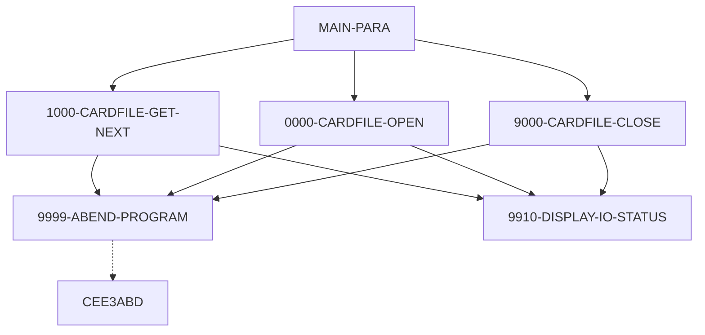

*Solid arrows are calls to the program's own paragraphs; dashed arrows are calls to other programs or paragraphs.*

### CBACT03C

*Complexity: Medium · Rules: 5*

Batch program that sequentially reads the card-to-account cross-reference file (XREFFILE) and displays every cross-reference record. A simple browse utility linking card numbers to account ids; open, loop read-and-display until end-of-file, close. Any I/O error prints the status and abends.

**Figure 6.3 — CBACT03C process/call flow**

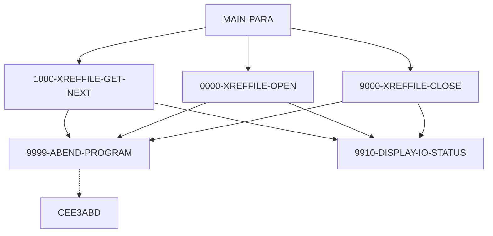

*Solid arrows are calls to the program's own paragraphs; dashed arrows are calls to other programs or paragraphs.*

### CBACT04C

*Complexity: High · Rules: 8*

The interest & fee posting batch. Reads the transaction-category-balance file (TCATBAL) in account order; for each account it looks up account data, the card cross-reference, and the interest rate from the disclosure-group file (falling back to a DEFAULT group if the specific one is missing). It computes monthly interest as (category balance x rate) / 1200, writes an interest transaction record, accumulates the interest, and when the account changes it rewrites the account master with the accumulated interest added to the balance and the cycle credit/debit reset to zero. Receives the processing date as a linkage parameter. Fee computation is stubbed ('to be implemented').

**Figure 6.4 — CBACT04C process/call flow**

```mermaid
flowchart TD
  MAIN_PARA["MAIN-PARA"]
  1050_UPDATE_ACCOUNT["1050-UPDATE-ACCOUNT"]
  1200_GET_INTEREST_RATE["1200-GET-INTEREST-RATE"]
  1200_A_GET_DEFAULT_INT_RATE["1200-A-GET-DEFAULT-INT-RATE"]
  1300_COMPUTE_INTEREST["1300-COMPUTE-INTEREST"]
  1300_B_WRITE_TX["1300-B-WRITE-TX"]
  1400_COMPUTE_FEES["1400-COMPUTE-FEES"]
  1000_TCATBALF_GET_NEXT["1000-TCATBALF-GET-NEXT"]
  1100_GET_ACCT_DATA["1100-GET-ACCT-DATA"]
  1110_GET_XREF_DATA["1110-GET-XREF-DATA"]
  0000_TCATBALF_OPEN["0000-TCATBALF-OPEN"]
  0100_XREFFILE_OPEN["0100-XREFFILE-OPEN"]
  0200_DISCGRP_OPEN["0200-DISCGRP-OPEN"]
  0300_ACCTFILE_OPEN["0300-ACCTFILE-OPEN"]
  0400_TRANFILE_OPEN["0400-TRANFILE-OPEN"]
  9000_TCATBALF_CLOSE["9000-TCATBALF-CLOSE"]
  9100_XREFFILE_CLOSE["9100-XREFFILE-CLOSE"]
  9200_DISCGRP_CLOSE["9200-DISCGRP-CLOSE"]
  9300_ACCTFILE_CLOSE["9300-ACCTFILE-CLOSE"]
  9400_TRANFILE_CLOSE["9400-TRANFILE-CLOSE"]
  Z_GET_DB2_FORMAT_TIMESTAMP["Z-GET-DB2-FORMAT-TIMESTAMP"]
  9999_ABEND_PROGRAM["9999-ABEND-PROGRAM"]
  9910_DISPLAY_IO_STATUS["9910-DISPLAY-IO-STATUS"]
  MAIN_PARA --> 0000_TCATBALF_OPEN
  MAIN_PARA --> 0100_XREFFILE_OPEN
  MAIN_PARA --> 0200_DISCGRP_OPEN
  MAIN_PARA --> 0300_ACCTFILE_OPEN
  MAIN_PARA --> 0400_TRANFILE_OPEN
  MAIN_PARA --> 1000_TCATBALF_GET_NEXT
  MAIN_PARA --> 1050_UPDATE_ACCOUNT
  MAIN_PARA --> 1100_GET_ACCT_DATA
  MAIN_PARA --> 1110_GET_XREF_DATA
  MAIN_PARA --> 1200_GET_INTEREST_RATE
  MAIN_PARA --> 1300_COMPUTE_INTEREST
  MAIN_PARA --> 1400_COMPUTE_FEES
  MAIN_PARA --> 9000_TCATBALF_CLOSE
  MAIN_PARA --> 9100_XREFFILE_CLOSE
  MAIN_PARA --> 9200_DISCGRP_CLOSE
  MAIN_PARA --> 9300_ACCTFILE_CLOSE
  MAIN_PARA --> 9400_TRANFILE_CLOSE
  1050_UPDATE_ACCOUNT --> 9910_DISPLAY_IO_STATUS
  1050_UPDATE_ACCOUNT --> 9999_ABEND_PROGRAM
  1200_GET_INTEREST_RATE --> 9910_DISPLAY_IO_STATUS
  1200_GET_INTEREST_RATE --> 9999_ABEND_PROGRAM
  1200_GET_INTEREST_RATE --> 1200_A_GET_DEFAULT_INT_RATE
  1200_A_GET_DEFAULT_INT_RATE --> 9910_DISPLAY_IO_STATUS
  1200_A_GET_DEFAULT_INT_RATE --> 9999_ABEND_PROGRAM
  1300_COMPUTE_INTEREST --> 1300_B_WRITE_TX
  1300_B_WRITE_TX --> Z_GET_DB2_FORMAT_TIMESTAMP
  1300_B_WRITE_TX --> 9910_DISPLAY_IO_STATUS
  1300_B_WRITE_TX --> 9999_ABEND_PROGRAM
  1000_TCATBALF_GET_NEXT --> 9910_DISPLAY_IO_STATUS
  1000_TCATBALF_GET_NEXT --> 9999_ABEND_PROGRAM
  1100_GET_ACCT_DATA --> 9910_DISPLAY_IO_STATUS
  1100_GET_ACCT_DATA --> 9999_ABEND_PROGRAM
  1110_GET_XREF_DATA --> 9910_DISPLAY_IO_STATUS
  1110_GET_XREF_DATA --> 9999_ABEND_PROGRAM
  0000_TCATBALF_OPEN --> 9910_DISPLAY_IO_STATUS
  0000_TCATBALF_OPEN --> 9999_ABEND_PROGRAM
  0100_XREFFILE_OPEN --> 9910_DISPLAY_IO_STATUS
  0100_XREFFILE_OPEN --> 9999_ABEND_PROGRAM
  0200_DISCGRP_OPEN --> 9910_DISPLAY_IO_STATUS
  0200_DISCGRP_OPEN --> 9999_ABEND_PROGRAM
  0300_ACCTFILE_OPEN --> 9910_DISPLAY_IO_STATUS
  0300_ACCTFILE_OPEN --> 9999_ABEND_PROGRAM
  0400_TRANFILE_OPEN --> 9910_DISPLAY_IO_STATUS
  0400_TRANFILE_OPEN --> 9999_ABEND_PROGRAM
  9000_TCATBALF_CLOSE --> 9910_DISPLAY_IO_STATUS
  9000_TCATBALF_CLOSE --> 9999_ABEND_PROGRAM
  9100_XREFFILE_CLOSE --> 9910_DISPLAY_IO_STATUS
  9100_XREFFILE_CLOSE --> 9999_ABEND_PROGRAM
  9200_DISCGRP_CLOSE --> 9910_DISPLAY_IO_STATUS
  9200_DISCGRP_CLOSE --> 9999_ABEND_PROGRAM
  9300_ACCTFILE_CLOSE --> 9910_DISPLAY_IO_STATUS
  9300_ACCTFILE_CLOSE --> 9999_ABEND_PROGRAM
  9400_TRANFILE_CLOSE --> 9910_DISPLAY_IO_STATUS
  9400_TRANFILE_CLOSE --> 9999_ABEND_PROGRAM
  9999_ABEND_PROGRAM -.-> CEE3ABD
```

*Solid arrows are calls to the program's own paragraphs; dashed arrows are calls to other programs or paragraphs.*

### CBCUS01C

*Complexity: Medium · Rules: 5*

Batch program that sequentially reads the indexed CUSTOMER master file (CUSTFILE) and displays every customer record. A simple browse utility: open the file, loop read-and-display until end-of-file, then close. Any I/O error prints the file status and abends.

**Figure 6.5 — CBCUS01C process/call flow**

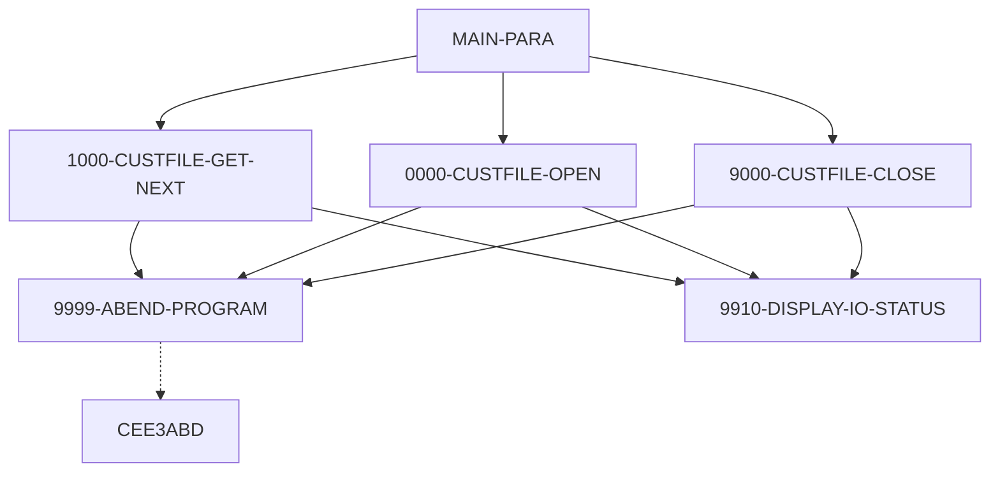

*Solid arrows are calls to the program's own paragraphs; dashed arrows are calls to other programs or paragraphs.*

### CBEXPORT

*Complexity: Low · Rules: 11*

Batch data-export utility for branch migration. Reads the five normalized CardDemo master files (customer, account, cross-reference, transaction, card) and writes a single multi-record export file, stamping each run with a generated timestamp and counting the records exported per entity. A straightforward ETL/migration extract with little business logic.

**Figure 6.6 — CBEXPORT process/call flow**

```mermaid
flowchart TD
  MAIN_PARA["MAIN-PARA"]
  1000_INITIALIZE["1000-INITIALIZE"]
  1050_GENERATE_TIMESTAMP["1050-GENERATE-TIMESTAMP"]
  1100_OPEN_FILES["1100-OPEN-FILES"]
  2000_EXPORT_CUSTOMERS["2000-EXPORT-CUSTOMERS"]
  2100_READ_CUSTOMER_RECORD["2100-READ-CUSTOMER-RECORD"]
  2200_CREATE_CUSTOMER_EXP_REC["2200-CREATE-CUSTOMER-EXP-REC"]
  3000_EXPORT_ACCOUNTS["3000-EXPORT-ACCOUNTS"]
  3100_READ_ACCOUNT_RECORD["3100-READ-ACCOUNT-RECORD"]
  3200_CREATE_ACCOUNT_EXP_REC["3200-CREATE-ACCOUNT-EXP-REC"]
  4000_EXPORT_XREFS["4000-EXPORT-XREFS"]
  4100_READ_XREF_RECORD["4100-READ-XREF-RECORD"]
  4200_CREATE_XREF_EXP_REC["4200-CREATE-XREF-EXP-REC"]
  5000_EXPORT_TRANSACTIONS["5000-EXPORT-TRANSACTIONS"]
  5100_READ_TRANSACTION_RECORD["5100-READ-TRANSACTION-RECORD"]
  5200_CREATE_TRANSACTION_EXP_REC["5200-CREATE-TRANSACTION-EXP-REC"]
  5500_EXPORT_CARDS["5500-EXPORT-CARDS"]
  5600_READ_CARD_RECORD["5600-READ-CARD-RECORD"]
  5700_CREATE_CARD_EXP_REC["5700-CREATE-CARD-EXP-REC"]
  6000_FINALIZE["6000-FINALIZE"]
  9999_ABEND_PROGRAM["9999-ABEND-PROGRAM"]
  MAIN_PARA --> 1000_INITIALIZE
  MAIN_PARA --> 2000_EXPORT_CUSTOMERS
  MAIN_PARA --> 3000_EXPORT_ACCOUNTS
  MAIN_PARA --> 4000_EXPORT_XREFS
  MAIN_PARA --> 5000_EXPORT_TRANSACTIONS
  MAIN_PARA --> 5500_EXPORT_CARDS
  MAIN_PARA --> 6000_FINALIZE
  1000_INITIALIZE --> 1050_GENERATE_TIMESTAMP
  1000_INITIALIZE --> 1100_OPEN_FILES
  1100_OPEN_FILES --> 9999_ABEND_PROGRAM
  2000_EXPORT_CUSTOMERS --> 2100_READ_CUSTOMER_RECORD
  2000_EXPORT_CUSTOMERS --> 2200_CREATE_CUSTOMER_EXP_REC
  2100_READ_CUSTOMER_RECORD --> 9999_ABEND_PROGRAM
  3000_EXPORT_ACCOUNTS --> 3100_READ_ACCOUNT_RECORD
  3000_EXPORT_ACCOUNTS --> 3200_CREATE_ACCOUNT_EXP_REC
  3100_READ_ACCOUNT_RECORD --> 9999_ABEND_PROGRAM
  4000_EXPORT_XREFS --> 4100_READ_XREF_RECORD
  4000_EXPORT_XREFS --> 4200_CREATE_XREF_EXP_REC
  4100_READ_XREF_RECORD --> 9999_ABEND_PROGRAM
  5000_EXPORT_TRANSACTIONS --> 5100_READ_TRANSACTION_RECORD
  5000_EXPORT_TRANSACTIONS --> 5200_CREATE_TRANSACTION_EXP_REC
  5100_READ_TRANSACTION_RECORD --> 9999_ABEND_PROGRAM
  5500_EXPORT_CARDS --> 5600_READ_CARD_RECORD
  5500_EXPORT_CARDS --> 5700_CREATE_CARD_EXP_REC
  5600_READ_CARD_RECORD --> 9999_ABEND_PROGRAM
```

*Solid arrows are calls to the program's own paragraphs; dashed arrows are calls to other programs or paragraphs.*

### CBIMPORT

*Complexity: Medium · Rules: 9*

Batch data-import counterpart of CBEXPORT. Reads the multi-record export file, routes each record to the correct output master file based on its record-type code (customer, account, cross-reference, transaction, card), logs unknown record types to an error file, and reports per-entity import counts. Validates the import at the end.

**Figure 6.7 — CBIMPORT process/call flow**

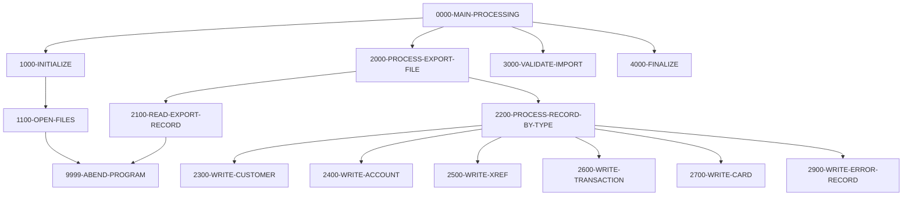

*Solid arrows are calls to the program's own paragraphs; dashed arrows are calls to other programs or paragraphs.*

### CBPAUP0C

*Complexity: High · Rules: 21*

IMS batch purge for the authorization module: deletes expired pending-authorization messages. It walks the IMS pending-authorization database (summary root segments, each with detail child segments); for each detail it checks whether it is older than the expiry window (parameter, default 5 days) and deletes qualifying details. When a summary has no remaining approved authorizations it deletes the summary too. Takes IMS checkpoints at a configurable frequency for restartability and prints counts of records read and deleted.

**Figure 6.8 — CBPAUP0C process/call flow**

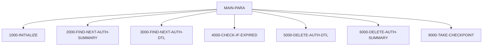

*Solid arrows are calls to the program's own paragraphs; dashed arrows are calls to other programs or paragraphs.*

### CBSTM03A

*Complexity: Medium · Rules: 11*

Account statement generator. For each account (via the card cross-reference) it reads the customer and account data and all of the account's transactions, then produces a statement in BOTH plain-text and HTML formats. Transactions are buffered in an in-memory table (up to 51 cards x 10 transactions). Notably uses legacy ALTER + GO TO 'switched paragraph' control flow and reads the mainframe TIOT control blocks to list the job's DD names. Contains unstructured control flow that should be reviewed before modernization.

**Figure 6.9 — CBSTM03A process/call flow**

```mermaid
flowchart TD
  MAIN_PARA["MAIN-PARA"]
  0000_START["0000-START"]
  1000_MAINLINE["1000-MAINLINE"]
  5000_CREATE_STATEMENT["5000-CREATE-STATEMENT"]
  1000_XREFFILE_GET_NEXT["1000-XREFFILE-GET-NEXT"]
  2000_CUSTFILE_GET["2000-CUSTFILE-GET"]
  3000_ACCTFILE_GET["3000-ACCTFILE-GET"]
  4000_TRNXFILE_GET["4000-TRNXFILE-GET"]
  8100_FILE_OPEN["8100-FILE-OPEN"]
  8100_TRNXFILE_OPEN["8100-TRNXFILE-OPEN"]
  8200_XREFFILE_OPEN["8200-XREFFILE-OPEN"]
  8300_CUSTFILE_OPEN["8300-CUSTFILE-OPEN"]
  8400_ACCTFILE_OPEN["8400-ACCTFILE-OPEN"]
  8500_READTRNX_READ["8500-READTRNX-READ"]
  9999_GOBACK["9999-GOBACK"]
  0000_START --> 8100_FILE_OPEN
  0000_START --> 8500_READTRNX_READ
  0000_START --> 9999_GOBACK
  1000_MAINLINE --> 1000_XREFFILE_GET_NEXT
  1000_MAINLINE --> 2000_CUSTFILE_GET
  1000_MAINLINE --> 3000_ACCTFILE_GET
  1000_MAINLINE --> 5000_CREATE_STATEMENT
  1000_MAINLINE --> 4000_TRNXFILE_GET
```

*Solid arrows are calls to the program's own paragraphs; dashed arrows are calls to other programs or paragraphs.*

### CBSTM03B

*Complexity: Medium · Rules: 7*

Called I/O subroutine used by the statement generator (CBSTM03A). It is a generic data-access layer: the caller passes a linkage area naming a file (DD) and an operation code (Open/Close/Read/Read-Keyed/Write/Rewrite) plus a key and a record buffer; the routine performs the requested operation on the matching file (transaction, cross-reference, customer, account) and returns the file status. Keeps all VSAM I/O in one reusable module.

**Figure 6.10 — CBSTM03B process/call flow**

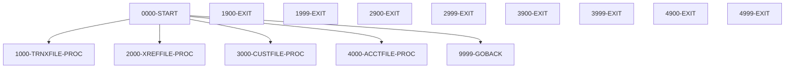

*Solid arrows are calls to the program's own paragraphs; dashed arrows are calls to other programs or paragraphs.*

### CBTRN01C

*Complexity: Medium · Rules: 3*

Daily-transaction verification/browse batch. Reads each daily transaction, looks up its card in the cross-reference, and (if found) reads the matching account, displaying the results. A read-only validation pre-pass that reports invalid cards and missing accounts but does not post anything. Opens six files (daily transactions, customer, cross-reference, card, account, transaction).

**Figure 6.11 — CBTRN01C process/call flow**

```mermaid
flowchart TD
  MAIN_PARA["MAIN-PARA"]
  2000_LOOKUP_XREF["2000-LOOKUP-XREF"]
  3000_READ_ACCOUNT["3000-READ-ACCOUNT"]
  1000_DALYTRAN_GET_NEXT["1000-DALYTRAN-GET-NEXT"]
  0000_DALYTRAN_OPEN["0000-DALYTRAN-OPEN"]
  0100_CUSTFILE_OPEN["0100-CUSTFILE-OPEN"]
  0200_XREFFILE_OPEN["0200-XREFFILE-OPEN"]
  0300_CARDFILE_OPEN["0300-CARDFILE-OPEN"]
  0400_ACCTFILE_OPEN["0400-ACCTFILE-OPEN"]
  0500_TRANFILE_OPEN["0500-TRANFILE-OPEN"]
  9000_DALYTRAN_CLOSE["9000-DALYTRAN-CLOSE"]
  9100_CUSTFILE_CLOSE["9100-CUSTFILE-CLOSE"]
  9200_XREFFILE_CLOSE["9200-XREFFILE-CLOSE"]
  9300_CARDFILE_CLOSE["9300-CARDFILE-CLOSE"]
  9400_ACCTFILE_CLOSE["9400-ACCTFILE-CLOSE"]
  9500_TRANFILE_CLOSE["9500-TRANFILE-CLOSE"]
  Z_DISPLAY_IO_STATUS["Z-DISPLAY-IO-STATUS"]
  Z_ABEND_PROGRAM["Z-ABEND-PROGRAM"]
  MAIN_PARA --> 0000_DALYTRAN_OPEN
  MAIN_PARA --> 0100_CUSTFILE_OPEN
  MAIN_PARA --> 0200_XREFFILE_OPEN
  MAIN_PARA --> 0300_CARDFILE_OPEN
  MAIN_PARA --> 0400_ACCTFILE_OPEN
  MAIN_PARA --> 0500_TRANFILE_OPEN
  MAIN_PARA --> 1000_DALYTRAN_GET_NEXT
  MAIN_PARA --> 2000_LOOKUP_XREF
  MAIN_PARA --> 3000_READ_ACCOUNT
  MAIN_PARA --> 9000_DALYTRAN_CLOSE
  MAIN_PARA --> 9100_CUSTFILE_CLOSE
  MAIN_PARA --> 9200_XREFFILE_CLOSE
  MAIN_PARA --> 9300_CARDFILE_CLOSE
  MAIN_PARA --> 9400_ACCTFILE_CLOSE
  MAIN_PARA --> 9500_TRANFILE_CLOSE
  1000_DALYTRAN_GET_NEXT --> Z_DISPLAY_IO_STATUS
  1000_DALYTRAN_GET_NEXT --> Z_ABEND_PROGRAM
  0000_DALYTRAN_OPEN --> Z_DISPLAY_IO_STATUS
  0000_DALYTRAN_OPEN --> Z_ABEND_PROGRAM
  0100_CUSTFILE_OPEN --> Z_DISPLAY_IO_STATUS
  0100_CUSTFILE_OPEN --> Z_ABEND_PROGRAM
  0200_XREFFILE_OPEN --> Z_DISPLAY_IO_STATUS
  0200_XREFFILE_OPEN --> Z_ABEND_PROGRAM
  0300_CARDFILE_OPEN --> Z_DISPLAY_IO_STATUS
  0300_CARDFILE_OPEN --> Z_ABEND_PROGRAM
  0400_ACCTFILE_OPEN --> Z_DISPLAY_IO_STATUS
  0400_ACCTFILE_OPEN --> Z_ABEND_PROGRAM
  0500_TRANFILE_OPEN --> Z_DISPLAY_IO_STATUS
  0500_TRANFILE_OPEN --> Z_ABEND_PROGRAM
  9000_DALYTRAN_CLOSE --> Z_DISPLAY_IO_STATUS
  9000_DALYTRAN_CLOSE --> Z_ABEND_PROGRAM
  9100_CUSTFILE_CLOSE --> Z_DISPLAY_IO_STATUS
  9100_CUSTFILE_CLOSE --> Z_ABEND_PROGRAM
  9200_XREFFILE_CLOSE --> Z_DISPLAY_IO_STATUS
  9200_XREFFILE_CLOSE --> Z_ABEND_PROGRAM
  9300_CARDFILE_CLOSE --> Z_DISPLAY_IO_STATUS
  9300_CARDFILE_CLOSE --> Z_ABEND_PROGRAM
  9400_ACCTFILE_CLOSE --> Z_DISPLAY_IO_STATUS
  9400_ACCTFILE_CLOSE --> Z_ABEND_PROGRAM
  9500_TRANFILE_CLOSE --> Z_DISPLAY_IO_STATUS
  9500_TRANFILE_CLOSE --> Z_ABEND_PROGRAM
  Z_ABEND_PROGRAM -.-> CEE3ABD
```

*Solid arrows are calls to the program's own paragraphs; dashed arrows are calls to other programs or paragraphs.*

### CBTRN02C

*Complexity: High · Rules: 9*

The daily transaction posting engine. Reads the day's transactions (DALYTRAN); for each one it validates the card, account, credit limit and expiry, and either POSTS the transaction (updating the transaction-category balance, the account balance and cycle credit/debit, and writing the transaction record) or REJECTS it with a numbered reason to the rejects file. Counts processed and rejected transactions and sets return code 4 if any were rejected. Contains the core credit-card transaction validation rules (reasons 100-103, 109).

**Figure 6.12 — CBTRN02C process/call flow**

```mermaid
flowchart TD
  MAIN_PARA["MAIN-PARA"]
  1500_VALIDATE_TRAN["1500-VALIDATE-TRAN"]
  1500_A_LOOKUP_XREF["1500-A-LOOKUP-XREF"]
  1500_B_LOOKUP_ACCT["1500-B-LOOKUP-ACCT"]
  2000_POST_TRANSACTION["2000-POST-TRANSACTION"]
  2700_UPDATE_TCATBAL["2700-UPDATE-TCATBAL"]
  2700_A_CREATE_TCATBAL_REC["2700-A-CREATE-TCATBAL-REC"]
  2700_B_UPDATE_TCATBAL_REC["2700-B-UPDATE-TCATBAL-REC"]
  2800_UPDATE_ACCOUNT_REC["2800-UPDATE-ACCOUNT-REC"]
  2500_WRITE_REJECT_REC["2500-WRITE-REJECT-REC"]
  2900_WRITE_TRANSACTION_FILE["2900-WRITE-TRANSACTION-FILE"]
  1000_DALYTRAN_GET_NEXT["1000-DALYTRAN-GET-NEXT"]
  0000_DALYTRAN_OPEN["0000-DALYTRAN-OPEN"]
  0100_TRANFILE_OPEN["0100-TRANFILE-OPEN"]
  0200_XREFFILE_OPEN["0200-XREFFILE-OPEN"]
  0300_DALYREJS_OPEN["0300-DALYREJS-OPEN"]
  0400_ACCTFILE_OPEN["0400-ACCTFILE-OPEN"]
  0500_TCATBALF_OPEN["0500-TCATBALF-OPEN"]
  9000_DALYTRAN_CLOSE["9000-DALYTRAN-CLOSE"]
  9100_TRANFILE_CLOSE["9100-TRANFILE-CLOSE"]
  9200_XREFFILE_CLOSE["9200-XREFFILE-CLOSE"]
  9300_DALYREJS_CLOSE["9300-DALYREJS-CLOSE"]
  9400_ACCTFILE_CLOSE["9400-ACCTFILE-CLOSE"]
  9500_TCATBALF_CLOSE["9500-TCATBALF-CLOSE"]
  Z_GET_DB2_FORMAT_TIMESTAMP["Z-GET-DB2-FORMAT-TIMESTAMP"]
  9999_ABEND_PROGRAM["9999-ABEND-PROGRAM"]
  9910_DISPLAY_IO_STATUS["9910-DISPLAY-IO-STATUS"]
  MAIN_PARA --> 0000_DALYTRAN_OPEN
  MAIN_PARA --> 0100_TRANFILE_OPEN
  MAIN_PARA --> 0200_XREFFILE_OPEN
  MAIN_PARA --> 0300_DALYREJS_OPEN
  MAIN_PARA --> 0400_ACCTFILE_OPEN
  MAIN_PARA --> 0500_TCATBALF_OPEN
  MAIN_PARA --> 1000_DALYTRAN_GET_NEXT
  MAIN_PARA --> 1500_VALIDATE_TRAN
  MAIN_PARA --> 2000_POST_TRANSACTION
  MAIN_PARA --> 2500_WRITE_REJECT_REC
  MAIN_PARA --> 9000_DALYTRAN_CLOSE
  MAIN_PARA --> 9100_TRANFILE_CLOSE
  MAIN_PARA --> 9200_XREFFILE_CLOSE
  MAIN_PARA --> 9300_DALYREJS_CLOSE
  MAIN_PARA --> 9400_ACCTFILE_CLOSE
  MAIN_PARA --> 9500_TCATBALF_CLOSE
  1500_VALIDATE_TRAN --> 1500_A_LOOKUP_XREF
  1500_VALIDATE_TRAN --> 1500_B_LOOKUP_ACCT
  2000_POST_TRANSACTION --> Z_GET_DB2_FORMAT_TIMESTAMP
  2000_POST_TRANSACTION --> 2700_UPDATE_TCATBAL
  2000_POST_TRANSACTION --> 2800_UPDATE_ACCOUNT_REC
  2000_POST_TRANSACTION --> 2900_WRITE_TRANSACTION_FILE
  2700_UPDATE_TCATBAL --> 2700_A_CREATE_TCATBAL_REC
  2700_UPDATE_TCATBAL --> 2700_B_UPDATE_TCATBAL_REC
  2700_UPDATE_TCATBAL --> 9910_DISPLAY_IO_STATUS
  2700_UPDATE_TCATBAL --> 9999_ABEND_PROGRAM
  2700_A_CREATE_TCATBAL_REC --> 9910_DISPLAY_IO_STATUS
  2700_A_CREATE_TCATBAL_REC --> 9999_ABEND_PROGRAM
  2700_B_UPDATE_TCATBAL_REC --> 9910_DISPLAY_IO_STATUS
  2700_B_UPDATE_TCATBAL_REC --> 9999_ABEND_PROGRAM
  2500_WRITE_REJECT_REC --> 9910_DISPLAY_IO_STATUS
  2500_WRITE_REJECT_REC --> 9999_ABEND_PROGRAM
  2900_WRITE_TRANSACTION_FILE --> 9910_DISPLAY_IO_STATUS
  2900_WRITE_TRANSACTION_FILE --> 9999_ABEND_PROGRAM
  1000_DALYTRAN_GET_NEXT --> 9910_DISPLAY_IO_STATUS
  1000_DALYTRAN_GET_NEXT --> 9999_ABEND_PROGRAM
  0000_DALYTRAN_OPEN --> 9910_DISPLAY_IO_STATUS
  0000_DALYTRAN_OPEN --> 9999_ABEND_PROGRAM
  0100_TRANFILE_OPEN --> 9910_DISPLAY_IO_STATUS
  0100_TRANFILE_OPEN --> 9999_ABEND_PROGRAM
  0200_XREFFILE_OPEN --> 9910_DISPLAY_IO_STATUS
  0200_XREFFILE_OPEN --> 9999_ABEND_PROGRAM
  0300_DALYREJS_OPEN --> 9910_DISPLAY_IO_STATUS
  0300_DALYREJS_OPEN --> 9999_ABEND_PROGRAM
  0400_ACCTFILE_OPEN --> 9910_DISPLAY_IO_STATUS
  0400_ACCTFILE_OPEN --> 9999_ABEND_PROGRAM
  0500_TCATBALF_OPEN --> 9910_DISPLAY_IO_STATUS
  0500_TCATBALF_OPEN --> 9999_ABEND_PROGRAM
  9000_DALYTRAN_CLOSE --> 9910_DISPLAY_IO_STATUS
  9000_DALYTRAN_CLOSE --> 9999_ABEND_PROGRAM
  9100_TRANFILE_CLOSE --> 9910_DISPLAY_IO_STATUS
  9100_TRANFILE_CLOSE --> 9999_ABEND_PROGRAM
  9200_XREFFILE_CLOSE --> 9910_DISPLAY_IO_STATUS
  9200_XREFFILE_CLOSE --> 9999_ABEND_PROGRAM
  9300_DALYREJS_CLOSE --> 9910_DISPLAY_IO_STATUS
  9300_DALYREJS_CLOSE --> 9999_ABEND_PROGRAM
  9400_ACCTFILE_CLOSE --> 9910_DISPLAY_IO_STATUS
  9400_ACCTFILE_CLOSE --> 9999_ABEND_PROGRAM
  9500_TCATBALF_CLOSE --> 9910_DISPLAY_IO_STATUS
  9500_TCATBALF_CLOSE --> 9999_ABEND_PROGRAM
  9999_ABEND_PROGRAM -.-> CEE3ABD
```

*Solid arrows are calls to the program's own paragraphs; dashed arrows are calls to other programs or paragraphs.*

### CBTRN03C

*Complexity: High · Rules: 11*

Transaction detail report batch. Reads a date range from a parameter file, then reads the transaction file and prints only transactions whose processing date falls in that range. Enriches each line with the account (via card cross-reference), transaction-type and transaction-category descriptions, and produces a formatted report with page headers, per-account (per-card) subtotals, page totals and a grand total via control-break logic.

**Figure 6.13 — CBTRN03C process/call flow**

```mermaid
flowchart TD
  MAIN_PARA["MAIN-PARA"]
  0550_DATEPARM_READ["0550-DATEPARM-READ"]
  1000_TRANFILE_GET_NEXT["1000-TRANFILE-GET-NEXT"]
  1100_WRITE_TRANSACTION_REPORT["1100-WRITE-TRANSACTION-REPORT"]
  1110_WRITE_PAGE_TOTALS["1110-WRITE-PAGE-TOTALS"]
  1120_WRITE_ACCOUNT_TOTALS["1120-WRITE-ACCOUNT-TOTALS"]
  1110_WRITE_GRAND_TOTALS["1110-WRITE-GRAND-TOTALS"]
  1120_WRITE_HEADERS["1120-WRITE-HEADERS"]
  1120_WRITE_DETAIL["1120-WRITE-DETAIL"]
  1111_WRITE_REPORT_REC["1111-WRITE-REPORT-REC"]
  1500_A_LOOKUP_XREF["1500-A-LOOKUP-XREF"]
  1500_B_LOOKUP_TRANTYPE["1500-B-LOOKUP-TRANTYPE"]
  1500_C_LOOKUP_TRANCATG["1500-C-LOOKUP-TRANCATG"]
  0000_TRANFILE_OPEN["0000-TRANFILE-OPEN"]
  0100_REPTFILE_OPEN["0100-REPTFILE-OPEN"]
  0200_CARDXREF_OPEN["0200-CARDXREF-OPEN"]
  0300_TRANTYPE_OPEN["0300-TRANTYPE-OPEN"]
  0400_TRANCATG_OPEN["0400-TRANCATG-OPEN"]
  0500_DATEPARM_OPEN["0500-DATEPARM-OPEN"]
  9000_TRANFILE_CLOSE["9000-TRANFILE-CLOSE"]
  9100_REPTFILE_CLOSE["9100-REPTFILE-CLOSE"]
  9200_CARDXREF_CLOSE["9200-CARDXREF-CLOSE"]
  9300_TRANTYPE_CLOSE["9300-TRANTYPE-CLOSE"]
  9400_TRANCATG_CLOSE["9400-TRANCATG-CLOSE"]
  9500_DATEPARM_CLOSE["9500-DATEPARM-CLOSE"]
  9999_ABEND_PROGRAM["9999-ABEND-PROGRAM"]
  9910_DISPLAY_IO_STATUS["9910-DISPLAY-IO-STATUS"]
  MAIN_PARA --> 0000_TRANFILE_OPEN
  MAIN_PARA --> 0100_REPTFILE_OPEN
  MAIN_PARA --> 0200_CARDXREF_OPEN
  MAIN_PARA --> 0300_TRANTYPE_OPEN
  MAIN_PARA --> 0400_TRANCATG_OPEN
  MAIN_PARA --> 0500_DATEPARM_OPEN
  MAIN_PARA --> 0550_DATEPARM_READ
  MAIN_PARA --> 1000_TRANFILE_GET_NEXT
  MAIN_PARA --> 1120_WRITE_ACCOUNT_TOTALS
  MAIN_PARA --> 1500_A_LOOKUP_XREF
  MAIN_PARA --> 1500_B_LOOKUP_TRANTYPE
  MAIN_PARA --> 1500_C_LOOKUP_TRANCATG
  MAIN_PARA --> 1100_WRITE_TRANSACTION_REPORT
  MAIN_PARA --> 1110_WRITE_PAGE_TOTALS
  MAIN_PARA --> 1110_WRITE_GRAND_TOTALS
  MAIN_PARA --> 9000_TRANFILE_CLOSE
  MAIN_PARA --> 9100_REPTFILE_CLOSE
  MAIN_PARA --> 9200_CARDXREF_CLOSE
  MAIN_PARA --> 9300_TRANTYPE_CLOSE
  MAIN_PARA --> 9400_TRANCATG_CLOSE
  MAIN_PARA --> 9500_DATEPARM_CLOSE
  0550_DATEPARM_READ --> 9910_DISPLAY_IO_STATUS
  0550_DATEPARM_READ --> 9999_ABEND_PROGRAM
  1000_TRANFILE_GET_NEXT --> 9910_DISPLAY_IO_STATUS
  1000_TRANFILE_GET_NEXT --> 9999_ABEND_PROGRAM
  1100_WRITE_TRANSACTION_REPORT --> 1120_WRITE_HEADERS
  1100_WRITE_TRANSACTION_REPORT --> 1110_WRITE_PAGE_TOTALS
  1100_WRITE_TRANSACTION_REPORT --> 1120_WRITE_DETAIL
  1110_WRITE_PAGE_TOTALS --> 1111_WRITE_REPORT_REC
  1120_WRITE_ACCOUNT_TOTALS --> 1111_WRITE_REPORT_REC
  1110_WRITE_GRAND_TOTALS --> 1111_WRITE_REPORT_REC
  1120_WRITE_HEADERS --> 1111_WRITE_REPORT_REC
  1120_WRITE_DETAIL --> 1111_WRITE_REPORT_REC
  1111_WRITE_REPORT_REC --> 9910_DISPLAY_IO_STATUS
  1111_WRITE_REPORT_REC --> 9999_ABEND_PROGRAM
  0000_TRANFILE_OPEN --> 9910_DISPLAY_IO_STATUS
  0000_TRANFILE_OPEN --> 9999_ABEND_PROGRAM
  0100_REPTFILE_OPEN --> 9910_DISPLAY_IO_STATUS
  0100_REPTFILE_OPEN --> 9999_ABEND_PROGRAM
  0200_CARDXREF_OPEN --> 9910_DISPLAY_IO_STATUS
  0200_CARDXREF_OPEN --> 9999_ABEND_PROGRAM
  0300_TRANTYPE_OPEN --> 9910_DISPLAY_IO_STATUS
  0300_TRANTYPE_OPEN --> 9999_ABEND_PROGRAM
  0400_TRANCATG_OPEN --> 9910_DISPLAY_IO_STATUS
  0400_TRANCATG_OPEN --> 9999_ABEND_PROGRAM
  0500_DATEPARM_OPEN --> 9910_DISPLAY_IO_STATUS
  0500_DATEPARM_OPEN --> 9999_ABEND_PROGRAM
  9000_TRANFILE_CLOSE --> 9910_DISPLAY_IO_STATUS
  9000_TRANFILE_CLOSE --> 9999_ABEND_PROGRAM
  9100_REPTFILE_CLOSE --> 9910_DISPLAY_IO_STATUS
  9100_REPTFILE_CLOSE --> 9999_ABEND_PROGRAM
  9200_CARDXREF_CLOSE --> 9910_DISPLAY_IO_STATUS
  9200_CARDXREF_CLOSE --> 9999_ABEND_PROGRAM
  9300_TRANTYPE_CLOSE --> 9910_DISPLAY_IO_STATUS
  9300_TRANTYPE_CLOSE --> 9999_ABEND_PROGRAM
  9400_TRANCATG_CLOSE --> 9910_DISPLAY_IO_STATUS
  9400_TRANCATG_CLOSE --> 9999_ABEND_PROGRAM
  9500_DATEPARM_CLOSE --> 9910_DISPLAY_IO_STATUS
  9500_DATEPARM_CLOSE --> 9999_ABEND_PROGRAM
  9999_ABEND_PROGRAM -.-> CEE3ABD
```

*Solid arrows are calls to the program's own paragraphs; dashed arrows are calls to other programs or paragraphs.*

### COACCT01

*Complexity: Medium · Rules: 7*

MQ-triggered CICS account-inquiry service (VSAM-MQ variant, sibling of CODATE01). Started by an IBM MQ trigger message, it retrieves the triggering queue via CICS RETRIEVE, opens the input, reply and error MQ queues, reads request messages containing a function code and an account key, reads the requested account record from the account file, and puts an account-data reply message on the reply queue. Errors go to an error queue. A message-driven integration service.

**Figure 6.14 — COACCT01 process/call flow**

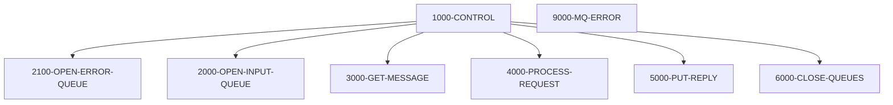

*Solid arrows are calls to the program's own paragraphs; dashed arrows are calls to other programs or paragraphs.*

### COACTUPC

*Complexity: High · Rules: 78*

CICS online Account Update screen -- the most complex online program. Lets a user retrieve an account, edit account and customer fields, and save the changes. It runs an extensive field-validation suite (account number, mandatory fields, yes/no flags, alphabetic, alphanumeric, numeric, signed amounts, US phone, SSN, US state code, FICO score, state+zip consistency), compares old vs new values, and only rewrites the account/customer records if something actually changed AND the record was not changed by someone else since it was read (optimistic concurrency check). Pseudo-conversational via a 2000-byte COMMAREA.

**Figure 6.15 — COACTUPC process/call flow**

```mermaid
flowchart TD
  0000_MAIN["0000-MAIN"]
  1000_PROCESS_INPUTS["1000-PROCESS-INPUTS"]
  1100_RECEIVE_MAP["1100-RECEIVE-MAP"]
  1200_EDIT_MAP_INPUTS["1200-EDIT-MAP-INPUTS"]
  1205_COMPARE_OLD_NEW["1205-COMPARE-OLD-NEW"]
  1210_EDIT_ACCOUNT["1210-EDIT-ACCOUNT"]
  1215_EDIT_MANDATORY["1215-EDIT-MANDATORY"]
  1220_EDIT_YESNO["1220-EDIT-YESNO"]
  1225_EDIT_ALPHA_REQD["1225-EDIT-ALPHA-REQD"]
  1230_EDIT_ALPHANUM_REQD["1230-EDIT-ALPHANUM-REQD"]
  1235_EDIT_ALPHA_OPT["1235-EDIT-ALPHA-OPT"]
  1240_EDIT_ALPHANUM_OPT["1240-EDIT-ALPHANUM-OPT"]
  1245_EDIT_NUM_REQD["1245-EDIT-NUM-REQD"]
  1250_EDIT_SIGNED_9V2["1250-EDIT-SIGNED-9V2"]
  1260_EDIT_US_PHONE_NUM["1260-EDIT-US-PHONE-NUM"]
  EDIT_AREA_CODE["EDIT-AREA-CODE"]
  EDIT_US_PHONE_PREFIX["EDIT-US-PHONE-PREFIX"]
  EDIT_US_PHONE_LINENUM["EDIT-US-PHONE-LINENUM"]
  1265_EDIT_US_SSN["1265-EDIT-US-SSN"]
  1270_EDIT_US_STATE_CD["1270-EDIT-US-STATE-CD"]
  1275_EDIT_FICO_SCORE["1275-EDIT-FICO-SCORE"]
  1280_EDIT_US_STATE_ZIP_CD["1280-EDIT-US-STATE-ZIP-CD"]
  2000_DECIDE_ACTION["2000-DECIDE-ACTION"]
  3000_SEND_MAP["3000-SEND-MAP"]
  3200_SETUP_SCREEN_VARS["3200-SETUP-SCREEN-VARS"]
  3300_SETUP_SCREEN_ATTRS["3300-SETUP-SCREEN-ATTRS"]
  9000_READ_ACCT["9000-READ-ACCT"]
  9500_STORE_FETCHED_DATA["9500-STORE-FETCHED-DATA"]
  9600_WRITE_PROCESSING["9600-WRITE-PROCESSING"]
  9700_CHECK_CHANGE_IN_REC["9700-CHECK-CHANGE-IN-REC"]
  COMMON_RETURN["COMMON-RETURN"]
  ABEND_ROUTINE["ABEND-ROUTINE"]
  0000_MAIN --> 1000_PROCESS_INPUTS
  0000_MAIN --> 2000_DECIDE_ACTION
  0000_MAIN --> 3000_SEND_MAP
  0000_MAIN --> 9000_READ_ACCT
  0000_MAIN --> 9600_WRITE_PROCESSING
  0000_MAIN --> COMMON_RETURN
  1000_PROCESS_INPUTS --> 1100_RECEIVE_MAP
  1000_PROCESS_INPUTS --> 1200_EDIT_MAP_INPUTS
  1200_EDIT_MAP_INPUTS --> 1210_EDIT_ACCOUNT
  1200_EDIT_MAP_INPUTS --> 1215_EDIT_MANDATORY
  1200_EDIT_MAP_INPUTS --> 1220_EDIT_YESNO
  1200_EDIT_MAP_INPUTS --> 1225_EDIT_ALPHA_REQD
  1200_EDIT_MAP_INPUTS --> 1230_EDIT_ALPHANUM_REQD
  1200_EDIT_MAP_INPUTS --> 1235_EDIT_ALPHA_OPT
  1200_EDIT_MAP_INPUTS --> 1240_EDIT_ALPHANUM_OPT
  1200_EDIT_MAP_INPUTS --> 1245_EDIT_NUM_REQD
  1200_EDIT_MAP_INPUTS --> 1250_EDIT_SIGNED_9V2
  1200_EDIT_MAP_INPUTS --> 1260_EDIT_US_PHONE_NUM
  1200_EDIT_MAP_INPUTS --> 1265_EDIT_US_SSN
  1200_EDIT_MAP_INPUTS --> 1270_EDIT_US_STATE_CD
  1200_EDIT_MAP_INPUTS --> 1275_EDIT_FICO_SCORE
  1200_EDIT_MAP_INPUTS --> 1280_EDIT_US_STATE_ZIP_CD
  1260_EDIT_US_PHONE_NUM --> EDIT_AREA_CODE
  1260_EDIT_US_PHONE_NUM --> EDIT_US_PHONE_PREFIX
  1260_EDIT_US_PHONE_NUM --> EDIT_US_PHONE_LINENUM
  3000_SEND_MAP -.-> 3100_SCREEN_INIT
  3000_SEND_MAP --> 3200_SETUP_SCREEN_VARS
  3000_SEND_MAP -.-> 3250_SETUP_INFOMSG
  3000_SEND_MAP --> 3300_SETUP_SCREEN_ATTRS
  3000_SEND_MAP -.-> 3400_SEND_SCREEN
  3200_SETUP_SCREEN_VARS -.-> 3201_SHOW_INITIAL_VALUES
  3200_SETUP_SCREEN_VARS -.-> 3202_SHOW_ORIGINAL_VALUES
  3200_SETUP_SCREEN_VARS -.-> 3203_SHOW_UPDATED_VALUES
  3300_SETUP_SCREEN_ATTRS -.-> 3310_PROTECT_ALL_ATTRS
  3300_SETUP_SCREEN_ATTRS -.-> 3320_UNPROTECT_FEW_ATTRS
  3300_SETUP_SCREEN_ATTRS -.-> 3390_SETUP_INFOMSG_ATTRS
  9000_READ_ACCT -.-> 9200_GETCARDXREF_BYACCT
  9000_READ_ACCT -.-> 9300_GETACCTDATA_BYACCT
  9000_READ_ACCT -.-> 9400_GETCUSTDATA_BYCUST
  9000_READ_ACCT --> 9500_STORE_FETCHED_DATA
  9600_WRITE_PROCESSING --> 9700_CHECK_CHANGE_IN_REC
```

*Solid arrows are calls to the program's own paragraphs; dashed arrows are calls to other programs or paragraphs.*

### COACTVWC

*Complexity: Medium · Rules: 10*

CICS online Account View screen. A pseudo-conversational transaction: the user enters an account number, the program validates it, then reads the card cross-reference, account and customer records to display the full account detail. Read-only inquiry (no updates). Handles PF-key navigation (Enter to inquire, PF3 to return to the menu) via a 2000-byte COMMAREA.

**Figure 6.16 — COACTVWC process/call flow**

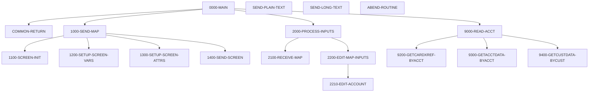

*Solid arrows are calls to the program's own paragraphs; dashed arrows are calls to other programs or paragraphs.*

### COADM01C

*Complexity: Medium · Rules: 5*

CICS online Admin Menu for administrator users. Like the main menu but exposes administrative options -- notably user management (list/add/update/delete users). Validates the selected option and transfers control (CICS XCTL) to the corresponding admin program. Reached only by users authenticated as Admin.

**Figure 6.17 — COADM01C process/call flow**

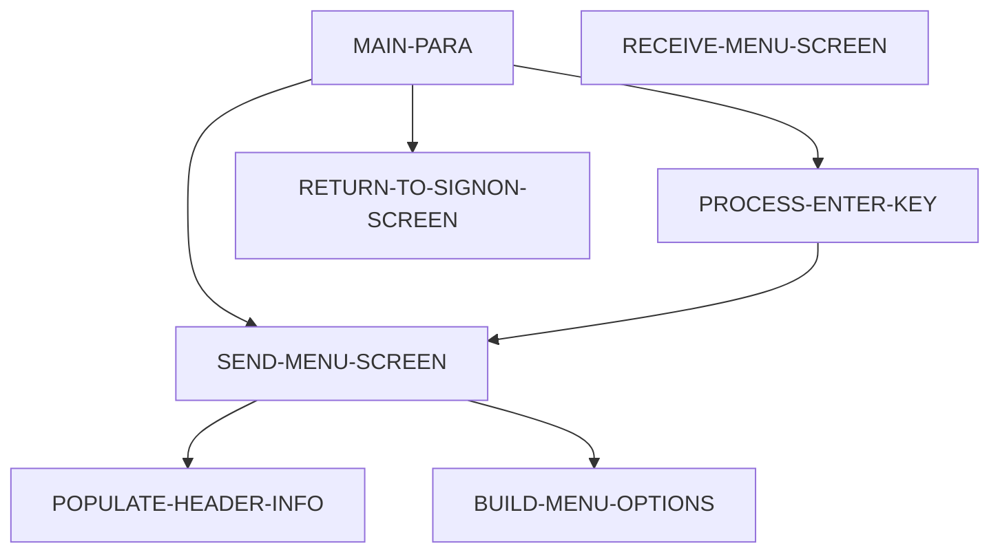

*Solid arrows are calls to the program's own paragraphs; dashed arrows are calls to other programs or paragraphs.*

### COBIL00C

*Complexity: High · Rules: 9*

CICS online Bill Payment screen. The user enters an account id and confirms payment; the program reads the account, shows the current balance, and on confirmation pays the FULL outstanding balance -- creating a payment transaction for the balance amount and zeroing the account balance. Rejects payment when there is nothing to pay (balance <= 0). Pseudo-conversational.

**Figure 6.18 — COBIL00C process/call flow**

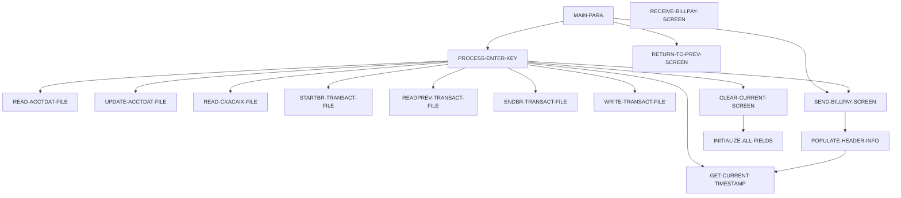

*Solid arrows are calls to the program's own paragraphs; dashed arrows are calls to other programs or paragraphs.*

### COBSWAIT

*Complexity: Low · Rules: 0*

Small utility program that pauses execution for a specified interval. It accepts a wait time (in centiseconds) as a parameter and issues a timed delay before returning -- used to introduce controlled waits between processing steps.

**Figure 6.19 — COBSWAIT process/call flow**

```mermaid
flowchart TD
  MAIN_PARA["MAIN-PARA"]
```

*Solid arrows are calls to the program's own paragraphs; dashed arrows are calls to other programs or paragraphs.*

### COBTUPDT

*Complexity: Medium · Rules: 4*

Batch program that updates transaction-type reference records based on user-supplied input. Reads an input file of transaction-type changes and applies them (add/update) to the transaction-type reference file, reporting counts and errors.

**Figure 6.20 — COBTUPDT process/call flow**

```mermaid
flowchart TD
  MAIN_PARA["MAIN-PARA"]
  OPEN_FILES["OPEN-FILES"]
  READ_INPUT["READ-INPUT"]
  APPLY_UPDATE["APPLY-UPDATE"]
  CLOSE_FILES["CLOSE-FILES"]
  MAIN_PARA --> OPEN_FILES
  MAIN_PARA --> READ_INPUT
  MAIN_PARA --> APPLY_UPDATE
  MAIN_PARA --> CLOSE_FILES
```

*Solid arrows are calls to the program's own paragraphs; dashed arrows are calls to other programs or paragraphs.*

### COCRDLIC

*Complexity: Medium · Rules: 23*

CICS online Card List screen. Displays a scrollable, paginated list of credit cards, optionally filtered by account number and/or card number. Supports forward/backward paging (PF7/PF8) through the card file and lets the user select a card from the displayed array to drill into. Pseudo-conversational via a 2000-byte COMMAREA that remembers the paging position and filter.

**Figure 6.21 — COCRDLIC process/call flow**

```mermaid
flowchart TD
  0000_MAIN["0000-MAIN"]
  COMMON_RETURN["COMMON-RETURN"]
  1000_SEND_MAP["1000-SEND-MAP"]
  1100_SCREEN_INIT["1100-SCREEN-INIT"]
  1200_SCREEN_ARRAY_INIT["1200-SCREEN-ARRAY-INIT"]
  1250_SETUP_ARRAY_ATTRIBS["1250-SETUP-ARRAY-ATTRIBS"]
  1300_SETUP_SCREEN_ATTRS["1300-SETUP-SCREEN-ATTRS"]
  1400_SETUP_MESSAGE["1400-SETUP-MESSAGE"]
  1500_SEND_SCREEN["1500-SEND-SCREEN"]
  2000_RECEIVE_MAP["2000-RECEIVE-MAP"]
  2100_RECEIVE_SCREEN["2100-RECEIVE-SCREEN"]
  2200_EDIT_INPUTS["2200-EDIT-INPUTS"]
  2210_EDIT_ACCOUNT["2210-EDIT-ACCOUNT"]
  2220_EDIT_CARD["2220-EDIT-CARD"]
  2250_EDIT_ARRAY["2250-EDIT-ARRAY"]
  9000_READ_FORWARD["9000-READ-FORWARD"]
  9100_READ_BACKWARDS["9100-READ-BACKWARDS"]
  9500_FILTER_RECORDS["9500-FILTER-RECORDS"]
  SEND_PLAIN_TEXT["SEND-PLAIN-TEXT"]
  SEND_LONG_TEXT["SEND-LONG-TEXT"]
  0000_MAIN --> 1000_SEND_MAP
  0000_MAIN --> 2000_RECEIVE_MAP
  0000_MAIN --> 9000_READ_FORWARD
  0000_MAIN --> 9100_READ_BACKWARDS
  0000_MAIN --> COMMON_RETURN
  1000_SEND_MAP --> 1100_SCREEN_INIT
  1000_SEND_MAP --> 1200_SCREEN_ARRAY_INIT
  1000_SEND_MAP --> 1300_SETUP_SCREEN_ATTRS
  1000_SEND_MAP --> 1400_SETUP_MESSAGE
  1000_SEND_MAP --> 1500_SEND_SCREEN
  1200_SCREEN_ARRAY_INIT --> 1250_SETUP_ARRAY_ATTRIBS
  2000_RECEIVE_MAP --> 2100_RECEIVE_SCREEN
  2000_RECEIVE_MAP --> 2200_EDIT_INPUTS
  2200_EDIT_INPUTS --> 2210_EDIT_ACCOUNT
  2200_EDIT_INPUTS --> 2220_EDIT_CARD
  2200_EDIT_INPUTS --> 2250_EDIT_ARRAY
  9000_READ_FORWARD --> 9500_FILTER_RECORDS
  9100_READ_BACKWARDS --> 9500_FILTER_RECORDS
```

*Solid arrows are calls to the program's own paragraphs; dashed arrows are calls to other programs or paragraphs.*

### COCRDSLC

*Complexity: Medium · Rules: 10*

CICS online Card Detail (view) screen. The user enters an account number and/or card number; the program validates them and reads the matching card record to display its details. Read-only inquiry. Can look up a card either by account+card key or by account alone. Pseudo-conversational via a 2000-byte COMMAREA.

**Figure 6.22 — COCRDSLC process/call flow**

```mermaid
flowchart TD
  0000_MAIN["0000-MAIN"]
  COMMON_RETURN["COMMON-RETURN"]
  1000_SEND_MAP["1000-SEND-MAP"]
  1100_SCREEN_INIT["1100-SCREEN-INIT"]
  1200_SETUP_SCREEN_VARS["1200-SETUP-SCREEN-VARS"]
  1300_SETUP_SCREEN_ATTRS["1300-SETUP-SCREEN-ATTRS"]
  1400_SEND_SCREEN["1400-SEND-SCREEN"]
  2000_PROCESS_INPUTS["2000-PROCESS-INPUTS"]
  2100_RECEIVE_MAP["2100-RECEIVE-MAP"]
  2200_EDIT_MAP_INPUTS["2200-EDIT-MAP-INPUTS"]
  2210_EDIT_ACCOUNT["2210-EDIT-ACCOUNT"]
  2220_EDIT_CARD["2220-EDIT-CARD"]
  9000_READ_DATA["9000-READ-DATA"]
  9100_GETCARD_BYACCTCARD["9100-GETCARD-BYACCTCARD"]
  9150_GETCARD_BYACCT["9150-GETCARD-BYACCT"]
  SEND_LONG_TEXT["SEND-LONG-TEXT"]
  SEND_PLAIN_TEXT["SEND-PLAIN-TEXT"]
  ABEND_ROUTINE["ABEND-ROUTINE"]
  0000_MAIN --> 1000_SEND_MAP
  0000_MAIN --> 2000_PROCESS_INPUTS
  0000_MAIN --> 9000_READ_DATA
  0000_MAIN --> COMMON_RETURN
  1000_SEND_MAP --> 1100_SCREEN_INIT
  1000_SEND_MAP --> 1200_SETUP_SCREEN_VARS
  1000_SEND_MAP --> 1300_SETUP_SCREEN_ATTRS
  1000_SEND_MAP --> 1400_SEND_SCREEN
  2000_PROCESS_INPUTS --> 2100_RECEIVE_MAP
  2000_PROCESS_INPUTS --> 2200_EDIT_MAP_INPUTS
  2200_EDIT_MAP_INPUTS --> 2210_EDIT_ACCOUNT
  2200_EDIT_MAP_INPUTS --> 2220_EDIT_CARD
  9000_READ_DATA --> 9100_GETCARD_BYACCTCARD
  9000_READ_DATA --> 9150_GETCARD_BYACCT
```

*Solid arrows are calls to the program's own paragraphs; dashed arrows are calls to other programs or paragraphs.*

### COCRDUPC

*Complexity: High · Rules: 21*

CICS online Card Update screen. The user retrieves a card (by account + card number), edits its embossed name, active status and expiry month/year, and saves. Runs field validations (account, card, name, card status, expiry month, expiry year), compares old vs new, and rewrites the card record only if it changed and was not modified by another user since it was read (optimistic concurrency). Pseudo-conversational via a 2000-byte COMMAREA.

**Figure 6.23 — COCRDUPC process/call flow**

```mermaid
flowchart TD
  0000_MAIN["0000-MAIN"]
  1000_PROCESS_INPUTS["1000-PROCESS-INPUTS"]
  1100_RECEIVE_MAP["1100-RECEIVE-MAP"]
  1200_EDIT_MAP_INPUTS["1200-EDIT-MAP-INPUTS"]
  1210_EDIT_ACCOUNT["1210-EDIT-ACCOUNT"]
  1220_EDIT_CARD["1220-EDIT-CARD"]
  1230_EDIT_NAME["1230-EDIT-NAME"]
  1240_EDIT_CARDSTATUS["1240-EDIT-CARDSTATUS"]
  1250_EDIT_EXPIRY_MON["1250-EDIT-EXPIRY-MON"]
  1260_EDIT_EXPIRY_YEAR["1260-EDIT-EXPIRY-YEAR"]
  2000_DECIDE_ACTION["2000-DECIDE-ACTION"]
  3000_SEND_MAP["3000-SEND-MAP"]
  3200_SETUP_SCREEN_VARS["3200-SETUP-SCREEN-VARS"]
  3300_SETUP_SCREEN_ATTRS["3300-SETUP-SCREEN-ATTRS"]
  9000_READ_DATA["9000-READ-DATA"]
  9100_GETCARD_BYACCTCARD["9100-GETCARD-BYACCTCARD"]
  9200_WRITE_PROCESSING["9200-WRITE-PROCESSING"]
  9300_CHECK_CHANGE_IN_REC["9300-CHECK-CHANGE-IN-REC"]
  COMMON_RETURN["COMMON-RETURN"]
  ABEND_ROUTINE["ABEND-ROUTINE"]
  0000_MAIN --> 1000_PROCESS_INPUTS
  0000_MAIN --> 2000_DECIDE_ACTION
  0000_MAIN --> 3000_SEND_MAP
  0000_MAIN --> 9000_READ_DATA
  0000_MAIN --> 9200_WRITE_PROCESSING
  0000_MAIN --> COMMON_RETURN
  1000_PROCESS_INPUTS --> 1100_RECEIVE_MAP
  1000_PROCESS_INPUTS --> 1200_EDIT_MAP_INPUTS
  1200_EDIT_MAP_INPUTS --> 1210_EDIT_ACCOUNT
  1200_EDIT_MAP_INPUTS --> 1220_EDIT_CARD
  1200_EDIT_MAP_INPUTS --> 1230_EDIT_NAME
  1200_EDIT_MAP_INPUTS --> 1240_EDIT_CARDSTATUS
  1200_EDIT_MAP_INPUTS --> 1250_EDIT_EXPIRY_MON
  1200_EDIT_MAP_INPUTS --> 1260_EDIT_EXPIRY_YEAR
  3000_SEND_MAP -.-> 3100_SCREEN_INIT
  3000_SEND_MAP --> 3200_SETUP_SCREEN_VARS
  3000_SEND_MAP -.-> 3250_SETUP_INFOMSG
  3000_SEND_MAP --> 3300_SETUP_SCREEN_ATTRS
  3000_SEND_MAP -.-> 3400_SEND_SCREEN
  9000_READ_DATA --> 9100_GETCARD_BYACCTCARD
  9200_WRITE_PROCESSING --> 9300_CHECK_CHANGE_IN_REC
```

*Solid arrows are calls to the program's own paragraphs; dashed arrows are calls to other programs or paragraphs.*

### CODATE01

*Complexity: Medium · Rules: 7*

MQ-triggered CICS date service (VSAM-MQ variant). Started by an IBM MQ trigger message, it retrieves the triggering queue name via CICS RETRIEVE, opens the input, reply and error MQ queues, reads request messages (a function code + account key), services each request (e.g. a date/account lookup against the account file), and puts a reply message on the reply queue. Errors are written to an error queue. A message-driven integration service rather than batch business logic.

**Figure 6.24 — CODATE01 process/call flow**

```mermaid
flowchart TD
  1000_CONTROL["1000-CONTROL"]
  2100_OPEN_ERROR_QUEUE["2100-OPEN-ERROR-QUEUE"]
  2000_OPEN_INPUT_QUEUE["2000-OPEN-INPUT-QUEUE"]
  3000_GET_MESSAGE["3000-GET-MESSAGE"]
  4000_PROCESS_REQUEST["4000-PROCESS-REQUEST"]
  5000_PUT_REPLY["5000-PUT-REPLY"]
  6000_CLOSE_QUEUES["6000-CLOSE-QUEUES"]
  9000_MQ_ERROR["9000-MQ-ERROR"]
  1000_CONTROL --> 2100_OPEN_ERROR_QUEUE
  1000_CONTROL --> 2000_OPEN_INPUT_QUEUE
  1000_CONTROL --> 3000_GET_MESSAGE
  1000_CONTROL --> 4000_PROCESS_REQUEST
  1000_CONTROL --> 5000_PUT_REPLY
  1000_CONTROL --> 6000_CLOSE_QUEUES
```

*Solid arrows are calls to the program's own paragraphs; dashed arrows are calls to other programs or paragraphs.*

### COMEN01C

*Complexity: Medium · Rules: 5*

CICS online Main Menu for regular users. Displays the list of available options (account view/update, card list/view/update, transaction list/view/add, bill pay, reports, etc.), validates the option the user selects, and transfers control (CICS XCTL) to the corresponding program. Pseudo-conversational; the menu options are driven by a shared menu-definition copybook.

**Figure 6.25 — COMEN01C process/call flow**

```mermaid
flowchart TD
  MAIN_PARA["MAIN-PARA"]
  PROCESS_ENTER_KEY["PROCESS-ENTER-KEY"]
  SEND_MENU_SCREEN["SEND-MENU-SCREEN"]
  RECEIVE_MENU_SCREEN["RECEIVE-MENU-SCREEN"]
  BUILD_MENU_OPTIONS["BUILD-MENU-OPTIONS"]
  POPULATE_HEADER_INFO["POPULATE-HEADER-INFO"]
  RETURN_TO_SIGNON_SCREEN["RETURN-TO-SIGNON-SCREEN"]
  MAIN_PARA --> PROCESS_ENTER_KEY
  MAIN_PARA --> SEND_MENU_SCREEN
  MAIN_PARA --> RETURN_TO_SIGNON_SCREEN
  PROCESS_ENTER_KEY --> SEND_MENU_SCREEN
  SEND_MENU_SCREEN --> POPULATE_HEADER_INFO
  SEND_MENU_SCREEN --> BUILD_MENU_OPTIONS
```

*Solid arrows are calls to the program's own paragraphs; dashed arrows are calls to other programs or paragraphs.*

### COPAUA0C

*Complexity: High · Rules: 21*

Card Authorization Decision program (CICS + IMS + MQ). Triggered by MQ, it processes incoming authorization request messages (up to 500 per run): for each request it reads the card cross-reference, account and customer, computes the available credit, and decides APPROVE or DECLINE based on whether the transaction amount fits within the available credit (and card/account status/expiry). It stores the pending authorization in the IMS authorization database and sends the decision back on the reply queue. This is the real-time authorization engine.

**Figure 6.26 — COPAUA0C process/call flow**

```mermaid
flowchart TD
  MAIN_PARA["MAIN-PARA"]
  GET_AUTH_REQUEST["GET-AUTH-REQUEST"]
  LOOKUP_CARD_ACCT_CUST["LOOKUP-CARD-ACCT-CUST"]
  MAKE_AUTH_DECISION["MAKE-AUTH-DECISION"]
  STORE_PENDING_AUTH["STORE-PENDING-AUTH"]
  SEND_AUTH_REPLY["SEND-AUTH-REPLY"]
  OPEN_QUEUES["OPEN-QUEUES"]
  CLOSE_QUEUES["CLOSE-QUEUES"]
  MAIN_PARA --> OPEN_QUEUES
  MAIN_PARA --> GET_AUTH_REQUEST
  MAIN_PARA --> LOOKUP_CARD_ACCT_CUST
  MAIN_PARA --> MAKE_AUTH_DECISION
  MAIN_PARA --> STORE_PENDING_AUTH
  MAIN_PARA --> SEND_AUTH_REPLY
  MAIN_PARA --> CLOSE_QUEUES
```

*Solid arrows are calls to the program's own paragraphs; dashed arrows are calls to other programs or paragraphs.*

### COPAUS0C

*Complexity: Medium · Rules: 17*

CICS online Authorization Summary View screen. Displays a paginated list of pending-authorization summary records (from the IMS authorization database), optionally filtered by account/card, letting the user page through them and select one to view its details (COPAUS1C). Pseudo-conversational.

**Figure 6.27 — COPAUS0C process/call flow**

```mermaid
flowchart TD
  MAIN_PARA["MAIN-PARA"]
  PROCESS_ENTER_KEY["PROCESS-ENTER-KEY"]
  PROCESS_PAGE_FORWARD["PROCESS-PAGE-FORWARD"]
  PROCESS_PAGE_BACKWARD["PROCESS-PAGE-BACKWARD"]
  SEND_AUTHSUM_SCREEN["SEND-AUTHSUM-SCREEN"]
  POPULATE_HEADER_INFO["POPULATE-HEADER-INFO"]
  RETURN_TO_PREV_SCREEN["RETURN-TO-PREV-SCREEN"]
  MAIN_PARA --> PROCESS_ENTER_KEY
  MAIN_PARA --> PROCESS_PAGE_FORWARD
  MAIN_PARA --> PROCESS_PAGE_BACKWARD
  MAIN_PARA --> SEND_AUTHSUM_SCREEN
  MAIN_PARA --> RETURN_TO_PREV_SCREEN
  PROCESS_PAGE_FORWARD -.-> READ_AUTH_DB_FORWARD
  PROCESS_PAGE_BACKWARD -.-> READ_AUTH_DB_BACKWARD
  SEND_AUTHSUM_SCREEN --> POPULATE_HEADER_INFO
```

*Solid arrows are calls to the program's own paragraphs; dashed arrows are calls to other programs or paragraphs.*

### COPAUS1C

*Complexity: Medium · Rules: 10*

CICS online Authorization Message Detail View screen. Reads a single pending-authorization record (summary + detail) from the IMS authorization database for the selected key and displays its full detail (card, amount, merchant, approval status, timestamps). From here the user can mark it as fraud (COPAUS2C). Pseudo-conversational.

**Figure 6.28 — COPAUS1C process/call flow**

```mermaid
flowchart TD
  MAIN_PARA["MAIN-PARA"]
  READ_AUTH_DETAIL["READ-AUTH-DETAIL"]
  SEND_AUTHDTL_SCREEN["SEND-AUTHDTL-SCREEN"]
  RECEIVE_AUTHDTL_SCREEN["RECEIVE-AUTHDTL-SCREEN"]
  POPULATE_HEADER_INFO["POPULATE-HEADER-INFO"]
  RETURN_TO_PREV_SCREEN["RETURN-TO-PREV-SCREEN"]
  MAIN_PARA --> READ_AUTH_DETAIL
  MAIN_PARA --> SEND_AUTHDTL_SCREEN
  MAIN_PARA --> RETURN_TO_PREV_SCREEN
  SEND_AUTHDTL_SCREEN --> POPULATE_HEADER_INFO
```

*Solid arrows are calls to the program's own paragraphs; dashed arrows are calls to other programs or paragraphs.*

### COPAUS2C

*Complexity: Low · Rules: 3*

CICS online 'Mark Authorization as Fraud' action program. For a selected pending authorization it sets the fraud indicator on the IMS authorization record (and/or writes a fraud marker), so the authorization is flagged as fraudulent for downstream handling. Small action program.

**Figure 6.29 — COPAUS2C process/call flow**

```mermaid
flowchart TD
  MAIN_PARA["MAIN-PARA"]
  MARK_FRAUD["MARK-FRAUD"]
  MAIN_PARA --> MARK_FRAUD
```

*Solid arrows are calls to the program's own paragraphs; dashed arrows are calls to other programs or paragraphs.*

### CORPT00C

*Complexity: Medium · Rules: 8*

CICS online Transaction Reports screen. The user chooses a report type -- Monthly, Yearly, or a Custom date range -- and the program validates the selection/dates and submits a batch job (writing a date-parameter and job to the internal reader / transient data queue) to run the transaction detail report (CBTRN03C). Pseudo-conversational.

**Figure 6.30 — CORPT00C process/call flow**

```mermaid
flowchart TD
  MAIN_PARA["MAIN-PARA"]
  PROCESS_ENTER_KEY["PROCESS-ENTER-KEY"]
  VALIDATE_DATES["VALIDATE-DATES"]
  SUBMIT_JOB["SUBMIT-JOB"]
  SEND_RPT_SCREEN["SEND-RPT-SCREEN"]
  RECEIVE_RPT_SCREEN["RECEIVE-RPT-SCREEN"]
  POPULATE_HEADER_INFO["POPULATE-HEADER-INFO"]
  RETURN_TO_PREV_SCREEN["RETURN-TO-PREV-SCREEN"]
  MAIN_PARA --> PROCESS_ENTER_KEY
  MAIN_PARA --> SEND_RPT_SCREEN
  MAIN_PARA --> RETURN_TO_PREV_SCREEN
  PROCESS_ENTER_KEY --> VALIDATE_DATES
  PROCESS_ENTER_KEY --> SUBMIT_JOB
  VALIDATE_DATES -.-> CSUTLDTC
  SEND_RPT_SCREEN --> POPULATE_HEADER_INFO
```

*Solid arrows are calls to the program's own paragraphs; dashed arrows are calls to other programs or paragraphs.*

### COSGN00C

*Complexity: Medium · Rules: 5*

CICS online Sign-on (authentication) screen -- the application's entry point. Prompts for a user id and password, validates both are entered, reads the user security file, checks the password, and routes the user to the Admin menu or the regular Main menu based on their user type. The security gate for the whole CardDemo online application.

**Figure 6.31 — COSGN00C process/call flow**

```mermaid
flowchart TD
  MAIN_PARA["MAIN-PARA"]
  PROCESS_ENTER_KEY["PROCESS-ENTER-KEY"]
  READ_USER_SEC_FILE["READ-USER-SEC-FILE"]
  SEND_SIGNON_SCREEN["SEND-SIGNON-SCREEN"]
  RECEIVE_SIGNON_SCREEN["RECEIVE-SIGNON-SCREEN"]
  POPULATE_HEADER_INFO["POPULATE-HEADER-INFO"]
  MAIN_PARA --> PROCESS_ENTER_KEY
  MAIN_PARA --> SEND_SIGNON_SCREEN
  PROCESS_ENTER_KEY --> SEND_SIGNON_SCREEN
  PROCESS_ENTER_KEY --> READ_USER_SEC_FILE
  SEND_SIGNON_SCREEN --> POPULATE_HEADER_INFO
```

*Solid arrows are calls to the program's own paragraphs; dashed arrows are calls to other programs or paragraphs.*

### COTRN00C

*Complexity: Medium · Rules: 10*

CICS online Transaction List screen. Displays a scrollable, paginated list of transactions from the transaction file, with forward/backward paging (PF7/PF8). The user can select a transaction to view its detail. Pseudo-conversational, carrying the paging position in the COMMAREA.

**Figure 6.32 — COTRN00C process/call flow**

```mermaid
flowchart TD
  MAIN_PARA["MAIN-PARA"]
  PROCESS_PF7_KEY["PROCESS-PF7-KEY"]
  PROCESS_PF8_KEY["PROCESS-PF8-KEY"]
  PROCESS_PAGE_FORWARD["PROCESS-PAGE-FORWARD"]
  PROCESS_PAGE_BACKWARD["PROCESS-PAGE-BACKWARD"]
  POPULATE_TRAN_DATA["POPULATE-TRAN-DATA"]
  INITIALIZE_TRAN_DATA["INITIALIZE-TRAN-DATA"]
  SEND_TRNLST_SCREEN["SEND-TRNLST-SCREEN"]
  RECEIVE_TRNLST_SCREEN["RECEIVE-TRNLST-SCREEN"]
  POPULATE_HEADER_INFO["POPULATE-HEADER-INFO"]
  STARTBR_TRANSACT_FILE["STARTBR-TRANSACT-FILE"]
  READNEXT_TRANSACT_FILE["READNEXT-TRANSACT-FILE"]
  READPREV_TRANSACT_FILE["READPREV-TRANSACT-FILE"]
  ENDBR_TRANSACT_FILE["ENDBR-TRANSACT-FILE"]
  RETURN_TO_PREV_SCREEN["RETURN-TO-PREV-SCREEN"]
  MAIN_PARA --> PROCESS_PF7_KEY
  MAIN_PARA --> PROCESS_PF8_KEY
  MAIN_PARA --> SEND_TRNLST_SCREEN
  MAIN_PARA --> RETURN_TO_PREV_SCREEN
  PROCESS_PF7_KEY --> PROCESS_PAGE_BACKWARD
  PROCESS_PF8_KEY --> PROCESS_PAGE_FORWARD
  PROCESS_PAGE_FORWARD --> STARTBR_TRANSACT_FILE
  PROCESS_PAGE_FORWARD --> READNEXT_TRANSACT_FILE
  PROCESS_PAGE_FORWARD --> ENDBR_TRANSACT_FILE
  PROCESS_PAGE_FORWARD --> POPULATE_TRAN_DATA
  PROCESS_PAGE_BACKWARD --> STARTBR_TRANSACT_FILE
  PROCESS_PAGE_BACKWARD --> READPREV_TRANSACT_FILE
  PROCESS_PAGE_BACKWARD --> ENDBR_TRANSACT_FILE
  PROCESS_PAGE_BACKWARD --> POPULATE_TRAN_DATA
  SEND_TRNLST_SCREEN --> POPULATE_HEADER_INFO
```

*Solid arrows are calls to the program's own paragraphs; dashed arrows are calls to other programs or paragraphs.*

### COTRN01C

*Complexity: Medium · Rules: 5*

CICS online Transaction View screen. The user enters a transaction id; the program validates it, reads the transaction record, and displays its full detail (account/card, type, category, amount, dates, merchant). Read-only inquiry. Pseudo-conversational.

**Figure 6.33 — COTRN01C process/call flow**

```mermaid
flowchart TD
  MAIN_PARA["MAIN-PARA"]
  PROCESS_ENTER_KEY["PROCESS-ENTER-KEY"]
  READ_TRANSACT_FILE["READ-TRANSACT-FILE"]
  SEND_TRNVIEW_SCREEN["SEND-TRNVIEW-SCREEN"]
  RECEIVE_TRNVIEW_SCREEN["RECEIVE-TRNVIEW-SCREEN"]
  POPULATE_HEADER_INFO["POPULATE-HEADER-INFO"]
  RETURN_TO_PREV_SCREEN["RETURN-TO-PREV-SCREEN"]
  CLEAR_CURRENT_SCREEN["CLEAR-CURRENT-SCREEN"]
  INITIALIZE_ALL_FIELDS["INITIALIZE-ALL-FIELDS"]
  MAIN_PARA --> PROCESS_ENTER_KEY
  MAIN_PARA --> SEND_TRNVIEW_SCREEN
  MAIN_PARA --> RETURN_TO_PREV_SCREEN
  PROCESS_ENTER_KEY --> READ_TRANSACT_FILE
  SEND_TRNVIEW_SCREEN --> POPULATE_HEADER_INFO
  CLEAR_CURRENT_SCREEN --> INITIALIZE_ALL_FIELDS
```

*Solid arrows are calls to the program's own paragraphs; dashed arrows are calls to other programs or paragraphs.*

### COTRN02C

*Complexity: Medium · Rules: 7*

CICS online Add Transaction screen. The user enters an account/card and transaction details (type, category, amount, dates, merchant, description); the program validates the key and data fields, derives the next transaction id from the last transaction, and writes a new transaction record. Can copy the last transaction's data as a template. Pseudo-conversational.

**Figure 6.34 — COTRN02C process/call flow**

```mermaid
flowchart TD
  MAIN_PARA["MAIN-PARA"]
  PROCESS_ENTER_KEY["PROCESS-ENTER-KEY"]
  VALIDATE_INPUT_KEY_FIELDS["VALIDATE-INPUT-KEY-FIELDS"]
  VALIDATE_INPUT_DATA_FIELDS["VALIDATE-INPUT-DATA-FIELDS"]
  ADD_TRANSACTION["ADD-TRANSACTION"]
  COPY_LAST_TRAN_DATA["COPY-LAST-TRAN-DATA"]
  READ_CXACAIX_FILE["READ-CXACAIX-FILE"]
  READ_CCXREF_FILE["READ-CCXREF-FILE"]
  STARTBR_TRANSACT_FILE["STARTBR-TRANSACT-FILE"]
  READPREV_TRANSACT_FILE["READPREV-TRANSACT-FILE"]
  ENDBR_TRANSACT_FILE["ENDBR-TRANSACT-FILE"]
  WRITE_TRANSACT_FILE["WRITE-TRANSACT-FILE"]
  SEND_TRNADD_SCREEN["SEND-TRNADD-SCREEN"]
  RECEIVE_TRNADD_SCREEN["RECEIVE-TRNADD-SCREEN"]
  POPULATE_HEADER_INFO["POPULATE-HEADER-INFO"]
  RETURN_TO_PREV_SCREEN["RETURN-TO-PREV-SCREEN"]
  CLEAR_CURRENT_SCREEN["CLEAR-CURRENT-SCREEN"]
  INITIALIZE_ALL_FIELDS["INITIALIZE-ALL-FIELDS"]
  MAIN_PARA --> PROCESS_ENTER_KEY
  MAIN_PARA --> COPY_LAST_TRAN_DATA
  MAIN_PARA --> SEND_TRNADD_SCREEN
  MAIN_PARA --> RETURN_TO_PREV_SCREEN
  PROCESS_ENTER_KEY --> VALIDATE_INPUT_KEY_FIELDS
  PROCESS_ENTER_KEY --> VALIDATE_INPUT_DATA_FIELDS
  PROCESS_ENTER_KEY --> ADD_TRANSACTION
  VALIDATE_INPUT_KEY_FIELDS --> READ_CXACAIX_FILE
  VALIDATE_INPUT_KEY_FIELDS --> READ_CCXREF_FILE
  ADD_TRANSACTION --> STARTBR_TRANSACT_FILE
  ADD_TRANSACTION --> READPREV_TRANSACT_FILE
  ADD_TRANSACTION --> ENDBR_TRANSACT_FILE
  ADD_TRANSACTION --> WRITE_TRANSACT_FILE
  COPY_LAST_TRAN_DATA --> STARTBR_TRANSACT_FILE
  COPY_LAST_TRAN_DATA --> READPREV_TRANSACT_FILE
  COPY_LAST_TRAN_DATA --> ENDBR_TRANSACT_FILE
  SEND_TRNADD_SCREEN --> POPULATE_HEADER_INFO
  CLEAR_CURRENT_SCREEN --> INITIALIZE_ALL_FIELDS
```

*Solid arrows are calls to the program's own paragraphs; dashed arrows are calls to other programs or paragraphs.*

### COTRTLIC

*Complexity: Medium · Rules: 35*

CICS online Transaction-Type (reference data) List screen. Displays a scrollable, paginated list of transaction type/category reference records, optionally filtered by type code, with forward/backward paging. The user can select a type to view or maintain it. Pseudo-conversational, carrying paging position and filter in the COMMAREA. (Large program -- key logic paragraphs summarized; the remainder are screen-array setup and attribute boilerplate.)

**Figure 6.35 — COTRTLIC process/call flow**

```mermaid
flowchart TD
  0000_MAIN["0000-MAIN"]
  1000_SEND_MAP["1000-SEND-MAP"]
  1200_SCREEN_ARRAY_INIT["1200-SCREEN-ARRAY-INIT"]
  2000_RECEIVE_MAP["2000-RECEIVE-MAP"]
  2200_EDIT_INPUTS["2200-EDIT-INPUTS"]
  9000_READ_FORWARD["9000-READ-FORWARD"]
  9100_READ_BACKWARDS["9100-READ-BACKWARDS"]
  9500_FILTER_RECORDS["9500-FILTER-RECORDS"]
  COMMON_RETURN["COMMON-RETURN"]
  0000_MAIN --> 1000_SEND_MAP
  0000_MAIN --> 2000_RECEIVE_MAP
  0000_MAIN --> 9000_READ_FORWARD
  0000_MAIN --> 9100_READ_BACKWARDS
  0000_MAIN --> COMMON_RETURN
  1000_SEND_MAP -.-> 1100_SCREEN_INIT
  1000_SEND_MAP --> 1200_SCREEN_ARRAY_INIT
  1000_SEND_MAP -.-> 1300_SETUP_SCREEN_ATTRS
  1000_SEND_MAP -.-> 1400_SETUP_MESSAGE
  1000_SEND_MAP -.-> 1500_SEND_SCREEN
  2000_RECEIVE_MAP -.-> 2100_RECEIVE_SCREEN
  2000_RECEIVE_MAP --> 2200_EDIT_INPUTS
  9000_READ_FORWARD --> 9500_FILTER_RECORDS
  9100_READ_BACKWARDS --> 9500_FILTER_RECORDS
```

*Solid arrows are calls to the program's own paragraphs; dashed arrows are calls to other programs or paragraphs.*

### COTRTUPC

*Complexity: High · Rules: 16*

CICS online Transaction-Type (reference data) Update screen. The user retrieves a transaction type/category record, edits its fields (type code, category code, description, and any associated attributes), and saves. Validates the fields, compares old vs new, and rewrites the record only if it changed and was not modified by another user since it was read (optimistic concurrency). Pseudo-conversational. (Large program -- key logic paragraphs summarized; the remainder are screen setup/attribute boilerplate.)

**Figure 6.36 — COTRTUPC process/call flow**

```mermaid
flowchart TD
  0000_MAIN["0000-MAIN"]
  1000_PROCESS_INPUTS["1000-PROCESS-INPUTS"]
  1200_EDIT_MAP_INPUTS["1200-EDIT-MAP-INPUTS"]
  2000_DECIDE_ACTION["2000-DECIDE-ACTION"]
  3000_SEND_MAP["3000-SEND-MAP"]
  9000_READ_DATA["9000-READ-DATA"]
  9200_WRITE_PROCESSING["9200-WRITE-PROCESSING"]
  9300_CHECK_CHANGE_IN_REC["9300-CHECK-CHANGE-IN-REC"]
  COMMON_RETURN["COMMON-RETURN"]
  0000_MAIN --> 1000_PROCESS_INPUTS
  0000_MAIN --> 2000_DECIDE_ACTION
  0000_MAIN --> 3000_SEND_MAP
  0000_MAIN --> 9000_READ_DATA
  0000_MAIN --> 9200_WRITE_PROCESSING
  0000_MAIN --> COMMON_RETURN
  1000_PROCESS_INPUTS -.-> 1100_RECEIVE_MAP
  1000_PROCESS_INPUTS --> 1200_EDIT_MAP_INPUTS
  9200_WRITE_PROCESSING --> 9300_CHECK_CHANGE_IN_REC
```

*Solid arrows are calls to the program's own paragraphs; dashed arrows are calls to other programs or paragraphs.*

### COUSR00C

*Complexity: Medium · Rules: 10*

CICS online User List screen (admin function). Displays a scrollable, paginated list of user security records with forward/backward paging; the user can select a row to update (U) or delete (D) that user, which transfers to the corresponding maintenance program. Pseudo-conversational.

**Figure 6.37 — COUSR00C process/call flow**

```mermaid
flowchart TD
  MAIN_PARA["MAIN-PARA"]
  PROCESS_ENTER_KEY["PROCESS-ENTER-KEY"]
  PROCESS_PF7_KEY["PROCESS-PF7-KEY"]
  PROCESS_PF8_KEY["PROCESS-PF8-KEY"]
  PROCESS_PAGE_FORWARD["PROCESS-PAGE-FORWARD"]
  PROCESS_PAGE_BACKWARD["PROCESS-PAGE-BACKWARD"]
  SEND_USRLST_SCREEN["SEND-USRLST-SCREEN"]
  POPULATE_HEADER_INFO["POPULATE-HEADER-INFO"]
  RETURN_TO_PREV_SCREEN["RETURN-TO-PREV-SCREEN"]
  MAIN_PARA --> PROCESS_PF7_KEY
  MAIN_PARA --> PROCESS_PF8_KEY
  MAIN_PARA --> PROCESS_ENTER_KEY
  MAIN_PARA --> SEND_USRLST_SCREEN
  MAIN_PARA --> RETURN_TO_PREV_SCREEN
  PROCESS_PF7_KEY --> PROCESS_PAGE_BACKWARD
  PROCESS_PF8_KEY --> PROCESS_PAGE_FORWARD
  PROCESS_PAGE_FORWARD -.-> STARTBR_USER_FILE
  PROCESS_PAGE_FORWARD -.-> READNEXT_USER_FILE
  PROCESS_PAGE_FORWARD -.-> ENDBR_USER_FILE
  PROCESS_PAGE_BACKWARD -.-> STARTBR_USER_FILE
  PROCESS_PAGE_BACKWARD -.-> READPREV_USER_FILE
  PROCESS_PAGE_BACKWARD -.-> ENDBR_USER_FILE
  SEND_USRLST_SCREEN --> POPULATE_HEADER_INFO
```

*Solid arrows are calls to the program's own paragraphs; dashed arrows are calls to other programs or paragraphs.*

### COUSR01C

*Complexity: Medium · Rules: 4*

CICS online Add User screen (admin function). Captures a new user's id, first name, last name, password and user type, validates all fields are present and valid, checks the user id does not already exist, and writes a new user security record. Pseudo-conversational.

**Figure 6.38 — COUSR01C process/call flow**

```mermaid
flowchart TD
  MAIN_PARA["MAIN-PARA"]
  PROCESS_ENTER_KEY["PROCESS-ENTER-KEY"]
  READ_USER_SEC_FILE["READ-USER-SEC-FILE"]
  WRITE_USER_SEC_FILE["WRITE-USER-SEC-FILE"]
  SEND_USRADD_SCREEN["SEND-USRADD-SCREEN"]
  RECEIVE_USRADD_SCREEN["RECEIVE-USRADD-SCREEN"]
  POPULATE_HEADER_INFO["POPULATE-HEADER-INFO"]
  RETURN_TO_PREV_SCREEN["RETURN-TO-PREV-SCREEN"]
  CLEAR_CURRENT_SCREEN["CLEAR-CURRENT-SCREEN"]
  MAIN_PARA --> PROCESS_ENTER_KEY
  MAIN_PARA --> SEND_USRADD_SCREEN
  MAIN_PARA --> RETURN_TO_PREV_SCREEN
  MAIN_PARA --> CLEAR_CURRENT_SCREEN
  PROCESS_ENTER_KEY --> READ_USER_SEC_FILE
  PROCESS_ENTER_KEY --> WRITE_USER_SEC_FILE
  SEND_USRADD_SCREEN --> POPULATE_HEADER_INFO
```

*Solid arrows are calls to the program's own paragraphs; dashed arrows are calls to other programs or paragraphs.*

### COUSR02C

*Complexity: Medium · Rules: 6*

CICS online Update User screen (admin function). Retrieves a user security record by user id, lets the admin edit the first name, last name, password and user type, validates the fields, and rewrites the record. Pseudo-conversational.

**Figure 6.39 — COUSR02C process/call flow**

```mermaid
flowchart TD
  MAIN_PARA["MAIN-PARA"]
  PROCESS_ENTER_KEY["PROCESS-ENTER-KEY"]
  READ_USER_SEC_FILE["READ-USER-SEC-FILE"]
  UPDATE_USER_SEC_FILE["UPDATE-USER-SEC-FILE"]
  SEND_USRUPD_SCREEN["SEND-USRUPD-SCREEN"]
  RECEIVE_USRUPD_SCREEN["RECEIVE-USRUPD-SCREEN"]
  POPULATE_HEADER_INFO["POPULATE-HEADER-INFO"]
  RETURN_TO_PREV_SCREEN["RETURN-TO-PREV-SCREEN"]
  CLEAR_CURRENT_SCREEN["CLEAR-CURRENT-SCREEN"]
  MAIN_PARA --> PROCESS_ENTER_KEY
  MAIN_PARA --> SEND_USRUPD_SCREEN
  MAIN_PARA --> RETURN_TO_PREV_SCREEN
  MAIN_PARA --> CLEAR_CURRENT_SCREEN
  PROCESS_ENTER_KEY --> READ_USER_SEC_FILE
  PROCESS_ENTER_KEY --> UPDATE_USER_SEC_FILE
  SEND_USRUPD_SCREEN --> POPULATE_HEADER_INFO
```

*Solid arrows are calls to the program's own paragraphs; dashed arrows are calls to other programs or paragraphs.*

### COUSR03C

*Complexity: Medium · Rules: 6*

CICS online Delete User screen (admin function). Retrieves a user security record by user id, displays it for confirmation, and on confirmation deletes the user record. Pseudo-conversational.

**Figure 6.40 — COUSR03C process/call flow**

```mermaid
flowchart TD
  MAIN_PARA["MAIN-PARA"]
  PROCESS_ENTER_KEY["PROCESS-ENTER-KEY"]
  READ_USER_SEC_FILE["READ-USER-SEC-FILE"]
  DELETE_USER_SEC_FILE["DELETE-USER-SEC-FILE"]
  SEND_USRDEL_SCREEN["SEND-USRDEL-SCREEN"]
  RECEIVE_USRDEL_SCREEN["RECEIVE-USRDEL-SCREEN"]
  POPULATE_HEADER_INFO["POPULATE-HEADER-INFO"]
  RETURN_TO_PREV_SCREEN["RETURN-TO-PREV-SCREEN"]
  MAIN_PARA --> PROCESS_ENTER_KEY
  MAIN_PARA --> SEND_USRDEL_SCREEN
  MAIN_PARA --> RETURN_TO_PREV_SCREEN
  PROCESS_ENTER_KEY --> READ_USER_SEC_FILE
  PROCESS_ENTER_KEY --> DELETE_USER_SEC_FILE
  SEND_USRDEL_SCREEN --> POPULATE_HEADER_INFO
```

*Solid arrows are calls to the program's own paragraphs; dashed arrows are calls to other programs or paragraphs.*

### CSUTLDTC

*Complexity: Low · Rules: 3*

Called date-validation utility subroutine. Given a date and a date format in its linkage area, it uses the Language Environment date services (CEEDAYS / CEEDATE) to check whether the date is a valid calendar date in the given format, and returns a result/severity code to the caller. Shared date-edit helper used by the online and batch programs.

**Figure 6.41 — CSUTLDTC process/call flow**

```mermaid
flowchart TD
  MAIN_PARA["MAIN-PARA"]
  SET_RESULT["SET-RESULT"]
  MAIN_PARA -.-> CEEDAYS
  MAIN_PARA -.-> CEEDATE
```

*Solid arrows are calls to the program's own paragraphs; dashed arrows are calls to other programs or paragraphs.*

### DBUNLDGS

*Complexity: Medium · Rules: 9*

Batch database UNLOAD utility that extracts database segments/rows (e.g. the disclosure-group / authorization support data) and writes them to a sequential output file for migration, backup, or reload. Reads the source database sequentially and writes each record to the unload file with counts.

**Figure 6.42 — DBUNLDGS process/call flow**

```mermaid
flowchart TD
  MAIN_PARA["MAIN-PARA"]
  1000_INITIALIZE["1000-INITIALIZE"]
  2000_GET_NEXT_RECORD["2000-GET-NEXT-RECORD"]
  3000_WRITE_OUTPUT["3000-WRITE-OUTPUT"]
  9000_FINALIZE["9000-FINALIZE"]
  MAIN_PARA --> 1000_INITIALIZE
  MAIN_PARA --> 2000_GET_NEXT_RECORD
  MAIN_PARA --> 3000_WRITE_OUTPUT
  MAIN_PARA --> 9000_FINALIZE
```

*Solid arrows are calls to the program's own paragraphs; dashed arrows are calls to other programs or paragraphs.*

### PAUDBLOD

*Complexity: Medium · Rules: 11*

Batch IMS database LOAD program for the pending-authorization database. Reads a sequential input file of authorization summary and detail records and inserts them as segments into the IMS pending-authorization database (root summary segments with their detail children), reporting the number of segments loaded.

**Figure 6.43 — PAUDBLOD process/call flow**

```mermaid
flowchart TD
  MAIN_PARA["MAIN-PARA"]
  1000_INITIALIZE["1000-INITIALIZE"]
  2000_READ_INPUT["2000-READ-INPUT"]
  3000_LOAD_SUMMARY["3000-LOAD-SUMMARY"]
  4000_LOAD_DETAIL["4000-LOAD-DETAIL"]
  9000_FINALIZE["9000-FINALIZE"]
  MAIN_PARA --> 1000_INITIALIZE
  MAIN_PARA --> 2000_READ_INPUT
  MAIN_PARA --> 3000_LOAD_SUMMARY
  MAIN_PARA --> 4000_LOAD_DETAIL
  MAIN_PARA --> 9000_FINALIZE
```

*Solid arrows are calls to the program's own paragraphs; dashed arrows are calls to other programs or paragraphs.*

### PAUDBUNL

*Complexity: Medium · Rules: 11*

Batch IMS database UNLOAD program for the pending-authorization database. Sequentially walks the IMS pending-authorization database (summary root segments and their detail children) and writes each segment to a sequential output file, reporting the number of segments unloaded. The counterpart of PAUDBLOD.

**Figure 6.44 — PAUDBUNL process/call flow**

```mermaid
flowchart TD
  MAIN_PARA["MAIN-PARA"]
  1000_INITIALIZE["1000-INITIALIZE"]
  2000_GET_NEXT_SUMMARY["2000-GET-NEXT-SUMMARY"]
  3000_GET_NEXT_DETAIL["3000-GET-NEXT-DETAIL"]
  4000_WRITE_OUTPUT["4000-WRITE-OUTPUT"]
  9000_FINALIZE["9000-FINALIZE"]
  MAIN_PARA --> 1000_INITIALIZE
  MAIN_PARA --> 2000_GET_NEXT_SUMMARY
  MAIN_PARA --> 3000_GET_NEXT_DETAIL
  MAIN_PARA --> 4000_WRITE_OUTPUT
  MAIN_PARA --> 9000_FINALIZE
```

*Solid arrows are calls to the program's own paragraphs; dashed arrows are calls to other programs or paragraphs.*

## 7. Component Architecture

**Most-called programs (hubs):** CSSETATY (40), COCOM01Y (21), COTTL01Y (21), CSDAT01Y (21), CSMSG01Y (21), DFHAID (21), DFHBMSCA (21), CVACT03Y (14).

**Most-shared copybooks:** CSSETATY (40), COCOM01Y (21), COTTL01Y (21), CSDAT01Y (21), CSMSG01Y (21), CSUSR01Y (14).

## 8. Error Handling and Recovery

259 technical error-handling conditions were catalogued (file status, SQLCODE, CICS RESP and similar checks). These are handled by standard status-code checks after each I/O or SQL operation.

| Program | Paragraph | Condition |
|---|---|---|
| CBACT01C | 1000-ACCTFILE-GET-NEXT | IF ACCTFILE-STATUS = '00' |
| CBACT01C | 1000-ACCTFILE-GET-NEXT | ELSE IF ACCTFILE-STATUS = '10' |
| CBACT01C | 1000-ACCTFILE-GET-NEXT | ELSE (other status = error 12) |
| CBACT01C | 1000-ACCTFILE-GET-NEXT | IF APPL-AOK ... ELSE IF APPL-EOF ... ELSE (abend) |
| CBACT01C | 1350-WRITE-ACCT-RECORD | IF OUTFILE-STATUS NOT = '00' AND NOT = '10' -> error |
| CBACT01C | 1450-WRITE-ARRY-RECORD | IF ARRYFILE-STATUS NOT = '00' AND NOT = '10' -> error |
| CBACT01C | 1550-WRITE-VB1-RECORD | IF VBRCFILE-STATUS NOT = '00' AND NOT = '10' -> error |
| CBACT01C | 1575-WRITE-VB2-RECORD | IF VBRCFILE-STATUS NOT = '00' AND NOT = '10' -> error |
| CBACT01C | 0000-ACCTFILE-OPEN | IF ACCTFILE-STATUS = '00' ... ELSE (error 12) |
| CBACT01C | 0000-ACCTFILE-OPEN | IF APPL-AOK ... ELSE (abend) |
| CBACT01C | 2000-OUTFILE-OPEN | IF OUTFILE-STATUS = '00' ... ELSE (error 12) |
| CBACT01C | 2000-OUTFILE-OPEN | IF APPL-AOK ... ELSE (abend) |
| CBACT01C | 3000-ARRFILE-OPEN | IF ARRYFILE-STATUS = '00' ... ELSE (error 12) |
| CBACT01C | 3000-ARRFILE-OPEN | IF APPL-AOK ... ELSE (abend) |
| CBACT01C | 4000-VBRFILE-OPEN | IF VBRCFILE-STATUS = '00' ... ELSE (error 12) |
| CBACT01C | 4000-VBRFILE-OPEN | IF APPL-AOK ... ELSE (abend) |
| CBACT01C | 9000-ACCTFILE-CLOSE | IF ACCTFILE-STATUS = '00' ... ELSE (error 12) |
| CBACT01C | 9000-ACCTFILE-CLOSE | IF APPL-AOK ... ELSE (abend) |
| CBACT02C | 1000-CARDFILE-GET-NEXT | IF CARDFILE-STATUS = '00' ... ELSE IF '10' ... ELSE (error 12) |
| CBACT02C | 1000-CARDFILE-GET-NEXT | IF APPL-AOK ... ELSE IF APPL-EOF ... ELSE (abend) |
| CBACT02C | 0000-CARDFILE-OPEN | IF CARDFILE-STATUS = '00' ... ELSE (error 12) |
| CBACT02C | 0000-CARDFILE-OPEN | IF APPL-AOK ... ELSE (abend) |
| CBACT02C | 9000-CARDFILE-CLOSE | IF CARDFILE-STATUS = '00' ... ELSE (error 12) |
| CBACT02C | 9000-CARDFILE-CLOSE | IF APPL-AOK ... ELSE (abend) |
| CBACT03C | 1000-XREFFILE-GET-NEXT | IF XREFFILE-STATUS = '00' ... ELSE IF '10' ... ELSE (error) |
| … | … | … and 234 more |

## 9. Gaps and Assumptions Register

This chapter lists everything static analysis could not fully resolve. Critical and high gaps should be resolved with SME input before this document drives modernisation or testing.

Total gaps: **253**  ·  critical: 0  ·  high: 0  ·  medium: 248  ·  low: 5

| Gap ID | Severity | Type | Description | Source |
|---|---|---|---|---|
| GAP-001 | MEDIUM | unresolved_reference | COPY target 'CMQODV' not found in file registry — may be external or in load library | inventory |
| GAP-002 | MEDIUM | unresolved_reference | COPY target 'CMQMDV' not found in file registry — may be external or in load library | inventory |
| GAP-003 | MEDIUM | unresolved_reference | COPY target 'CMQODV' not found in file registry — may be external or in load library | inventory |
| GAP-004 | MEDIUM | unresolved_reference | COPY target 'CMQMDV' not found in file registry — may be external or in load library | inventory |
| GAP-005 | MEDIUM | unresolved_reference | COPY target 'CMQV' not found in file registry — may be external or in load library | inventory |
| GAP-006 | MEDIUM | unresolved_reference | COPY target 'CMQTML' not found in file registry — may be external or in load library | inventory |
| GAP-007 | MEDIUM | unresolved_reference | COPY target 'CMQPMOV' not found in file registry — may be external or in load library | inventory |
| GAP-008 | MEDIUM | unresolved_reference | COPY target 'CMQGMOV' not found in file registry — may be external or in load library | inventory |
| GAP-009 | MEDIUM | unresolved_reference | CALL target 'MQOPEN' not found in file registry — may be external or in load library | inventory |
| GAP-010 | MEDIUM | unresolved_reference | CALL target 'MQGET' not found in file registry — may be external or in load library | inventory |
| GAP-011 | MEDIUM | unresolved_reference | CALL target 'MQPUT1' not found in file registry — may be external or in load library | inventory |
| GAP-012 | MEDIUM | unresolved_reference | CALL target 'MQCLOSE' not found in file registry — may be external or in load library | inventory |
| GAP-013 | MEDIUM | unresolved_reference | COPY target 'DFHAID' not found in file registry — may be external or in load library | inventory |
| GAP-014 | MEDIUM | unresolved_reference | COPY target 'DFHBMSCA' not found in file registry — may be external or in load library | inventory |
| GAP-015 | MEDIUM | unresolved_reference | COPY target 'DFHAID' not found in file registry — may be external or in load library | inventory |
| GAP-016 | MEDIUM | unresolved_reference | COPY target 'DFHBMSCA' not found in file registry — may be external or in load library | inventory |
| GAP-017 | MEDIUM | unresolved_reference | CALL target 'CBLTDLI' not found in file registry — may be external or in load library | inventory |
| GAP-018 | MEDIUM | unresolved_reference | CALL target 'CBLTDLI' not found in file registry — may be external or in load library | inventory |
| GAP-019 | MEDIUM | unresolved_reference | CALL target 'CBLTDLI' not found in file registry — may be external or in load library | inventory |
| GAP-020 | MEDIUM | unresolved_reference | CALL target 'CBLTDLI' not found in file registry — may be external or in load library | inventory |
| GAP-021 | MEDIUM | unresolved_reference | CALL target 'CBLTDLI' not found in file registry — may be external or in load library | inventory |
| GAP-022 | MEDIUM | unresolved_reference | CALL target 'CBLTDLI' not found in file registry — may be external or in load library | inventory |
| GAP-023 | MEDIUM | unresolved_reference | CALL target 'CBLTDLI' not found in file registry — may be external or in load library | inventory |
| GAP-024 | MEDIUM | unresolved_reference | CALL target 'CBLTDLI' not found in file registry — may be external or in load library | inventory |
| GAP-025 | MEDIUM | unresolved_reference | CALL target 'CBLTDLI' not found in file registry — may be external or in load library | inventory |
| GAP-026 | MEDIUM | unresolved_reference | SQL INCLUDE target 'DCLTRTYP' not found in file registry | inventory |
| GAP-027 | MEDIUM | unresolved_reference | SQL INCLUDE target 'SQLCA' not found in file registry | inventory |
| GAP-028 | MEDIUM | unresolved_reference | SQL INCLUDE target 'DCLTRTYP' not found in file registry | inventory |
| GAP-029 | MEDIUM | unresolved_reference | COPY target 'DFHBMSCA' not found in file registry — may be external or in load library | inventory |
| GAP-030 | MEDIUM | unresolved_reference | COPY target 'DFHAID' not found in file registry — may be external or in load library | inventory |
| GAP-031 | MEDIUM | unresolved_reference | COPY target 'DFHBMSCA' not found in file registry — may be external or in load library | inventory |
| GAP-032 | MEDIUM | unresolved_reference | COPY target 'DFHAID' not found in file registry — may be external or in load library | inventory |
| GAP-033 | MEDIUM | unresolved_reference | SQL INCLUDE target 'DCLTRTYP' not found in file registry | inventory |
| GAP-034 | MEDIUM | unresolved_reference | SQL INCLUDE target 'DCLTRCAT' not found in file registry | inventory |
| GAP-035 | MEDIUM | unresolved_reference | COPY target 'CMQGMOV' not found in file registry — may be external or in load library | inventory |
| GAP-036 | MEDIUM | unresolved_reference | COPY target 'CMQPMOV' not found in file registry — may be external or in load library | inventory |
| GAP-037 | MEDIUM | unresolved_reference | COPY target 'CMQMDV' not found in file registry — may be external or in load library | inventory |
| GAP-038 | MEDIUM | unresolved_reference | COPY target 'CMQODV' not found in file registry — may be external or in load library | inventory |
| GAP-039 | MEDIUM | unresolved_reference | COPY target 'CMQV' not found in file registry — may be external or in load library | inventory |
| GAP-040 | MEDIUM | unresolved_reference | COPY target 'CMQTML' not found in file registry — may be external or in load library | inventory |
| GAP-041 | MEDIUM | unresolved_reference | CALL target 'MQOPEN' not found in file registry — may be external or in load library | inventory |
| GAP-042 | MEDIUM | unresolved_reference | CALL target 'MQOPEN' not found in file registry — may be external or in load library | inventory |
| GAP-043 | MEDIUM | unresolved_reference | CALL target 'MQOPEN' not found in file registry — may be external or in load library | inventory |
| GAP-044 | MEDIUM | unresolved_reference | COPY target 'REPLACING' not found in file registry — may be external or in load library | inventory |
| GAP-045 | MEDIUM | unresolved_reference | CALL target 'MQGET' not found in file registry — may be external or in load library | inventory |
| GAP-046 | MEDIUM | unresolved_reference | CALL target 'MQPUT' not found in file registry — may be external or in load library | inventory |
| GAP-047 | MEDIUM | unresolved_reference | CALL target 'MQPUT' not found in file registry — may be external or in load library | inventory |
| GAP-048 | MEDIUM | unresolved_reference | CALL target 'MQCLOSE' not found in file registry — may be external or in load library | inventory |
| GAP-049 | MEDIUM | unresolved_reference | CALL target 'MQCLOSE' not found in file registry — may be external or in load library | inventory |
| GAP-050 | MEDIUM | unresolved_reference | CALL target 'MQCLOSE' not found in file registry — may be external or in load library | inventory |
| GAP-051 | MEDIUM | unresolved_reference | COPY target 'CMQGMOV' not found in file registry — may be external or in load library | inventory |
| GAP-052 | MEDIUM | unresolved_reference | COPY target 'CMQPMOV' not found in file registry — may be external or in load library | inventory |
| GAP-053 | MEDIUM | unresolved_reference | COPY target 'CMQMDV' not found in file registry — may be external or in load library | inventory |
| GAP-054 | MEDIUM | unresolved_reference | COPY target 'CMQODV' not found in file registry — may be external or in load library | inventory |
| GAP-055 | MEDIUM | unresolved_reference | COPY target 'CMQV' not found in file registry — may be external or in load library | inventory |
| GAP-056 | MEDIUM | unresolved_reference | COPY target 'CMQTML' not found in file registry — may be external or in load library | inventory |
| GAP-057 | MEDIUM | unresolved_reference | CALL target 'MQOPEN' not found in file registry — may be external or in load library | inventory |
| GAP-058 | MEDIUM | unresolved_reference | CALL target 'MQOPEN' not found in file registry — may be external or in load library | inventory |
| GAP-059 | MEDIUM | unresolved_reference | CALL target 'MQOPEN' not found in file registry — may be external or in load library | inventory |
| GAP-060 | MEDIUM | unresolved_reference | COPY target 'REPLACING' not found in file registry — may be external or in load library | inventory |
| GAP-061 | MEDIUM | unresolved_reference | CALL target 'MQGET' not found in file registry — may be external or in load library | inventory |
| GAP-062 | MEDIUM | unresolved_reference | CALL target 'MQPUT' not found in file registry — may be external or in load library | inventory |
| GAP-063 | MEDIUM | unresolved_reference | CALL target 'MQPUT' not found in file registry — may be external or in load library | inventory |
| GAP-064 | MEDIUM | unresolved_reference | CALL target 'MQCLOSE' not found in file registry — may be external or in load library | inventory |
| GAP-065 | MEDIUM | unresolved_reference | CALL target 'MQCLOSE' not found in file registry — may be external or in load library | inventory |
| GAP-066 | MEDIUM | unresolved_reference | CALL target 'MQCLOSE' not found in file registry — may be external or in load library | inventory |
| GAP-067 | MEDIUM | unresolved_reference | CALL target 'COBDATFT' not found in file registry — may be external or in load library | inventory |
| GAP-068 | MEDIUM | unresolved_reference | CALL target 'CEE3ABD' not found in file registry — may be external or in load library | inventory |
| GAP-069 | MEDIUM | unresolved_reference | CALL target 'CEE3ABD' not found in file registry — may be external or in load library | inventory |
| GAP-070 | MEDIUM | unresolved_reference | CALL target 'CEE3ABD' not found in file registry — may be external or in load library | inventory |
| GAP-071 | MEDIUM | unresolved_reference | CALL target 'CEE3ABD' not found in file registry — may be external or in load library | inventory |
| GAP-072 | MEDIUM | unresolved_reference | CALL target 'CEE3ABD' not found in file registry — may be external or in load library | inventory |
| GAP-073 | MEDIUM | unresolved_reference | CALL target 'CEE3ABD' not found in file registry — may be external or in load library | inventory |
| GAP-074 | MEDIUM | unresolved_reference | CALL target 'CEE3ABD' not found in file registry — may be external or in load library | inventory |
| GAP-075 | MEDIUM | unresolved_reference | CALL target 'CEE3ABD' not found in file registry — may be external or in load library | inventory |
| GAP-076 | MEDIUM | unresolved_reference | CALL target 'CEE3ABD' not found in file registry — may be external or in load library | inventory |
| GAP-077 | MEDIUM | unresolved_reference | CALL target 'CEE3ABD' not found in file registry — may be external or in load library | inventory |
| GAP-078 | MEDIUM | unresolved_reference | CALL target 'CEE3ABD' not found in file registry — may be external or in load library | inventory |
| GAP-079 | MEDIUM | unresolved_reference | COPY target 'DFHBMSCA' not found in file registry — may be external or in load library | inventory |
| GAP-080 | MEDIUM | unresolved_reference | COPY target 'DFHAID' not found in file registry — may be external or in load library | inventory |
| GAP-081 | MEDIUM | unresolved_reference | COPY target 'DFHBMSCA' not found in file registry — may be external or in load library | inventory |
| GAP-082 | MEDIUM | unresolved_reference | COPY target 'DFHAID' not found in file registry — may be external or in load library | inventory |
| GAP-083 | MEDIUM | unresolved_reference | COPY target 'DFHAID' not found in file registry — may be external or in load library | inventory |
| GAP-084 | MEDIUM | unresolved_reference | COPY target 'DFHBMSCA' not found in file registry — may be external or in load library | inventory |
| GAP-085 | MEDIUM | unresolved_reference | COPY target 'DFHAID' not found in file registry — may be external or in load library | inventory |
| GAP-086 | MEDIUM | unresolved_reference | COPY target 'DFHBMSCA' not found in file registry — may be external or in load library | inventory |
| GAP-087 | MEDIUM | unresolved_reference | CALL target 'MVSWAIT' not found in file registry — may be external or in load library | inventory |
| GAP-088 | MEDIUM | unresolved_reference | COPY target 'DFHBMSCA' not found in file registry — may be external or in load library | inventory |
| GAP-089 | MEDIUM | unresolved_reference | COPY target 'DFHAID' not found in file registry — may be external or in load library | inventory |
| GAP-090 | MEDIUM | unresolved_reference | COPY target 'DFHBMSCA' not found in file registry — may be external or in load library | inventory |
| GAP-091 | MEDIUM | unresolved_reference | COPY target 'DFHAID' not found in file registry — may be external or in load library | inventory |
| GAP-092 | MEDIUM | unresolved_reference | COPY target 'DFHBMSCA' not found in file registry — may be external or in load library | inventory |
| GAP-093 | MEDIUM | unresolved_reference | COPY target 'DFHAID' not found in file registry — may be external or in load library | inventory |
| GAP-094 | MEDIUM | unresolved_reference | COPY target 'DFHAID' not found in file registry — may be external or in load library | inventory |
| GAP-095 | MEDIUM | unresolved_reference | COPY target 'DFHBMSCA' not found in file registry — may be external or in load library | inventory |
| GAP-096 | MEDIUM | unresolved_reference | COPY target 'DFHAID' not found in file registry — may be external or in load library | inventory |
| GAP-097 | MEDIUM | unresolved_reference | COPY target 'DFHBMSCA' not found in file registry — may be external or in load library | inventory |
| GAP-098 | MEDIUM | unresolved_reference | COPY target 'DFHAID' not found in file registry — may be external or in load library | inventory |
| GAP-099 | MEDIUM | unresolved_reference | COPY target 'DFHBMSCA' not found in file registry — may be external or in load library | inventory |
| GAP-100 | MEDIUM | unresolved_reference | COPY target 'DFHAID' not found in file registry — may be external or in load library | inventory |
| GAP-101 | MEDIUM | unresolved_reference | COPY target 'DFHBMSCA' not found in file registry — may be external or in load library | inventory |
| GAP-102 | MEDIUM | unresolved_reference | COPY target 'DFHAID' not found in file registry — may be external or in load library | inventory |
| GAP-103 | MEDIUM | unresolved_reference | COPY target 'DFHBMSCA' not found in file registry — may be external or in load library | inventory |
| GAP-104 | MEDIUM | unresolved_reference | COPY target 'DFHAID' not found in file registry — may be external or in load library | inventory |
| GAP-105 | MEDIUM | unresolved_reference | COPY target 'DFHBMSCA' not found in file registry — may be external or in load library | inventory |
| GAP-106 | MEDIUM | unresolved_reference | COPY target 'DFHAID' not found in file registry — may be external or in load library | inventory |
| GAP-107 | MEDIUM | unresolved_reference | COPY target 'DFHBMSCA' not found in file registry — may be external or in load library | inventory |
| GAP-108 | MEDIUM | unresolved_reference | COPY target 'DFHAID' not found in file registry — may be external or in load library | inventory |
| GAP-109 | MEDIUM | unresolved_reference | COPY target 'DFHBMSCA' not found in file registry — may be external or in load library | inventory |
| GAP-110 | MEDIUM | unresolved_reference | COPY target 'DFHAID' not found in file registry — may be external or in load library | inventory |
| GAP-111 | MEDIUM | unresolved_reference | COPY target 'DFHBMSCA' not found in file registry — may be external or in load library | inventory |
| GAP-112 | MEDIUM | unresolved_reference | COPY target 'DFHAID' not found in file registry — may be external or in load library | inventory |
| GAP-113 | MEDIUM | unresolved_reference | COPY target 'DFHBMSCA' not found in file registry — may be external or in load library | inventory |
| GAP-114 | MEDIUM | unresolved_reference | CALL target 'CEEDAYS' not found in file registry — may be external or in load library | inventory |
| GAP-115 | MEDIUM | rule_sme_review | BR-004 “Validate Account Id” — low confidence, requires SME confirmation. | rules |
| GAP-116 | MEDIUM | rule_sme_review | BR-005 “Validate Account Id” — low confidence, requires SME confirmation. | rules |
| GAP-117 | MEDIUM | rule_sme_review | BR-006 “Validate Account Id” — low confidence, requires SME confirmation. | rules |
| GAP-118 | MEDIUM | rule_sme_review | BR-009 “Validate Account Record” — low confidence, requires SME confirmation. | rules |
| GAP-119 | MEDIUM | rule_sme_review | BR-010 “Validate Account Records Exported” — low confidence, requires SME confirmation. | rules |
| GAP-120 | MEDIUM | rule_sme_review | BR-012 “Validate Actidini” — low confidence, requires SME confirmation. | rules |
| GAP-121 | MEDIUM | rule_sme_review | BR-013 “Validate Actidini” — low confidence, requires SME confirmation. | rules |
| GAP-122 | MEDIUM | rule_sme_review | BR-033 “Validate Card Record” — low confidence, requires SME confirmation. | rules |
| GAP-123 | MEDIUM | rule_sme_review | BR-034 “Validate Card Records Exported” — low confidence, requires SME confirmation. | rules |
| GAP-124 | MEDIUM | rule_sme_review | BR-049 “Validate Cdemo Menu Opt” — low confidence, requires SME confirmation. | rules |
| GAP-125 | MEDIUM | rule_sme_review | BR-050 “Validate Cdemo Menu Opt” — low confidence, requires SME confirmation. | rules |
| GAP-126 | MEDIUM | rule_sme_review | BR-053 “Validate Change Flg” — low confidence, requires SME confirmation. | rules |
| GAP-127 | MEDIUM | rule_sme_review | BR-065 “Validate Customer Records Exported” — low confidence, requires SME confirmation. | rules |
| GAP-128 | MEDIUM | rule_sme_review | BR-147 “Validate Eibcalen” — low confidence, requires SME confirmation. | rules |
| GAP-129 | MEDIUM | rule_sme_review | BR-148 “Validate Eibcalen” — low confidence, requires SME confirmation. | rules |
| GAP-130 | MEDIUM | rule_sme_review | BR-149 “Validate Eibcalen” — low confidence, requires SME confirmation. | rules |
| GAP-131 | MEDIUM | rule_sme_review | BR-150 “Validate Eibcalen” — low confidence, requires SME confirmation. | rules |
| GAP-132 | MEDIUM | rule_sme_review | BR-151 “Validate Eibcalen” — low confidence, requires SME confirmation. | rules |
| GAP-133 | MEDIUM | rule_sme_review | BR-152 “Validate Eibcalen” — low confidence, requires SME confirmation. | rules |
| GAP-134 | MEDIUM | rule_sme_review | BR-153 “Validate Eibcalen” — low confidence, requires SME confirmation. | rules |
| GAP-135 | MEDIUM | rule_sme_review | BR-157 “Validate End Of Db” — low confidence, requires SME confirmation. | rules |
| GAP-136 | MEDIUM | rule_sme_review | BR-158 “Validate End Of Db” — low confidence, requires SME confirmation. | rules |
| GAP-137 | MEDIUM | rule_sme_review | BR-159 “Validate End Of Db” — low confidence, requires SME confirmation. | rules |
| GAP-138 | MEDIUM | rule_sme_review | BR-160 “Validate End Of File” — low confidence, requires SME confirmation. | rules |
| GAP-139 | MEDIUM | rule_sme_review | BR-161 “Validate End Of File” — low confidence, requires SME confirmation. | rules |
| GAP-140 | MEDIUM | rule_sme_review | BR-162 “Validate End Of File” — low confidence, requires SME confirmation. | rules |
| GAP-141 | MEDIUM | rule_sme_review | BR-163 “Validate End Of File” — low confidence, requires SME confirmation. | rules |
| GAP-142 | MEDIUM | rule_sme_review | BR-164 “Validate End Of File” — low confidence, requires SME confirmation. | rules |
| GAP-143 | MEDIUM | rule_sme_review | BR-165 “Validate End Of File” — low confidence, requires SME confirmation. | rules |
| GAP-144 | MEDIUM | rule_sme_review | BR-166 “Validate End Of File” — low confidence, requires SME confirmation. | rules |
| GAP-145 | MEDIUM | rule_sme_review | BR-167 “Validate End Of File” — low confidence, requires SME confirmation. | rules |
| GAP-146 | MEDIUM | rule_sme_review | BR-168 “Validate End Of File” — low confidence, requires SME confirmation. | rules |
| GAP-147 | MEDIUM | rule_sme_review | BR-169 “Validate End Of File” — low confidence, requires SME confirmation. | rules |
| GAP-148 | MEDIUM | rule_sme_review | BR-171 “Validate Error Flg” — low confidence, requires SME confirmation. | rules |
| GAP-149 | MEDIUM | rule_sme_review | BR-172 “Validate Error Flg On” — low confidence, requires SME confirmation. | rules |
| GAP-150 | MEDIUM | rule_sme_review | BR-173 “Validate Error Flg On” — low confidence, requires SME confirmation. | rules |
| GAP-151 | MEDIUM | rule_sme_review | BR-174 “Validate Error Flg On” — low confidence, requires SME confirmation. | rules |
| GAP-152 | MEDIUM | rule_sme_review | BR-175 “Validate Error Flg On” — low confidence, requires SME confirmation. | rules |
| GAP-153 | MEDIUM | rule_sme_review | BR-176 “Validate Error Flg On” — low confidence, requires SME confirmation. | rules |
| GAP-154 | MEDIUM | rule_sme_review | BR-190 “Validate First Key” — low confidence, requires SME confirmation. | rules |
| GAP-155 | MEDIUM | rule_sme_review | BR-191 “Validate First Key” — low confidence, requires SME confirmation. | rules |
| GAP-156 | MEDIUM | rule_sme_review | BR-192 “Validate First Key” — low confidence, requires SME confirmation. | rules |
| GAP-157 | MEDIUM | rule_sme_review | BR-193 “Validate First Key” — low confidence, requires SME confirmation. | rules |
| GAP-158 | MEDIUM | rule_sme_review | BR-194 “Validate First Time” — low confidence, requires SME confirmation. | rules |
| GAP-159 | MEDIUM | rule_sme_review | BR-198 “Validate Fnamei” — low confidence, requires SME confirmation. | rules |
| GAP-160 | MEDIUM | rule_sme_review | BR-209 “Validate Last Key” — low confidence, requires SME confirmation. | rules |
| GAP-161 | MEDIUM | rule_sme_review | BR-210 “Validate Last Key” — low confidence, requires SME confirmation. | rules |
| GAP-162 | MEDIUM | rule_sme_review | BR-211 “Validate Last Key” — low confidence, requires SME confirmation. | rules |
| GAP-163 | MEDIUM | rule_sme_review | BR-212 “Validate Last Key” — low confidence, requires SME confirmation. | rules |
| GAP-164 | MEDIUM | rule_sme_review | BR-217 “Validate Lk Date” — low confidence, requires SME confirmation. | rules |
| GAP-165 | MEDIUM | rule_sme_review | BR-229 “Validate Optioni” — low confidence, requires SME confirmation. | rules |
| GAP-166 | MEDIUM | rule_sme_review | BR-230 “Validate Optioni” — low confidence, requires SME confirmation. | rules |
| GAP-167 | MEDIUM | rule_sme_review | BR-237 “Validate Pending Authorisation Details” — low confidence, requires SME confirmation. | rules |
| GAP-168 | MEDIUM | rule_sme_review | BR-238 “Validate Pending Authorisation Summary” — low confidence, requires SME confirmation. | rules |
| GAP-169 | MEDIUM | rule_sme_review | BR-240 “Validate Psaptr” — low confidence, requires SME confirmation. | rules |
| GAP-170 | MEDIUM | rule_sme_review | BR-241 “Validate Psaptr” — low confidence, requires SME confirmation. | rules |
| GAP-171 | MEDIUM | rule_sme_review | BR-249 “Validate Request Qname” — low confidence, requires SME confirmation. | rules |
| GAP-172 | MEDIUM | rule_sme_review | BR-259 “Validate Sel Flg” — low confidence, requires SME confirmation. | rules |
| GAP-173 | MEDIUM | rule_sme_review | BR-260 “Validate Sel Flg” — low confidence, requires SME confirmation. | rules |
| GAP-174 | MEDIUM | rule_sme_review | BR-261 “Validate Sel Flg” — low confidence, requires SME confirmation. | rules |
| GAP-175 | MEDIUM | rule_sme_review | BR-264 “Validate Total Records Read” — low confidence, requires SME confirmation. | rules |
| GAP-176 | MEDIUM | rule_sme_review | BR-265 “Validate Tran Process Ts” — low confidence, requires SME confirmation. | rules |
| GAP-177 | MEDIUM | rule_sme_review | BR-266 “Validate Tran Process Ts” — low confidence, requires SME confirmation. | rules |
| GAP-178 | MEDIUM | rule_sme_review | BR-267 “Validate Tran Process Ts” — low confidence, requires SME confirmation. | rules |
| GAP-179 | MEDIUM | rule_sme_review | BR-298 “Validate Transaction Records Exported” — low confidence, requires SME confirmation. | rules |
| GAP-180 | MEDIUM | rule_sme_review | BR-301 “Validate Trnx Table” — low confidence, requires SME confirmation. | rules |
| GAP-181 | MEDIUM | rule_sme_review | BR-306 “Validate Update Count” — low confidence, requires SME confirmation. | rules |
| GAP-182 | MEDIUM | rule_sme_review | BR-307 “Validate Update Count” — low confidence, requires SME confirmation. | rules |
| GAP-183 | MEDIUM | rule_sme_review | BR-315 “Validate Useridi” — low confidence, requires SME confirmation. | rules |
| GAP-184 | MEDIUM | rule_sme_review | BR-316 “Validate Useridi” — low confidence, requires SME confirmation. | rules |
| GAP-185 | MEDIUM | rule_sme_review | BR-319 “Validate Xref Account Id” — low confidence, requires SME confirmation. | rules |
| GAP-186 | MEDIUM | rule_sme_review | BR-323 “Validate Xref Records Exported” — low confidence, requires SME confirmation. | rules |
| GAP-187 | MEDIUM | unresolved_copy_stub | COPY CMQGMOV not found in copybook registry | data |
| GAP-188 | MEDIUM | unresolved_copy_stub | COPY CMQPMOV not found in copybook registry | data |
| GAP-189 | MEDIUM | unresolved_copy_stub | COPY CMQMDV not found in copybook registry | data |
| GAP-190 | MEDIUM | unresolved_copy_stub | COPY CMQODV not found in copybook registry | data |
| GAP-191 | MEDIUM | unresolved_copy_stub | COPY CMQV not found in copybook registry | data |
| GAP-192 | MEDIUM | unresolved_copy_stub | COPY CMQTML not found in copybook registry | data |
| GAP-193 | MEDIUM | unresolved_copy_stub | COPY DFHBMSCA not found in copybook registry | data |
| GAP-194 | MEDIUM | unresolved_copy_stub | COPY DFHAID not found in copybook registry | data |
| GAP-195 | MEDIUM | unresolved_copy_stub | COPY DFHBMSCA not found in copybook registry | data |
| GAP-196 | MEDIUM | unresolved_copy_stub | COPY DFHAID not found in copybook registry | data |
| GAP-197 | MEDIUM | unresolved_copy_stub | COPY DFHAID not found in copybook registry | data |
| GAP-198 | MEDIUM | unresolved_copy_stub | COPY DFHBMSCA not found in copybook registry | data |
| GAP-199 | MEDIUM | unresolved_copy_stub | COPY DFHAID not found in copybook registry | data |
| GAP-200 | MEDIUM | unresolved_copy_stub | COPY DFHBMSCA not found in copybook registry | data |
| GAP-201 | MEDIUM | unresolved_copy_stub | COPY DFHBMSCA not found in copybook registry | data |
| GAP-202 | MEDIUM | unresolved_copy_stub | COPY DFHAID not found in copybook registry | data |
| GAP-203 | MEDIUM | unresolved_copy_stub | COPY DFHBMSCA not found in copybook registry | data |
| GAP-204 | MEDIUM | unresolved_copy_stub | COPY DFHAID not found in copybook registry | data |
| GAP-205 | MEDIUM | unresolved_copy_stub | COPY DFHBMSCA not found in copybook registry | data |
| GAP-206 | MEDIUM | unresolved_copy_stub | COPY DFHAID not found in copybook registry | data |
| GAP-207 | MEDIUM | unresolved_copy_stub | COPY CMQGMOV not found in copybook registry | data |
| GAP-208 | MEDIUM | unresolved_copy_stub | COPY CMQPMOV not found in copybook registry | data |
| GAP-209 | MEDIUM | unresolved_copy_stub | COPY CMQMDV not found in copybook registry | data |
| GAP-210 | MEDIUM | unresolved_copy_stub | COPY CMQODV not found in copybook registry | data |
| GAP-211 | MEDIUM | unresolved_copy_stub | COPY CMQV not found in copybook registry | data |
| GAP-212 | MEDIUM | unresolved_copy_stub | COPY CMQTML not found in copybook registry | data |
| GAP-213 | MEDIUM | unresolved_copy_stub | COPY DFHAID not found in copybook registry | data |
| GAP-214 | MEDIUM | unresolved_copy_stub | COPY DFHBMSCA not found in copybook registry | data |
| GAP-215 | MEDIUM | unresolved_copy_stub | COPY CMQODV not found in copybook registry | data |
| GAP-216 | MEDIUM | unresolved_copy_stub | COPY CMQMDV not found in copybook registry | data |
| GAP-217 | MEDIUM | unresolved_copy_stub | COPY CMQODV not found in copybook registry | data |
| GAP-218 | MEDIUM | unresolved_copy_stub | COPY CMQMDV not found in copybook registry | data |
| GAP-219 | MEDIUM | unresolved_copy_stub | COPY CMQV not found in copybook registry | data |
| GAP-220 | MEDIUM | unresolved_copy_stub | COPY CMQTML not found in copybook registry | data |
| GAP-221 | MEDIUM | unresolved_copy_stub | COPY CMQPMOV not found in copybook registry | data |
| GAP-222 | MEDIUM | unresolved_copy_stub | COPY CMQGMOV not found in copybook registry | data |
| GAP-223 | MEDIUM | unresolved_copy_stub | COPY DFHAID not found in copybook registry | data |
| GAP-224 | MEDIUM | unresolved_copy_stub | COPY DFHBMSCA not found in copybook registry | data |
| GAP-225 | MEDIUM | unresolved_copy_stub | COPY DFHAID not found in copybook registry | data |
| GAP-226 | MEDIUM | unresolved_copy_stub | COPY DFHBMSCA not found in copybook registry | data |
| GAP-227 | MEDIUM | unresolved_copy_stub | COPY DFHAID not found in copybook registry | data |
| GAP-228 | MEDIUM | unresolved_copy_stub | COPY DFHBMSCA not found in copybook registry | data |
| GAP-229 | MEDIUM | unresolved_copy_stub | COPY DFHAID not found in copybook registry | data |
| GAP-230 | MEDIUM | unresolved_copy_stub | COPY DFHBMSCA not found in copybook registry | data |
| GAP-231 | MEDIUM | unresolved_copy_stub | COPY DFHAID not found in copybook registry | data |
| GAP-232 | MEDIUM | unresolved_copy_stub | COPY DFHBMSCA not found in copybook registry | data |
| GAP-233 | MEDIUM | unresolved_copy_stub | COPY DFHAID not found in copybook registry | data |
| GAP-234 | MEDIUM | unresolved_copy_stub | COPY DFHBMSCA not found in copybook registry | data |
| GAP-235 | MEDIUM | unresolved_copy_stub | COPY DFHAID not found in copybook registry | data |
| GAP-236 | MEDIUM | unresolved_copy_stub | COPY DFHBMSCA not found in copybook registry | data |
| GAP-237 | MEDIUM | unresolved_copy_stub | COPY DFHBMSCA not found in copybook registry | data |
| GAP-238 | MEDIUM | unresolved_copy_stub | COPY DFHAID not found in copybook registry | data |
| GAP-239 | MEDIUM | unresolved_copy_stub | COPY DFHBMSCA not found in copybook registry | data |
| GAP-240 | MEDIUM | unresolved_copy_stub | COPY DFHAID not found in copybook registry | data |
| GAP-241 | MEDIUM | unresolved_copy_stub | COPY DFHAID not found in copybook registry | data |
| GAP-242 | MEDIUM | unresolved_copy_stub | COPY DFHBMSCA not found in copybook registry | data |
| GAP-243 | MEDIUM | unresolved_copy_stub | COPY DFHAID not found in copybook registry | data |
| GAP-244 | MEDIUM | unresolved_copy_stub | COPY DFHBMSCA not found in copybook registry | data |
| GAP-245 | MEDIUM | unresolved_copy_stub | COPY DFHAID not found in copybook registry | data |
| GAP-246 | MEDIUM | unresolved_copy_stub | COPY DFHBMSCA not found in copybook registry | data |
| GAP-247 | MEDIUM | unresolved_copy_stub | COPY DFHAID not found in copybook registry | data |
| GAP-248 | MEDIUM | unresolved_copy_stub | COPY DFHBMSCA not found in copybook registry | data |
| GAP-249 | LOW | ambiguous_logic | CBACT04C: 1 paragraph(s) flagged ambiguous during pseudocode extraction. | logic |
| GAP-250 | LOW | ambiguous_logic | CBIMPORT: 1 paragraph(s) flagged ambiguous during pseudocode extraction. | logic |
| GAP-251 | LOW | ambiguous_logic | CBSTM03A: 3 paragraph(s) flagged ambiguous during pseudocode extraction. | logic |
| GAP-252 | LOW | ambiguous_logic | COACCT01: 2 paragraph(s) flagged ambiguous during pseudocode extraction. | logic |
| GAP-253 | LOW | ambiguous_logic | CODATE01: 2 paragraph(s) flagged ambiguous during pseudocode extraction. | logic |

## Appendices

- **Appendix A — Full data dictionary:** see `outputs/data/data_artifact.json` (10223 fields) and `outputs/data/data_layouts/`.
- **Appendix B — Program pseudocode:** see `outputs/logic/program_logic/*.json` (514 paragraphs).
- **Appendix C — Diagram index:** pending the Diagram agent.

