# COBOL Modernization Pipeline Architecture

## Overview

This document describes the end-to-end pipeline used to analyze a COBOL application, extract business knowledge, generate technical artifacts, and finally produce a Business Requirements Document (BRD).

The pipeline consists of ten sequential processing modules.

---

# 1. End-to-End Pipeline

```mermaid
flowchart LR

A[Raw COBOL Codebase]
--> B[1. Discovery]

B --> C[2. Analysis Parser]

C --> D[3. Topology Builder]

D --> E[4. Context Builder]

E --> F[5. Data Agent]

F --> G[6. Logic Agent]

G --> H[7. Rules Agent]

H --> I[8. Diagram Agent]

I --> J[9. BRD Generator]

J --> K[10. BRD Validator]
```

This diagram only illustrates the execution sequence.

---

# 2. Repository Layout

**Source code** lives under `phases/` — one Python package per phase (`p01_discovery` …
`p10_judge`), driven by `run_pipeline.py`. The Claude Code harness (agent + skill
definitions + manifest) lives under `.claude/`. Inputs and outputs are split per codebase:
`inputs/{sample,carddemo}` and `outputs/{sample,carddemo}`.

```text
phases/
├── p01_discovery/    scanner.py
├── p02_parser/       engine.py, orchestrator.py
├── p03_topology/     graph_builder.py
├── p04_context/      context_builder.py
├── p05_data/         data_builder.py
├── p06_logic/        logic_builder.py   + logic_agent.md
├── p07_rules/        rules_builder.py   + rules_agent.md
├── p08_diagram/      diagram_builder.py
├── p09_brd/          brd_builder.py     + brd_agent.md
└── p10_judge/        brd_judge.py       + brd_judge_agent.md
```

**Output artifact layout** (per output folder, e.g. `outputs/sample/`):

```text
outputs/

├── discovery/
│   └── inventory.json
│
├── analysis/
│   ├── raw_structure/
│   │   └── PROGRAM.json
│   └── parser_artifact.json
│
├── topology/
│   └── graph.json
│
├── context/
│   ├── PROGRAM_context.txt
│   └── system_index.json
│
├── data/
│   ├── data_artifact.json
│   └── data_layouts/
│
├── logic/
│   ├── logic_artifact.json
│   └── program_logic/
│
├── rules/
│   ├── classified_conditions.json
│   └── rules_artifact.json
│
├── diagram/
│   ├── component_overview.mmd
│   ├── erd.mmd
│   └── diagrams/
│       └── flow_PROGRAM.mmd
│
└── final_report/
    ├── brd.md
    ├── brd_summary.md
    ├── gaps_register.json
    ├── gaps_register.md
    ├── brd_judge.json                   # Phase 10 — BRD Judge (built)
    └── brd_judge.md
```

The pipeline is run via `run_pipeline.py`, a CLI orchestrator that executes each phase in order (with interactive prompts and skip/re-run support). Logic, Rules, BRD Generation and the BRD Judge are hybrid (deterministic + LLM) phases; Discovery, Parser, Topology, Context, Data and Diagram are fully deterministic.

---

# 3. Discovery Module

## Inputs

- Raw COBOL source

## Outputs

- inventory.json

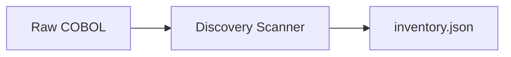

---

# 4. Analysis Parser

## Inputs

- Raw COBOL
- inventory.json

## Outputs

- PROGRAM.json
- parser_artifact.json

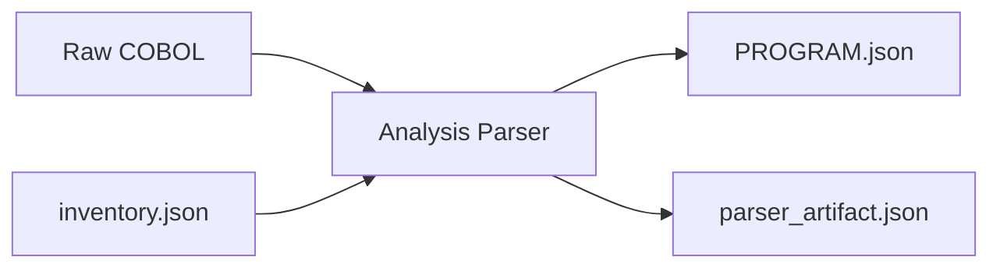

---

# 5. Topology Builder

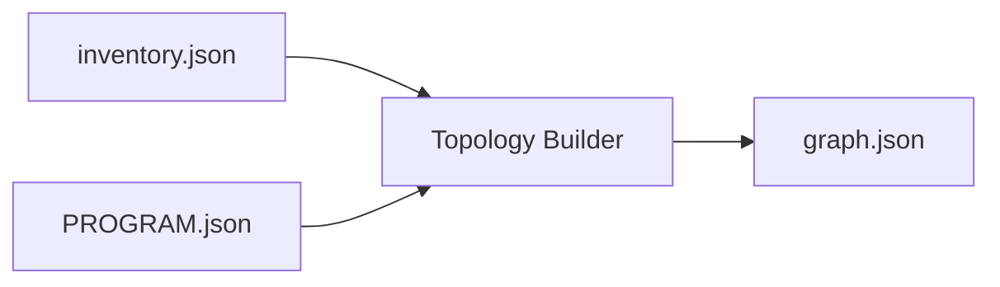

---

# 6. Context Builder

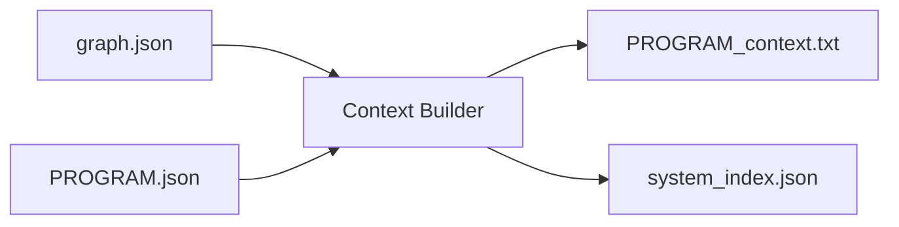

---

# 7. Data Agent

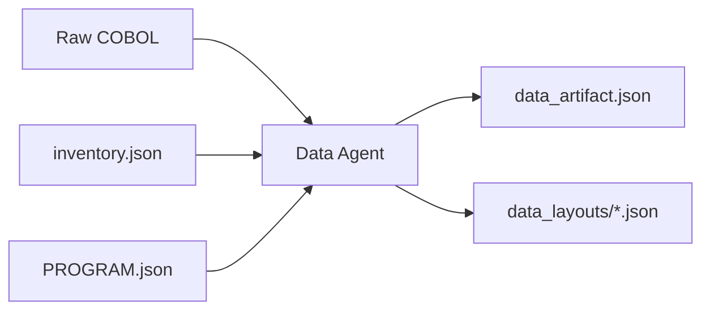

---

# 8. Logic Agent

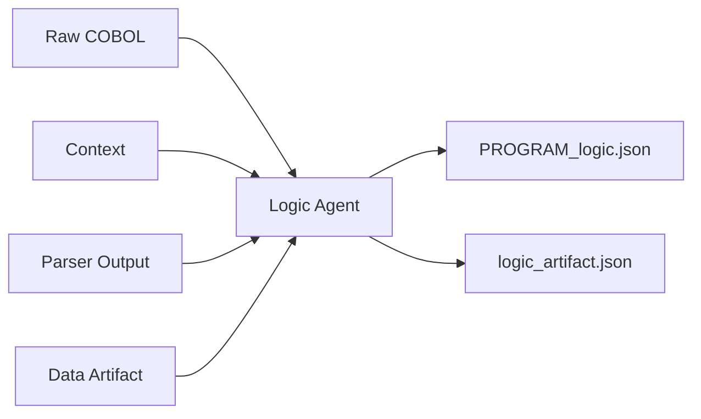

---

# 9. Rules Agent

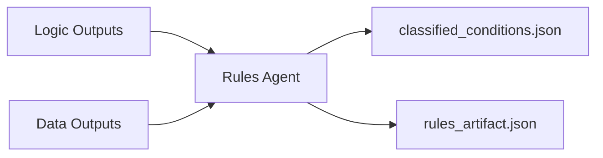

---

# 10. Diagram Agent

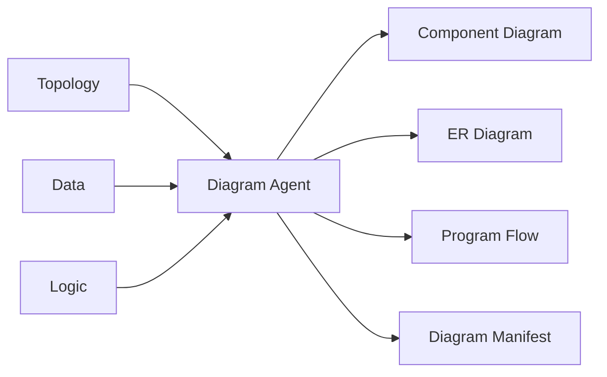

---

# 11. BRD Generation

All previously generated knowledge artifacts are consolidated into the Business Requirements Document.

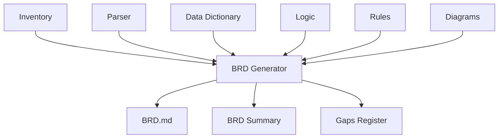

---

# 12. BRD Validation — the Judge

> **Status: Built.** Implemented as `phases/p10_judge/brd_judge.py` and wired into `run_pipeline.py` as Phase 10.
> **HYBRID** — two labelled parts: a deterministic **Validation** (groundedness gate + consistency checks)
> and an LLM **Judge** (5-dimension scoring + feedback).

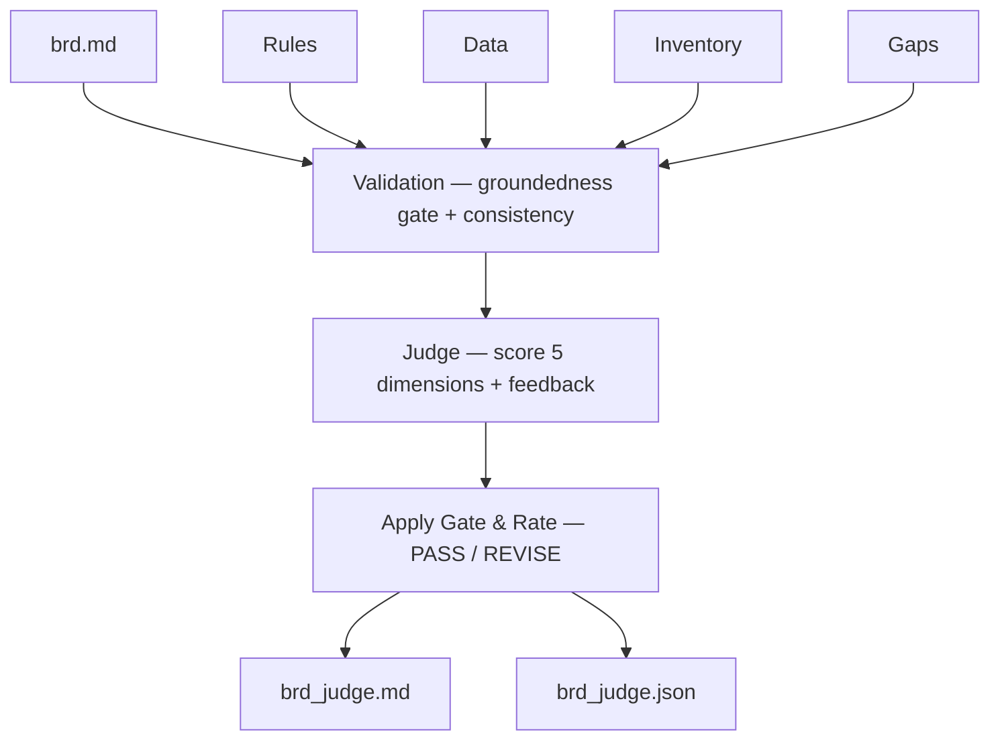

## Inputs

- brd.md (from BRD Generation)
- rules_artifact.json, data_artifact.json, logic_artifact.json, inventory.json
- gaps_register.json

## Outputs

- brd_judge.json — verdict, per-dimension scores, groundedness result, consistency issues, feedback
- brd_judge.md — human-readable report

## What each part does

- **Validation (deterministic Python):** builds the set of known references, then runs the *groundedness
  gate* — every `BR-`/`GAP-`/`RS-` id the BRD cites must exist in the artifacts; any invented one
  hard-floors the accuracy score to 2 — plus consistency checks (all chapters present, headline numbers
  match, every rule/gap covered, diagrams embedded).
- **Judge (LLM):** scores five dimensions 1–5 with rationale — completeness (0.25), accuracy (0.30),
  clarity (0.15), consistency (0.15), actionability (0.15) — and writes feedback items.
- The gate is then applied, the weighted score computed, and a **PASS / REVISE** verdict decided.

---

# 13. Complete Artifact Dependency

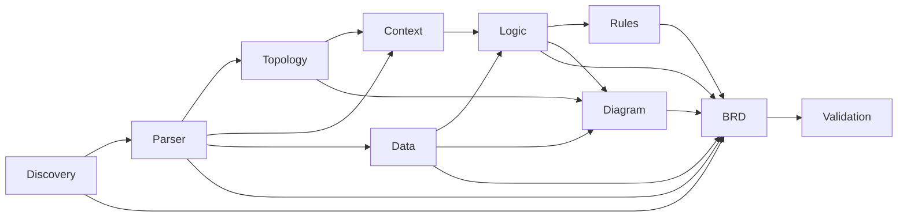

---

# 14. Processing Summary

| Module | Purpose | Primary Output |
|---------|----------|----------------|
| Discovery | Inventory COBOL assets | inventory.json |
| Parser | Parse COBOL structure | PROGRAM.json |
| Topology | Build dependency graph | graph.json |
| Context | Build semantic context | context.txt |
| Data Agent | Extract data model | data_artifact.json |
| Logic Agent | Extract business logic | logic_artifact.json |
| Rules Agent | Identify business rules | rules_artifact.json |
| Diagram Agent | Generate visual artifacts | Mermaid diagrams |
| BRD Generator | Produce BRD | brd.md |
| BRD Judge | Validate (groundedness + consistency) & score the BRD | brd_judge.md / brd_judge.json |


---

# Appendix A (Complete Architecture)

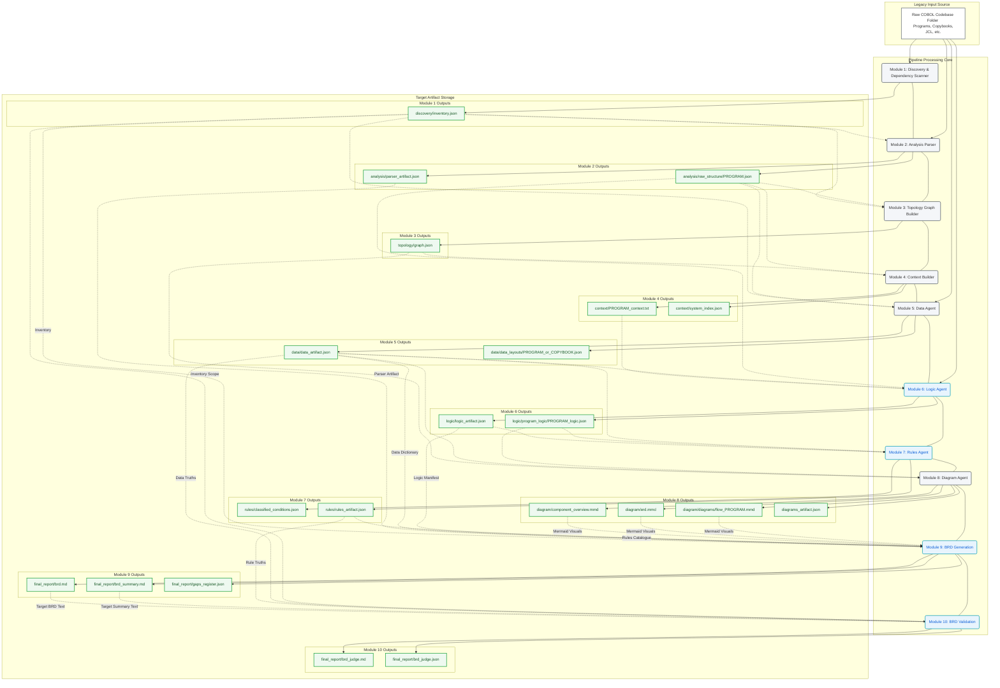

