# Business Requirements Document
## AWS CardDemo

| | |
|---|---|
| **Document type** | Reverse-engineered Business Requirements Document |
| **Status** | Draft — generated; requires subject-matter-expert review |
| **Source analysed** | `carddemo` (44 programs) |
| **Generated** | 2026-09-25 |
| **Prepared by** | Legacy Modernization Harness — facts by static analysis; narrative: AI-host (brd_narratives.json) |

> Every fact, count and rule in this document is derived from the source code. Items labelled *Pending business confirmation* and the gaps in Chapter 9 need subject-matter-expert review before the document is treated as authoritative.

---

## Table of Contents

- [1. Executive Summary](#1-executive-summary)
   - [1.1 At a glance](#11-at-a-glance)
   - [1.2 Scope of analysis](#12-scope-of-analysis)
- [2. Business Context and Scope](#2-business-context-and-scope)
   - [2.1 Business purpose](#21-business-purpose)
   - [2.2 Users and actors](#22-users-and-actors)
   - [2.3 Scope](#23-scope)
   - [2.4 System context](#24-system-context)
- [3. Business Capabilities](#3-business-capabilities)
   - [3.1 Sign-On and Access Control](#31-sign-on-and-access-control)
   - [3.2 User Administration](#32-user-administration)
   - [3.3 Account Management](#33-account-management)
   - [3.4 Card Management](#34-card-management)
   - [3.5 Transaction Entry and Posting](#35-transaction-entry-and-posting)
   - [3.6 Interest and Bill Payment](#36-interest-and-bill-payment)
   - [3.7 Statements and Reporting](#37-statements-and-reporting)
   - [3.8 Card Authorization](#38-card-authorization)
   - [3.9 Transaction Type Reference Data](#39-transaction-type-reference-data)
   - [3.10 Data Migration and Shared Services](#310-data-migration-and-shared-services)
- [4. Business Rules](#4-business-rules)
   - [4.1 Key business rules](#41-key-business-rules)
   - [4.2 Business rules catalogue](#42-business-rules-catalogue)
- [5. Data Model and Definitions](#5-data-model-and-definitions)
   - [5.1 Key entities](#51-key-entities)
- [6. Process Descriptions](#6-process-descriptions)
   - [6.1 Sign-On and Access Control](#61-sign-on-and-access-control)
   - [6.2 User Administration](#62-user-administration)
   - [6.3 Account Management](#63-account-management)
   - [6.4 Card Management](#64-card-management)
   - [6.5 Transaction Entry and Posting](#65-transaction-entry-and-posting)
   - [6.6 Interest and Bill Payment](#66-interest-and-bill-payment)
   - [6.7 Statements and Reporting](#67-statements-and-reporting)
   - [6.8 Card Authorization](#68-card-authorization)
   - [6.9 Transaction Type Reference Data](#69-transaction-type-reference-data)
   - [6.10 Data Migration and Shared Services](#610-data-migration-and-shared-services)
- [7. System Architecture and Inventory](#7-system-architecture-and-inventory)
   - [7.1 Program inventory](#71-program-inventory)
   - [7.2 Shared copybooks](#72-shared-copybooks)
   - [7.3 Platform dependencies](#73-platform-dependencies)
   - [7.4 Integration hotspots](#74-integration-hotspots)
- [8. Error Handling and Technical Conditions](#8-error-handling-and-technical-conditions)
   - [8.1 Error handling](#81-error-handling)
   - [8.2 Technical conditions](#82-technical-conditions)
- [9. Gaps and Assumptions Register](#9-gaps-and-assumptions-register)
- [10. Modernization Considerations and Next Steps](#10-modernization-considerations-and-next-steps)
   - [10.1 Structural risk indicators](#101-structural-risk-indicators)
   - [10.2 Next steps](#102-next-steps)
- [Appendices](#appendices)

---

## 1. Executive Summary

AWS CardDemo runs the core of a credit-card business. It signs users on, maintains credit-card accounts, their customers and their cards, captures and posts card transactions, calculates monthly interest, takes bill payments, produces account statements and transaction reports, and makes real-time approve-or-decline decisions on card authorization requests. Regular users work from a Main menu of account, card, transaction, bill-payment and report functions; administrators also have an Admin menu for maintaining application users. Online screens handle day-to-day work, while batch jobs post each day's transactions, apply monthly interest and produce statements.

The analysis found 44 business rules. The most important are the money decisions: a daily transaction is rejected if it would take the account over its credit limit (BR-018) or is dated after the account expiration date (BR-019); an authorization request is declined when the amount exceeds the available credit, which is the credit limit minus the current balance (BR-039), and otherwise approved (BR-040); monthly interest is the category balance times the rate divided by 1200 (BR-024); and an online bill payment always settles the full outstanding balance (BR-027).

There are 16 open gaps, none of high severity. Nine rules are low confidence and need confirmation by subject-matter experts, including a hard-coded 2525.00 default written into the account extract (BR-005). Two database definitions used by the transaction-type programs are missing from the analysed source (GAP-001, GAP-002). Structural risk sits in a known set of programs: the statement generator uses legacy switched-paragraph control flow, and the transaction posting, interest, authorization and account-update programs are high-complexity programs.

Recommendation: confirm the key rules and the low-confidence rules with business owners first, and treat card authorization and daily transaction posting as the processes whose behaviour any modernization must preserve exactly.

### 1.1 At a glance

| Measure | Value |
|---|---|
| Programs | 44 (25 online · 17 batch · 2 shared subroutines) |
| Business capabilities | 10 |
| Business rules | 44 in 8 rule sets (9 need SME confirmation) |
| Data | 334 entities · 596 records · 10223 fields |
| Platform subsystems used | CICS, DB2, IMS and MQ |
| Open gaps | 16 (0 high/critical) |

### 1.2 Scope of analysis

The analysed codebase comprises 44 programs, 62 copybooks, 55 job streams and 21 screen maps. Static analysis extracted 44 business rules, set aside 295 technical conditions and 259 error-handling checks as program mechanics, and explained 514 paragraphs in plain English.

## 2. Business Context and Scope

### 2.1 Business purpose

AWS CardDemo supports the lifecycle of a credit-card account. It holds the account master, customer details, cards and the card-to-account cross-reference, and it records every transaction against an account. Its purpose is to let users view and maintain accounts and cards, to keep account balances correct by validating and posting each day's transactions and adding monthly interest, to let an account's outstanding balance be paid, and to give users statements and transaction reports.

The system also decides in real time whether a card authorization request is approved or declined by comparing the requested amount with the account's available credit, keeps those pending authorizations for review, lets users flag an authorization as fraud, and deletes authorizations once they pass an expiry window.

### 2.2 Users and actors

| Actor | How they use the system |
|---|---|
| Regular user | Signs on with a user id and password and reaches the Main menu to view and update accounts and cards, list, view and add transactions, pay a bill and request reports (BR-001, BR-003). |
| Administrator | Signs on and is routed to the Admin menu, where they list, add, update and delete application users, including their names, passwords and user type (BR-003, BR-004). |
| Authorization requester (message-driven) | Sends card authorization requests as messages; the system replies with an approve or decline decision (BR-041). |
| Account and date service requesters (message-driven) | Send request messages with an account key and receive account data or a date/account reply on a reply queue. |
| Batch operations | Run the batch jobs: verification and posting of the daily transaction file, monthly interest posting, statements, the transaction detail report, authorization purge, database load and unload, and data export and import. |

### 2.3 Scope

In scope is everything found in the analysed source: 44 programs (25 online, 17 batch and 2 shared subroutines), 21 screens, 55 job streams and 62 copybooks. The document covers the online screens, the batch jobs, the message-driven services, the business rules the code enforces, and the data records it defines.

Out of scope is anything not present in the analysed source: the definitions of two transaction-type database tables that the code references but that are not in the analysed source (GAP-001, GAP-002), the internal behaviour of the platform services the system calls, operational scheduling, and any business policy that is not present in the code. Fee computation in the interest job is a stub marked 'to be implemented', so fee rules are not captured. Rules marked low confidence reflect what the code does, not a confirmed business policy.

### 2.4 System context

Users work through online screens. Sign-on checks the user security file and routes each user to the Main or Admin menu, from which they reach account, card, transaction, bill-payment, report, authorization and user-administration screens. These screens read and update the shared master records: accounts, customers, cards, the card-to-account cross-reference, transactions and the transaction type and category reference data. Update screens write a record back only if it actually changed and no one else changed it since it was read.

Batch jobs work on the same records. The daily posting job validates each day's transactions and either posts them to account balances or writes them to a rejects file; the interest job adds monthly interest; the statement and report jobs produce account statements and the transaction detail report, which users request from the reports screen. Card authorization is message-driven: requests come in on a queue, the decision program compares the requested amount with the account's available credit, stores the pending authorization in the authorization database and replies on a queue, while batch jobs purge, load and unload that database. Separate message-driven services answer account and date requests, and export and import jobs move all master data for branch migration.

**Figure 2.1 — System component overview**

```mermaid
flowchart LR
  CBPAUP0C["CBPAUP0C"]
  COPAUA0C["COPAUA0C"]
  COPAUS0C["COPAUS0C"]
  COPAUS1C["COPAUS1C"]
  COPAUS2C["COPAUS2C"]
  DBUNLDGS["DBUNLDGS"]
  PAUDBLOD["PAUDBLOD"]
  PAUDBUNL["PAUDBUNL"]
  COBTUPDT["COBTUPDT"]
  COTRTLIC["COTRTLIC"]
  COTRTUPC["COTRTUPC"]
  COACCT01["COACCT01"]
  CODATE01["CODATE01"]
  CBACT01C["CBACT01C"]
  CBACT02C["CBACT02C"]
  CBACT03C["CBACT03C"]
  CBACT04C["CBACT04C"]
  CBCUS01C["CBCUS01C"]
  CBEXPORT["CBEXPORT"]
  CBIMPORT["CBIMPORT"]
  CBSTM03A["CBSTM03A"]
  CBSTM03B["CBSTM03B"]
  CBTRN01C["CBTRN01C"]
  CBTRN02C["CBTRN02C"]
  CBTRN03C["CBTRN03C"]
  COACTUPC["COACTUPC"]
  COACTVWC["COACTVWC"]
  COADM01C["COADM01C"]
  COBIL00C["COBIL00C"]
  COBSWAIT["COBSWAIT"]
  COCRDLIC["COCRDLIC"]
  COCRDSLC["COCRDSLC"]
  COCRDUPC["COCRDUPC"]
  COMEN01C["COMEN01C"]
  CORPT00C["CORPT00C"]
  COSGN00C["COSGN00C"]
  COTRN00C["COTRN00C"]
  COTRN01C["COTRN01C"]
  COTRN02C["COTRN02C"]
  COUSR00C["COUSR00C"]
  COUSR01C["COUSR01C"]
  COUSR02C["COUSR02C"]
  COUSR03C["COUSR03C"]
  CSUTLDTC["CSUTLDTC"]
  MQOPEN["MQOPEN"]
  MQGET["MQGET"]
  MQPUT1["MQPUT1"]
  MQCLOSE["MQCLOSE"]
  CBLTDLI["CBLTDLI"]
  MQPUT["MQPUT"]
  COBDATFT["COBDATFT"]
  CEE3ABD["CEE3ABD"]
  MVSWAIT["MVSWAIT"]
  CEEDAYS["CEEDAYS"]
  COPAUA0C --> MQOPEN
  COPAUA0C --> MQGET
  COPAUA0C --> MQPUT1
  COPAUA0C --> MQCLOSE
  DBUNLDGS --> CBLTDLI
  PAUDBLOD --> CBLTDLI
  PAUDBUNL --> CBLTDLI
  COACCT01 --> MQOPEN
  COACCT01 --> MQGET
  COACCT01 --> MQPUT
  COACCT01 --> MQCLOSE
  CODATE01 --> MQOPEN
  CODATE01 --> MQGET
  CODATE01 --> MQPUT
  CODATE01 --> MQCLOSE
  CBACT01C --> COBDATFT
  CBACT01C --> CEE3ABD
  CBACT02C --> CEE3ABD
  CBACT03C --> CEE3ABD
  CBACT04C --> CEE3ABD
  CBCUS01C --> CEE3ABD
  CBEXPORT --> CEE3ABD
  CBIMPORT --> CEE3ABD
  CBSTM03A --> CBSTM03B
  CBSTM03A --> CEE3ABD
  CBTRN01C --> CEE3ABD
  CBTRN02C --> CEE3ABD
  CBTRN03C --> CEE3ABD
  COBSWAIT --> MVSWAIT
  CORPT00C --> CSUTLDTC
  COTRN02C --> CSUTLDTC
  CSUTLDTC --> CEEDAYS
```

*Each box is a program; an arrow means the source program calls, links to or transfers control to the target.*

## 3. Business Capabilities

Programs grouped by the business capability they support (grouping reviewed by AI from the program summaries).

### 3.1 Sign-On and Access Control

This is the front door to the online application. Users sign on with a user id and password; sign-on fails if the password does not match the one held in the user security file (BR-002). Every user is either an administrator or a regular user (BR-001), and that type decides where they land: administrators go to the Admin menu and all other users to the Main menu (BR-003). The menus then list the functions each kind of user can select.

| Program | Run mode | What it does | Rules |
|---|---|---|---|
| COSGN00C | Online | CICS online Sign-on (authentication) screen — the application's entry point | 3 |
| COMEN01C | Online | CICS online Main Menu for regular users | 1 |
| COADM01C | Online | CICS online Admin Menu for administrator users | 1 |

*Business rules: BR-002, BR-003 — see Chapter 4.*

### 3.2 User Administration

Administrators maintain who can use the application. From a scrollable list of users they can add a new user (the user id must not already exist), update a user's first name, last name, password and user type, or delete a user. Deletion is done only after the administrator confirms it (BR-004), a low-confidence rule that should be confirmed (GAP-003).

| Program | Run mode | What it does | Rules |
|---|---|---|---|
| COUSR00C | Online | CICS online User List screen | 1 |
| COUSR01C | Online | CICS online Add User screen | 1 |
| COUSR02C | Online | CICS online Update User screen | 1 |
| COUSR03C | Online | CICS online Delete User screen | 2 |

*Business rules: BR-004 — see Chapter 4.*

### 3.3 Account Management

Users view an account together with its customer and card details, and update account and customer information. The update screen applies the most extensive validation in the system: a FICO score must be between 300 and 850 (BR-006), active status and primary cardholder indicators must be Y or N (BR-007, BR-008), Social Security Numbers with an invalid first part are rejected (BR-009), and state, ZIP code and phone area code must be valid and consistent (BR-010, BR-011, BR-012). Changes are written only if something changed and no one else updated the record first. Batch jobs extract account and customer data, and one extract writes a hard-coded 2525.00 when the cycle debit is zero (BR-005, GAP-004); a message-driven service answers account inquiries.

| Program | Run mode | What it does | Rules |
|---|---|---|---|
| COACTVWC | Online | CICS online Account View screen | 1 |
| COACTUPC | Online | CICS online Account Update screen — the most complex online program | 11 |
| COACCT01 | Online | MQ-triggered CICS account-inquiry service | 0 |
| CBACT01C | Batch | Batch program that reads every record from the indexed ACCOUNT master file (ACCTFILE) and writes each account out to four output files in different layouts: a flat fixed record (OUTFILE), an array/table record (ARRYFILE), and two variable-length records | 1 |
| CBCUS01C | Batch | Batch program that sequentially reads the indexed CUSTOMER master file (CUSTFILE) and displays every customer record | 0 |

*Business rules: BR-005, BR-006, BR-007, BR-008, BR-009, BR-010, BR-011, BR-012 — see Chapter 4.*

### 3.4 Card Management

Users list cards, filtered by account or card number, view a card's details, and update its embossed name, active status and expiry date. On update the expiry month must be 1 to 12 (BR-016) and the expiry year 1950 to 2099 (BR-017), and the card record is updated only if it changed and was not modified by another user in the meantime. Batch utilities list the card master and the card-to-account cross-reference.

| Program | Run mode | What it does | Rules |
|---|---|---|---|
| COCRDLIC | Online | CICS online Card List screen | 1 |
| COCRDSLC | Online | CICS online Card Detail (view) screen | 1 |
| COCRDUPC | Online | CICS online Card Update screen | 3 |
| CBACT02C | Batch | Batch program that sequentially reads the indexed CARD master file (CARDFILE) and displays every card record | 0 |
| CBACT03C | Batch | Batch program that sequentially reads the card-to-account cross-reference file (XREFFILE) and displays every cross-reference record | 0 |

*Business rules: BR-016, BR-017 — see Chapter 4.*

### 3.5 Transaction Entry and Posting

Online, users list and view transactions and add new ones through manual entry; a new transaction is written only when its account or card key and its data are valid (BR-022) and its amount is a valid signed number (BR-023). In batch, a verification job checks each daily transaction's card and account, and the posting job then posts or rejects each one. A transaction is rejected if it would take the account over its credit limit (BR-018) or is dated after the account expiration date (BR-019); it is posted only when it passes every check (BR-021), and posted amounts update the current-cycle credit or debit (BR-020). Rejected transactions go to a rejects file with a numbered reason.

| Program | Run mode | What it does | Rules |
|---|---|---|---|
| COTRN00C | Online | CICS online Transaction List screen | 1 |
| COTRN01C | Online | CICS online Transaction View screen | 1 |
| COTRN02C | Online | CICS online Add Transaction screen | 3 |
| CBTRN01C | Batch | Daily-transaction verification/browse batch | 0 |
| CBTRN02C | Batch | The daily transaction posting engine | 4 |

*Business rules: BR-018, BR-019, BR-020, BR-021, BR-022, BR-023 — see Chapter 4.*

### 3.6 Interest and Bill Payment

The monthly interest job reads each account's transaction-category balances, looks up the interest rate for the account's disclosure group (falling back to a default group), and computes interest as the balance times the rate divided by 1200, only when the rate is not zero (BR-024). It writes an interest transaction and adds the interest to the account balance. Online, a user pays a bill by entering an account id and confirming (BR-025): no payment is made when there is nothing to pay (BR-026), and otherwise the full outstanding balance is paid and the balance set to zero (BR-027). Both payment rules are low confidence (GAP-007, GAP-008).

| Program | Run mode | What it does | Rules |
|---|---|---|---|
| CBACT04C | Batch | The interest & fee posting batch | 1 |
| COBIL00C | Online | CICS online Bill Payment screen | 4 |

*Business rules: BR-024, BR-025, BR-026, BR-027 — see Chapter 4.*

### 3.7 Statements and Reporting

The statement job produces an account statement in both plain text and HTML, combining customer, account and transaction data. Users request the transaction detail report online as a Monthly, Yearly or Custom date-range report (BR-029); the screen submits a batch job that prints only transactions processed within the requested dates (BR-028), with per-account subtotals, page totals and a grand total. The statement generator is the one program using legacy switched-paragraph control flow and should be reviewed before modernization.

| Program | Run mode | What it does | Rules |
|---|---|---|---|
| CBSTM03A | Batch | Account statement generator | 0 |
| CBSTM03B | Shared subroutine | Called I/O subroutine used by the statement generator | 0 |
| CBTRN03C | Batch | Transaction detail report batch | 1 |
| CORPT00C | Online | CICS online Transaction Reports screen | 2 |

*Business rules: BR-028, BR-029 — see Chapter 4.*

### 3.8 Card Authorization

This is the real-time decision engine. For each authorization request message, the system computes the account's available credit as the credit limit minus the current balance and declines the request if the transaction amount exceeds that available credit (BR-039); a request is also declined when the account record cannot be found. Otherwise the request is approved with response code 00 (BR-040, BR-035). The answer is approved or declined (BR-041, BR-042), each decline records a reason code, for example insufficient funds when the amount is over the available credit (BR-043), and each pending authorization is stored and tracked by match status (BR-036). Users review pending authorizations online and can report fraud or clear a fraud flag (BR-044, BR-034). A batch purge deletes authorizations older than an expiry window of 5 days by default (BR-030, BR-031, BR-032) and removes summaries with no approved authorizations left (BR-033); other batch jobs load and unload the authorization database.

| Program | Run mode | What it does | Rules |
|---|---|---|---|
| COPAUA0C | Online | Card Authorization Decision program | 10 |
| COPAUS0C | Online | CICS online Authorization Summary View screen | 4 |
| COPAUS1C | Online | CICS online Authorization Message Detail View screen | 5 |
| COPAUS2C | Online | CICS online 'Mark Authorization as Fraud' action program | 4 |
| CBPAUP0C | Batch | IMS batch purge for the authorization module: deletes expired pending-authorization messages | 7 |
| PAUDBLOD | Batch | Batch IMS database LOAD program for the pending-authorization database | 3 |
| PAUDBUNL | Batch | Batch IMS database UNLOAD program for the pending-authorization database | 3 |
| DBUNLDGS | Batch | Batch database UNLOAD utility that extracts database segments/rows (e.g. the disclosure-group / authorization support data) and writes them to a sequential output file for migration, backup, or reload | 3 |

*Business rules: BR-001, BR-030, BR-031, BR-032, BR-033, BR-034, BR-035, BR-036, BR-037, BR-038, BR-039, BR-040, BR-041, BR-042, BR-043, BR-044 — see Chapter 4.*

### 3.9 Transaction Type Reference Data

The transaction type and category codes that classify every transaction are maintained here. Users list the reference records, filtered by type code, and update a type or category; as with other update screens, a record is updated only if it changed and was not modified by someone else. A batch job applies add and update changes to the transaction-type records from an input file. The database definitions these programs use are missing from the analysed source (GAP-001, GAP-002).

| Program | Run mode | What it does | Rules |
|---|---|---|---|
| COTRTLIC | Online | CICS online Transaction-Type (reference data) List screen | 1 |
| COTRTUPC | Online | CICS online Transaction-Type (reference data) Update screen | 4 |
| COBTUPDT | Batch | Batch program that updates transaction-type reference records based on user-supplied input | 0 |

*Business rules: BR-013, BR-014, BR-015 — see Chapter 4.*

### 3.10 Data Migration and Shared Services

An export job writes all CardDemo master data (customers, accounts, cross-references, transactions and cards) into a single file for branch migration, and an import job loads that file back into the master files, recording any unknown record types. Shared services include a date-validation routine used by online and batch programs, a message-driven date and account service, and a utility that waits for a set interval between processing steps.

| Program | Run mode | What it does | Rules |
|---|---|---|---|
| CBEXPORT | Batch | Batch data-export utility for branch migration | 0 |
| CBIMPORT | Batch | Batch data-import counterpart of CBEXPORT | 0 |
| CODATE01 | Online | MQ-triggered CICS date service | 0 |
| CSUTLDTC | Shared subroutine | Called date-validation utility subroutine | 0 |
| COBSWAIT | Batch | Small utility program that pauses execution for a specified interval | 0 |

## 4. Business Rules

44 business rules were identified — decisions and domain constraints a business owner can confirm. Program mechanics (loop control, screen handling, file status, flags) are listed separately in Chapter 8. Rules labelled *Pending business confirmation* were inferred with low confidence and should be confirmed by the business owner.

### 4.1 Key business rules

| Rule | Statement | Capability | Why it matters |
|---|---|---|---|
| BR-018 | Reject a transaction that would take the account over its credit limit | Transaction Entry and Posting | Stops a posted transaction from taking an account over its credit limit; this is the main credit-exposure control in daily posting. |
| BR-019 | Reject a transaction dated after the account expiration date | Transaction Entry and Posting | Rejects transactions dated after the account expiration date; low confidence, so the business must confirm it. |
| BR-021 | Post a daily transaction only when it passes every validation | Transaction Entry and Posting | Only transactions that pass every check reach account balances; everything else is rejected with a reason for follow-up. |
| BR-020 | Treat zero or positive amounts as credits and negative amounts as debits | Transaction Entry and Posting | Decides whether a posted amount counts as a cycle credit or a cycle debit, which drives the account's cycle totals. |
| BR-039 | Decline an authorization that exceeds the available credit | Card Authorization | Declines any authorization larger than the available credit, protecting against over-limit authorizations in real time. |
| BR-035 | Treat response code 00 as an approved authorization | Card Authorization | Response code 00 marks an approved authorization, which the purge and review functions rely on to tell approvals from declines. |
| BR-009 | Reject a Social Security Number with an invalid first part | Account Management | Rejects Social Security Numbers whose first three digits are 000, 666 or 900 to 999, keeping customer identity data valid. |
| BR-040 | Approve an authorization that passes all decline checks | Card Authorization | Defines when a request is approved: when the amount fits within the available credit, answered with response code 00. |
| BR-043 | Classify the reason for a declined authorization | Card Authorization | Defines the decline reason codes; in practice a decline records insufficient funds when the amount exceeds the available credit. |
| BR-024 | Compute interest only when the interest rate is not zero | Interest and Bill Payment | Sets how monthly interest is calculated (balance times rate divided by 1200), which directly affects every customer's balance. |
| BR-027 | Pay the full outstanding balance only after the user confirms | Interest and Bill Payment | An online bill payment always pays the full outstanding balance; partial payment is not supported and needs confirmation. |
| BR-026 | Refuse a bill payment when there is nothing to pay | Interest and Bill Payment | Prevents a payment when the balance is zero or less. |
| BR-030 | Use a 5-day authorization expiry window unless a valid one is supplied | Card Authorization | Sets how long pending authorizations are kept (5 days by default) before they are purged. |
| BR-006 | Require a FICO score between 300 and 850 | Account Management | Keeps customer FICO scores within the valid 300 to 850 range. |
| BR-005 | Default a zero cycle debit to 2525.00 in the account extract | Account Management | A hard-coded 2525.00 is written into the account extract when the cycle debit is zero; the business must confirm whether this is intended. |

### 4.2 Business rules catalogue

#### RS-001 — Sign-On and Access Control

*Programs: COACTUPC, COACTVWC, COADM01C, COBIL00C, COCRDLIC, COCRDSLC, COCRDUPC, COMEN01C · Rules: 3*

**BR-001 — Classify every user as an administrator or a regular user**  
User type is A for an administrator or U for a regular user; it is carried with the user's session across the online programs.  
*Validation · confirmed confidence · Source: COPAUS0C, line 26*

**BR-002 — Reject sign-on when the password does not match**  
If the password stored in the user security file differs from the one entered, sign-on fails with a wrong-password message.  
*Validation · medium confidence · Source: COSGN00C, READ-USER-SEC-FILE*

**BR-003 — Send administrators to the Admin menu and other users to the Main menu**  
After a successful sign-on, a user whose type is Admin is transferred to the Admin menu; every other user is transferred to the Main menu.  
*Validation · medium confidence · Source: COSGN00C, READ-USER-SEC-FILE*

#### RS-002 — User Administration

*Programs: COUSR03C · Rules: 1*

**BR-004 — Delete a user only after the deletion is confirmed** — *Pending business confirmation*  
A user security record is deleted only after the administrator confirms the deletion.  
*Validation · low confidence · Source: COUSR03C, PROCESS-ENTER-KEY*

#### RS-003 — Account Management

*Programs: CBACT01C, COACTUPC, COTRTUPC · Rules: 11*

**BR-005 — Default a zero cycle debit to 2525.00 in the account extract** — *Pending business confirmation*  
When the account extract finds that the account's current-cycle debit is zero, it writes 2525.00 into that field of the output record. This hard-coded value should be confirmed with the business.  
*Validation · low confidence · Source: CBACT01C, 1300-POPUL-ACCT-RECORD*

**BR-006 — Require a FICO score between 300 and 850**  
When a customer's FICO score is updated, the new score must be between 300 and 850.  
*Validation · confirmed confidence · Source: COACTUPC, line 846*

**BR-007 — Require the account active status to be Y or N**  
On account update, the account active status is valid only when it is Y or N.  
*Validation · confirmed confidence · Source: COACTUPC, line 192*

**BR-008 — Require the primary cardholder indicator to be Y or N**  
On account update, the primary cardholder indicator is valid only when it is Y or N.  
*Validation · confirmed confidence · Source: COACTUPC, line 349*

**BR-009 — Reject a Social Security Number with an invalid first part**  
The first three digits of a Social Security Number are invalid if they are 000, 666, or anywhere from 900 to 999.  
*Validation · confirmed confidence · Source: COACTUPC, line 119*

**BR-010 — Require the ZIP code to be consistent with the state**  
The state code combined with the first two digits of the ZIP code must be a recognised combination, for example CA with 90 to 96 or NY with 10 to 14.  
*Validation · confirmed confidence · Source: COACTUPC, line 1072*

**BR-011 — Accept only valid US state and territory codes**  
A state code must be one of the 50 US state codes, DC, or the territory codes AS, GU, MP, PR and VI.  
*Validation · confirmed confidence · Source: COACTUPC, line 1012*

**BR-012 — Accept only recognised US phone area codes**  
A phone area code is valid only if it appears in the list of valid area codes, which combines general-purpose codes (such as 201, 202 and 203) with easily recognisable codes (200, 211, 222 and so on up to 999).  
*Validation · confirmed confidence · Source: COACTUPC, line 24*

**BR-013 — Recognise only the 19xx and 20xx centuries in entered dates**  
When a date is edited, its century is recognised as 20 (this century) or 19 (last century).  
*Validation · confirmed confidence · Source: COTRTUPC, line 7*

**BR-014 — Require a valid day of the month in entered dates**  
The day of an entered date must be 1 through 31, with days 29, 30 and 31 checked separately; a February day is valid from 1 through 28.  
*Validation · confirmed confidence · Source: COTRTUPC, line 26*

**BR-015 — Require a month between 1 and 12 in entered dates**  
The month of an entered date must be 1 through 12; months 1, 3, 5, 7, 8, 10 and 12 are treated as 31-day months and month 2 as February.  
*Validation · confirmed confidence · Source: COTRTUPC, line 17*

#### RS-004 — Card Management

*Programs: COCRDUPC · Rules: 2*

**BR-016 — Require a card expiry month between 1 and 12**  
On card update, the expiry month must be 1 through 12.  
*Validation · confirmed confidence · Source: COCRDUPC, line 93*

**BR-017 — Require a card expiry year between 1950 and 2099**  
On card update, the expiry year must be 1950 through 2099.  
*Validation · confirmed confidence · Source: COCRDUPC, line 97*

#### RS-005 — Transaction Entry and Posting

*Programs: CBTRN02C, COTRN02C · Rules: 6*

**BR-018 — Reject a transaction that would take the account over its credit limit**  
A daily transaction is accepted only if the account credit limit is greater than or equal to the resulting balance; otherwise it is rejected with reason 102.  
*Limit Check · high confidence · Source: CBTRN02C, 1500-B-LOOKUP-ACCT*

**BR-019 — Reject a transaction dated after the account expiration date** — *Pending business confirmation*  
A daily transaction is accepted only if the account expiration date is on or after the transaction date; otherwise it is rejected with reason 103.  
*Validation · low confidence · Source: CBTRN02C, 1500-B-LOOKUP-ACCT*

**BR-020 — Treat zero or positive amounts as credits and negative amounts as debits**  
When a posted transaction updates the account, an amount of zero or more is applied as a current-cycle credit and a negative amount as a current-cycle debit.  
*Limit Check · high confidence · Source: CBTRN02C, 2800-UPDATE-ACCOUNT-REC*

**BR-021 — Post a daily transaction only when it passes every validation**  
A daily transaction is posted when no validation failure reason has been set; otherwise it is rejected and written to the rejects file with its numbered reason.  
*Validation · medium confidence · Source: CBTRN02C, MAIN-PARA*

**BR-022 — Add a transaction only when its key and data fields are valid** — *Pending business confirmation*  
A new transaction record is written only when both the account/card key and the transaction data fields pass validation.  
*Validation · low confidence · Source: COTRN02C, PROCESS-ENTER-KEY*

**BR-023 — Reject a transaction amount that is not a valid signed number**  
On the Add Transaction screen, an amount that is not a valid signed number is rejected with an error.  
*Validation · medium confidence · Source: COTRN02C, VALIDATE-INPUT-DATA-FIELDS*

#### RS-006 — Interest and Bill Payment

*Programs: CBACT04C, COBIL00C · Rules: 4*

**BR-024 — Compute interest only when the interest rate is not zero**  
During interest posting, interest for a transaction-category balance is computed only when the rate found for the account's disclosure group is not zero. Monthly interest is the category balance times the rate divided by 1200.  
*Calculation · medium confidence · Source: CBACT04C, MAIN-PARA*

**BR-025 — Handle the bill-payment confirmation answer**  
The bill payment screen evaluates the user's confirmation entry and handles Y, N, blank and any other value as separate cases.  
*Routing · high confidence · Source: COBIL00C, PROCESS-ENTER-KEY*

**BR-026 — Refuse a bill payment when there is nothing to pay** — *Pending business confirmation*  
If the account's current balance is zero or less, no payment is made and the user is told there is nothing to pay.  
*Validation · low confidence · Source: COBIL00C, PROCESS-ENTER-KEY*

**BR-027 — Pay the full outstanding balance only after the user confirms** — *Pending business confirmation*  
When the user confirms payment, a payment transaction is created for the full outstanding balance and the account balance is set to zero.  
*Validation · low confidence · Source: COBIL00C, PROCESS-ENTER-KEY*

#### RS-007 — Statements and Reporting

*Programs: CBTRN03C, CORPT00C · Rules: 2*

**BR-028 — Report only transactions processed within the requested date range** — *Pending business confirmation*  
The transaction detail report includes a transaction only when its processing date falls between the start and end dates read from the date parameter file; other transactions are skipped.  
*Validation · low confidence · Source: CBTRN03C, MAIN-PARA*

**BR-029 — Offer Monthly, Yearly or Custom date-range transaction reports**  
The report request screen accepts one of three report types: Monthly, Yearly or a Custom date range, and validates the selection and dates before the report is submitted.  
*Validation · medium confidence · Source: CORPT00C, PROCESS-ENTER-KEY*

#### RS-008 — Card Authorization

*Programs: CBPAUP0C, COPAUA0C, COPAUS0C, COPAUS1C, COPAUS2C, DBUNLDGS, PAUDBLOD, PAUDBUNL · Rules: 15*

**BR-030 — Use a 5-day authorization expiry window unless a valid one is supplied**  
The purge takes the expiry window (in days) from its run parameter when that parameter is numeric; otherwise it uses a default of 5 days.  
*Validation · medium confidence · Source: CBPAUP0C, 1000-INITIALIZE*

**BR-031 — Qualify a pending authorization for deletion when it is older than the expiry window**  
A pending-authorization detail qualifies for deletion when its age is greater than the expiry window in days.  
*Validation · medium confidence · Source: CBPAUP0C, 4000-CHECK-IF-EXPIRED*

**BR-032 — Delete a pending-authorization detail that qualifies for deletion** — *Pending business confirmation*  
The authorization purge deletes a pending-authorization detail record when it has been marked as qualified for deletion (older than the expiry window).  
*Validation · low confidence · Source: CBPAUP0C, MAIN-PARA*

**BR-033 — Delete an authorization summary with no approved authorizations left** — *Pending business confirmation*  
The purge deletes a pending-authorization summary when its count of approved authorizations is zero or less.  
*Validation · low confidence · Source: CBPAUP0C, MAIN-PARA*

**BR-034 — Record whether fraud is confirmed or removed on an authorization**  
The fraud indicator on a pending authorization is F when fraud is confirmed and R when the fraud flag has been removed.  
*Validation · confirmed confidence · Source: CBPAUP0C, line 50*

**BR-035 — Treat response code 00 as an approved authorization**  
A pending authorization with response code 00 is an approved authorization.  
*Validation · confirmed confidence · Source: CBPAUP0C, line 30*

**BR-036 — Track the match status of each pending authorization**  
A pending authorization's match status is P (pending), D (authorization declined), E (pending expired) or M (matched with a transaction).  
*Validation · confirmed confidence · Source: CBPAUP0C, line 45*

**BR-037 — Decline an authorization when the card is inactive**  
An authorization request is declined if the card is not active.  
*Validation · medium confidence · Source: COPAUA0C, MAKE-AUTH-DECISION*

**BR-038 — Decline an authorization when the card has expired**  
An authorization request is declined if the card is expired.  
*Validation · medium confidence · Source: COPAUA0C, MAKE-AUTH-DECISION*

**BR-039 — Decline an authorization that exceeds the available credit**  
If the transaction amount is greater than the available credit computed for the account, the request is declined as over-limit.  
*Limit Check · high confidence · Source: COPAUA0C, MAKE-AUTH-DECISION*

**BR-040 — Approve an authorization that passes all decline checks**  
When none of the decline conditions (inactive card, expired card, over available credit) apply, the authorization request is approved.  
*Validation · medium confidence · Source: COPAUA0C, MAKE-AUTH-DECISION*

**BR-041 — Answer each authorization request as approved or declined**  
The authorization response is A for approved or D for declined.  
*Validation · confirmed confidence · Source: COPAUA0C, line 111*

**BR-042 — Record the approve or decline decision for each authorization**  
The authorization decision is held as A (approve) or D (decline).  
*Validation · confirmed confidence · Source: COPAUA0C, line 137*

**BR-043 — Classify the reason for a declined authorization**  
A decline reason is one of: insufficient funds (I), card not active (A), account closed (C), card fraud (F) or merchant fraud (M).  
*Validation · confirmed confidence · Source: COPAUA0C, line 140*

**BR-044 — Allow an authorization to be reported as fraud or cleared of fraud**  
From the authorization detail view a user can report fraud (F) on the selected authorization or remove a fraud flag (R).  
*Validation · confirmed confidence · Source: COPAUS1C, line 98*


## 5. Data Model and Definitions

The data model comprises **334 entities** and **2 estimated relationships**, with **10223 fields** across **596 records**.

**Figure 5.1 — Key entities and relationships**

```mermaid
erDiagram
  COPAU0AI {
    int field_count "373"
    string used_by "COPAUS0C"
  }
  COPAU0AO {
    int field_count "373"
    string used_by "COPAUS0C"
  }
  COPAU1AI {
    int field_count "163"
    string used_by "COPAUS1C"
  }
  CTRTLIAI {
    int field_count "241"
    string used_by "COTRTLIC"
  }
  CTRTLIAO {
    int field_count "241"
    string used_by "COTRTLIC"
  }
  WS_DATE_VALIDATION_RESULT {
    int field_count "15"
    string used_by "COTRTUPC, COACTUPC"
  }
  TRAN_CAT_BAL_RECORD {
    int field_count "6"
    string used_by "CBACT04C, CBTRN02C"
  }
  TRAN_CAT_RECORD {
    int field_count "5"
    string used_by "CBTRN03C"
  }
  CACTUPAI {
    int field_count "325"
    string used_by "COACTUPC"
  }
  CACTUPAO {
    int field_count "325"
    string used_by "COACTUPC"
  }
  CACTVWAI {
    int field_count "223"
    string used_by "COACTVWC"
  }
  CACTVWAO {
    int field_count "223"
    string used_by "COACTVWC"
  }
  CCRDLIAI {
    int field_count "271"
    string used_by "COCRDLIC"
  }
  CCRDLIAO {
    int field_count "271"
    string used_by "COCRDLIC"
  }
  COTRN0AI {
    int field_count "355"
    string used_by "COTRN00C"
  }
  COTRN0AO {
    int field_count "355"
    string used_by "COTRN00C"
  }
  COUSR0AI {
    int field_count "355"
    string used_by "COUSR00C"
  }
  COUSR0AO {
    int field_count "355"
    string used_by "COUSR00C"
  }
  WS_MISC_STORAGE {
    int field_count "173"
    string used_by "COACTUPC"
  }
  WS_MESSAGE {
    int field_count "15"
    string used_by "CSUTLDTC"
  }
  WS_DATE_VALIDATION_RESULT ||--o{ WS_MESSAGE : "shared field WS-MSG-NO"
  TRAN_CAT_BAL_RECORD ||--o{ TRAN_CAT_RECORD : "shared field TRAN-CAT-KEY"
```

*Relationships are inferred from shared key fields and should be confirmed by a data architect.*

### 5.1 Key entities

| Entity | Defined in | Fields | Used by |
|---|---|---|---|
| COPAU0AI | COPAU00 | 373 | COPAUS0C |
| COPAU0AO | COPAU00 | 373 | COPAUS0C |
| COTRN0AI | COTRN00 | 355 | COTRN00C |
| COTRN0AO | COTRN00 | 355 | COTRN00C |
| COUSR0AI | COUSR00 | 355 | COUSR00C |
| COUSR0AO | COUSR00 | 355 | COUSR00C |
| CACTUPAI | COACTUP | 325 | COACTUPC |
| CACTUPAO | COACTUP | 325 | COACTUPC |
| CCRDLIAI | COCRDLI | 271 | COCRDLIC |
| CCRDLIAO | COCRDLI | 271 | COCRDLIC |
| CTRTLIAI | COTRTLI | 241 | COTRTLIC |
| CTRTLIAO | COTRTLI | 241 | COTRTLIC |
| CACTVWAI | COACTVW | 223 | COACTVWC |
| CACTVWAO | COACTVW | 223 | COACTVWC |
| WS-MISC-STORAGE | COACTUPC | 173 | COACTUPC |
| COPAU1AI | COPAU01 | 163 | COPAUS1C |
| COPAU1AO | COPAU01 | 163 | COPAUS1C |
| WS-THIS-PROGCOMMAREA | COACTUPC | 151 | COACTUPC |
| COTRN1AI | COTRN01 | 127 | COTRN01C |
| COTRN1AO | COTRN01 | 127 | COTRN01C |

## 6. Process Descriptions

### 6.1 Sign-On and Access Control

#### COSGN00C — CICS online Sign-on (authentication) screen — the application's entry point

*Online · CICS · Complexity: Medium · Business rules: BR-001, BR-002, BR-003*

CICS online Sign-on (authentication) screen -- the application's entry point. Prompts for a user id and password, validates both are entered, reads the user security file, checks the password, and routes the user to the Admin menu or the regular Main menu based on their user type. The security gate for the whole CardDemo online application.

**Figure 6.1 — COSGN00C flow**

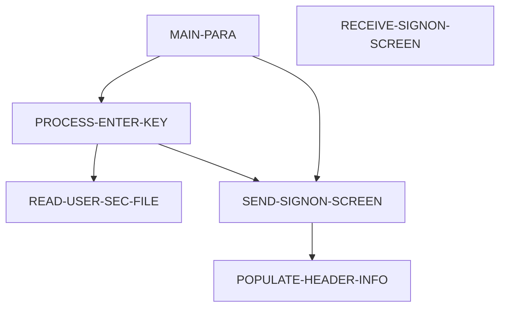

#### COMEN01C — CICS online Main Menu for regular users

*Online · CICS · Complexity: Medium · Business rules: BR-001*

CICS online Main Menu for regular users. Displays the list of available options (account view/update, card list/view/update, transaction list/view/add, bill pay, reports, etc.), validates the option the user selects, and transfers control (CICS XCTL) to the corresponding program. Pseudo-conversational; the menu options are driven by a shared menu-definition copybook.

**Figure 6.2 — COMEN01C flow**

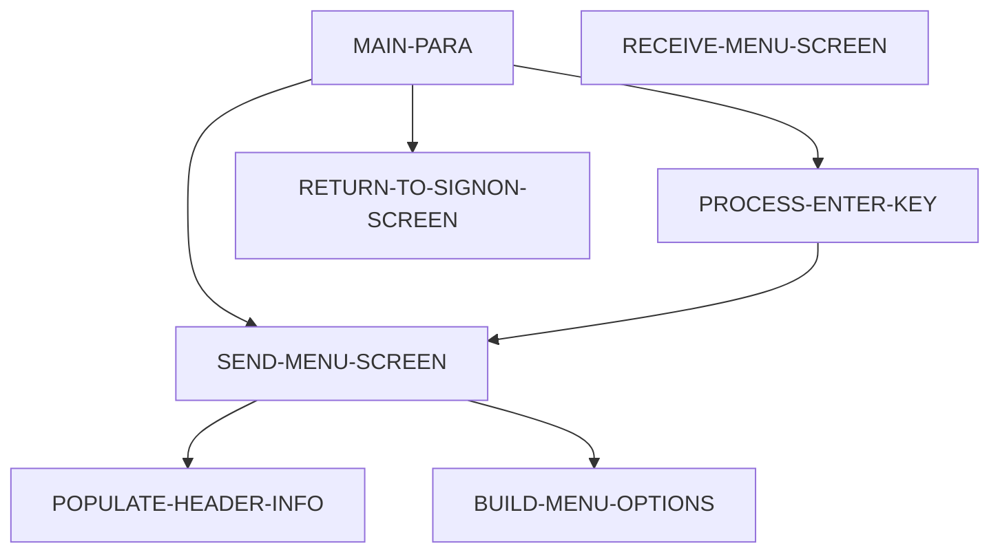

#### COADM01C — CICS online Admin Menu for administrator users

*Online · CICS · Complexity: Medium · Business rules: BR-001*

CICS online Admin Menu for administrator users. Like the main menu but exposes administrative options -- notably user management (list/add/update/delete users). Validates the selected option and transfers control (CICS XCTL) to the corresponding admin program. Reached only by users authenticated as Admin.

**Figure 6.3 — COADM01C flow**


### 6.2 User Administration

#### COUSR00C — CICS online User List screen

*Online · CICS · Complexity: Medium · Business rules: BR-001*

CICS online User List screen (admin function). Displays a scrollable, paginated list of user security records with forward/backward paging; the user can select a row to update (U) or delete (D) that user, which transfers to the corresponding maintenance program. Pseudo-conversational.

**Figure 6.4 — COUSR00C flow**

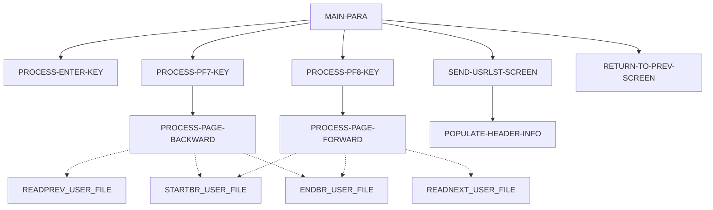

#### COUSR01C — CICS online Add User screen

*Online · CICS · Complexity: Medium · Business rules: BR-001*

CICS online Add User screen (admin function). Captures a new user's id, first name, last name, password and user type, validates all fields are present and valid, checks the user id does not already exist, and writes a new user security record. Pseudo-conversational.

**Figure 6.5 — COUSR01C flow**

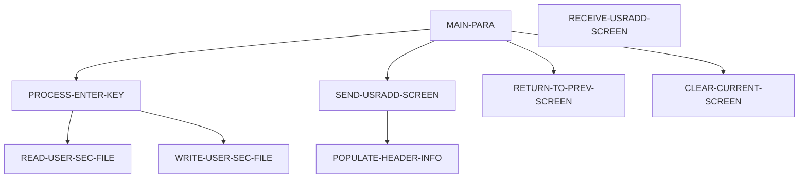

#### COUSR02C — CICS online Update User screen

*Online · CICS · Complexity: Medium · Business rules: BR-001*

CICS online Update User screen (admin function). Retrieves a user security record by user id, lets the admin edit the first name, last name, password and user type, validates the fields, and rewrites the record. Pseudo-conversational.

**Figure 6.6 — COUSR02C flow**


#### COUSR03C — CICS online Delete User screen

*Online · CICS · Complexity: Medium · Business rules: BR-001, BR-004*

CICS online Delete User screen (admin function). Retrieves a user security record by user id, displays it for confirmation, and on confirmation deletes the user record. Pseudo-conversational.

**Figure 6.7 — COUSR03C flow**

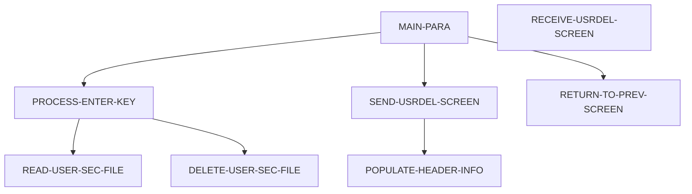

### 6.3 Account Management

#### COACTVWC — CICS online Account View screen

*Online · CICS · Complexity: Medium · Business rules: BR-001*

CICS online Account View screen. A pseudo-conversational transaction: the user enters an account number, the program validates it, then reads the card cross-reference, account and customer records to display the full account detail. Read-only inquiry (no updates). Handles PF-key navigation (Enter to inquire, PF3 to return to the menu) via a 2000-byte COMMAREA.

**Figure 6.8 — COACTVWC flow**

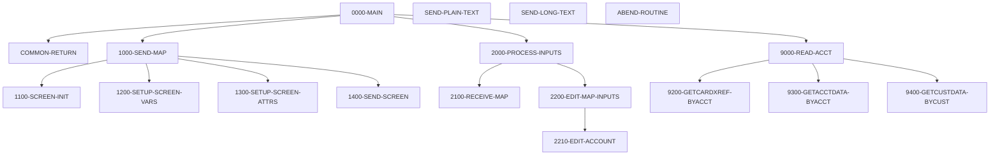

#### COACTUPC — CICS online Account Update screen — the most complex online program

*Online · CICS · Complexity: High · Business rules: BR-001, BR-006, BR-007, BR-008, BR-009, BR-010, BR-011, BR-012, BR-013, BR-014, BR-015*

CICS online Account Update screen -- the most complex online program. Lets a user retrieve an account, edit account and customer fields, and save the changes. It runs an extensive field-validation suite (account number, mandatory fields, yes/no flags, alphabetic, alphanumeric, numeric, signed amounts, US phone, SSN, US state code, FICO score, state+zip consistency), compares old vs new values, and only rewrites the account/customer records if something actually changed AND the record was not changed by someone else since it was read (optimistic concurrency check). Pseudo-conversational via a 2000-byte COMMAREA.

**Figure 6.9 — COACTUPC flow**

```mermaid
flowchart TD
  0000_MAIN["0000-MAIN"]
  1000_PROCESS_INPUTS["1000-PROCESS-INPUTS"]
  1100_RECEIVE_MAP["1100-RECEIVE-MAP"]
  1200_EDIT_MAP_INPUTS["1200-EDIT-MAP-INPUTS"]
  1205_COMPARE_OLD_NEW["1205-COMPARE-OLD-NEW"]
  1210_EDIT_ACCOUNT["1210-EDIT-ACCOUNT"]
  1215_EDIT_MANDATORY["1215-EDIT-MANDATORY"]
  1220_EDIT_YESNO["1220-EDIT-YESNO"]
  1225_EDIT_ALPHA_REQD["1225-EDIT-ALPHA-REQD"]
  1230_EDIT_ALPHANUM_REQD["1230-EDIT-ALPHANUM-REQD"]
  1235_EDIT_ALPHA_OPT["1235-EDIT-ALPHA-OPT"]
  1240_EDIT_ALPHANUM_OPT["1240-EDIT-ALPHANUM-OPT"]
  1245_EDIT_NUM_REQD["1245-EDIT-NUM-REQD"]
  1250_EDIT_SIGNED_9V2["1250-EDIT-SIGNED-9V2"]
  1260_EDIT_US_PHONE_NUM["1260-EDIT-US-PHONE-NUM"]
  EDIT_AREA_CODE["EDIT-AREA-CODE"]
  EDIT_US_PHONE_PREFIX["EDIT-US-PHONE-PREFIX"]
  EDIT_US_PHONE_LINENUM["EDIT-US-PHONE-LINENUM"]
  1265_EDIT_US_SSN["1265-EDIT-US-SSN"]
  1270_EDIT_US_STATE_CD["1270-EDIT-US-STATE-CD"]
  1275_EDIT_FICO_SCORE["1275-EDIT-FICO-SCORE"]
  1280_EDIT_US_STATE_ZIP_CD["1280-EDIT-US-STATE-ZIP-CD"]
  2000_DECIDE_ACTION["2000-DECIDE-ACTION"]
  3000_SEND_MAP["3000-SEND-MAP"]
  3200_SETUP_SCREEN_VARS["3200-SETUP-SCREEN-VARS"]
  3300_SETUP_SCREEN_ATTRS["3300-SETUP-SCREEN-ATTRS"]
  9000_READ_ACCT["9000-READ-ACCT"]
  9500_STORE_FETCHED_DATA["9500-STORE-FETCHED-DATA"]
  9600_WRITE_PROCESSING["9600-WRITE-PROCESSING"]
  9700_CHECK_CHANGE_IN_REC["9700-CHECK-CHANGE-IN-REC"]
  COMMON_RETURN["COMMON-RETURN"]
  ABEND_ROUTINE["ABEND-ROUTINE"]
  0000_MAIN --> 1000_PROCESS_INPUTS
  0000_MAIN --> 2000_DECIDE_ACTION
  0000_MAIN --> 3000_SEND_MAP
  0000_MAIN --> 9000_READ_ACCT
  0000_MAIN --> 9600_WRITE_PROCESSING
  0000_MAIN --> COMMON_RETURN
  1000_PROCESS_INPUTS --> 1100_RECEIVE_MAP
  1000_PROCESS_INPUTS --> 1200_EDIT_MAP_INPUTS
  1200_EDIT_MAP_INPUTS --> 1210_EDIT_ACCOUNT
  1200_EDIT_MAP_INPUTS --> 1215_EDIT_MANDATORY
  1200_EDIT_MAP_INPUTS --> 1220_EDIT_YESNO
  1200_EDIT_MAP_INPUTS --> 1225_EDIT_ALPHA_REQD
  1200_EDIT_MAP_INPUTS --> 1230_EDIT_ALPHANUM_REQD
  1200_EDIT_MAP_INPUTS --> 1235_EDIT_ALPHA_OPT
  1200_EDIT_MAP_INPUTS --> 1240_EDIT_ALPHANUM_OPT
  1200_EDIT_MAP_INPUTS --> 1245_EDIT_NUM_REQD
  1200_EDIT_MAP_INPUTS --> 1250_EDIT_SIGNED_9V2
  1200_EDIT_MAP_INPUTS --> 1260_EDIT_US_PHONE_NUM
  1200_EDIT_MAP_INPUTS --> 1265_EDIT_US_SSN
  1200_EDIT_MAP_INPUTS --> 1270_EDIT_US_STATE_CD
  1200_EDIT_MAP_INPUTS --> 1275_EDIT_FICO_SCORE
  1200_EDIT_MAP_INPUTS --> 1280_EDIT_US_STATE_ZIP_CD
  1260_EDIT_US_PHONE_NUM --> EDIT_AREA_CODE
  1260_EDIT_US_PHONE_NUM --> EDIT_US_PHONE_PREFIX
  1260_EDIT_US_PHONE_NUM --> EDIT_US_PHONE_LINENUM
  3000_SEND_MAP -.-> 3100_SCREEN_INIT
  3000_SEND_MAP --> 3200_SETUP_SCREEN_VARS
  3000_SEND_MAP -.-> 3250_SETUP_INFOMSG
  3000_SEND_MAP --> 3300_SETUP_SCREEN_ATTRS
  3000_SEND_MAP -.-> 3400_SEND_SCREEN
  3200_SETUP_SCREEN_VARS -.-> 3201_SHOW_INITIAL_VALUES
  3200_SETUP_SCREEN_VARS -.-> 3202_SHOW_ORIGINAL_VALUES
  3200_SETUP_SCREEN_VARS -.-> 3203_SHOW_UPDATED_VALUES
  3300_SETUP_SCREEN_ATTRS -.-> 3310_PROTECT_ALL_ATTRS
  3300_SETUP_SCREEN_ATTRS -.-> 3320_UNPROTECT_FEW_ATTRS
  3300_SETUP_SCREEN_ATTRS -.-> 3390_SETUP_INFOMSG_ATTRS
  9000_READ_ACCT -.-> 9200_GETCARDXREF_BYACCT
  9000_READ_ACCT -.-> 9300_GETACCTDATA_BYACCT
  9000_READ_ACCT -.-> 9400_GETCUSTDATA_BYCUST
  9000_READ_ACCT --> 9500_STORE_FETCHED_DATA
  9600_WRITE_PROCESSING --> 9700_CHECK_CHANGE_IN_REC
```

#### COACCT01 — MQ-triggered CICS account-inquiry service

*Online · CICS/MQ · Complexity: Medium · Business rules: none*

MQ-triggered CICS account-inquiry service (VSAM-MQ variant, sibling of CODATE01). Started by an IBM MQ trigger message, it retrieves the triggering queue via CICS RETRIEVE, opens the input, reply and error MQ queues, reads request messages containing a function code and an account key, reads the requested account record from the account file, and puts an account-data reply message on the reply queue. Errors go to an error queue. A message-driven integration service.

**Figure 6.10 — COACCT01 flow**

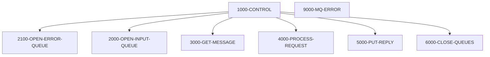

#### CBACT01C — Batch program that reads every record from the indexed ACCOUNT master file (ACCTFILE) and writes each account out to four output files in different layouts: a flat fixed record (OUTFILE), an array/table record (ARRYFILE), and two variable-length records

*Batch · Complexity: High · Business rules: BR-005*

Batch program that reads every record from the indexed ACCOUNT master file (ACCTFILE) and writes each account out to four output files in different layouts: a flat fixed record (OUTFILE), an array/table record (ARRYFILE), and two variable-length records (VBRCFILE). For each account it reformats the reissue date by calling the assembler routine COBDATFT. Any file I/O error prints the file status and abends the program.

**Figure 6.11 — CBACT01C flow**

```mermaid
flowchart TD
  MAIN_PARA["MAIN-PARA"]
  1000_ACCTFILE_GET_NEXT["1000-ACCTFILE-GET-NEXT"]
  1100_DISPLAY_ACCT_RECORD["1100-DISPLAY-ACCT-RECORD"]
  1300_POPUL_ACCT_RECORD["1300-POPUL-ACCT-RECORD"]
  1350_WRITE_ACCT_RECORD["1350-WRITE-ACCT-RECORD"]
  1400_POPUL_ARRAY_RECORD["1400-POPUL-ARRAY-RECORD"]
  1450_WRITE_ARRY_RECORD["1450-WRITE-ARRY-RECORD"]
  1500_POPUL_VBRC_RECORD["1500-POPUL-VBRC-RECORD"]
  1550_WRITE_VB1_RECORD["1550-WRITE-VB1-RECORD"]
  1575_WRITE_VB2_RECORD["1575-WRITE-VB2-RECORD"]
  0000_ACCTFILE_OPEN["0000-ACCTFILE-OPEN"]
  2000_OUTFILE_OPEN["2000-OUTFILE-OPEN"]
  3000_ARRFILE_OPEN["3000-ARRFILE-OPEN"]
  4000_VBRFILE_OPEN["4000-VBRFILE-OPEN"]
  9000_ACCTFILE_CLOSE["9000-ACCTFILE-CLOSE"]
  9999_ABEND_PROGRAM["9999-ABEND-PROGRAM"]
  9910_DISPLAY_IO_STATUS["9910-DISPLAY-IO-STATUS"]
  MAIN_PARA --> 0000_ACCTFILE_OPEN
  MAIN_PARA --> 2000_OUTFILE_OPEN
  MAIN_PARA --> 3000_ARRFILE_OPEN
  MAIN_PARA --> 4000_VBRFILE_OPEN
  MAIN_PARA --> 1000_ACCTFILE_GET_NEXT
  MAIN_PARA --> 9000_ACCTFILE_CLOSE
  1000_ACCTFILE_GET_NEXT --> 1100_DISPLAY_ACCT_RECORD
  1000_ACCTFILE_GET_NEXT --> 1300_POPUL_ACCT_RECORD
  1000_ACCTFILE_GET_NEXT --> 1350_WRITE_ACCT_RECORD
  1000_ACCTFILE_GET_NEXT --> 1400_POPUL_ARRAY_RECORD
  1000_ACCTFILE_GET_NEXT --> 1450_WRITE_ARRY_RECORD
  1000_ACCTFILE_GET_NEXT --> 1500_POPUL_VBRC_RECORD
  1000_ACCTFILE_GET_NEXT --> 1550_WRITE_VB1_RECORD
  1000_ACCTFILE_GET_NEXT --> 1575_WRITE_VB2_RECORD
  1000_ACCTFILE_GET_NEXT --> 9910_DISPLAY_IO_STATUS
  1000_ACCTFILE_GET_NEXT --> 9999_ABEND_PROGRAM
  1300_POPUL_ACCT_RECORD -.-> COBDATFT
  1350_WRITE_ACCT_RECORD --> 9910_DISPLAY_IO_STATUS
  1350_WRITE_ACCT_RECORD --> 9999_ABEND_PROGRAM
  1450_WRITE_ARRY_RECORD --> 9910_DISPLAY_IO_STATUS
  1450_WRITE_ARRY_RECORD --> 9999_ABEND_PROGRAM
  1550_WRITE_VB1_RECORD --> 9910_DISPLAY_IO_STATUS
  1550_WRITE_VB1_RECORD --> 9999_ABEND_PROGRAM
  1575_WRITE_VB2_RECORD --> 9910_DISPLAY_IO_STATUS
  1575_WRITE_VB2_RECORD --> 9999_ABEND_PROGRAM
  0000_ACCTFILE_OPEN --> 9910_DISPLAY_IO_STATUS
  0000_ACCTFILE_OPEN --> 9999_ABEND_PROGRAM
  2000_OUTFILE_OPEN --> 9910_DISPLAY_IO_STATUS
  2000_OUTFILE_OPEN --> 9999_ABEND_PROGRAM
  3000_ARRFILE_OPEN --> 9910_DISPLAY_IO_STATUS
  3000_ARRFILE_OPEN --> 9999_ABEND_PROGRAM
  4000_VBRFILE_OPEN --> 9910_DISPLAY_IO_STATUS
  4000_VBRFILE_OPEN --> 9999_ABEND_PROGRAM
  9000_ACCTFILE_CLOSE --> 9910_DISPLAY_IO_STATUS
  9000_ACCTFILE_CLOSE --> 9999_ABEND_PROGRAM
  9999_ABEND_PROGRAM -.-> CEE3ABD
```

#### CBCUS01C — Batch program that sequentially reads the indexed CUSTOMER master file (CUSTFILE) and displays every customer record

*Batch · Complexity: Medium · Business rules: none*

Batch program that sequentially reads the indexed CUSTOMER master file (CUSTFILE) and displays every customer record. A simple browse utility: open the file, loop read-and-display until end-of-file, then close. Any I/O error prints the file status and abends.

**Figure 6.12 — CBCUS01C flow**

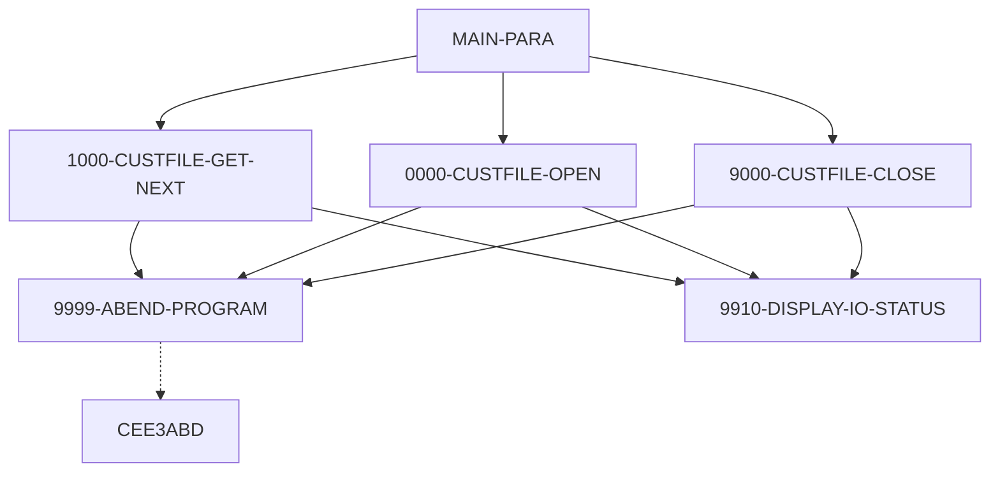

### 6.4 Card Management

#### COCRDLIC — CICS online Card List screen

*Online · CICS · Complexity: Medium · Business rules: BR-001*

CICS online Card List screen. Displays a scrollable, paginated list of credit cards, optionally filtered by account number and/or card number. Supports forward/backward paging (PF7/PF8) through the card file and lets the user select a card from the displayed array to drill into. Pseudo-conversational via a 2000-byte COMMAREA that remembers the paging position and filter.

**Figure 6.13 — COCRDLIC flow**

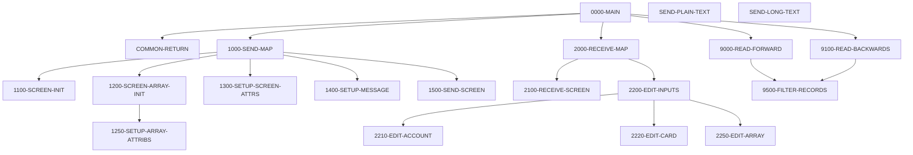

#### COCRDSLC — CICS online Card Detail (view) screen

*Online · CICS · Complexity: Medium · Business rules: BR-001*

CICS online Card Detail (view) screen. The user enters an account number and/or card number; the program validates them and reads the matching card record to display its details. Read-only inquiry. Can look up a card either by account+card key or by account alone. Pseudo-conversational via a 2000-byte COMMAREA.

**Figure 6.14 — COCRDSLC flow**

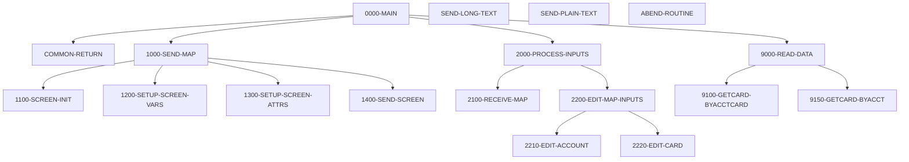

#### COCRDUPC — CICS online Card Update screen

*Online · CICS · Complexity: High · Business rules: BR-001, BR-016, BR-017*

CICS online Card Update screen. The user retrieves a card (by account + card number), edits its embossed name, active status and expiry month/year, and saves. Runs field validations (account, card, name, card status, expiry month, expiry year), compares old vs new, and rewrites the card record only if it changed and was not modified by another user since it was read (optimistic concurrency). Pseudo-conversational via a 2000-byte COMMAREA.

**Figure 6.15 — COCRDUPC flow**

```mermaid
flowchart TD
  0000_MAIN["0000-MAIN"]
  1000_PROCESS_INPUTS["1000-PROCESS-INPUTS"]
  1100_RECEIVE_MAP["1100-RECEIVE-MAP"]
  1200_EDIT_MAP_INPUTS["1200-EDIT-MAP-INPUTS"]
  1210_EDIT_ACCOUNT["1210-EDIT-ACCOUNT"]
  1220_EDIT_CARD["1220-EDIT-CARD"]
  1230_EDIT_NAME["1230-EDIT-NAME"]
  1240_EDIT_CARDSTATUS["1240-EDIT-CARDSTATUS"]
  1250_EDIT_EXPIRY_MON["1250-EDIT-EXPIRY-MON"]
  1260_EDIT_EXPIRY_YEAR["1260-EDIT-EXPIRY-YEAR"]
  2000_DECIDE_ACTION["2000-DECIDE-ACTION"]
  3000_SEND_MAP["3000-SEND-MAP"]
  3200_SETUP_SCREEN_VARS["3200-SETUP-SCREEN-VARS"]
  3300_SETUP_SCREEN_ATTRS["3300-SETUP-SCREEN-ATTRS"]
  9000_READ_DATA["9000-READ-DATA"]
  9100_GETCARD_BYACCTCARD["9100-GETCARD-BYACCTCARD"]
  9200_WRITE_PROCESSING["9200-WRITE-PROCESSING"]
  9300_CHECK_CHANGE_IN_REC["9300-CHECK-CHANGE-IN-REC"]
  COMMON_RETURN["COMMON-RETURN"]
  ABEND_ROUTINE["ABEND-ROUTINE"]
  0000_MAIN --> 1000_PROCESS_INPUTS
  0000_MAIN --> 2000_DECIDE_ACTION
  0000_MAIN --> 3000_SEND_MAP
  0000_MAIN --> 9000_READ_DATA
  0000_MAIN --> 9200_WRITE_PROCESSING
  0000_MAIN --> COMMON_RETURN
  1000_PROCESS_INPUTS --> 1100_RECEIVE_MAP
  1000_PROCESS_INPUTS --> 1200_EDIT_MAP_INPUTS
  1200_EDIT_MAP_INPUTS --> 1210_EDIT_ACCOUNT
  1200_EDIT_MAP_INPUTS --> 1220_EDIT_CARD
  1200_EDIT_MAP_INPUTS --> 1230_EDIT_NAME
  1200_EDIT_MAP_INPUTS --> 1240_EDIT_CARDSTATUS
  1200_EDIT_MAP_INPUTS --> 1250_EDIT_EXPIRY_MON
  1200_EDIT_MAP_INPUTS --> 1260_EDIT_EXPIRY_YEAR
  3000_SEND_MAP -.-> 3100_SCREEN_INIT
  3000_SEND_MAP --> 3200_SETUP_SCREEN_VARS
  3000_SEND_MAP -.-> 3250_SETUP_INFOMSG
  3000_SEND_MAP --> 3300_SETUP_SCREEN_ATTRS
  3000_SEND_MAP -.-> 3400_SEND_SCREEN
  9000_READ_DATA --> 9100_GETCARD_BYACCTCARD
  9200_WRITE_PROCESSING --> 9300_CHECK_CHANGE_IN_REC
```

#### CBACT02C — Batch program that sequentially reads the indexed CARD master file (CARDFILE) and displays every card record

*Batch · Complexity: Medium · Business rules: none*

Batch program that sequentially reads the indexed CARD master file (CARDFILE) and displays every card record. A simple browse/report utility: open the file, loop reading and displaying each record until end-of-file, then close. Any I/O error prints the file status and abends.

**Figure 6.16 — CBACT02C flow**

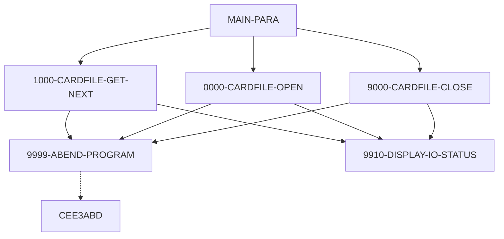

#### CBACT03C — Batch program that sequentially reads the card-to-account cross-reference file (XREFFILE) and displays every cross-reference record

*Batch · Complexity: Medium · Business rules: none*

Batch program that sequentially reads the card-to-account cross-reference file (XREFFILE) and displays every cross-reference record. A simple browse utility linking card numbers to account ids; open, loop read-and-display until end-of-file, close. Any I/O error prints the status and abends.

**Figure 6.17 — CBACT03C flow**

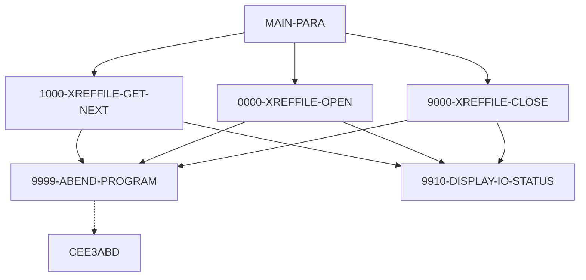

### 6.5 Transaction Entry and Posting

#### COTRN00C — CICS online Transaction List screen

*Online · CICS · Complexity: Medium · Business rules: BR-001*

CICS online Transaction List screen. Displays a scrollable, paginated list of transactions from the transaction file, with forward/backward paging (PF7/PF8). The user can select a transaction to view its detail. Pseudo-conversational, carrying the paging position in the COMMAREA.

**Figure 6.18 — COTRN00C flow**

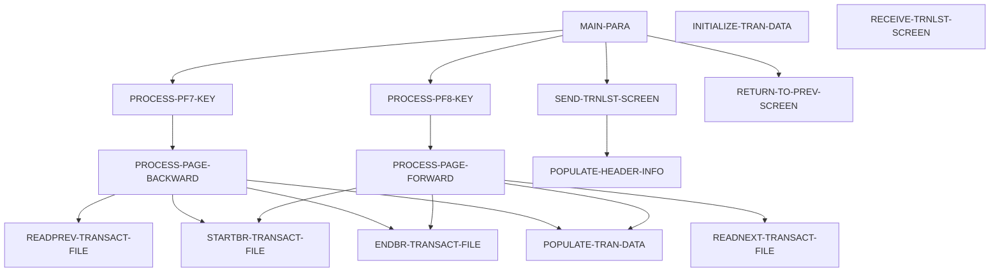

#### COTRN01C — CICS online Transaction View screen

*Online · CICS · Complexity: Medium · Business rules: BR-001*

CICS online Transaction View screen. The user enters a transaction id; the program validates it, reads the transaction record, and displays its full detail (account/card, type, category, amount, dates, merchant). Read-only inquiry. Pseudo-conversational.

**Figure 6.19 — COTRN01C flow**

```mermaid
flowchart TD
  MAIN_PARA["MAIN-PARA"]
  PROCESS_ENTER_KEY["PROCESS-ENTER-KEY"]
  READ_TRANSACT_FILE["READ-TRANSACT-FILE"]
  SEND_TRNVIEW_SCREEN["SEND-TRNVIEW-SCREEN"]
  RECEIVE_TRNVIEW_SCREEN["RECEIVE-TRNVIEW-SCREEN"]
  POPULATE_HEADER_INFO["POPULATE-HEADER-INFO"]
  RETURN_TO_PREV_SCREEN["RETURN-TO-PREV-SCREEN"]
  CLEAR_CURRENT_SCREEN["CLEAR-CURRENT-SCREEN"]
  INITIALIZE_ALL_FIELDS["INITIALIZE-ALL-FIELDS"]
  MAIN_PARA --> PROCESS_ENTER_KEY
  MAIN_PARA --> SEND_TRNVIEW_SCREEN
  MAIN_PARA --> RETURN_TO_PREV_SCREEN
  PROCESS_ENTER_KEY --> READ_TRANSACT_FILE
  SEND_TRNVIEW_SCREEN --> POPULATE_HEADER_INFO
  CLEAR_CURRENT_SCREEN --> INITIALIZE_ALL_FIELDS
```

#### COTRN02C — CICS online Add Transaction screen

*Online · CICS · Complexity: Medium · Business rules: BR-001, BR-022, BR-023*

CICS online Add Transaction screen. The user enters an account/card and transaction details (type, category, amount, dates, merchant, description); the program validates the key and data fields, derives the next transaction id from the last transaction, and writes a new transaction record. Can copy the last transaction's data as a template. Pseudo-conversational.

**Figure 6.20 — COTRN02C flow**

```mermaid
flowchart TD
  MAIN_PARA["MAIN-PARA"]
  PROCESS_ENTER_KEY["PROCESS-ENTER-KEY"]
  VALIDATE_INPUT_KEY_FIELDS["VALIDATE-INPUT-KEY-FIELDS"]
  VALIDATE_INPUT_DATA_FIELDS["VALIDATE-INPUT-DATA-FIELDS"]
  ADD_TRANSACTION["ADD-TRANSACTION"]
  COPY_LAST_TRAN_DATA["COPY-LAST-TRAN-DATA"]
  READ_CXACAIX_FILE["READ-CXACAIX-FILE"]
  READ_CCXREF_FILE["READ-CCXREF-FILE"]
  STARTBR_TRANSACT_FILE["STARTBR-TRANSACT-FILE"]
  READPREV_TRANSACT_FILE["READPREV-TRANSACT-FILE"]
  ENDBR_TRANSACT_FILE["ENDBR-TRANSACT-FILE"]
  WRITE_TRANSACT_FILE["WRITE-TRANSACT-FILE"]
  SEND_TRNADD_SCREEN["SEND-TRNADD-SCREEN"]
  RECEIVE_TRNADD_SCREEN["RECEIVE-TRNADD-SCREEN"]
  POPULATE_HEADER_INFO["POPULATE-HEADER-INFO"]
  RETURN_TO_PREV_SCREEN["RETURN-TO-PREV-SCREEN"]
  CLEAR_CURRENT_SCREEN["CLEAR-CURRENT-SCREEN"]
  INITIALIZE_ALL_FIELDS["INITIALIZE-ALL-FIELDS"]
  MAIN_PARA --> PROCESS_ENTER_KEY
  MAIN_PARA --> COPY_LAST_TRAN_DATA
  MAIN_PARA --> SEND_TRNADD_SCREEN
  MAIN_PARA --> RETURN_TO_PREV_SCREEN
  PROCESS_ENTER_KEY --> VALIDATE_INPUT_KEY_FIELDS
  PROCESS_ENTER_KEY --> VALIDATE_INPUT_DATA_FIELDS
  PROCESS_ENTER_KEY --> ADD_TRANSACTION
  VALIDATE_INPUT_KEY_FIELDS --> READ_CXACAIX_FILE
  VALIDATE_INPUT_KEY_FIELDS --> READ_CCXREF_FILE
  ADD_TRANSACTION --> STARTBR_TRANSACT_FILE
  ADD_TRANSACTION --> READPREV_TRANSACT_FILE
  ADD_TRANSACTION --> ENDBR_TRANSACT_FILE
  ADD_TRANSACTION --> WRITE_TRANSACT_FILE
  COPY_LAST_TRAN_DATA --> STARTBR_TRANSACT_FILE
  COPY_LAST_TRAN_DATA --> READPREV_TRANSACT_FILE
  COPY_LAST_TRAN_DATA --> ENDBR_TRANSACT_FILE
  SEND_TRNADD_SCREEN --> POPULATE_HEADER_INFO
  CLEAR_CURRENT_SCREEN --> INITIALIZE_ALL_FIELDS
```

#### CBTRN01C — Daily-transaction verification/browse batch

*Batch · Complexity: Medium · Business rules: none*

Daily-transaction verification/browse batch. Reads each daily transaction, looks up its card in the cross-reference, and (if found) reads the matching account, displaying the results. A read-only validation pre-pass that reports invalid cards and missing accounts but does not post anything. Opens six files (daily transactions, customer, cross-reference, card, account, transaction).

**Figure 6.21 — CBTRN01C flow**

```mermaid
flowchart TD
  MAIN_PARA["MAIN-PARA"]
  2000_LOOKUP_XREF["2000-LOOKUP-XREF"]
  3000_READ_ACCOUNT["3000-READ-ACCOUNT"]
  1000_DALYTRAN_GET_NEXT["1000-DALYTRAN-GET-NEXT"]
  0000_DALYTRAN_OPEN["0000-DALYTRAN-OPEN"]
  0100_CUSTFILE_OPEN["0100-CUSTFILE-OPEN"]
  0200_XREFFILE_OPEN["0200-XREFFILE-OPEN"]
  0300_CARDFILE_OPEN["0300-CARDFILE-OPEN"]
  0400_ACCTFILE_OPEN["0400-ACCTFILE-OPEN"]
  0500_TRANFILE_OPEN["0500-TRANFILE-OPEN"]
  9000_DALYTRAN_CLOSE["9000-DALYTRAN-CLOSE"]
  9100_CUSTFILE_CLOSE["9100-CUSTFILE-CLOSE"]
  9200_XREFFILE_CLOSE["9200-XREFFILE-CLOSE"]
  9300_CARDFILE_CLOSE["9300-CARDFILE-CLOSE"]
  9400_ACCTFILE_CLOSE["9400-ACCTFILE-CLOSE"]
  9500_TRANFILE_CLOSE["9500-TRANFILE-CLOSE"]
  Z_DISPLAY_IO_STATUS["Z-DISPLAY-IO-STATUS"]
  Z_ABEND_PROGRAM["Z-ABEND-PROGRAM"]
  MAIN_PARA --> 0000_DALYTRAN_OPEN
  MAIN_PARA --> 0100_CUSTFILE_OPEN
  MAIN_PARA --> 0200_XREFFILE_OPEN
  MAIN_PARA --> 0300_CARDFILE_OPEN
  MAIN_PARA --> 0400_ACCTFILE_OPEN
  MAIN_PARA --> 0500_TRANFILE_OPEN
  MAIN_PARA --> 1000_DALYTRAN_GET_NEXT
  MAIN_PARA --> 2000_LOOKUP_XREF
  MAIN_PARA --> 3000_READ_ACCOUNT
  MAIN_PARA --> 9000_DALYTRAN_CLOSE
  MAIN_PARA --> 9100_CUSTFILE_CLOSE
  MAIN_PARA --> 9200_XREFFILE_CLOSE
  MAIN_PARA --> 9300_CARDFILE_CLOSE
  MAIN_PARA --> 9400_ACCTFILE_CLOSE
  MAIN_PARA --> 9500_TRANFILE_CLOSE
  1000_DALYTRAN_GET_NEXT --> Z_DISPLAY_IO_STATUS
  1000_DALYTRAN_GET_NEXT --> Z_ABEND_PROGRAM
  0000_DALYTRAN_OPEN --> Z_DISPLAY_IO_STATUS
  0000_DALYTRAN_OPEN --> Z_ABEND_PROGRAM
  0100_CUSTFILE_OPEN --> Z_DISPLAY_IO_STATUS
  0100_CUSTFILE_OPEN --> Z_ABEND_PROGRAM
  0200_XREFFILE_OPEN --> Z_DISPLAY_IO_STATUS
  0200_XREFFILE_OPEN --> Z_ABEND_PROGRAM
  0300_CARDFILE_OPEN --> Z_DISPLAY_IO_STATUS
  0300_CARDFILE_OPEN --> Z_ABEND_PROGRAM
  0400_ACCTFILE_OPEN --> Z_DISPLAY_IO_STATUS
  0400_ACCTFILE_OPEN --> Z_ABEND_PROGRAM
  0500_TRANFILE_OPEN --> Z_DISPLAY_IO_STATUS
  0500_TRANFILE_OPEN --> Z_ABEND_PROGRAM
  9000_DALYTRAN_CLOSE --> Z_DISPLAY_IO_STATUS
  9000_DALYTRAN_CLOSE --> Z_ABEND_PROGRAM
  9100_CUSTFILE_CLOSE --> Z_DISPLAY_IO_STATUS
  9100_CUSTFILE_CLOSE --> Z_ABEND_PROGRAM
  9200_XREFFILE_CLOSE --> Z_DISPLAY_IO_STATUS
  9200_XREFFILE_CLOSE --> Z_ABEND_PROGRAM
  9300_CARDFILE_CLOSE --> Z_DISPLAY_IO_STATUS
  9300_CARDFILE_CLOSE --> Z_ABEND_PROGRAM
  9400_ACCTFILE_CLOSE --> Z_DISPLAY_IO_STATUS
  9400_ACCTFILE_CLOSE --> Z_ABEND_PROGRAM
  9500_TRANFILE_CLOSE --> Z_DISPLAY_IO_STATUS
  9500_TRANFILE_CLOSE --> Z_ABEND_PROGRAM
  Z_ABEND_PROGRAM -.-> CEE3ABD
```

#### CBTRN02C — The daily transaction posting engine

*Batch · Complexity: High · Business rules: BR-018, BR-019, BR-020, BR-021*

The daily transaction posting engine. Reads the day's transactions (DALYTRAN); for each one it validates the card, account, credit limit and expiry, and either POSTS the transaction (updating the transaction-category balance, the account balance and cycle credit/debit, and writing the transaction record) or REJECTS it with a numbered reason to the rejects file. Counts processed and rejected transactions and sets return code 4 if any were rejected. Contains the core credit-card transaction validation rules (reasons 100-103, 109).

**Figure 6.22 — CBTRN02C flow**

```mermaid
flowchart TD
  MAIN_PARA["MAIN-PARA"]
  1500_VALIDATE_TRAN["1500-VALIDATE-TRAN"]
  1500_A_LOOKUP_XREF["1500-A-LOOKUP-XREF"]
  1500_B_LOOKUP_ACCT["1500-B-LOOKUP-ACCT"]
  2000_POST_TRANSACTION["2000-POST-TRANSACTION"]
  2700_UPDATE_TCATBAL["2700-UPDATE-TCATBAL"]
  2700_A_CREATE_TCATBAL_REC["2700-A-CREATE-TCATBAL-REC"]
  2700_B_UPDATE_TCATBAL_REC["2700-B-UPDATE-TCATBAL-REC"]
  2800_UPDATE_ACCOUNT_REC["2800-UPDATE-ACCOUNT-REC"]
  2500_WRITE_REJECT_REC["2500-WRITE-REJECT-REC"]
  2900_WRITE_TRANSACTION_FILE["2900-WRITE-TRANSACTION-FILE"]
  1000_DALYTRAN_GET_NEXT["1000-DALYTRAN-GET-NEXT"]
  0000_DALYTRAN_OPEN["0000-DALYTRAN-OPEN"]
  0100_TRANFILE_OPEN["0100-TRANFILE-OPEN"]
  0200_XREFFILE_OPEN["0200-XREFFILE-OPEN"]
  0300_DALYREJS_OPEN["0300-DALYREJS-OPEN"]
  0400_ACCTFILE_OPEN["0400-ACCTFILE-OPEN"]
  0500_TCATBALF_OPEN["0500-TCATBALF-OPEN"]
  9000_DALYTRAN_CLOSE["9000-DALYTRAN-CLOSE"]
  9100_TRANFILE_CLOSE["9100-TRANFILE-CLOSE"]
  9200_XREFFILE_CLOSE["9200-XREFFILE-CLOSE"]
  9300_DALYREJS_CLOSE["9300-DALYREJS-CLOSE"]
  9400_ACCTFILE_CLOSE["9400-ACCTFILE-CLOSE"]
  9500_TCATBALF_CLOSE["9500-TCATBALF-CLOSE"]
  Z_GET_DB2_FORMAT_TIMESTAMP["Z-GET-DB2-FORMAT-TIMESTAMP"]
  9999_ABEND_PROGRAM["9999-ABEND-PROGRAM"]
  9910_DISPLAY_IO_STATUS["9910-DISPLAY-IO-STATUS"]
  MAIN_PARA --> 0000_DALYTRAN_OPEN
  MAIN_PARA --> 0100_TRANFILE_OPEN
  MAIN_PARA --> 0200_XREFFILE_OPEN
  MAIN_PARA --> 0300_DALYREJS_OPEN
  MAIN_PARA --> 0400_ACCTFILE_OPEN
  MAIN_PARA --> 0500_TCATBALF_OPEN
  MAIN_PARA --> 1000_DALYTRAN_GET_NEXT
  MAIN_PARA --> 1500_VALIDATE_TRAN
  MAIN_PARA --> 2000_POST_TRANSACTION
  MAIN_PARA --> 2500_WRITE_REJECT_REC
  MAIN_PARA --> 9000_DALYTRAN_CLOSE
  MAIN_PARA --> 9100_TRANFILE_CLOSE
  MAIN_PARA --> 9200_XREFFILE_CLOSE
  MAIN_PARA --> 9300_DALYREJS_CLOSE
  MAIN_PARA --> 9400_ACCTFILE_CLOSE
  MAIN_PARA --> 9500_TCATBALF_CLOSE
  1500_VALIDATE_TRAN --> 1500_A_LOOKUP_XREF
  1500_VALIDATE_TRAN --> 1500_B_LOOKUP_ACCT
  2000_POST_TRANSACTION --> Z_GET_DB2_FORMAT_TIMESTAMP
  2000_POST_TRANSACTION --> 2700_UPDATE_TCATBAL
  2000_POST_TRANSACTION --> 2800_UPDATE_ACCOUNT_REC
  2000_POST_TRANSACTION --> 2900_WRITE_TRANSACTION_FILE
  2700_UPDATE_TCATBAL --> 2700_A_CREATE_TCATBAL_REC
  2700_UPDATE_TCATBAL --> 2700_B_UPDATE_TCATBAL_REC
  2700_UPDATE_TCATBAL --> 9910_DISPLAY_IO_STATUS
  2700_UPDATE_TCATBAL --> 9999_ABEND_PROGRAM
  2700_A_CREATE_TCATBAL_REC --> 9910_DISPLAY_IO_STATUS
  2700_A_CREATE_TCATBAL_REC --> 9999_ABEND_PROGRAM
  2700_B_UPDATE_TCATBAL_REC --> 9910_DISPLAY_IO_STATUS
  2700_B_UPDATE_TCATBAL_REC --> 9999_ABEND_PROGRAM
  2500_WRITE_REJECT_REC --> 9910_DISPLAY_IO_STATUS
  2500_WRITE_REJECT_REC --> 9999_ABEND_PROGRAM
  2900_WRITE_TRANSACTION_FILE --> 9910_DISPLAY_IO_STATUS
  2900_WRITE_TRANSACTION_FILE --> 9999_ABEND_PROGRAM
  1000_DALYTRAN_GET_NEXT --> 9910_DISPLAY_IO_STATUS
  1000_DALYTRAN_GET_NEXT --> 9999_ABEND_PROGRAM
  0000_DALYTRAN_OPEN --> 9910_DISPLAY_IO_STATUS
  0000_DALYTRAN_OPEN --> 9999_ABEND_PROGRAM
  0100_TRANFILE_OPEN --> 9910_DISPLAY_IO_STATUS
  0100_TRANFILE_OPEN --> 9999_ABEND_PROGRAM
  0200_XREFFILE_OPEN --> 9910_DISPLAY_IO_STATUS
  0200_XREFFILE_OPEN --> 9999_ABEND_PROGRAM
  0300_DALYREJS_OPEN --> 9910_DISPLAY_IO_STATUS
  0300_DALYREJS_OPEN --> 9999_ABEND_PROGRAM
  0400_ACCTFILE_OPEN --> 9910_DISPLAY_IO_STATUS
  0400_ACCTFILE_OPEN --> 9999_ABEND_PROGRAM
  0500_TCATBALF_OPEN --> 9910_DISPLAY_IO_STATUS
  0500_TCATBALF_OPEN --> 9999_ABEND_PROGRAM
  9000_DALYTRAN_CLOSE --> 9910_DISPLAY_IO_STATUS
  9000_DALYTRAN_CLOSE --> 9999_ABEND_PROGRAM
  9100_TRANFILE_CLOSE --> 9910_DISPLAY_IO_STATUS
  9100_TRANFILE_CLOSE --> 9999_ABEND_PROGRAM
  9200_XREFFILE_CLOSE --> 9910_DISPLAY_IO_STATUS
  9200_XREFFILE_CLOSE --> 9999_ABEND_PROGRAM
  9300_DALYREJS_CLOSE --> 9910_DISPLAY_IO_STATUS
  9300_DALYREJS_CLOSE --> 9999_ABEND_PROGRAM
  9400_ACCTFILE_CLOSE --> 9910_DISPLAY_IO_STATUS
  9400_ACCTFILE_CLOSE --> 9999_ABEND_PROGRAM
  9500_TCATBALF_CLOSE --> 9910_DISPLAY_IO_STATUS
  9500_TCATBALF_CLOSE --> 9999_ABEND_PROGRAM
  9999_ABEND_PROGRAM -.-> CEE3ABD
```

### 6.6 Interest and Bill Payment

#### CBACT04C — The interest & fee posting batch

*Batch · Complexity: High · Business rules: BR-024*

The interest & fee posting batch. Reads the transaction-category-balance file (TCATBAL) in account order; for each account it looks up account data, the card cross-reference, and the interest rate from the disclosure-group file (falling back to a DEFAULT group if the specific one is missing). It computes monthly interest as (category balance x rate) / 1200, writes an interest transaction record, accumulates the interest, and when the account changes it rewrites the account master with the accumulated interest added to the balance and the cycle credit/debit reset to zero. Receives the processing date as a linkage parameter. Fee computation is stubbed ('to be implemented').

**Figure 6.23 — CBACT04C flow**

```mermaid
flowchart TD
  MAIN_PARA["MAIN-PARA"]
  1050_UPDATE_ACCOUNT["1050-UPDATE-ACCOUNT"]
  1200_GET_INTEREST_RATE["1200-GET-INTEREST-RATE"]
  1200_A_GET_DEFAULT_INT_RATE["1200-A-GET-DEFAULT-INT-RATE"]
  1300_COMPUTE_INTEREST["1300-COMPUTE-INTEREST"]
  1300_B_WRITE_TX["1300-B-WRITE-TX"]
  1400_COMPUTE_FEES["1400-COMPUTE-FEES"]
  1000_TCATBALF_GET_NEXT["1000-TCATBALF-GET-NEXT"]
  1100_GET_ACCT_DATA["1100-GET-ACCT-DATA"]
  1110_GET_XREF_DATA["1110-GET-XREF-DATA"]
  0000_TCATBALF_OPEN["0000-TCATBALF-OPEN"]
  0100_XREFFILE_OPEN["0100-XREFFILE-OPEN"]
  0200_DISCGRP_OPEN["0200-DISCGRP-OPEN"]
  0300_ACCTFILE_OPEN["0300-ACCTFILE-OPEN"]
  0400_TRANFILE_OPEN["0400-TRANFILE-OPEN"]
  9000_TCATBALF_CLOSE["9000-TCATBALF-CLOSE"]
  9100_XREFFILE_CLOSE["9100-XREFFILE-CLOSE"]
  9200_DISCGRP_CLOSE["9200-DISCGRP-CLOSE"]
  9300_ACCTFILE_CLOSE["9300-ACCTFILE-CLOSE"]
  9400_TRANFILE_CLOSE["9400-TRANFILE-CLOSE"]
  Z_GET_DB2_FORMAT_TIMESTAMP["Z-GET-DB2-FORMAT-TIMESTAMP"]
  9999_ABEND_PROGRAM["9999-ABEND-PROGRAM"]
  9910_DISPLAY_IO_STATUS["9910-DISPLAY-IO-STATUS"]
  MAIN_PARA --> 0000_TCATBALF_OPEN
  MAIN_PARA --> 0100_XREFFILE_OPEN
  MAIN_PARA --> 0200_DISCGRP_OPEN
  MAIN_PARA --> 0300_ACCTFILE_OPEN
  MAIN_PARA --> 0400_TRANFILE_OPEN
  MAIN_PARA --> 1000_TCATBALF_GET_NEXT
  MAIN_PARA --> 1050_UPDATE_ACCOUNT
  MAIN_PARA --> 1100_GET_ACCT_DATA
  MAIN_PARA --> 1110_GET_XREF_DATA
  MAIN_PARA --> 1200_GET_INTEREST_RATE
  MAIN_PARA --> 1300_COMPUTE_INTEREST
  MAIN_PARA --> 1400_COMPUTE_FEES
  MAIN_PARA --> 9000_TCATBALF_CLOSE
  MAIN_PARA --> 9100_XREFFILE_CLOSE
  MAIN_PARA --> 9200_DISCGRP_CLOSE
  MAIN_PARA --> 9300_ACCTFILE_CLOSE
  MAIN_PARA --> 9400_TRANFILE_CLOSE
  1050_UPDATE_ACCOUNT --> 9910_DISPLAY_IO_STATUS
  1050_UPDATE_ACCOUNT --> 9999_ABEND_PROGRAM
  1200_GET_INTEREST_RATE --> 9910_DISPLAY_IO_STATUS
  1200_GET_INTEREST_RATE --> 9999_ABEND_PROGRAM
  1200_GET_INTEREST_RATE --> 1200_A_GET_DEFAULT_INT_RATE
  1200_A_GET_DEFAULT_INT_RATE --> 9910_DISPLAY_IO_STATUS
  1200_A_GET_DEFAULT_INT_RATE --> 9999_ABEND_PROGRAM
  1300_COMPUTE_INTEREST --> 1300_B_WRITE_TX
  1300_B_WRITE_TX --> Z_GET_DB2_FORMAT_TIMESTAMP
  1300_B_WRITE_TX --> 9910_DISPLAY_IO_STATUS
  1300_B_WRITE_TX --> 9999_ABEND_PROGRAM
  1000_TCATBALF_GET_NEXT --> 9910_DISPLAY_IO_STATUS
  1000_TCATBALF_GET_NEXT --> 9999_ABEND_PROGRAM
  1100_GET_ACCT_DATA --> 9910_DISPLAY_IO_STATUS
  1100_GET_ACCT_DATA --> 9999_ABEND_PROGRAM
  1110_GET_XREF_DATA --> 9910_DISPLAY_IO_STATUS
  1110_GET_XREF_DATA --> 9999_ABEND_PROGRAM
  0000_TCATBALF_OPEN --> 9910_DISPLAY_IO_STATUS
  0000_TCATBALF_OPEN --> 9999_ABEND_PROGRAM
  0100_XREFFILE_OPEN --> 9910_DISPLAY_IO_STATUS
  0100_XREFFILE_OPEN --> 9999_ABEND_PROGRAM
  0200_DISCGRP_OPEN --> 9910_DISPLAY_IO_STATUS
  0200_DISCGRP_OPEN --> 9999_ABEND_PROGRAM
  0300_ACCTFILE_OPEN --> 9910_DISPLAY_IO_STATUS
  0300_ACCTFILE_OPEN --> 9999_ABEND_PROGRAM
  0400_TRANFILE_OPEN --> 9910_DISPLAY_IO_STATUS
  0400_TRANFILE_OPEN --> 9999_ABEND_PROGRAM
  9000_TCATBALF_CLOSE --> 9910_DISPLAY_IO_STATUS
  9000_TCATBALF_CLOSE --> 9999_ABEND_PROGRAM
  9100_XREFFILE_CLOSE --> 9910_DISPLAY_IO_STATUS
  9100_XREFFILE_CLOSE --> 9999_ABEND_PROGRAM
  9200_DISCGRP_CLOSE --> 9910_DISPLAY_IO_STATUS
  9200_DISCGRP_CLOSE --> 9999_ABEND_PROGRAM
  9300_ACCTFILE_CLOSE --> 9910_DISPLAY_IO_STATUS
  9300_ACCTFILE_CLOSE --> 9999_ABEND_PROGRAM
  9400_TRANFILE_CLOSE --> 9910_DISPLAY_IO_STATUS
  9400_TRANFILE_CLOSE --> 9999_ABEND_PROGRAM
  9999_ABEND_PROGRAM -.-> CEE3ABD
```

#### COBIL00C — CICS online Bill Payment screen

*Online · CICS · Complexity: High · Business rules: BR-001, BR-025, BR-026, BR-027*

CICS online Bill Payment screen. The user enters an account id and confirms payment; the program reads the account, shows the current balance, and on confirmation pays the FULL outstanding balance -- creating a payment transaction for the balance amount and zeroing the account balance. Rejects payment when there is nothing to pay (balance <= 0). Pseudo-conversational.

**Figure 6.24 — COBIL00C flow**

```mermaid
flowchart TD
  MAIN_PARA["MAIN-PARA"]
  PROCESS_ENTER_KEY["PROCESS-ENTER-KEY"]
  READ_ACCTDAT_FILE["READ-ACCTDAT-FILE"]
  UPDATE_ACCTDAT_FILE["UPDATE-ACCTDAT-FILE"]
  READ_CXACAIX_FILE["READ-CXACAIX-FILE"]
  STARTBR_TRANSACT_FILE["STARTBR-TRANSACT-FILE"]
  READPREV_TRANSACT_FILE["READPREV-TRANSACT-FILE"]
  ENDBR_TRANSACT_FILE["ENDBR-TRANSACT-FILE"]
  WRITE_TRANSACT_FILE["WRITE-TRANSACT-FILE"]
  GET_CURRENT_TIMESTAMP["GET-CURRENT-TIMESTAMP"]
  SEND_BILLPAY_SCREEN["SEND-BILLPAY-SCREEN"]
  RECEIVE_BILLPAY_SCREEN["RECEIVE-BILLPAY-SCREEN"]
  POPULATE_HEADER_INFO["POPULATE-HEADER-INFO"]
  RETURN_TO_PREV_SCREEN["RETURN-TO-PREV-SCREEN"]
  CLEAR_CURRENT_SCREEN["CLEAR-CURRENT-SCREEN"]
  INITIALIZE_ALL_FIELDS["INITIALIZE-ALL-FIELDS"]
  MAIN_PARA --> PROCESS_ENTER_KEY
  MAIN_PARA --> SEND_BILLPAY_SCREEN
  MAIN_PARA --> RETURN_TO_PREV_SCREEN
  PROCESS_ENTER_KEY --> READ_ACCTDAT_FILE
  PROCESS_ENTER_KEY --> CLEAR_CURRENT_SCREEN
  PROCESS_ENTER_KEY --> SEND_BILLPAY_SCREEN
  PROCESS_ENTER_KEY --> UPDATE_ACCTDAT_FILE
  PROCESS_ENTER_KEY --> WRITE_TRANSACT_FILE
  PROCESS_ENTER_KEY --> READ_CXACAIX_FILE
  PROCESS_ENTER_KEY --> STARTBR_TRANSACT_FILE
  PROCESS_ENTER_KEY --> READPREV_TRANSACT_FILE
  PROCESS_ENTER_KEY --> ENDBR_TRANSACT_FILE
  PROCESS_ENTER_KEY --> GET_CURRENT_TIMESTAMP
  SEND_BILLPAY_SCREEN --> POPULATE_HEADER_INFO
  POPULATE_HEADER_INFO --> GET_CURRENT_TIMESTAMP
  CLEAR_CURRENT_SCREEN --> INITIALIZE_ALL_FIELDS
```

### 6.7 Statements and Reporting

#### CBSTM03A — Account statement generator

*Batch · Complexity: Medium · Business rules: none*

Account statement generator. For each account (via the card cross-reference) it reads the customer and account data and all of the account's transactions, then produces a statement in BOTH plain-text and HTML formats. Transactions are buffered in an in-memory table (up to 51 cards x 10 transactions). Notably uses legacy ALTER + GO TO 'switched paragraph' control flow and reads the mainframe TIOT control blocks to list the job's DD names. Contains unstructured control flow that should be reviewed before modernization.

**Figure 6.25 — CBSTM03A flow**

```mermaid
flowchart TD
  MAIN_PARA["MAIN-PARA"]
  0000_START["0000-START"]
  1000_MAINLINE["1000-MAINLINE"]
  5000_CREATE_STATEMENT["5000-CREATE-STATEMENT"]
  1000_XREFFILE_GET_NEXT["1000-XREFFILE-GET-NEXT"]
  2000_CUSTFILE_GET["2000-CUSTFILE-GET"]
  3000_ACCTFILE_GET["3000-ACCTFILE-GET"]
  4000_TRNXFILE_GET["4000-TRNXFILE-GET"]
  8100_FILE_OPEN["8100-FILE-OPEN"]
  8100_TRNXFILE_OPEN["8100-TRNXFILE-OPEN"]
  8200_XREFFILE_OPEN["8200-XREFFILE-OPEN"]
  8300_CUSTFILE_OPEN["8300-CUSTFILE-OPEN"]
  8400_ACCTFILE_OPEN["8400-ACCTFILE-OPEN"]
  8500_READTRNX_READ["8500-READTRNX-READ"]
  9999_GOBACK["9999-GOBACK"]
  0000_START --> 8100_FILE_OPEN
  0000_START --> 8500_READTRNX_READ
  0000_START --> 9999_GOBACK
  1000_MAINLINE --> 1000_XREFFILE_GET_NEXT
  1000_MAINLINE --> 2000_CUSTFILE_GET
  1000_MAINLINE --> 3000_ACCTFILE_GET
  1000_MAINLINE --> 5000_CREATE_STATEMENT
  1000_MAINLINE --> 4000_TRNXFILE_GET
```

#### CBSTM03B — Called I/O subroutine used by the statement generator

*Shared subroutine · Complexity: Medium · Business rules: none*

Called I/O subroutine used by the statement generator (CBSTM03A). It is a generic data-access layer: the caller passes a linkage area naming a file (DD) and an operation code (Open/Close/Read/Read-Keyed/Write/Rewrite) plus a key and a record buffer; the routine performs the requested operation on the matching file (transaction, cross-reference, customer, account) and returns the file status. Keeps all VSAM I/O in one reusable module.

**Figure 6.26 — CBSTM03B flow**

```mermaid
flowchart TD
  0000_START["0000-START"]
  1000_TRNXFILE_PROC["1000-TRNXFILE-PROC"]
  1900_EXIT["1900-EXIT"]
  1999_EXIT["1999-EXIT"]
  2000_XREFFILE_PROC["2000-XREFFILE-PROC"]
  2900_EXIT["2900-EXIT"]
  2999_EXIT["2999-EXIT"]
  3000_CUSTFILE_PROC["3000-CUSTFILE-PROC"]
  3900_EXIT["3900-EXIT"]
  3999_EXIT["3999-EXIT"]
  4000_ACCTFILE_PROC["4000-ACCTFILE-PROC"]
  4900_EXIT["4900-EXIT"]
  4999_EXIT["4999-EXIT"]
  9999_GOBACK["9999-GOBACK"]
  0000_START --> 1000_TRNXFILE_PROC
  0000_START --> 2000_XREFFILE_PROC
  0000_START --> 3000_CUSTFILE_PROC
  0000_START --> 4000_ACCTFILE_PROC
  0000_START --> 9999_GOBACK
```

#### CBTRN03C — Transaction detail report batch

*Batch · Complexity: High · Business rules: BR-028*

Transaction detail report batch. Reads a date range from a parameter file, then reads the transaction file and prints only transactions whose processing date falls in that range. Enriches each line with the account (via card cross-reference), transaction-type and transaction-category descriptions, and produces a formatted report with page headers, per-account (per-card) subtotals, page totals and a grand total via control-break logic.

**Figure 6.27 — CBTRN03C flow**

```mermaid
flowchart TD
  MAIN_PARA["MAIN-PARA"]
  0550_DATEPARM_READ["0550-DATEPARM-READ"]
  1000_TRANFILE_GET_NEXT["1000-TRANFILE-GET-NEXT"]
  1100_WRITE_TRANSACTION_REPORT["1100-WRITE-TRANSACTION-REPORT"]
  1110_WRITE_PAGE_TOTALS["1110-WRITE-PAGE-TOTALS"]
  1120_WRITE_ACCOUNT_TOTALS["1120-WRITE-ACCOUNT-TOTALS"]
  1110_WRITE_GRAND_TOTALS["1110-WRITE-GRAND-TOTALS"]
  1120_WRITE_HEADERS["1120-WRITE-HEADERS"]
  1120_WRITE_DETAIL["1120-WRITE-DETAIL"]
  1111_WRITE_REPORT_REC["1111-WRITE-REPORT-REC"]
  1500_A_LOOKUP_XREF["1500-A-LOOKUP-XREF"]
  1500_B_LOOKUP_TRANTYPE["1500-B-LOOKUP-TRANTYPE"]
  1500_C_LOOKUP_TRANCATG["1500-C-LOOKUP-TRANCATG"]
  0000_TRANFILE_OPEN["0000-TRANFILE-OPEN"]
  0100_REPTFILE_OPEN["0100-REPTFILE-OPEN"]
  0200_CARDXREF_OPEN["0200-CARDXREF-OPEN"]
  0300_TRANTYPE_OPEN["0300-TRANTYPE-OPEN"]
  0400_TRANCATG_OPEN["0400-TRANCATG-OPEN"]
  0500_DATEPARM_OPEN["0500-DATEPARM-OPEN"]
  9000_TRANFILE_CLOSE["9000-TRANFILE-CLOSE"]
  9100_REPTFILE_CLOSE["9100-REPTFILE-CLOSE"]
  9200_CARDXREF_CLOSE["9200-CARDXREF-CLOSE"]
  9300_TRANTYPE_CLOSE["9300-TRANTYPE-CLOSE"]
  9400_TRANCATG_CLOSE["9400-TRANCATG-CLOSE"]
  9500_DATEPARM_CLOSE["9500-DATEPARM-CLOSE"]
  9999_ABEND_PROGRAM["9999-ABEND-PROGRAM"]
  9910_DISPLAY_IO_STATUS["9910-DISPLAY-IO-STATUS"]
  MAIN_PARA --> 0000_TRANFILE_OPEN
  MAIN_PARA --> 0100_REPTFILE_OPEN
  MAIN_PARA --> 0200_CARDXREF_OPEN
  MAIN_PARA --> 0300_TRANTYPE_OPEN
  MAIN_PARA --> 0400_TRANCATG_OPEN
  MAIN_PARA --> 0500_DATEPARM_OPEN
  MAIN_PARA --> 0550_DATEPARM_READ
  MAIN_PARA --> 1000_TRANFILE_GET_NEXT
  MAIN_PARA --> 1120_WRITE_ACCOUNT_TOTALS
  MAIN_PARA --> 1500_A_LOOKUP_XREF
  MAIN_PARA --> 1500_B_LOOKUP_TRANTYPE
  MAIN_PARA --> 1500_C_LOOKUP_TRANCATG
  MAIN_PARA --> 1100_WRITE_TRANSACTION_REPORT
  MAIN_PARA --> 1110_WRITE_PAGE_TOTALS
  MAIN_PARA --> 1110_WRITE_GRAND_TOTALS
  MAIN_PARA --> 9000_TRANFILE_CLOSE
  MAIN_PARA --> 9100_REPTFILE_CLOSE
  MAIN_PARA --> 9200_CARDXREF_CLOSE
  MAIN_PARA --> 9300_TRANTYPE_CLOSE
  MAIN_PARA --> 9400_TRANCATG_CLOSE
  MAIN_PARA --> 9500_DATEPARM_CLOSE
  0550_DATEPARM_READ --> 9910_DISPLAY_IO_STATUS
  0550_DATEPARM_READ --> 9999_ABEND_PROGRAM
  1000_TRANFILE_GET_NEXT --> 9910_DISPLAY_IO_STATUS
  1000_TRANFILE_GET_NEXT --> 9999_ABEND_PROGRAM
  1100_WRITE_TRANSACTION_REPORT --> 1120_WRITE_HEADERS
  1100_WRITE_TRANSACTION_REPORT --> 1110_WRITE_PAGE_TOTALS
  1100_WRITE_TRANSACTION_REPORT --> 1120_WRITE_DETAIL
  1110_WRITE_PAGE_TOTALS --> 1111_WRITE_REPORT_REC
  1120_WRITE_ACCOUNT_TOTALS --> 1111_WRITE_REPORT_REC
  1110_WRITE_GRAND_TOTALS --> 1111_WRITE_REPORT_REC
  1120_WRITE_HEADERS --> 1111_WRITE_REPORT_REC
  1120_WRITE_DETAIL --> 1111_WRITE_REPORT_REC
  1111_WRITE_REPORT_REC --> 9910_DISPLAY_IO_STATUS
  1111_WRITE_REPORT_REC --> 9999_ABEND_PROGRAM
  0000_TRANFILE_OPEN --> 9910_DISPLAY_IO_STATUS
  0000_TRANFILE_OPEN --> 9999_ABEND_PROGRAM
  0100_REPTFILE_OPEN --> 9910_DISPLAY_IO_STATUS
  0100_REPTFILE_OPEN --> 9999_ABEND_PROGRAM
  0200_CARDXREF_OPEN --> 9910_DISPLAY_IO_STATUS
  0200_CARDXREF_OPEN --> 9999_ABEND_PROGRAM
  0300_TRANTYPE_OPEN --> 9910_DISPLAY_IO_STATUS
  0300_TRANTYPE_OPEN --> 9999_ABEND_PROGRAM
  0400_TRANCATG_OPEN --> 9910_DISPLAY_IO_STATUS
  0400_TRANCATG_OPEN --> 9999_ABEND_PROGRAM
  0500_DATEPARM_OPEN --> 9910_DISPLAY_IO_STATUS
  0500_DATEPARM_OPEN --> 9999_ABEND_PROGRAM
  9000_TRANFILE_CLOSE --> 9910_DISPLAY_IO_STATUS
  9000_TRANFILE_CLOSE --> 9999_ABEND_PROGRAM
  9100_REPTFILE_CLOSE --> 9910_DISPLAY_IO_STATUS
  9100_REPTFILE_CLOSE --> 9999_ABEND_PROGRAM
  9200_CARDXREF_CLOSE --> 9910_DISPLAY_IO_STATUS
  9200_CARDXREF_CLOSE --> 9999_ABEND_PROGRAM
  9300_TRANTYPE_CLOSE --> 9910_DISPLAY_IO_STATUS
  9300_TRANTYPE_CLOSE --> 9999_ABEND_PROGRAM
  9400_TRANCATG_CLOSE --> 9910_DISPLAY_IO_STATUS
  9400_TRANCATG_CLOSE --> 9999_ABEND_PROGRAM
  9500_DATEPARM_CLOSE --> 9910_DISPLAY_IO_STATUS
  9500_DATEPARM_CLOSE --> 9999_ABEND_PROGRAM
  9999_ABEND_PROGRAM -.-> CEE3ABD
```

#### CORPT00C — CICS online Transaction Reports screen

*Online · CICS · Complexity: Medium · Business rules: BR-001, BR-029*

CICS online Transaction Reports screen. The user chooses a report type -- Monthly, Yearly, or a Custom date range -- and the program validates the selection/dates and submits a batch job (writing a date-parameter and job to the internal reader / transient data queue) to run the transaction detail report (CBTRN03C). Pseudo-conversational.

**Figure 6.28 — CORPT00C flow**

```mermaid
flowchart TD
  MAIN_PARA["MAIN-PARA"]
  PROCESS_ENTER_KEY["PROCESS-ENTER-KEY"]
  VALIDATE_DATES["VALIDATE-DATES"]
  SUBMIT_JOB["SUBMIT-JOB"]
  SEND_RPT_SCREEN["SEND-RPT-SCREEN"]
  RECEIVE_RPT_SCREEN["RECEIVE-RPT-SCREEN"]
  POPULATE_HEADER_INFO["POPULATE-HEADER-INFO"]
  RETURN_TO_PREV_SCREEN["RETURN-TO-PREV-SCREEN"]
  MAIN_PARA --> PROCESS_ENTER_KEY
  MAIN_PARA --> SEND_RPT_SCREEN
  MAIN_PARA --> RETURN_TO_PREV_SCREEN
  PROCESS_ENTER_KEY --> VALIDATE_DATES
  PROCESS_ENTER_KEY --> SUBMIT_JOB
  VALIDATE_DATES -.-> CSUTLDTC
  SEND_RPT_SCREEN --> POPULATE_HEADER_INFO
```

### 6.8 Card Authorization

#### COPAUA0C — Card Authorization Decision program

*Online · CICS/IMS/MQ · Complexity: High · Business rules: BR-034, BR-035, BR-036, BR-037, BR-038, BR-039, BR-040, BR-041, BR-042, BR-043*

Card Authorization Decision program (CICS + IMS + MQ). Triggered by MQ, it processes incoming authorization request messages (up to 500 per run): for each request it reads the card cross-reference, account and customer, computes the available credit, and decides APPROVE or DECLINE based on whether the transaction amount fits within the available credit (and card/account status/expiry). It stores the pending authorization in the IMS authorization database and sends the decision back on the reply queue. This is the real-time authorization engine.

**Figure 6.29 — COPAUA0C flow**

```mermaid
flowchart TD
  MAIN_PARA["MAIN-PARA"]
  GET_AUTH_REQUEST["GET-AUTH-REQUEST"]
  LOOKUP_CARD_ACCT_CUST["LOOKUP-CARD-ACCT-CUST"]
  MAKE_AUTH_DECISION["MAKE-AUTH-DECISION"]
  STORE_PENDING_AUTH["STORE-PENDING-AUTH"]
  SEND_AUTH_REPLY["SEND-AUTH-REPLY"]
  OPEN_QUEUES["OPEN-QUEUES"]
  CLOSE_QUEUES["CLOSE-QUEUES"]
  MAIN_PARA --> OPEN_QUEUES
  MAIN_PARA --> GET_AUTH_REQUEST
  MAIN_PARA --> LOOKUP_CARD_ACCT_CUST
  MAIN_PARA --> MAKE_AUTH_DECISION
  MAIN_PARA --> STORE_PENDING_AUTH
  MAIN_PARA --> SEND_AUTH_REPLY
  MAIN_PARA --> CLOSE_QUEUES
```

#### COPAUS0C — CICS online Authorization Summary View screen

*Online · CICS/IMS · Complexity: Medium · Business rules: BR-001, BR-034, BR-035, BR-036*

CICS online Authorization Summary View screen. Displays a paginated list of pending-authorization summary records (from the IMS authorization database), optionally filtered by account/card, letting the user page through them and select one to view its details (COPAUS1C). Pseudo-conversational.

**Figure 6.30 — COPAUS0C flow**

```mermaid
flowchart TD
  MAIN_PARA["MAIN-PARA"]
  PROCESS_ENTER_KEY["PROCESS-ENTER-KEY"]
  PROCESS_PAGE_FORWARD["PROCESS-PAGE-FORWARD"]
  PROCESS_PAGE_BACKWARD["PROCESS-PAGE-BACKWARD"]
  SEND_AUTHSUM_SCREEN["SEND-AUTHSUM-SCREEN"]
  POPULATE_HEADER_INFO["POPULATE-HEADER-INFO"]
  RETURN_TO_PREV_SCREEN["RETURN-TO-PREV-SCREEN"]
  MAIN_PARA --> PROCESS_ENTER_KEY
  MAIN_PARA --> PROCESS_PAGE_FORWARD
  MAIN_PARA --> PROCESS_PAGE_BACKWARD
  MAIN_PARA --> SEND_AUTHSUM_SCREEN
  MAIN_PARA --> RETURN_TO_PREV_SCREEN
  PROCESS_PAGE_FORWARD -.-> READ_AUTH_DB_FORWARD
  PROCESS_PAGE_BACKWARD -.-> READ_AUTH_DB_BACKWARD
  SEND_AUTHSUM_SCREEN --> POPULATE_HEADER_INFO
```

#### COPAUS1C — CICS online Authorization Message Detail View screen

*Online · CICS/IMS · Complexity: Medium · Business rules: BR-001, BR-034, BR-035, BR-036, BR-044*

CICS online Authorization Message Detail View screen. Reads a single pending-authorization record (summary + detail) from the IMS authorization database for the selected key and displays its full detail (card, amount, merchant, approval status, timestamps). From here the user can mark it as fraud (COPAUS2C). Pseudo-conversational.

**Figure 6.31 — COPAUS1C flow**

```mermaid
flowchart TD
  MAIN_PARA["MAIN-PARA"]
  READ_AUTH_DETAIL["READ-AUTH-DETAIL"]
  SEND_AUTHDTL_SCREEN["SEND-AUTHDTL-SCREEN"]
  RECEIVE_AUTHDTL_SCREEN["RECEIVE-AUTHDTL-SCREEN"]
  POPULATE_HEADER_INFO["POPULATE-HEADER-INFO"]
  RETURN_TO_PREV_SCREEN["RETURN-TO-PREV-SCREEN"]
  MAIN_PARA --> READ_AUTH_DETAIL
  MAIN_PARA --> SEND_AUTHDTL_SCREEN
  MAIN_PARA --> RETURN_TO_PREV_SCREEN
  SEND_AUTHDTL_SCREEN --> POPULATE_HEADER_INFO
```

#### COPAUS2C — CICS online 'Mark Authorization as Fraud' action program

*Online · CICS/DB2 · Complexity: Low · Business rules: BR-034, BR-035, BR-036, BR-044*

CICS online 'Mark Authorization as Fraud' action program. For a selected pending authorization it sets the fraud indicator on the IMS authorization record (and/or writes a fraud marker), so the authorization is flagged as fraudulent for downstream handling. Small action program.

**Figure 6.32 — COPAUS2C flow**

```mermaid
flowchart TD
  MAIN_PARA["MAIN-PARA"]
  MARK_FRAUD["MARK-FRAUD"]
  MAIN_PARA --> MARK_FRAUD
```

#### CBPAUP0C — IMS batch purge for the authorization module: deletes expired pending-authorization messages

*Batch · IMS · Complexity: High · Business rules: BR-030, BR-031, BR-032, BR-033, BR-034, BR-035, BR-036*

IMS batch purge for the authorization module: deletes expired pending-authorization messages. It walks the IMS pending-authorization database (summary root segments, each with detail child segments); for each detail it checks whether it is older than the expiry window (parameter, default 5 days) and deletes qualifying details. When a summary has no remaining approved authorizations it deletes the summary too. Takes IMS checkpoints at a configurable frequency for restartability and prints counts of records read and deleted.

**Figure 6.33 — CBPAUP0C flow**

```mermaid
flowchart TD
  MAIN_PARA["MAIN-PARA"]
  1000_INITIALIZE["1000-INITIALIZE"]
  2000_FIND_NEXT_AUTH_SUMMARY["2000-FIND-NEXT-AUTH-SUMMARY"]
  3000_FIND_NEXT_AUTH_DTL["3000-FIND-NEXT-AUTH-DTL"]
  4000_CHECK_IF_EXPIRED["4000-CHECK-IF-EXPIRED"]
  5000_DELETE_AUTH_DTL["5000-DELETE-AUTH-DTL"]
  6000_DELETE_AUTH_SUMMARY["6000-DELETE-AUTH-SUMMARY"]
  9000_TAKE_CHECKPOINT["9000-TAKE-CHECKPOINT"]
  MAIN_PARA --> 1000_INITIALIZE
  MAIN_PARA --> 2000_FIND_NEXT_AUTH_SUMMARY
  MAIN_PARA --> 3000_FIND_NEXT_AUTH_DTL
  MAIN_PARA --> 4000_CHECK_IF_EXPIRED
  MAIN_PARA --> 5000_DELETE_AUTH_DTL
  MAIN_PARA --> 6000_DELETE_AUTH_SUMMARY
  MAIN_PARA --> 9000_TAKE_CHECKPOINT
```

#### PAUDBLOD — Batch IMS database LOAD program for the pending-authorization database

*Batch · IMS · Complexity: Medium · Business rules: BR-034, BR-035, BR-036*

Batch IMS database LOAD program for the pending-authorization database. Reads a sequential input file of authorization summary and detail records and inserts them as segments into the IMS pending-authorization database (root summary segments with their detail children), reporting the number of segments loaded.

**Figure 6.34 — PAUDBLOD flow**

```mermaid
flowchart TD
  MAIN_PARA["MAIN-PARA"]
  1000_INITIALIZE["1000-INITIALIZE"]
  2000_READ_INPUT["2000-READ-INPUT"]
  3000_LOAD_SUMMARY["3000-LOAD-SUMMARY"]
  4000_LOAD_DETAIL["4000-LOAD-DETAIL"]
  9000_FINALIZE["9000-FINALIZE"]
  MAIN_PARA --> 1000_INITIALIZE
  MAIN_PARA --> 2000_READ_INPUT
  MAIN_PARA --> 3000_LOAD_SUMMARY
  MAIN_PARA --> 4000_LOAD_DETAIL
  MAIN_PARA --> 9000_FINALIZE
```

#### PAUDBUNL — Batch IMS database UNLOAD program for the pending-authorization database

*Batch · IMS · Complexity: Medium · Business rules: BR-034, BR-035, BR-036*

Batch IMS database UNLOAD program for the pending-authorization database. Sequentially walks the IMS pending-authorization database (summary root segments and their detail children) and writes each segment to a sequential output file, reporting the number of segments unloaded. The counterpart of PAUDBLOD.

**Figure 6.35 — PAUDBUNL flow**

```mermaid
flowchart TD
  MAIN_PARA["MAIN-PARA"]
  1000_INITIALIZE["1000-INITIALIZE"]
  2000_GET_NEXT_SUMMARY["2000-GET-NEXT-SUMMARY"]
  3000_GET_NEXT_DETAIL["3000-GET-NEXT-DETAIL"]
  4000_WRITE_OUTPUT["4000-WRITE-OUTPUT"]
  9000_FINALIZE["9000-FINALIZE"]
  MAIN_PARA --> 1000_INITIALIZE
  MAIN_PARA --> 2000_GET_NEXT_SUMMARY
  MAIN_PARA --> 3000_GET_NEXT_DETAIL
  MAIN_PARA --> 4000_WRITE_OUTPUT
  MAIN_PARA --> 9000_FINALIZE
```

#### DBUNLDGS — Batch database UNLOAD utility that extracts database segments/rows (e.g. the disclosure-group / authorization support data) and writes them to a sequential output file for migration, backup, or reload

*Batch · IMS · Complexity: Medium · Business rules: BR-034, BR-035, BR-036*

Batch database UNLOAD utility that extracts database segments/rows (e.g. the disclosure-group / authorization support data) and writes them to a sequential output file for migration, backup, or reload. Reads the source database sequentially and writes each record to the unload file with counts.

**Figure 6.36 — DBUNLDGS flow**

```mermaid
flowchart TD
  MAIN_PARA["MAIN-PARA"]
  1000_INITIALIZE["1000-INITIALIZE"]
  2000_GET_NEXT_RECORD["2000-GET-NEXT-RECORD"]
  3000_WRITE_OUTPUT["3000-WRITE-OUTPUT"]
  9000_FINALIZE["9000-FINALIZE"]
  MAIN_PARA --> 1000_INITIALIZE
  MAIN_PARA --> 2000_GET_NEXT_RECORD
  MAIN_PARA --> 3000_WRITE_OUTPUT
  MAIN_PARA --> 9000_FINALIZE
```

### 6.9 Transaction Type Reference Data

#### COTRTLIC — CICS online Transaction-Type (reference data) List screen

*Online · CICS/DB2 · Complexity: Medium · Business rules: BR-001*

CICS online Transaction-Type (reference data) List screen. Displays a scrollable, paginated list of transaction type/category reference records, optionally filtered by type code, with forward/backward paging. The user can select a type to view or maintain it. Pseudo-conversational, carrying paging position and filter in the COMMAREA. (Large program -- key logic paragraphs summarized; the remainder are screen-array setup and attribute boilerplate.)

**Figure 6.37 — COTRTLIC flow**

```mermaid
flowchart TD
  0000_MAIN["0000-MAIN"]
  1000_SEND_MAP["1000-SEND-MAP"]
  1200_SCREEN_ARRAY_INIT["1200-SCREEN-ARRAY-INIT"]
  2000_RECEIVE_MAP["2000-RECEIVE-MAP"]
  2200_EDIT_INPUTS["2200-EDIT-INPUTS"]
  9000_READ_FORWARD["9000-READ-FORWARD"]
  9100_READ_BACKWARDS["9100-READ-BACKWARDS"]
  9500_FILTER_RECORDS["9500-FILTER-RECORDS"]
  COMMON_RETURN["COMMON-RETURN"]
  0000_MAIN --> 1000_SEND_MAP
  0000_MAIN --> 2000_RECEIVE_MAP
  0000_MAIN --> 9000_READ_FORWARD
  0000_MAIN --> 9100_READ_BACKWARDS
  0000_MAIN --> COMMON_RETURN
  1000_SEND_MAP -.-> 1100_SCREEN_INIT
  1000_SEND_MAP --> 1200_SCREEN_ARRAY_INIT
  1000_SEND_MAP -.-> 1300_SETUP_SCREEN_ATTRS
  1000_SEND_MAP -.-> 1400_SETUP_MESSAGE
  1000_SEND_MAP -.-> 1500_SEND_SCREEN
  2000_RECEIVE_MAP -.-> 2100_RECEIVE_SCREEN
  2000_RECEIVE_MAP --> 2200_EDIT_INPUTS
  9000_READ_FORWARD --> 9500_FILTER_RECORDS
  9100_READ_BACKWARDS --> 9500_FILTER_RECORDS
```

#### COTRTUPC — CICS online Transaction-Type (reference data) Update screen

*Online · CICS/DB2 · Complexity: High · Business rules: BR-001, BR-013, BR-014, BR-015*

CICS online Transaction-Type (reference data) Update screen. The user retrieves a transaction type/category record, edits its fields (type code, category code, description, and any associated attributes), and saves. Validates the fields, compares old vs new, and rewrites the record only if it changed and was not modified by another user since it was read (optimistic concurrency). Pseudo-conversational. (Large program -- key logic paragraphs summarized; the remainder are screen setup/attribute boilerplate.)

**Figure 6.38 — COTRTUPC flow**

```mermaid
flowchart TD
  0000_MAIN["0000-MAIN"]
  1000_PROCESS_INPUTS["1000-PROCESS-INPUTS"]
  1200_EDIT_MAP_INPUTS["1200-EDIT-MAP-INPUTS"]
  2000_DECIDE_ACTION["2000-DECIDE-ACTION"]
  3000_SEND_MAP["3000-SEND-MAP"]
  9000_READ_DATA["9000-READ-DATA"]
  9200_WRITE_PROCESSING["9200-WRITE-PROCESSING"]
  9300_CHECK_CHANGE_IN_REC["9300-CHECK-CHANGE-IN-REC"]
  COMMON_RETURN["COMMON-RETURN"]
  0000_MAIN --> 1000_PROCESS_INPUTS
  0000_MAIN --> 2000_DECIDE_ACTION
  0000_MAIN --> 3000_SEND_MAP
  0000_MAIN --> 9000_READ_DATA
  0000_MAIN --> 9200_WRITE_PROCESSING
  0000_MAIN --> COMMON_RETURN
  1000_PROCESS_INPUTS -.-> 1100_RECEIVE_MAP
  1000_PROCESS_INPUTS --> 1200_EDIT_MAP_INPUTS
  9200_WRITE_PROCESSING --> 9300_CHECK_CHANGE_IN_REC
```

#### COBTUPDT — Batch program that updates transaction-type reference records based on user-supplied input

*Batch · DB2 · Complexity: Medium · Business rules: none*

Batch program that updates transaction-type reference records based on user-supplied input. Reads an input file of transaction-type changes and applies them (add/update) to the transaction-type reference file, reporting counts and errors.

**Figure 6.39 — COBTUPDT flow**

```mermaid
flowchart TD
  MAIN_PARA["MAIN-PARA"]
  OPEN_FILES["OPEN-FILES"]
  READ_INPUT["READ-INPUT"]
  APPLY_UPDATE["APPLY-UPDATE"]
  CLOSE_FILES["CLOSE-FILES"]
  MAIN_PARA --> OPEN_FILES
  MAIN_PARA --> READ_INPUT
  MAIN_PARA --> APPLY_UPDATE
  MAIN_PARA --> CLOSE_FILES
```

### 6.10 Data Migration and Shared Services

#### CBEXPORT — Batch data-export utility for branch migration

*Batch · Complexity: Low · Business rules: none*

Batch data-export utility for branch migration. Reads the five normalized CardDemo master files (customer, account, cross-reference, transaction, card) and writes a single multi-record export file, stamping each run with a generated timestamp and counting the records exported per entity. A straightforward ETL/migration extract with little business logic.

**Figure 6.40 — CBEXPORT flow**

```mermaid
flowchart TD
  MAIN_PARA["MAIN-PARA"]
  1000_INITIALIZE["1000-INITIALIZE"]
  1050_GENERATE_TIMESTAMP["1050-GENERATE-TIMESTAMP"]
  1100_OPEN_FILES["1100-OPEN-FILES"]
  2000_EXPORT_CUSTOMERS["2000-EXPORT-CUSTOMERS"]
  2100_READ_CUSTOMER_RECORD["2100-READ-CUSTOMER-RECORD"]
  2200_CREATE_CUSTOMER_EXP_REC["2200-CREATE-CUSTOMER-EXP-REC"]
  3000_EXPORT_ACCOUNTS["3000-EXPORT-ACCOUNTS"]
  3100_READ_ACCOUNT_RECORD["3100-READ-ACCOUNT-RECORD"]
  3200_CREATE_ACCOUNT_EXP_REC["3200-CREATE-ACCOUNT-EXP-REC"]
  4000_EXPORT_XREFS["4000-EXPORT-XREFS"]
  4100_READ_XREF_RECORD["4100-READ-XREF-RECORD"]
  4200_CREATE_XREF_EXP_REC["4200-CREATE-XREF-EXP-REC"]
  5000_EXPORT_TRANSACTIONS["5000-EXPORT-TRANSACTIONS"]
  5100_READ_TRANSACTION_RECORD["5100-READ-TRANSACTION-RECORD"]
  5200_CREATE_TRANSACTION_EXP_REC["5200-CREATE-TRANSACTION-EXP-REC"]
  5500_EXPORT_CARDS["5500-EXPORT-CARDS"]
  5600_READ_CARD_RECORD["5600-READ-CARD-RECORD"]
  5700_CREATE_CARD_EXP_REC["5700-CREATE-CARD-EXP-REC"]
  6000_FINALIZE["6000-FINALIZE"]
  9999_ABEND_PROGRAM["9999-ABEND-PROGRAM"]
  MAIN_PARA --> 1000_INITIALIZE
  MAIN_PARA --> 2000_EXPORT_CUSTOMERS
  MAIN_PARA --> 3000_EXPORT_ACCOUNTS
  MAIN_PARA --> 4000_EXPORT_XREFS
  MAIN_PARA --> 5000_EXPORT_TRANSACTIONS
  MAIN_PARA --> 5500_EXPORT_CARDS
  MAIN_PARA --> 6000_FINALIZE
  1000_INITIALIZE --> 1050_GENERATE_TIMESTAMP
  1000_INITIALIZE --> 1100_OPEN_FILES
  1100_OPEN_FILES --> 9999_ABEND_PROGRAM
  2000_EXPORT_CUSTOMERS --> 2100_READ_CUSTOMER_RECORD
  2000_EXPORT_CUSTOMERS --> 2200_CREATE_CUSTOMER_EXP_REC
  2100_READ_CUSTOMER_RECORD --> 9999_ABEND_PROGRAM
  3000_EXPORT_ACCOUNTS --> 3100_READ_ACCOUNT_RECORD
  3000_EXPORT_ACCOUNTS --> 3200_CREATE_ACCOUNT_EXP_REC
  3100_READ_ACCOUNT_RECORD --> 9999_ABEND_PROGRAM
  4000_EXPORT_XREFS --> 4100_READ_XREF_RECORD
  4000_EXPORT_XREFS --> 4200_CREATE_XREF_EXP_REC
  4100_READ_XREF_RECORD --> 9999_ABEND_PROGRAM
  5000_EXPORT_TRANSACTIONS --> 5100_READ_TRANSACTION_RECORD
  5000_EXPORT_TRANSACTIONS --> 5200_CREATE_TRANSACTION_EXP_REC
  5100_READ_TRANSACTION_RECORD --> 9999_ABEND_PROGRAM
  5500_EXPORT_CARDS --> 5600_READ_CARD_RECORD
  5500_EXPORT_CARDS --> 5700_CREATE_CARD_EXP_REC
  5600_READ_CARD_RECORD --> 9999_ABEND_PROGRAM
```

#### CBIMPORT — Batch data-import counterpart of CBEXPORT

*Batch · Complexity: Medium · Business rules: none*

Batch data-import counterpart of CBEXPORT. Reads the multi-record export file, routes each record to the correct output master file based on its record-type code (customer, account, cross-reference, transaction, card), logs unknown record types to an error file, and reports per-entity import counts. Validates the import at the end.

**Figure 6.41 — CBIMPORT flow**

```mermaid
flowchart TD
  0000_MAIN_PROCESSING["0000-MAIN-PROCESSING"]
  1000_INITIALIZE["1000-INITIALIZE"]
  1100_OPEN_FILES["1100-OPEN-FILES"]
  2000_PROCESS_EXPORT_FILE["2000-PROCESS-EXPORT-FILE"]
  2100_READ_EXPORT_RECORD["2100-READ-EXPORT-RECORD"]
  2200_PROCESS_RECORD_BY_TYPE["2200-PROCESS-RECORD-BY-TYPE"]
  2300_WRITE_CUSTOMER["2300-WRITE-CUSTOMER"]
  2400_WRITE_ACCOUNT["2400-WRITE-ACCOUNT"]
  2500_WRITE_XREF["2500-WRITE-XREF"]
  2600_WRITE_TRANSACTION["2600-WRITE-TRANSACTION"]
  2700_WRITE_CARD["2700-WRITE-CARD"]
  2900_WRITE_ERROR_RECORD["2900-WRITE-ERROR-RECORD"]
  3000_VALIDATE_IMPORT["3000-VALIDATE-IMPORT"]
  4000_FINALIZE["4000-FINALIZE"]
  9999_ABEND_PROGRAM["9999-ABEND-PROGRAM"]
  0000_MAIN_PROCESSING --> 1000_INITIALIZE
  0000_MAIN_PROCESSING --> 2000_PROCESS_EXPORT_FILE
  0000_MAIN_PROCESSING --> 3000_VALIDATE_IMPORT
  0000_MAIN_PROCESSING --> 4000_FINALIZE
  1000_INITIALIZE --> 1100_OPEN_FILES
  1100_OPEN_FILES --> 9999_ABEND_PROGRAM
  2000_PROCESS_EXPORT_FILE --> 2100_READ_EXPORT_RECORD
  2000_PROCESS_EXPORT_FILE --> 2200_PROCESS_RECORD_BY_TYPE
  2100_READ_EXPORT_RECORD --> 9999_ABEND_PROGRAM
  2200_PROCESS_RECORD_BY_TYPE --> 2300_WRITE_CUSTOMER
  2200_PROCESS_RECORD_BY_TYPE --> 2400_WRITE_ACCOUNT
  2200_PROCESS_RECORD_BY_TYPE --> 2500_WRITE_XREF
  2200_PROCESS_RECORD_BY_TYPE --> 2600_WRITE_TRANSACTION
  2200_PROCESS_RECORD_BY_TYPE --> 2700_WRITE_CARD
  2200_PROCESS_RECORD_BY_TYPE --> 2900_WRITE_ERROR_RECORD
```

#### CODATE01 — MQ-triggered CICS date service

*Online · CICS/MQ · Complexity: Medium · Business rules: none*

MQ-triggered CICS date service (VSAM-MQ variant). Started by an IBM MQ trigger message, it retrieves the triggering queue name via CICS RETRIEVE, opens the input, reply and error MQ queues, reads request messages (a function code + account key), services each request (e.g. a date/account lookup against the account file), and puts a reply message on the reply queue. Errors are written to an error queue. A message-driven integration service rather than batch business logic.

**Figure 6.42 — CODATE01 flow**

```mermaid
flowchart TD
  1000_CONTROL["1000-CONTROL"]
  2100_OPEN_ERROR_QUEUE["2100-OPEN-ERROR-QUEUE"]
  2000_OPEN_INPUT_QUEUE["2000-OPEN-INPUT-QUEUE"]
  3000_GET_MESSAGE["3000-GET-MESSAGE"]
  4000_PROCESS_REQUEST["4000-PROCESS-REQUEST"]
  5000_PUT_REPLY["5000-PUT-REPLY"]
  6000_CLOSE_QUEUES["6000-CLOSE-QUEUES"]
  9000_MQ_ERROR["9000-MQ-ERROR"]
  1000_CONTROL --> 2100_OPEN_ERROR_QUEUE
  1000_CONTROL --> 2000_OPEN_INPUT_QUEUE
  1000_CONTROL --> 3000_GET_MESSAGE
  1000_CONTROL --> 4000_PROCESS_REQUEST
  1000_CONTROL --> 5000_PUT_REPLY
  1000_CONTROL --> 6000_CLOSE_QUEUES
```

#### CSUTLDTC — Called date-validation utility subroutine

*Shared subroutine · Complexity: Low · Business rules: none*

Called date-validation utility subroutine. Given a date and a date format in its linkage area, it uses the Language Environment date services (CEEDAYS / CEEDATE) to check whether the date is a valid calendar date in the given format, and returns a result/severity code to the caller. Shared date-edit helper used by the online and batch programs.

**Figure 6.43 — CSUTLDTC flow**

```mermaid
flowchart TD
  MAIN_PARA["MAIN-PARA"]
  SET_RESULT["SET-RESULT"]
  MAIN_PARA -.-> CEEDAYS
  MAIN_PARA -.-> CEEDATE
```

#### COBSWAIT — Small utility program that pauses execution for a specified interval

*Batch · Complexity: Low · Business rules: none*

Small utility program that pauses execution for a specified interval. It accepts a wait time (in centiseconds) as a parameter and issues a timed delay before returning -- used to introduce controlled waits between processing steps.

**Figure 6.44 — COBSWAIT flow**

```mermaid
flowchart TD
  MAIN_PARA["MAIN-PARA"]
```

## 7. System Architecture and Inventory

### 7.1 Program inventory

| Program | Run mode | Subsystems | Capability | Complexity | Rules |
|---|---|---|---|---|---|
| CBPAUP0C | Batch | IMS | Card Authorization | High | 7 |
| COPAUA0C | Online | CICS/IMS/MQ | Card Authorization | High | 10 |
| COPAUS0C | Online | CICS/IMS | Card Authorization | Medium | 4 |
| COPAUS1C | Online | CICS/IMS | Card Authorization | Medium | 5 |
| COPAUS2C | Online | CICS/DB2 | Card Authorization | Low | 4 |
| DBUNLDGS | Batch | IMS | Card Authorization | Medium | 3 |
| PAUDBLOD | Batch | IMS | Card Authorization | Medium | 3 |
| PAUDBUNL | Batch | IMS | Card Authorization | Medium | 3 |
| COBTUPDT | Batch | DB2 | Transaction Type Reference Data | Medium | 0 |
| COTRTLIC | Online | CICS/DB2 | Transaction Type Reference Data | Medium | 1 |
| COTRTUPC | Online | CICS/DB2 | Transaction Type Reference Data | High | 4 |
| COACCT01 | Online | CICS/MQ | Account Management | Medium | 0 |
| CODATE01 | Online | CICS/MQ | Data Migration and Shared Services | Medium | 0 |
| CBACT01C | Batch | — | Account Management | High | 1 |
| CBACT02C | Batch | — | Card Management | Medium | 0 |
| CBACT03C | Batch | — | Card Management | Medium | 0 |
| CBACT04C | Batch | — | Interest and Bill Payment | High | 1 |
| CBCUS01C | Batch | — | Account Management | Medium | 0 |
| CBEXPORT | Batch | — | Data Migration and Shared Services | Low | 0 |
| CBIMPORT | Batch | — | Data Migration and Shared Services | Medium | 0 |
| CBSTM03A | Batch | — | Statements and Reporting | Medium | 0 |
| CBSTM03B | Shared subroutine | — | Statements and Reporting | Medium | 0 |
| CBTRN01C | Batch | — | Transaction Entry and Posting | Medium | 0 |
| CBTRN02C | Batch | — | Transaction Entry and Posting | High | 4 |
| CBTRN03C | Batch | — | Statements and Reporting | High | 1 |
| COACTUPC | Online | CICS | Account Management | High | 11 |
| COACTVWC | Online | CICS | Account Management | Medium | 1 |
| COADM01C | Online | CICS | Sign-On and Access Control | Medium | 1 |
| COBIL00C | Online | CICS | Interest and Bill Payment | High | 4 |
| COBSWAIT | Batch | — | Data Migration and Shared Services | Low | 0 |
| COCRDLIC | Online | CICS | Card Management | Medium | 1 |
| COCRDSLC | Online | CICS | Card Management | Medium | 1 |
| COCRDUPC | Online | CICS | Card Management | High | 3 |
| COMEN01C | Online | CICS | Sign-On and Access Control | Medium | 1 |
| CORPT00C | Online | CICS | Statements and Reporting | Medium | 2 |
| COSGN00C | Online | CICS | Sign-On and Access Control | Medium | 3 |
| COTRN00C | Online | CICS | Transaction Entry and Posting | Medium | 1 |
| COTRN01C | Online | CICS | Transaction Entry and Posting | Medium | 1 |
| COTRN02C | Online | CICS | Transaction Entry and Posting | Medium | 3 |
| COUSR00C | Online | CICS | User Administration | Medium | 1 |
| COUSR01C | Online | CICS | User Administration | Medium | 1 |
| COUSR02C | Online | CICS | User Administration | Medium | 1 |
| COUSR03C | Online | CICS | User Administration | Medium | 2 |
| CSUTLDTC | Shared subroutine | — | Data Migration and Shared Services | Low | 0 |

### 7.2 Shared copybooks

| Copybook | Used by (programs) |
|---|---|
| CSSETATY | 40 |
| COCOM01Y | 21 |
| COTTL01Y | 21 |
| CSDAT01Y | 21 |
| CSMSG01Y | 21 |
| CSUSR01Y | 14 |
| CVACT01Y | 14 |
| CVACT03Y | 14 |
| CVTRA05Y | 11 |
| CVACT02Y | 10 |
| CVCUS01Y | 10 |
| CIPAUDTY | 8 |
| CIPAUSMY | 7 |
| CSMSG02Y | 7 |
| CSSTRPFY | 7 |
| CVCRD01Y | 7 |
| IMSFUNCS | 3 |
| PAUTBPCB | 3 |
| CSUTLDWY | 2 |
| CVEXPORT | 2 |

### 7.3 Platform dependencies

Components supplied by the mainframe platform. They are not in the repository by design, and each needs an equivalent in the target architecture.

| Component | Subsystem | Kind | Used by |
|---|---|---|---|
| DFHAID | CICS | CICS system copybook / interface | COACTUPC, COACTVWC, COADM01C, COBIL00C, COCRDLIC, COCRDSLC, COCRDUPC, COMEN01C (+13) |
| DFHBMSCA | CICS | CICS system copybook / interface | COACTUPC, COACTVWC, COADM01C, COBIL00C, COCRDLIC, COCRDSLC, COCRDUPC, COMEN01C (+13) |
| SQLCA | DB2 | DB2 interface | COTRTLIC |
| CMQGMOV | IBM MQ | MQ API copybook | COACCT01, CODATE01, COPAUA0C |
| CMQMDV | IBM MQ | MQ API copybook | COACCT01, CODATE01, COPAUA0C |
| CMQODV | IBM MQ | MQ API copybook | COACCT01, CODATE01, COPAUA0C |
| CMQPMOV | IBM MQ | MQ API copybook | COACCT01, CODATE01, COPAUA0C |
| CMQTML | IBM MQ | MQ API copybook | COACCT01, CODATE01, COPAUA0C |
| CMQV | IBM MQ | MQ API copybook | COACCT01, CODATE01, COPAUA0C |
| MQCLOSE | IBM MQ | MQ API call | COACCT01, CODATE01, COPAUA0C |
| MQGET | IBM MQ | MQ API call | COACCT01, CODATE01, COPAUA0C |
| MQOPEN | IBM MQ | MQ API call | COACCT01, CODATE01, COPAUA0C |
| MQPUT | IBM MQ | MQ API call | COACCT01, CODATE01 |
| MQPUT1 | IBM MQ | MQ API call | COPAUA0C |
| CBLTDLI | IMS | IMS DL/I interface | DBUNLDGS, PAUDBLOD, PAUDBUNL |
| CEE3ABD | Language Environment | LE runtime service | CBACT01C, CBACT02C, CBACT03C, CBACT04C, CBCUS01C, CBEXPORT, CBIMPORT, CBSTM03A (+3) |
| CEEDAYS | Language Environment | LE runtime service | CSUTLDTC |

### 7.4 Integration hotspots

**Most-invoked programs:** CSUTLDTC (called by CORPT00C and COTRN02C), CBSTM03B (called by CBSTM03A).

## 8. Error Handling and Technical Conditions

### 8.1 Error handling

259 error-handling checks were found (file status, SQLCODE, CICS RESP and similar), typically after each input/output or database operation.

| Program | Paragraph | Condition |
|---|---|---|
| CBACT01C | 1000-ACCTFILE-GET-NEXT | IF ACCTFILE-STATUS = '00' |
| CBACT01C | 1000-ACCTFILE-GET-NEXT | ELSE IF ACCTFILE-STATUS = '10' |
| CBACT01C | 1000-ACCTFILE-GET-NEXT | ELSE (other status = error 12) |
| CBACT01C | 1000-ACCTFILE-GET-NEXT | IF APPL-AOK ... ELSE IF APPL-EOF ... ELSE (abend) |
| CBACT01C | 1350-WRITE-ACCT-RECORD | IF OUTFILE-STATUS NOT = '00' AND NOT = '10' -> error |
| CBACT01C | 1450-WRITE-ARRY-RECORD | IF ARRYFILE-STATUS NOT = '00' AND NOT = '10' -> error |
| CBACT01C | 1550-WRITE-VB1-RECORD | IF VBRCFILE-STATUS NOT = '00' AND NOT = '10' -> error |
| CBACT01C | 1575-WRITE-VB2-RECORD | IF VBRCFILE-STATUS NOT = '00' AND NOT = '10' -> error |
| CBACT01C | 0000-ACCTFILE-OPEN | IF ACCTFILE-STATUS = '00' ... ELSE (error 12) |
| CBACT01C | 0000-ACCTFILE-OPEN | IF APPL-AOK ... ELSE (abend) |
| CBACT01C | 2000-OUTFILE-OPEN | IF OUTFILE-STATUS = '00' ... ELSE (error 12) |
| CBACT01C | 2000-OUTFILE-OPEN | IF APPL-AOK ... ELSE (abend) |
| CBACT01C | 3000-ARRFILE-OPEN | IF ARRYFILE-STATUS = '00' ... ELSE (error 12) |
| CBACT01C | 3000-ARRFILE-OPEN | IF APPL-AOK ... ELSE (abend) |
| CBACT01C | 4000-VBRFILE-OPEN | IF VBRCFILE-STATUS = '00' ... ELSE (error 12) |
| | | 244 further checks of the same kind are listed in the rules artifact |

### 8.2 Technical conditions

295 conditions describe program mechanics rather than business policy. They matter for a faithful re-implementation but not for business sign-off. Full list: Appendix D.

| Kind | Count | Example |
|---|---|---|
| Program flags and status switches | 186 | 88-level values on CODATECN-TYPE: YYYYMMDD-IN, YYYY-MM-DD-IN |
| Loop and end-of-file control | 42 | PERFORM UNTIL END-OF-FILE = 'Y' |
| Screen and session handling | 26 | IF WS-FIRST-TIME NOT = 'Y' |
| File, database and messaging status | 14 | IF IO-STATUS NOT NUMERIC OR IO-STAT1 = '9' ... ELSE |
| Program state and run parameters | 13 | IF TRANCAT-ACCT-ID NOT = WS-LAST-ACCT-NUM (account break) |
| Record persistence | 9 | IF WS-CREATE-TRANCAT-REC = 'Y' (create) ELSE (update) |
| Reclassified as technical by the AI review | 5 | 88-level values on WS-QUALIFY-DELETE-FLAG: QUALIFIED-FOR-DELETE, NOT-Q |

## 9. Gaps and Assumptions Register

Everything static analysis could not fully resolve. High-severity gaps should be resolved with subject-matter experts before this document drives design or testing. Platform components are not gaps — see 7.3.

Total gaps: **16**  ·  critical: 0  ·  high: 0  ·  medium: 11  ·  low: 5

| Gap ID | Severity | Type | Description | Source |
|---|---|---|---|---|
| GAP-001 | MEDIUM | unresolved_reference | SQL_INCLUDE target 'DCLTRCAT' is not in the repository (referenced by COTRTUPC) — its definition is needed to complete the data model / call graph. | inventory |
| GAP-002 | MEDIUM | unresolved_reference | SQL_INCLUDE target 'DCLTRTYP' is not in the repository (referenced by COBTUPDT, COTRTLIC, COTRTUPC) — its definition is needed to complete the data model / call graph. | inventory |
| GAP-003 | MEDIUM | rule_sme_review | BR-004 “Delete a user only after the deletion is confirmed” — low confidence, requires SME confirmation. | rules |
| GAP-004 | MEDIUM | rule_sme_review | BR-005 “Default a zero cycle debit to 2525.00 in the account extract” — low confidence, requires SME confirmation. | rules |
| GAP-005 | MEDIUM | rule_sme_review | BR-019 “Reject a transaction dated after the account expiration date” — low confidence, requires SME confirmation. | rules |
| GAP-006 | MEDIUM | rule_sme_review | BR-022 “Add a transaction only when its key and data fields are valid” — low confidence, requires SME confirmation. | rules |
| GAP-007 | MEDIUM | rule_sme_review | BR-026 “Refuse a bill payment when there is nothing to pay” — low confidence, requires SME confirmation. | rules |
| GAP-008 | MEDIUM | rule_sme_review | BR-027 “Pay the full outstanding balance only after the user confirms” — low confidence, requires SME confirmation. | rules |
| GAP-009 | MEDIUM | rule_sme_review | BR-028 “Report only transactions processed within the requested date range” — low confidence, requires SME confirmation. | rules |
| GAP-010 | MEDIUM | rule_sme_review | BR-032 “Delete a pending-authorization detail that qualifies for deletion” — low confidence, requires SME confirmation. | rules |
| GAP-011 | MEDIUM | rule_sme_review | BR-033 “Delete an authorization summary with no approved authorizations left” — low confidence, requires SME confirmation. | rules |
| GAP-012 | LOW | ambiguous_logic | CBACT04C: 1 paragraph(s) flagged ambiguous during pseudocode extraction. | logic |
| GAP-013 | LOW | ambiguous_logic | CBIMPORT: 1 paragraph(s) flagged ambiguous during pseudocode extraction. | logic |
| GAP-014 | LOW | ambiguous_logic | CBSTM03A: 3 paragraph(s) flagged ambiguous during pseudocode extraction. | logic |
| GAP-015 | LOW | ambiguous_logic | COACCT01: 2 paragraph(s) flagged ambiguous during pseudocode extraction. | logic |
| GAP-016 | LOW | ambiguous_logic | CODATE01: 2 paragraph(s) flagged ambiguous during pseudocode extraction. | logic |

## 10. Modernization Considerations and Next Steps

The main task is to preserve the money decisions exactly. Daily posting, interest, the real-time authorization decision and bill payment each change account balances or approve card use, and the programs that implement them are high-complexity programs (for example CBTRN02C, CBACT04C, COPAUA0C and COBIL00C). Their rules should be captured as test cases before any change, and the nine low-confidence rules, among them BR-019, BR-027 and BR-005, need business confirmation so that code behaviour is not treated as policy without confirmation.

The code also carries structural debt. The analysis counted 89 unstructured branches (GO TO) across the programs, and one program, the statement generator CBSTM03A, uses legacy switched-paragraph control flow that alters its own branching at run time. The account-update, card-update and transaction-type update screens, several authorization programs and the statement generator all appear in the unstructured list. These areas are complex and need review before any change.

The system depends on several platform subsystems: CICS for the online screens, IMS for the pending-authorization database, IBM MQ for the message-driven authorization, account and date services, DB2 mainly for the transaction-type reference data, and Language Environment services for date checking and error handling. Each dependency needs a replacement or equivalent. Two missing DB2 definitions (GAP-001, GAP-002) must be found before the transaction-type data model is complete, and the ambiguous logic flagged in the interest, import, statement and message-driven programs (GAP-012 to GAP-016) should be resolved with subject-matter experts.

### 10.1 Structural risk indicators

| Indicator | Value | Programs |
|---|---|---|
| GO TO transfers | 89 | 15 programs with unstructured flow: CBPAUP0C, CBSTM03A, CBSTM03B, COACTUPC, COACTVWC, COCRDLIC, COCRDSLC, COCRDUPC, COPAUA0C, CORPT00C, COTRTLIC, COTRTUPC, DBUNLDGS, PAUDBLOD, PAUDBUNL |
| ALTER statements | 1 | CBSTM03A |
| High-complexity programs | 10 | CBACT01C, CBACT04C, CBPAUP0C, CBTRN02C, CBTRN03C, COACTUPC, COBIL00C, COCRDUPC, COPAUA0C, COTRTUPC |
| Dead-code candidates (paragraphs) | 523 | — |
| Platform components to replace | 17 | CICS, DB2, IBM MQ, IMS and Language Environment |

### 10.2 Next steps

1. Review the key business rules in section 4.1 with business owners, starting with the transaction posting and card authorization decisions.
2. Resolve the nine low-confidence rules recorded as GAP-003 to GAP-011, in particular the 2525.00 extract default (BR-005) and the full-balance bill payment (BR-027).
3. Locate the missing transaction-type database definitions (GAP-001, GAP-002) and complete the data model.
4. Walk through the ambiguous logic in GAP-012 to GAP-016 with subject-matter experts.
5. Build test cases from the confirmed rules for daily posting, interest, bill payment and authorization before changing those programs.
6. Review the statement generator and the other unstructured and high-complexity programs to decide how their control flow will be replaced.
7. Plan how each platform dependency (CICS, IMS, IBM MQ, DB2 and Language Environment services) will be replaced or retained.

## Appendices

- **Appendix A — Data dictionary:** `../data/data_artifact.json` (10223 fields) and `../data/data_layouts/`.
- **Appendix B — Program pseudocode:** `../logic/program_logic/` (514 paragraphs).
- **Appendix C — Diagram index:** see below.
- **Appendix D — Technical conditions:** see below.

### Appendix C — Diagram index

| Diagram | Type | File |
|---|---|---|
| System component overview | component | `component_overview.mmd` |
| Data model — key entities and relationships | erd | `erd.mmd` |
| CBACT01C process/call flow | flow | `diagrams/flow_CBACT01C.mmd` |
| CBACT02C process/call flow | flow | `diagrams/flow_CBACT02C.mmd` |
| CBACT03C process/call flow | flow | `diagrams/flow_CBACT03C.mmd` |
| CBACT04C process/call flow | flow | `diagrams/flow_CBACT04C.mmd` |
| CBCUS01C process/call flow | flow | `diagrams/flow_CBCUS01C.mmd` |
| CBEXPORT process/call flow | flow | `diagrams/flow_CBEXPORT.mmd` |
| CBIMPORT process/call flow | flow | `diagrams/flow_CBIMPORT.mmd` |
| CBPAUP0C process/call flow | flow | `diagrams/flow_CBPAUP0C.mmd` |
| CBSTM03A process/call flow | flow | `diagrams/flow_CBSTM03A.mmd` |
| CBSTM03B process/call flow | flow | `diagrams/flow_CBSTM03B.mmd` |
| CBTRN01C process/call flow | flow | `diagrams/flow_CBTRN01C.mmd` |
| CBTRN02C process/call flow | flow | `diagrams/flow_CBTRN02C.mmd` |
| CBTRN03C process/call flow | flow | `diagrams/flow_CBTRN03C.mmd` |
| COACCT01 process/call flow | flow | `diagrams/flow_COACCT01.mmd` |
| COACTUPC process/call flow | flow | `diagrams/flow_COACTUPC.mmd` |
| COACTVWC process/call flow | flow | `diagrams/flow_COACTVWC.mmd` |
| COADM01C process/call flow | flow | `diagrams/flow_COADM01C.mmd` |
| COBIL00C process/call flow | flow | `diagrams/flow_COBIL00C.mmd` |
| COBSWAIT process/call flow | flow | `diagrams/flow_COBSWAIT.mmd` |
| COBTUPDT process/call flow | flow | `diagrams/flow_COBTUPDT.mmd` |
| COCRDLIC process/call flow | flow | `diagrams/flow_COCRDLIC.mmd` |
| COCRDSLC process/call flow | flow | `diagrams/flow_COCRDSLC.mmd` |
| COCRDUPC process/call flow | flow | `diagrams/flow_COCRDUPC.mmd` |
| CODATE01 process/call flow | flow | `diagrams/flow_CODATE01.mmd` |
| COMEN01C process/call flow | flow | `diagrams/flow_COMEN01C.mmd` |
| COPAUA0C process/call flow | flow | `diagrams/flow_COPAUA0C.mmd` |
| COPAUS0C process/call flow | flow | `diagrams/flow_COPAUS0C.mmd` |
| COPAUS1C process/call flow | flow | `diagrams/flow_COPAUS1C.mmd` |
| COPAUS2C process/call flow | flow | `diagrams/flow_COPAUS2C.mmd` |
| CORPT00C process/call flow | flow | `diagrams/flow_CORPT00C.mmd` |
| COSGN00C process/call flow | flow | `diagrams/flow_COSGN00C.mmd` |
| COTRN00C process/call flow | flow | `diagrams/flow_COTRN00C.mmd` |
| COTRN01C process/call flow | flow | `diagrams/flow_COTRN01C.mmd` |
| COTRN02C process/call flow | flow | `diagrams/flow_COTRN02C.mmd` |
| COTRTLIC process/call flow | flow | `diagrams/flow_COTRTLIC.mmd` |
| COTRTUPC process/call flow | flow | `diagrams/flow_COTRTUPC.mmd` |
| COUSR00C process/call flow | flow | `diagrams/flow_COUSR00C.mmd` |
| COUSR01C process/call flow | flow | `diagrams/flow_COUSR01C.mmd` |
| COUSR02C process/call flow | flow | `diagrams/flow_COUSR02C.mmd` |
| COUSR03C process/call flow | flow | `diagrams/flow_COUSR03C.mmd` |
| CSUTLDTC process/call flow | flow | `diagrams/flow_CSUTLDTC.mmd` |
| DBUNLDGS process/call flow | flow | `diagrams/flow_DBUNLDGS.mmd` |
| PAUDBLOD process/call flow | flow | `diagrams/flow_PAUDBLOD.mmd` |
| PAUDBUNL process/call flow | flow | `diagrams/flow_PAUDBUNL.mmd` |

### Appendix D — Technical conditions

| ID | Kind | Condition | Programs |
|---|---|---|---|
| TR-001 | File, database and messaging status | IF IO-STATUS NOT NUMERIC OR IO-STAT1 = '9' ... ELSE | CBACT01C, CBACT02C, CBACT03C, CBACT04C |
| TR-002 | File, database and messaging status | IF NOT NULL-UCB ... ELSE | CBSTM03A |
| TR-003 | File, database and messaging status | EVALUATE WS-FL-DD: TRNXFILE / XREFFILE / CUSTFILE / ACCTFILE / READTRNX / OTHER | CBSTM03A |
| TR-004 | File, database and messaging status | EVALUATE LK-M03B-DD: TRNXFILE / XREFFILE / CUSTFILE / ACCTFILE / OTHER | CBSTM03B |
| TR-005 | File, database and messaging status | IF M03B-OPEN -> open | CBSTM03B |
| TR-006 | File, database and messaging status | IF M03B-READ -> read | CBSTM03B |
| TR-007 | File, database and messaging status | IF M03B-CLOSE -> close | CBSTM03B |
| TR-008 | File, database and messaging status | IF M03B-OPEN / M03B-READ / M03B-CLOSE | CBSTM03B |
| TR-009 | File, database and messaging status | IF M03B-OPEN / M03B-READ-K (keyed) / M03B-CLOSE | CBSTM03B |
| TR-010 | File, database and messaging status | EVALUATE DATEPARM-STATUS '00'/'10'/OTHER | CBTRN03C |
| TR-011 | File, database and messaging status | EVALUATE TRANFILE-STATUS | CBTRN03C |
| TR-012 | File, database and messaging status | IF MQ no-message -> stop | COPAUA0C |
| TR-013 | File, database and messaging status | IF CEEDAYS feedback severity <> 0 -> date invalid ELSE valid | CSUTLDTC |
| TR-014 | File, database and messaging status | EVALUATE feedback severity | CSUTLDTC |
| TR-015 | Loop and end-of-file control | PERFORM UNTIL END-OF-FILE = 'Y' | CBACT01C, CBACT02C, CBACT03C, CBACT04C |
| TR-016 | Loop and end-of-file control | IF END-OF-FILE = 'N' (guard read) | CBACT01C, CBACT02C, CBACT03C, CBCUS01C |
| TR-017 | Loop and end-of-file control | IF END-OF-FILE = 'N' (guard display) | CBACT01C, CBACT02C, CBACT03C, CBCUS01C |
| TR-018 | Loop and end-of-file control | IF END-OF-FILE = 'N' | CBACT04C, CBTRN02C |
| TR-019 | Loop and end-of-file control | ELSE (EOF -> post final account) | CBACT04C |
| TR-020 | Loop and end-of-file control | PERFORM UNTIL WS-CUSTOMER-EOF | CBEXPORT |
| TR-021 | Loop and end-of-file control | PERFORM UNTIL WS-ACCOUNT-EOF | CBEXPORT |
| TR-022 | Loop and end-of-file control | PERFORM UNTIL WS-XREF-EOF | CBEXPORT |
| TR-023 | Loop and end-of-file control | PERFORM UNTIL WS-TRANSACTION-EOF | CBEXPORT |
| TR-024 | Loop and end-of-file control | PERFORM UNTIL WS-CARD-EOF | CBEXPORT |
| TR-025 | Loop and end-of-file control | PERFORM UNTIL WS-EXPORT-EOF | CBIMPORT |
| TR-026 | Loop and end-of-file control | PERFORM UNTIL ERR-FLG-ON OR END-OF-AUTHDB | CBPAUP0C |
| TR-027 | Loop and end-of-file control | PERFORM UNTIL NO-MORE-AUTHS | CBPAUP0C |
| TR-028 | Loop and end-of-file control | PERFORM UNTIL END-OF-TIOT OR TIO-LEN = LOW-VALUES | CBSTM03A |
| TR-029 | Loop and end-of-file control | IF END-OF-FILE = 'N' (guards) | CBSTM03A |
| TR-030 | Loop and end-of-file control | IF status ... EOF | CBSTM03A |
| TR-031 | Loop and end-of-file control | loop over transactions | CBSTM03A |
| TR-032 | Loop and end-of-file control | PERFORM UNTIL END-OF-DAILY-TRANS-FILE = 'Y' | CBTRN01C |
| TR-033 | Loop and end-of-file control | ELSE (EOF -> page + grand totals) | CBTRN03C |
| TR-034 | Loop and end-of-file control | PERFORM UNTIL NO-MORE-MSGS | COACCT01, CODATE01 |
| TR-035 | Loop and end-of-file control | IF MQ get = no-message -> NO-MORE-MSGS | COACCT01 |
| TR-036 | Loop and end-of-file control | loop over defined admin options | COADM01C |
| TR-037 | Loop and end-of-file control | PERFORM UNTIL end-of-input | COBTUPDT, PAUDBLOD |
| TR-038 | Loop and end-of-file control | IF EOF -> set flag | COBTUPDT |
| TR-039 | Loop and end-of-file control | loop over page rows | COCRDLIC, COTRTLIC |
| TR-040 | Loop and end-of-file control | STARTBR/READNEXT loop until page full or EOF | COCRDLIC, COTRTLIC |
| TR-041 | Loop and end-of-file control | STARTBR/READPREV loop until page full or BOF | COCRDLIC, COTRTLIC |
| TR-042 | Loop and end-of-file control | IF MQ get reason = no-message -> NO-MORE-MSGS | CODATE01 |
| TR-043 | Loop and end-of-file control | loop over defined options | COMEN01C |
| TR-044 | Loop and end-of-file control | PERFORM UNTIL no-more-messages OR WS-MSG-PROCESSED >= WS-REQSTS-PROCESS-LIMIT | COPAUA0C |
| TR-045 | Loop and end-of-file control | loop until page full or end-of-db | COPAUS0C |
| TR-046 | Loop and end-of-file control | loop until page full or top-of-db | COPAUS0C |
| TR-047 | Loop and end-of-file control | READNEXT loop until page full or EOF | COTRN00C, COUSR00C |
| TR-048 | Loop and end-of-file control | IF EOF -> message | COTRN00C |
| TR-049 | Loop and end-of-file control | READPREV loop until page full or BOF | COTRN00C, COUSR00C |
| TR-050 | Loop and end-of-file control | IF BOF -> message | COTRN00C |
| TR-051 | Loop and end-of-file control | PERFORM UNTIL end-of-db | DBUNLDGS, PAUDBUNL |
| TR-052 | Loop and end-of-file control | IF end -> END-OF-DB | DBUNLDGS |
| TR-053 | Loop and end-of-file control | IF EOF -> flag | PAUDBLOD |
| TR-054 | Loop and end-of-file control | PERFORM UNTIL no-more-details | PAUDBUNL |
| TR-055 | Loop and end-of-file control | IF IMS end -> END-OF-DB | PAUDBUNL |
| TR-056 | Loop and end-of-file control | IF IMS end -> no-more-details | PAUDBUNL |
| TR-057 | Program flags and status switches | 88-level values on CODATECN-TYPE: YYYYMMDD-IN, YYYY-MM-DD-IN | CBACT01C |
| TR-058 | Program flags and status switches | 88-level values on CODATECN-OUTTYPE: YYYY-MM-DD-OP, YYYYMMDD-OP | CBACT01C |
| TR-059 | Program flags and status switches | 88-level values on APPL-RESULT: APPL-AOK, APPL-EOF | CBACT01C, CBACT02C, CBACT03C, CBACT04C |
| TR-060 | Program flags and status switches | 88-level values on WS-CUSTOMER-STATUS: WS-CUSTOMER-EOF, WS-CUSTOMER-OK | CBEXPORT |
| TR-061 | Program flags and status switches | 88-level values on WS-ACCOUNT-STATUS: WS-ACCOUNT-EOF, WS-ACCOUNT-OK | CBEXPORT |
| TR-062 | Program flags and status switches | 88-level values on WS-XREF-STATUS: WS-XREF-EOF, WS-XREF-OK | CBEXPORT |
| TR-063 | Program flags and status switches | 88-level values on WS-TRANSACTION-STATUS: WS-TRANSACTION-EOF, WS-TRANSACTION-OK | CBEXPORT |
| TR-064 | Program flags and status switches | 88-level values on WS-CARD-STATUS: WS-CARD-EOF, WS-CARD-OK | CBEXPORT |
| TR-065 | Program flags and status switches | 88-level values on WS-EXPORT-STATUS: WS-EXPORT-OK | CBEXPORT |
| TR-066 | Program flags and status switches | 88-level values on WS-EXPORT-STATUS: WS-EXPORT-EOF, WS-EXPORT-OK | CBIMPORT |
| TR-067 | Program flags and status switches | 88-level values on WS-CUSTOMER-STATUS: WS-CUSTOMER-OK | CBIMPORT |
| TR-068 | Program flags and status switches | 88-level values on WS-ACCOUNT-STATUS: WS-ACCOUNT-OK | CBIMPORT |
| TR-069 | Program flags and status switches | 88-level values on WS-XREF-STATUS: WS-XREF-OK | CBIMPORT |
| TR-070 | Program flags and status switches | 88-level values on WS-TRANSACTION-STATUS: WS-TRANSACTION-OK | CBIMPORT |
| TR-071 | Program flags and status switches | 88-level values on WS-CARD-STATUS: WS-CARD-OK | CBIMPORT |
| TR-072 | Program flags and status switches | 88-level values on WS-ERROR-STATUS: WS-ERROR-OK | CBIMPORT |
| TR-073 | Program flags and status switches | 88-level values on WS-ERR-FLG: ERR-FLG-ON, ERR-FLG-OFF | CBPAUP0C, COADM01C, COBIL00C, COMEN01C |
| TR-074 | Program flags and status switches | 88-level values on WS-END-OF-AUTHDB-FLAG: END-OF-AUTHDB, NOT-END-OF-AUTHDB | CBPAUP0C, DBUNLDGS, PAUDBLOD, PAUDBUNL |
| TR-075 | Program flags and status switches | 88-level values on WS-MORE-AUTHS-FLAG: MORE-AUTHS, NO-MORE-AUTHS | CBPAUP0C, DBUNLDGS, PAUDBLOD, PAUDBUNL |
| TR-076 | Program flags and status switches | 88-level values on WS-CUSTID-STATUS: END-OF-FILE | CBPAUP0C, DBUNLDGS, PAUDBLOD, PAUDBUNL |
| TR-077 | Program flags and status switches | 88-level values on IMS-RETURN-CODE: STATUS-OK, SEGMENT-NOT-FOUND, DUPLICATE-SEGMENT-FOUND, | CBPAUP0C, COPAUA0C, COPAUS0C, COPAUS1C |
| TR-078 | Program flags and status switches | 88-level values on WS-IMS-PSB-SCHD-FLG: IMS-PSB-SCHD, IMS-PSB-NOT-SCHD | CBPAUP0C, COPAUA0C, COPAUS0C, COPAUS1C |
| TR-079 | Program flags and status switches | 88-level values on P-DEBUG-FLAG: DEBUG-ON, DEBUG-OFF | CBPAUP0C, DBUNLDGS, PAUDBLOD, PAUDBUNL |
| TR-080 | Program flags and status switches | 88-level values on WS-M03B-OPER: M03B-OPEN, M03B-CLOSE, M03B-READ, M03B-READ-K, M03B-WRITE | CBSTM03A |
| TR-081 | Program flags and status switches | 88-level values on HTML-FIXED-LN: HTML-L01, HTML-L02, HTML-L03, HTML-L04, HTML-L05, HTML-L | CBSTM03A |
| TR-082 | Program flags and status switches | 88-level values on UCB-ADDR: NULL-UCB | CBSTM03A |
| TR-083 | Program flags and status switches | 88-level values on FILLER: END-OF-TIOT | CBSTM03A |
| TR-084 | Program flags and status switches | 88-level values on LK-M03B-OPER: M03B-OPEN, M03B-CLOSE, M03B-READ, M03B-READ-K, M03B-WRITE | CBSTM03B |
| TR-085 | Program flags and status switches | 88-level values on WS-MQ-MSG-FLAG: NO-MORE-MSGS | COACCT01, CODATE01 |
| TR-086 | Program flags and status switches | 88-level values on WS-RESP-QUEUE-STS: RESP-QUEUE-OPEN | COACCT01, CODATE01 |
| TR-087 | Program flags and status switches | 88-level values on WS-ERR-QUEUE-STS: ERR-QUEUE-OPEN | COACCT01, CODATE01 |
| TR-088 | Program flags and status switches | 88-level values on WS-REPLY-QUEUE-STS: REPLY-QUEUE-OPEN | COACCT01, CODATE01 |
| TR-089 | Program flags and status switches | 88-level values on WS-FLG-SIGNED-NUMBER-EDIT: FLG-SIGNED-NUMBER-ISVALID, FLG-SIGNED-NUMBER | COACTUPC |
| TR-090 | Program flags and status switches | 88-level values on WS-EDIT-ALPHA-ONLY-FLAGS: FLG-ALPHA-ISVALID, FLG-ALPHA-NOT-OK, FLG-ALPH | COACTUPC |
| TR-091 | Program flags and status switches | 88-level values on WS-EDIT-ALPHANUM-ONLY-FLAGS: FLG-ALPHNANUM-ISVALID, FLG-ALPHNANUM-NOT-O | COACTUPC, COTRTLIC, COTRTUPC |
| TR-092 | Program flags and status switches | 88-level values on WS-EDIT-MANDATORY-FLAGS: FLG-MANDATORY-ISVALID, FLG-MANDATORY-NOT-OK, F | COACTUPC |
| TR-093 | Program flags and status switches | 88-level values on WS-EDIT-YES-NO: FLG-YES-NO-ISVALID, FLG-YES-NO-NOT-OK, FLG-YES-NO-BLANK | COACTUPC |
| TR-094 | Program flags and status switches | 88-level values on WS-EDIT-US-PHONE-NUM-FLGS: WS-EDIT-US-PHONE-IS-INVALID, WS-EDIT-US-PHON | COACTUPC |
| TR-095 | Program flags and status switches | 88-level values on WS-EDIT-US-PHONEA-FLG: FLG-EDIT-US-PHONEA-ISVALID, FLG-EDIT-US-PHONEA-N | COACTUPC |
| TR-096 | Program flags and status switches | 88-level values on WS-EDIT-EDIT-US-PHONEB: FLG-EDIT-US-PHONEB-ISVALID, FLG-EDIT-US-PHONEB- | COACTUPC |
| TR-097 | Program flags and status switches | 88-level values on WS-EDIT-EDIT-PHONEC: FLG-EDIT-US-PHONEC-ISVALID, FLG-EDIT-US-PHONEC-NOT | COACTUPC |
| TR-098 | Program flags and status switches | 88-level values on WS-EDIT-US-SSN-FLGS: WS-EDIT-US-SSN-IS-INVALID, WS-EDIT-US-SSN-IS-VALID | COACTUPC |
| TR-099 | Program flags and status switches | 88-level values on WS-EDIT-US-SSN-PART1-FLGS: FLG-EDIT-US-SSN-PART1-ISVALID, FLG-EDIT-US-S | COACTUPC |
| TR-100 | Program flags and status switches | 88-level values on WS-EDIT-US-SSN-PART2-FLGS: FLG-EDIT-US-SSN-PART2-ISVALID, FLG-EDIT-US-S | COACTUPC |
| TR-101 | Program flags and status switches | 88-level values on WS-EDIT-US-SSN-PART3-FLGS: FLG-EDIT-US-SSN-PART3-ISVALID, FLG-EDIT-US-S | COACTUPC |
| TR-102 | Program flags and status switches | 88-level values on WS-DATACHANGED-FLAG: NO-CHANGES-FOUND, CHANGE-HAS-OCCURRED | COACTUPC, COTRTUPC |
| TR-103 | Program flags and status switches | 88-level values on WS-INPUT-FLAG: INPUT-OK, INPUT-ERROR, INPUT-PENDING | COACTUPC, COACTVWC, COCRDSLC, COCRDUPC |
| TR-104 | Program flags and status switches | 88-level values on WS-RETURN-FLAG: WS-RETURN-FLAG-OFF, WS-RETURN-FLAG-ON | COACTUPC, COCRDLIC, COCRDSLC, COCRDUPC |
| TR-105 | Program flags and status switches | 88-level values on WS-PFK-FLAG: PFK-VALID, PFK-INVALID | COACTUPC, COCRDLIC, COCRDSLC, COCRDUPC |
| TR-106 | Program flags and status switches | 88-level values on WS-EDIT-ACCT-FLAG: FLG-ACCTFILTER-ISVALID, FLG-ACCTFILTER-NOT-OK, FLG-A | COACTUPC, COACTVWC, COCRDLIC, COCRDSLC |
| TR-107 | Program flags and status switches | 88-level values on WS-EDIT-CUST-FLAG: FLG-CUSTFILTER-ISVALID, FLG-CUSTFILTER-NOT-OK, FLG-C | COACTUPC, COACTVWC |
| TR-108 | Program flags and status switches | 88-level values on WS-EDIT-CREDIT-LIMIT: FLG-CRED-LIMIT-ISVALID, FLG-CRED-LIMIT-NOT-OK, FL | COACTUPC |
| TR-109 | Program flags and status switches | 88-level values on WS-EDIT-CASH-CREDIT-LIMIT: FLG-CASH-CREDIT-LIMIT-ISVALID, FLG-CASH-CRED | COACTUPC |
| TR-110 | Program flags and status switches | 88-level values on WS-EDIT-CURR-BAL: FLG-CURR-BAL-ISVALID, FLG-CURR-BAL-NOT-OK, FLG-CURR-B | COACTUPC |
| TR-111 | Program flags and status switches | 88-level values on WS-EDIT-CURR-CYC-CREDIT: FLG-CURR-CYC-CREDIT-ISVALID, FLG-CURR-CYC-CRED | COACTUPC |
| TR-112 | Program flags and status switches | 88-level values on WS-EDIT-CURR-CYC-DEBIT: FLG-CURR-CYC-DEBIT-ISVALID, FLG-CURR-CYC-DEBIT- | COACTUPC |
| TR-113 | Program flags and status switches | 88-level values on WS-EDIT-DT-OF-BIRTH-FLGS: WS-EDIT-DT-OF-BIRTH-INVALID, WS-EDIT-DT-OF-BI | COACTUPC |
| TR-114 | Program flags and status switches | 88-level values on WS-EDIT-DT-OF-BIRTH-YEAR-FLG: FLG-DT-OF-BIRTH-YEAR-ISVALID, FLG-DT-OF-B | COACTUPC |
| TR-115 | Program flags and status switches | 88-level values on WS-EDIT-DT-OF-BIRTH-MONTH: FLG-DT-OF-BIRTH-MONTH-ISVALID, FLG-DT-OF-BIR | COACTUPC |
| TR-116 | Program flags and status switches | 88-level values on WS-EDIT-DT-OF-BIRTH-DAY: FLG-DT-OF-BIRTH-DAY-ISVALID, FLG-DT-OF-BIRTH-D | COACTUPC |
| TR-117 | Program flags and status switches | 88-level values on WS-EDIT-FICO-SCORE-FLGS: FLG-FICO-SCORE-ISVALID, FLG-FICO-SCORE-NOT-OK, | COACTUPC |
| TR-118 | Program flags and status switches | 88-level values on WS-EDIT-OPEN-DATE-FLGS: WS-EDIT-OPEN-DATE-IS-INVALID | COACTUPC |
| TR-119 | Program flags and status switches | 88-level values on WS-EDIT-OPEN-YEAR-FLG: FLG-OPEN-YEAR-ISVALID, FLG-OPEN-YEAR-NOT-OK, FLG | COACTUPC |
| TR-120 | Program flags and status switches | 88-level values on WS-EDIT-OPEN-MONTH: FLG-OPEN-MONTH-ISVALID, FLG-OPEN-MONTH-NOT-OK, FLG- | COACTUPC |
| TR-121 | Program flags and status switches | 88-level values on WS-EDIT-OPEN-DAY: FLG-OPEN-DAY-ISVALID, FLG-OPEN-DAY-NOT-OK, FLG-OPEN-D | COACTUPC |
| TR-122 | Program flags and status switches | 88-level values on WS-EXPIRY-DATE-FLGS: WS-EDIT-EXPIRY-IS-INVALID | COACTUPC |
| TR-123 | Program flags and status switches | 88-level values on WS-EDIT-EXPIRY-YEAR-FLG: FLG-EXPIRY-YEAR-ISVALID, FLG-EXPIRY-YEAR-NOT-O | COACTUPC |
| TR-124 | Program flags and status switches | 88-level values on WS-EDIT-EXPIRY-MONTH: FLG-EXPIRY-MONTH-ISVALID, FLG-EXPIRY-MONTH-NOT-OK | COACTUPC |
| TR-125 | Program flags and status switches | 88-level values on WS-EDIT-EXPIRY-DAY: FLG-EXPIRY-DAY-ISVALID, FLG-EXPIRY-DAY-NOT-OK, FLG- | COACTUPC |
| TR-126 | Program flags and status switches | 88-level values on WS-EDIT-REISSUE-DATE-FLGS: WS-EDIT-REISSUE-DATE-INVALID | COACTUPC |
| TR-127 | Program flags and status switches | 88-level values on WS-EDIT-REISSUE-YEAR-FLG: FLG-REISSUE-YEAR-ISVALID, FLG-REISSUE-YEAR-NO | COACTUPC |
| TR-128 | Program flags and status switches | 88-level values on WS-EDIT-REISSUE-MONTH: FLG-REISSUE-MONTH-ISVALID, FLG-REISSUE-MONTH-NOT | COACTUPC |
| TR-129 | Program flags and status switches | 88-level values on WS-EDIT-REISSUE-DAY: FLG-REISSUE-DAY-ISVALID, FLG-REISSUE-DAY-NOT-OK, F | COACTUPC |
| TR-130 | Program flags and status switches | 88-level values on WS-EDIT-FIRST-NAME-FLGS: FLG-FIRST-NAME-ISVALID, FLG-FIRST-NAME-NOT-OK, | COACTUPC |
| TR-131 | Program flags and status switches | 88-level values on WS-EDIT-MIDDLE-NAME-FLGS: FLG-MIDDLE-NAME-ISVALID, FLG-MIDDLE-NAME-NOT- | COACTUPC |
| TR-132 | Program flags and status switches | 88-level values on WS-EDIT-LAST-NAME-FLGS: FLG-LAST-NAME-ISVALID, FLG-LAST-NAME-NOT-OK, FL | COACTUPC |
| TR-133 | Program flags and status switches | 88-level values on WS-EDIT-ADDRESS-LINE-1-FLGS: FLG-ADDRESS-LINE-1-ISVALID, FLG-ADDRESS-LI | COACTUPC |
| TR-134 | Program flags and status switches | 88-level values on WS-EDIT-ADDRESS-LINE-2-FLGS: FLG-ADDRESS-LINE-2-ISVALID, FLG-ADDRESS-LI | COACTUPC |
| TR-135 | Program flags and status switches | 88-level values on WS-EDIT-CITY-FLGS: FLG-CITY-ISVALID, FLG-CITY-NOT-OK, FLG-CITY-BLANK | COACTUPC |
| TR-136 | Program flags and status switches | 88-level values on WS-EDIT-STATE-FLGS: FLG-STATE-ISVALID, FLG-STATE-NOT-OK, FLG-STATE-BLAN | COACTUPC |
| TR-137 | Program flags and status switches | 88-level values on WS-EDIT-ZIPCODE-FLGS: FLG-ZIPCODE-ISVALID, FLG-ZIPCODE-NOT-OK, FLG-ZIPC | COACTUPC |
| TR-138 | Program flags and status switches | 88-level values on WS-EDIT-COUNTRY-FLGS: FLG-COUNTRY-ISVALID, FLG-COUNTRY-NOT-OK, FLG-COUN | COACTUPC |
| TR-139 | Program flags and status switches | 88-level values on WS-EDIT-PHONE-NUM-1-FLGS: WS-EDIT-PHONE-NUM-1-IS-INVALID | COACTUPC |
| TR-140 | Program flags and status switches | 88-level values on WS-EDIT-PHONE-NUM-1A-FLG: FLG-PHONE-NUM-1A-ISVALID, FLG-PHONE-NUM-1A-NO | COACTUPC |
| TR-141 | Program flags and status switches | 88-level values on WS-EDIT-PHONE-NUM-1B: FLG-PHONE-NUM-1B-ISVALID, FLG-PHONE-NUM-1B-NOT-OK | COACTUPC |
| TR-142 | Program flags and status switches | 88-level values on WS-EDIT-PHONE-NUM-1C: FLG-PHONE-NUM-1C-ISVALID, FLG-PHONE-NUM-1C-NOT-OK | COACTUPC |
| TR-143 | Program flags and status switches | 88-level values on WS-EDIT-PHONE-NUM-2-FLGS: WS-EDIT-PHONE-NUM-2-IS-INVALID | COACTUPC |
| TR-144 | Program flags and status switches | 88-level values on WS-EDIT-PHONE-NUM-2A-FLG: FLG-PHONE-NUM-2A-ISVALID, FLG-PHONE-NUM-2A-NO | COACTUPC |
| TR-145 | Program flags and status switches | 88-level values on WS-EDIT-PHONE-NUM-2B: FLG-PHONE-NUM-2B-ISVALID, FLG-PHONE-NUM-2B-NOT-OK | COACTUPC |
| TR-146 | Program flags and status switches | 88-level values on WS-EDIT-PHONE-NUM-2C: FLG-PHONE-NUM-2C-ISVALID, FLG-PHONE-NUM-2C-NOT-OK | COACTUPC |
| TR-147 | Program flags and status switches | 88-level values on WS-EFT-ACCOUNT-ID-FLGS: FLG-EFT-ACCOUNT-ID-ISVALID, FLG-EFT-ACCOUNT-ID- | COACTUPC |
| TR-148 | Program flags and status switches | 88-level values on WS-ACCOUNT-MASTER-READ-FLAG: FOUND-ACCT-IN-MASTER | COACTUPC, COACTVWC |
| TR-149 | Program flags and status switches | 88-level values on WS-CUST-MASTER-READ-FLAG: FOUND-CUST-IN-MASTER | COACTUPC, COACTVWC |
| TR-150 | Program flags and status switches | 88-level values on WS-INFO-MSG: WS-NO-INFO-MESSAGE, FOUND-ACCOUNT-DATA, PROMPT-FOR-SEARCH- | COACTUPC |
| TR-151 | Program flags and status switches | 88-level values on WS-RETURN-MSG: WS-RETURN-MSG-OFF, WS-EXIT-MESSAGE, WS-PROMPT-FOR-ACCT,  | COACTUPC |
| TR-152 | Program flags and status switches | 88-level values on ACUP-CHANGE-ACTION: ACUP-DETAILS-NOT-FETCHED, ACUP-SHOW-DETAILS, ACUP-C | COACTUPC |
| TR-153 | Program flags and status switches | 88-level values on WS-PFK-FLAG: PFK-VALID, PFK-INVALID, INPUT-PENDING | COACTVWC |
| TR-154 | Program flags and status switches | 88-level values on WS-INFO-MSG: WS-NO-INFO-MESSAGE, WS-PROMPT-FOR-INPUT, WS-INFORM-OUTPUT | COACTVWC |
| TR-155 | Program flags and status switches | 88-level values on WS-RETURN-MSG: WS-RETURN-MSG-OFF, WS-EXIT-MESSAGE, WS-PROMPT-FOR-ACCT,  | COACTVWC |
| TR-156 | Program flags and status switches | 88-level values on WS-USR-MODIFIED: USR-MODIFIED-YES, USR-MODIFIED-NO | COBIL00C, COTRN01C, COTRN02C, COUSR02C |
| TR-157 | Program flags and status switches | 88-level values on WS-CONF-PAY-FLG: CONF-PAY-YES, CONF-PAY-NO | COBIL00C |
| TR-158 | Program flags and status switches | 88-level values on CDEMO-CB00-NEXT-PAGE-FLG: NEXT-PAGE-YES, NEXT-PAGE-NO | COBIL00C |
| TR-159 | Program flags and status switches | 88-level values on WS-INPUT-FLAG: INPUT-OK, INPUT-ERROR | COCRDLIC, COTRTLIC |
| TR-160 | Program flags and status switches | 88-level values on WS-EDIT-CARD-FLAG: FLG-CARDFILTER-NOT-OK, FLG-CARDFILTER-ISVALID, FLG-C | COCRDLIC, COCRDSLC, COCRDUPC |
| TR-161 | Program flags and status switches | 88-level values on WS-EDIT-SELECT: SELECT-OK, VIEW-REQUESTED-ON, UPDATE-REQUESTED-ON, SELE | COCRDLIC |
| TR-162 | Program flags and status switches | 88-level values on WS-ROW-CRDSELECT-ERROR: WS-ROW-SELECT-ERROR | COCRDLIC |
| TR-163 | Program flags and status switches | 88-level values on I-SELECTED: DETAIL-WAS-REQUESTED | COCRDLIC |
| TR-164 | Program flags and status switches | 88-level values on FLG-PROTECT-SELECT-ROWS: FLG-PROTECT-SELECT-ROWS-NO, FLG-PROTECT-SELECT | COCRDLIC, COTRTLIC |
| TR-165 | Program flags and status switches | 88-level values on WS-INFO-MSG: WS-NO-INFO-MESSAGE, WS-INFORM-REC-ACTIONS | COCRDLIC |
| TR-166 | Program flags and status switches | 88-level values on WS-ERROR-MSG: WS-ERROR-MSG-OFF, WS-EXIT-MESSAGE, WS-NO-RECORDS-FOUND, W | COCRDLIC |
| TR-167 | Program flags and status switches | 88-level values on WS-CONTEXT-FLAG: WS-CONTEXT-FRESH-START, WS-CONTEXT-FRESH-START-NO | COCRDLIC |
| TR-168 | Program flags and status switches | 88-level values on WS-FILTER-RECORD-FLAG: WS-EXCLUDE-THIS-RECORD, WS-DONOT-EXCLUDE-THIS-RE | COCRDLIC |
| TR-169 | Program flags and status switches | 88-level values on WS-RECORDS-TO-PROCESS-FLAG: READ-LOOP-EXIT, MORE-RECORDS-TO-READ | COCRDLIC, COTRTLIC |
| TR-170 | Program flags and status switches | 88-level values on WS-CA-SCREEN-NUM: CA-FIRST-PAGE | COCRDLIC, COTRTLIC |
| TR-171 | Program flags and status switches | 88-level values on WS-CA-LAST-PAGE-DISPLAYED: CA-LAST-PAGE-SHOWN, CA-LAST-PAGE-NOT-SHOWN | COCRDLIC, COTRTLIC |
| TR-172 | Program flags and status switches | 88-level values on WS-CA-NEXT-PAGE-IND: CA-NEXT-PAGE-NOT-EXISTS, CA-NEXT-PAGE-EXISTS | COCRDLIC, COTRTLIC |
| TR-173 | Program flags and status switches | 88-level values on WS-INFO-MSG: WS-NO-INFO-MESSAGE, FOUND-CARDS-FOR-ACCOUNT, WS-PROMPT-FOR | COCRDSLC |
| TR-174 | Program flags and status switches | 88-level values on WS-RETURN-MSG: WS-RETURN-MSG-OFF, WS-EXIT-MESSAGE, WS-PROMPT-FOR-ACCT,  | COCRDSLC |
| TR-175 | Program flags and status switches | 88-level values on WS-EDIT-CARDNAME-FLAG: FLG-CARDNAME-NOT-OK, FLG-CARDNAME-ISVALID, FLG-C | COCRDUPC |
| TR-176 | Program flags and status switches | 88-level values on WS-EDIT-CARDSTATUS-FLAG: FLG-CARDSTATUS-NOT-OK, FLG-CARDSTATUS-ISVALID, | COCRDUPC |
| TR-177 | Program flags and status switches | 88-level values on WS-EDIT-CARDEXPMON-FLAG: FLG-CARDEXPMON-NOT-OK, FLG-CARDEXPMON-ISVALID, | COCRDUPC |
| TR-178 | Program flags and status switches | 88-level values on WS-EDIT-CARDEXPYEAR-FLAG: FLG-CARDEXPYEAR-NOT-OK, FLG-CARDEXPYEAR-ISVAL | COCRDUPC |
| TR-179 | Program flags and status switches | 88-level values on FLG-YES-NO-CHECK: FLG-YES-NO-VALID | COCRDUPC |
| TR-180 | Program flags and status switches | 88-level values on WS-INFO-MSG: WS-NO-INFO-MESSAGE, FOUND-CARDS-FOR-ACCOUNT, PROMPT-FOR-SE | COCRDUPC |
| TR-181 | Program flags and status switches | 88-level values on WS-RETURN-MSG: WS-RETURN-MSG-OFF, WS-EXIT-MESSAGE, WS-PROMPT-FOR-ACCT,  | COCRDUPC |
| TR-182 | Program flags and status switches | 88-level values on CCUP-CHANGE-ACTION: CCUP-DETAILS-NOT-FETCHED, CCUP-SHOW-DETAILS, CCUP-C | COCRDUPC |
| TR-183 | Program flags and status switches | 88-level values on ERR-LEVEL: ERR-LOG, ERR-INFO, ERR-WARNING, ERR-CRITICAL | COPAUA0C |
| TR-184 | Program flags and status switches | 88-level values on ERR-SUBSYSTEM: ERR-APP, ERR-CICS, ERR-IMS, ERR-DB2, ERR-MQ, ERR-FILE | COPAUA0C |
| TR-185 | Program flags and status switches | 88-level values on WS-MSG-LOOP-FLG: WS-LOOP-END | COPAUA0C |
| TR-186 | Program flags and status switches | 88-level values on WS-MSG-AVAILABLE-FLG: NO-MORE-MSG-AVAILABLE, MORE-MSG-AVAILABLE | COPAUA0C |
| TR-187 | Program flags and status switches | 88-level values on WS-REQUEST-MQ-FLG: WS-REQUEST-MQ-OPEN, WS-REQUEST-MQ-CLSE | COPAUA0C |
| TR-188 | Program flags and status switches | 88-level values on WS-REPLY-MQ-FLG: WS-REPLY-MQ-OPEN, WS-REPLY-MQ-CLSE | COPAUA0C |
| TR-189 | Program flags and status switches | 88-level values on WS-XREF-READ-FLG: CARD-NFOUND-XREF, CARD-FOUND-XREF | COPAUA0C |
| TR-190 | Program flags and status switches | 88-level values on WS-ACCT-MASTER-READ-FLG: FOUND-ACCT-IN-MSTR, NFOUND-ACCT-IN-MSTR | COPAUA0C, COPAUS0C |
| TR-191 | Program flags and status switches | 88-level values on WS-CUST-MASTER-READ-FLG: FOUND-CUST-IN-MSTR, NFOUND-CUST-IN-MSTR | COPAUA0C, COPAUS0C |
| TR-192 | Program flags and status switches | 88-level values on WS-PAUT-SMRY-SEG-FLG: FOUND-PAUT-SMRY-SEG, NFOUND-PAUT-SMRY-SEG | COPAUA0C, COPAUS0C |
| TR-193 | Program flags and status switches | 88-level values on CDEMO-PGM-CONTEXT: CDEMO-PGM-ENTER, CDEMO-PGM-REENTER | COPAUS0C, COPAUS1C, COTRTLIC, COTRTUPC |
| TR-194 | Program flags and status switches | 88-level values on WS-XREF-READ-FLG: ACCT-NFOUND-XREF, ACCT-FOUND-XREF | COPAUS0C |
| TR-195 | Program flags and status switches | 88-level values on WS-AUTHS-EOF: AUTHS-EOF, AUTHS-NOT-EOF | COPAUS0C, COPAUS1C |
| TR-196 | Program flags and status switches | 88-level values on WS-SEND-ERASE-FLG: SEND-ERASE-YES, SEND-ERASE-NO | COPAUS0C, COPAUS1C, CORPT00C, COTRN00C |
| TR-197 | Program flags and status switches | 88-level values on CDEMO-CPVS-NEXT-PAGE-FLG: NEXT-PAGE-YES, NEXT-PAGE-NO | COPAUS0C |
| TR-198 | Program flags and status switches | 88-level values on WS-FRD-UPDATE-STATUS: WS-FRD-UPDT-SUCCESS, WS-FRD-UPDT-FAILED | COPAUS1C, COPAUS2C |
| TR-199 | Program flags and status switches | 88-level values on CDEMO-CPVD-NEXT-PAGE-FLG: NEXT-PAGE-YES, NEXT-PAGE-NO | COPAUS1C |
| TR-200 | Program flags and status switches | 88-level values on WS-ERR-FLG: ERR-FLG-ON, ERR-FLG-OF | COPAUS2C |
| TR-201 | Program flags and status switches | 88-level values on WS-TRANSACT-EOF: TRANSACT-EOF, TRANSACT-NOT-EOF | CORPT00C, COTRN00C |
| TR-202 | Program flags and status switches | 88-level values on WS-END-LOOP: END-LOOP-YES, END-LOOP-NO | CORPT00C |
| TR-203 | Program flags and status switches | 88-level values on CDEMO-CT00-NEXT-PAGE-FLG: NEXT-PAGE-YES, NEXT-PAGE-NO | COTRN00C |
| TR-204 | Program flags and status switches | 88-level values on CDEMO-CT01-NEXT-PAGE-FLG: NEXT-PAGE-YES, NEXT-PAGE-NO | COTRN01C |
| TR-205 | Program flags and status switches | 88-level values on CDEMO-CT02-NEXT-PAGE-FLG: NEXT-PAGE-YES, NEXT-PAGE-NO | COTRN02C |
| TR-206 | Program flags and status switches | 88-level values on CCARD-AID: CCARD-AID-ENTER, CCARD-AID-CLEAR, CCARD-AID-PA1, CCARD-AID-P | COTRTLIC, COTRTUPC, COACTUPC, COACTVWC |
| TR-207 | Program flags and status switches | 88-level values on CCARD-RETURN-MSG: CCARD-RETURN-MSG-OFF | COTRTLIC, COTRTUPC, COACTUPC, COACTVWC |
| TR-208 | Program flags and status switches | 88-level values on WS-EDIT-TYPE-FLAG: FLG-TYPEFILTER-NOT-OK, FLG-TYPEFILTER-ISVALID, FLG-T | COTRTLIC |
| TR-209 | Program flags and status switches | 88-level values on WS-EDIT-DESC-FLAG: FLG-DESCFILTER-NOT-OK, FLG-DESCFILTER-ISVALID, FLG-D | COTRTLIC |
| TR-210 | Program flags and status switches | 88-level values on WS-TYPEFILTER-CHANGED: FLG-TYPEFILTER-CHANGED-NO, FLG-TYPEFILTER-CHANGE | COTRTLIC |
| TR-211 | Program flags and status switches | 88-level values on WS-DESCFILTER-CHANGED: FLG-DESCFILTER-CHANGED-NO, FLG-DESCFILTER-CHANGE | COTRTLIC |
| TR-212 | Program flags and status switches | 88-level values on WS-ROW-RECORDS-CHANGED: FLG-ROW-DESCR-CHANGED-NO, FLG-ROW-DESCR-CHANGED | COTRTLIC |
| TR-213 | Program flags and status switches | 88-level values on WS-DELETE-STATUS: FLG-DELETED-NO, FLG-DELETED-YES | COTRTLIC |
| TR-214 | Program flags and status switches | 88-level values on WS-UPDATE-STATUS: FLG-UPDATED-NO, FLG-UPDATE-COMPLETED | COTRTLIC |
| TR-215 | Program flags and status switches | 88-level values on WS-ROW-SELECTION-CHANGED: FLG-ROW-SELECTION-CHANGED-NO, FLG-ROW-SELECTI | COTRTLIC |
| TR-216 | Program flags and status switches | 88-level values on WS-BAD-SELECTION-ACTION: FLG-BAD-ACTIONS-SELECTED-NO, FLG-BAD-ACTIONS-S | COTRTLIC |
| TR-217 | Program flags and status switches | 88-level values on WS-ARRAY-DESCRIPTION-FLGS: FLG-ROW-DESCRIPTION-ISVALID, FLG-ROW-DESCRIP | COTRTLIC |
| TR-218 | Program flags and status switches | 88-level values on WS-DATACHANGED-FLAG: NO-CHANGES-FOUND, CHANGES-HAVE-OCCURRED | COTRTLIC |
| TR-219 | Program flags and status switches | 88-level values on WS-EDIT-SELECT: SELECT-OK, DELETE-REQUESTED-ON, UPDATE-REQUESTED-ON, SE | COTRTLIC |
| TR-220 | Program flags and status switches | 88-level values on WS-ROW-TRTSELECT-ERROR: WS-ROW-SELECT-ERROR | COTRTLIC |
| TR-221 | Program flags and status switches | 88-level values on WS-ACTIONS-REQUESTED: WS-ONLY-1-ACTION, WS-MORETHAN1ACTION | COTRTLIC |
| TR-222 | Program flags and status switches | 88-level values on WS-VALID-ACTIONS-SELECTED: WS-ONLY-1-VALID-ACTION | COTRTLIC |
| TR-223 | Program flags and status switches | 88-level values on WS-INFO-MSG: WS-NO-INFO-MESSAGE, WS-INFORM-REC-ACTIONS, WS-INFORM-DELET | COTRTLIC |
| TR-224 | Program flags and status switches | 88-level values on WS-RETURN-MSG: WS-RETURN-MSG-OFF, WS-EXIT-MESSAGE, WS-MESG-NO-RECORDS-F | COTRTLIC |
| TR-225 | Program flags and status switches | 88-level values on WS-CA-DELETE-FLAG: CA-DELETE-NOT-REQUESTED, CA-DELETE-REQUESTED, CA-DEL | COTRTLIC |
| TR-226 | Program flags and status switches | 88-level values on WS-CA-UPDATE-FLAG: CA-UPDATE-NOT-REQUESTED, CA-UPDATE-REQUESTED, CA-UPD | COTRTLIC |
| TR-227 | Program flags and status switches | 88-level values on WS-EDIT-DATE-FLGS: WS-EDIT-DATE-IS-VALID, WS-EDIT-DATE-IS-INVALID | COTRTUPC, COACTUPC |
| TR-228 | Program flags and status switches | 88-level values on WS-EDIT-YEAR-FLG: FLG-YEAR-ISVALID, FLG-YEAR-NOT-OK, FLG-YEAR-BLANK | COTRTUPC, COACTUPC |
| TR-229 | Program flags and status switches | 88-level values on WS-EDIT-MONTH: FLG-MONTH-ISVALID, FLG-MONTH-NOT-OK, FLG-MONTH-BLANK | COTRTUPC, COACTUPC |
| TR-230 | Program flags and status switches | 88-level values on WS-EDIT-DAY: FLG-DAY-ISVALID, FLG-DAY-NOT-OK, FLG-DAY-BLANK | COTRTUPC, COACTUPC |
| TR-231 | Program flags and status switches | 88-level values on WS-EDIT-TTYP-FLAG: FLG-TRANFILTER-ISVALID, FLG-TRANFILTER-NOT-OK, FLG-T | COTRTUPC |
| TR-232 | Program flags and status switches | 88-level values on WS-EDIT-DESC-FLAGS: FLG-DESCRIPTION-ISVALID, FLG-DESCRIPTION-NOT-OK, FL | COTRTUPC |
| TR-233 | Program flags and status switches | 88-level values on WS-TRANTYPE-MASTER-READ-FLAG: FOUND-TRANTYPE-IN-TABLE | COTRTUPC |
| TR-234 | Program flags and status switches | 88-level values on WS-INFO-MSG: WS-NO-INFO-MESSAGE, FOUND-TRANTYPE-DATA, PROMPT-FOR-SEARCH | COTRTUPC |
| TR-235 | Program flags and status switches | 88-level values on WS-RETURN-MSG: WS-RETURN-MSG-OFF, WS-EXIT-MESSAGE, WS-INVALID-KEY, WS-N | COTRTUPC |
| TR-236 | Program flags and status switches | 88-level values on TTUP-CHANGE-ACTION: TTUP-DETAILS-NOT-FETCHED, TTUP-INVALID-SEARCH-KEYS, | COTRTUPC |
| TR-237 | Program flags and status switches | 88-level values on WS-USER-SEC-EOF: USER-SEC-EOF, USER-SEC-NOT-EOF | COUSR00C |
| TR-238 | Program flags and status switches | 88-level values on CDEMO-CU00-NEXT-PAGE-FLG: NEXT-PAGE-YES, NEXT-PAGE-NO | COUSR00C |
| TR-239 | Program flags and status switches | 88-level values on CDEMO-CU02-NEXT-PAGE-FLG: NEXT-PAGE-YES, NEXT-PAGE-NO | COUSR02C |
| TR-240 | Program flags and status switches | 88-level values on CDEMO-CU03-NEXT-PAGE-FLG: NEXT-PAGE-YES, NEXT-PAGE-NO | COUSR03C |
| TR-241 | Program flags and status switches | 88-level values on FEEDBACK-TOKEN-VALUE: FC-INVALID-DATE, FC-INSUFFICIENT-DATA, FC-BAD-DAT | CSUTLDTC |
| TR-242 | Program flags and status switches | 88-level values on WS-DB2-PROCESSING-FLAG: WS-DB2-OK, WS-DB2-ERROR |  |
| TR-243 | Program state and run parameters | IF TRANCAT-ACCT-ID NOT = WS-LAST-ACCT-NUM (account break) | CBACT04C |
| TR-244 | Program state and run parameters | EVALUATE record type -> customer / account / xref / transaction / card / WHEN OTHER (unkno | CBIMPORT |
| TR-245 | Program state and run parameters | IF WS-AUTH-SMRY-PROC-CNT > P-CHKP-FREQ -> checkpoint | CBPAUP0C |
| TR-246 | Program state and run parameters | IF P-CHKP-FREQ blank/zero -> default 5 | CBPAUP0C |
| TR-247 | Program state and run parameters | IF P-CHKP-DIS-FREQ blank/zero -> default 10 | CBPAUP0C |
| TR-248 | Program state and run parameters | IF P-DEBUG-FLAG NOT 'Y' -> 'N' | CBPAUP0C |
| TR-249 | Program state and run parameters | IF WS-CURR-CARD-NUM NOT = TRAN-CARD-NUM (card break) | CBTRN03C |
| TR-250 | Program state and run parameters | EVALUATE WS-FUNC | COACCT01, CODATE01 |
| TR-251 | Program state and run parameters | IF any field differs -> changes present | COACTUPC |
| TR-252 | Program state and run parameters | EVALUATE state: prompt / show / confirm / update | COACTUPC |
| TR-253 | Program state and run parameters | EVALUATE state -> 3201 / 3202 / 3203 | COACTUPC |
| TR-254 | Program state and run parameters | IF current != baseline -> changed | COACTUPC, COCRDUPC, COTRTUPC |
| TR-255 | Program state and run parameters | EVALUATE state | COCRDUPC, COTRTUPC |
| TR-256 | Reclassified as technical by the AI review | 88-level values on WS-QUALIFY-DELETE-FLAG: QUALIFIED-FOR-DELETE, NOT-QUALIFIED-FOR-DELETE | CBPAUP0C |
| TR-257 | Reclassified as technical by the AI review | IF record matches filter -> include ELSE skip | COCRDLIC |
| TR-258 | Reclassified as technical by the AI review | IF card supplied -> by acct+card ELSE by acct | COCRDSLC |
| TR-259 | Reclassified as technical by the AI review | ELSE submit job | CORPT00C |
| TR-260 | Reclassified as technical by the AI review | IF matches filter -> include ELSE skip | COTRTLIC |
| TR-261 | Record persistence | IF WS-CREATE-TRANCAT-REC = 'Y' (create) ELSE (update) | CBTRN02C |
| TR-262 | Record persistence | ELSE rewrite records | COACTUPC |
| TR-263 | Record persistence | IF type exists -> update ELSE add | COBTUPDT |
| TR-264 | Record persistence | IF found -> rewrite ELSE write | COBTUPDT |
| TR-265 | Record persistence | ELSE rewrite | COCRDUPC, COTRTUPC |
| TR-266 | Record persistence | ELSE write user | COUSR01C |
| TR-267 | Record persistence | ELSE rewrite user | COUSR02C |
| TR-268 | Record persistence | IF summary record -> insert root | PAUDBLOD |
| TR-269 | Record persistence | IF detail record -> insert child | PAUDBLOD |
| TR-270 | Screen and session handling | IF WS-FIRST-TIME NOT = 'Y' | CBACT04C |
| TR-271 | Screen and session handling | IF WS-FIRST-TIME = 'N' -> write account totals | CBTRN03C |
| TR-272 | Screen and session handling | IF WS-FIRST-TIME = 'Y' -> headers | CBTRN03C |
| TR-273 | Screen and session handling | IF MOD(line-counter, page-size) = 0 -> page totals + headers | CBTRN03C |
| TR-274 | Screen and session handling | IF EIBCALEN = 0 -> send map | COACTUPC, COCRDSLC, COCRDUPC, COTRTUPC |
| TR-275 | Screen and session handling | EVALUATE EIBAID and program state | COACTUPC |
| TR-276 | Screen and session handling | IF EIBCALEN = 0 (first time) -> send map | COACTVWC |
| TR-277 | Screen and session handling | EVALUATE EIBAID: PF3 / ENTER / OTHER | COACTVWC, COBIL00C, COCRDSLC |
| TR-278 | Screen and session handling | IF EIBCALEN = 0 -> send menu | COADM01C, COMEN01C |
| TR-279 | Screen and session handling | EVALUATE EIBAID: PF3 / ENTER | COADM01C, COMEN01C, CORPT00C, COSGN00C |
| TR-280 | Screen and session handling | ELSE XCTL to admin option program | COADM01C |
| TR-281 | Screen and session handling | IF EIBCALEN = 0 -> send screen | COBIL00C, CORPT00C, COSGN00C, COTRN01C |
| TR-282 | Screen and session handling | IF EIBCALEN = 0 -> send first page | COCRDLIC |
| TR-283 | Screen and session handling | EVALUATE EIBAID: PF3 / PF7 / PF8 / ENTER | COCRDLIC, COPAUS0C, COTRN00C, COTRTLIC |
| TR-284 | Screen and session handling | EVALUATE EIBAID and state | COCRDUPC, COTRTUPC |
| TR-285 | Screen and session handling | one call per field edit | COCRDUPC |
| TR-286 | Screen and session handling | ELSE XCTL to option program | COMEN01C |
| TR-287 | Screen and session handling | IF EIBCALEN = 0 -> first page | COPAUS0C, COTRN00C, COTRTLIC, COUSR00C |
| TR-288 | Screen and session handling | IF row selected -> XCTL detail | COPAUS0C |
| TR-289 | Screen and session handling | IF EIBCALEN = 0 -> read+display | COPAUS1C |
| TR-290 | Screen and session handling | EVALUATE EIBAID: PF3 / fraud action | COPAUS1C |
| TR-291 | Screen and session handling | EVALUATE EIBAID: PF3 / PF4 / ENTER | COTRN02C, COUSR01C |
| TR-292 | Screen and session handling | IF selection = 'U' -> XCTL update | COUSR00C |
| TR-293 | Screen and session handling | IF selection = 'D' -> XCTL delete | COUSR00C |
| TR-294 | Screen and session handling | EVALUATE EIBAID: PF3 / PF4 / PF5 / ENTER | COUSR02C |
| TR-295 | Screen and session handling | EVALUATE EIBAID: PF3 / PF5 / ENTER | COUSR03C |

