# Business Requirements Document
## Portfolio Management System

**Document type:** Reverse-engineered Business Requirements Document  
**Generated by:** new_legacy_harness (agents 1–8)  
**Generation date:** 2026-07-18  
**Repository analysed:** C:\Users\kaaja\Documents\Harness Repositories\new_legacy_harness\input\src_sample

> **Important:** This document was generated by automated static analysis of COBOL source code. All content is derived from the source as analysed. Confidence levels are indicated throughout; items marked ⚠ require subject-matter-expert review before the document is authoritative.

> **Gaps identified:** 26 (3 high/critical). See Chapter 9.

---

## 1. Executive Summary

The Portfolio Management System is a COBOL/mainframe application that maintains investment portfolios and their holdings, records transaction history, and lets users inquire on that data online. It combines batch processing — bulk portfolio maintenance, position-history loads, reporting and validation — with real-time CICS screen transactions for portfolio and transaction-history inquiry. Persistent data is held in indexed VSAM files (portfolio master, positions, transaction history) and in DB2, reached through a set of shared services for connection management, commit control, error logging and audit.

The analysed sample comprises 21 programs — 5 batch, 4 online CICS, and 12 common, portfolio, test and utility routines — together with 20 shared copybooks and 15 JCL jobs. Automated static analysis extracted 110 business rules across 44 rule sets, a data model of 146 records and 823 fields, and plain-English pseudocode for 180 paragraphs of program logic.

The most significant business logic is concentrated in three areas: the online inquiry driver, which enforces a validate → authorize → log access-control sequence before serving a request; the portfolio master service, a create/read/update/delete engine with portfolio-ID, name and status validation; and the batch scheduler and DB2 helper services, which implement commit-by-frequency, restartable checkpoints and SQLCODE-based error classification. The most control-flow-heavy programs are the online session driver and the batch process-sequence manager.

Automated analysis surfaced 26 gaps, 3 of them high severity — including an empty program source (POSUPDT), a truncated cursor-manager (CURSMGR, whose fetch and close logic is missing although another program depends on it), and four skeleton programs whose sub-routines are not yet implemented. These, together with the low-confidence rules flagged throughout, require subject-matter-expert review before this document is treated as authoritative. Chapter 9 contains the full register.

## 2. System Overview

### 2.1 System context

The Portfolio Management System is a mixed batch/online mainframe system. Real-time inquiry runs under CICS: an online driver receives each screen request, dispatches it to the portfolio-position or transaction-history inquiry handler, and enforces user security on every request. Batch jobs perform the heavier work — creating, updating and reporting on portfolio records, and loading position history into DB2. A layer of shared services underpins both: DB2 connection management, commit and rollback control, SQL error handling, statistics, audit-trail writing and centralised error logging. Data lives in indexed VSAM files — the portfolio master, position and transaction-history files — and in DB2 tables, with copybooks providing the shared record definitions.

### 2.2 Program inventory summary

| Program | Type | Rules | Complexity | Summary |
|---|---|---|---|---|
| BCHCTL00 | batch | 6 | Medium | Callable Batch Control Processor (INIT/CHEK/UPDT/TERM) — SKELETON: sub-paragraphs unimplem |
| CKPRST | batch | 7 | Medium | Callable Checkpoint/Restart service (INIT/TAKE/COMMIT/RESTART) — all operation bodies EMPT |
| HISTLD00 | batch | 7 | Medium | Batch: load VSAM transaction history into DB2 POSHIST with commit-every-1000 + restartable |
| POSUPDT | batch | 0 | Low | EMPTY source file — no COBOL, nothing to explain (flagged). |
| PRCSEQ00 | batch | 25 | Medium | Callable batch scheduler / dependency engine: builds a process sequence, checks hard/soft  |
| AUDPROC | common | 3 | Low | Shared audit-trail subroutine: append a timestamped before/after-image record to the audit |
| DB2CMT | common | 4 | Medium | Shared DB2 commit controller (commit-by-frequency, rollback, savepoint/restore, stats). |
| DB2CONN | common | 6 | Medium | Shared DB2 connection manager (CONN/DISC/STAT) with bounded retry + delay. |
| DB2ERR | common | 3 | Medium | Shared DB2 SQL error handler: log/diagnose/retrieve, classifies SQLCODEs + retry-ability. |
| DB2STAT | common | 2 | Medium | Shared DB2 statistics collector via a session temp table; CPU time is a rough estimate (fl |
| ERRPROC | common | 0 | Low | Shared error-processing subroutine: append to error log + print formatted error block; ret |
| CURSMGR | online | 4 | Medium | Shared DB2 cursor manager (declare/open/fetch/close) — source TRUNCATED: fetch/close bodie |
| INQHIST | online | 5 | Medium | Online CICS transaction-history inquiry: DB2 connect + recovery, CURSMGR cursor over POSHI |
| INQONLN | online | 7 | High | Online CICS main driver: session loop, dispatch to INQPORT/INQHIST, security via SECMGR, e |
| INQPORT | online | 3 | Medium | Online CICS portfolio position inquiry (POSFILE by account -> map POSMAP / not found). |
| PORTADD | portfolio | 7 | Medium | Batch: create portfolio records from input file with validation + add/dup/error counts. |
| PORTMSTR | portfolio | 10 | Medium | Callable portfolio CRUD service (C/R/U/D) with ID/name/status validation; 2 example stub p |
| PORTREAD | portfolio | 3 | Low | Batch: sequentially read and display all portfolio records (reporting utility). |
| PORTUPDT | portfolio | 6 | Medium | Batch: apply field-level updates (status/name/value) from an update file, REWRITE, count. |
| TSTVAL00 | test | 5 | Medium | Batch test-validation suite skeleton: dispatch by test type, write report; test bodies uni |
| UTLVAL00 | utility | 6 | Medium | Batch data-validation utility skeleton: dispatch by validation type; check bodies unimplem |

### 2.3 System component diagram

**Figure 2.1 — System component overview**

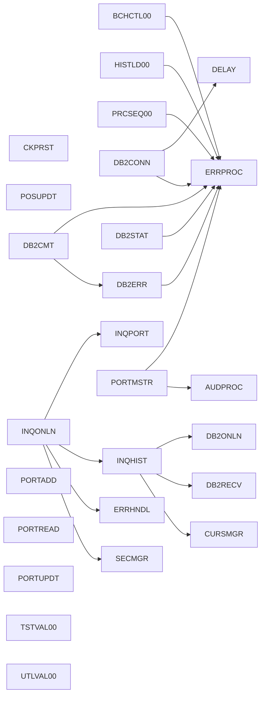

*This diagram shows the programs of the system and the calls/links between them. Each box is a program; an arrow means the source program calls or CICS-links the target. Shared helper programs (DB2, error, audit, cursor, security) appear as common call targets.*

## 3. System Inventory

Programs: **21** (5 batch, 4 online) · Copybooks: **20** · JCL jobs: **15** · Call edges: 76 (8 unresolved).

### 3.1 Copybooks (shared data definitions)

| Copybook | Used by (count) |
|---|---|
| ERRHAND | 10 — shared infrastructure |
| INQCOM | 6 — shared infrastructure |
| DBPROC | 5 — shared infrastructure |
| SQLCA | 5 — shared infrastructure |
| PORTFLIO | 4 |
| BCHCON | 3 |
| BCHCTL | 3 |
| CKPRST | 2 |
| POSREC | 2 |
| RTNCODE | 2 |
| DBTBLS | 2 |
| PRCSEQ | 1 |
| AUDITLOG | 1 |
| HISTREC | 1 |
| RETHND | 1 |
| TRNREC | 1 |
| ERRHND | 1 |

## 4. Data Model and Definitions

The data model comprises **106 entities** and **11 (estimated) relationships**, with **823 fields** across **146 records**.

**Figure 4.1 — Entity-relationship diagram (key entities)**

```mermaid
erDiagram
  BATCH_CONTROL_CONSTANTS {
    int field_count "40"
    string used_by "BCHCTL00, HISTLD00, PRCSEQ00"
  }
  BATCH_CONTROL_RECORD {
    int field_count "25"
    string used_by "BCHCTL00, HISTLD00, PRCSEQ00"
  }
  PROCESS_SEQUENCE_RECORD {
    int field_count "35"
    string used_by "PRCSEQ00"
  }
  STANDARD_SEQUENCES {
    int field_count "12"
    string used_by "PRCSEQ00"
  }
  AUDIT_RECORD {
    int field_count "15"
    string used_by "AUDPROC"
  }
  ERROR_HANDLING {
    int field_count "4"
    string used_by "-"
  }
  HISTORY_RECORD {
    int field_count "15"
    string used_by "HISTLD00"
  }
  PORT_RECORD {
    int field_count "17"
    string used_by "PORTADD, PORTADD, PORTREAD"
  }
  POSITION_RECORD {
    int field_count "14"
    string used_by "INQPORT, UTLVAL00"
  }
  RETURN_HANDLING {
    int field_count "21"
    string used_by "CKPRST"
  }
  STD_ERROR_CODES {
    int field_count "10"
    string used_by "CKPRST"
  }
  RETURN_CODE_AREA {
    int field_count "19"
    string used_by "TSTVAL00, UTLVAL00"
  }
  TRANSACTION_RECORD {
    int field_count "17"
    string used_by "UTLVAL00"
  }
  DB2_ERROR_HANDLING {
    int field_count "11"
    string used_by "HISTLD00, DB2CMT, DB2CONN"
  }
  POSHIST_RECORD {
    int field_count "18"
    string used_by "HISTLD00, DB2ERR"
  }
  DB2_REQUEST_AREA {
    int field_count "6"
    string used_by "-"
  }
  LS_AUDIT_REQUEST {
    int field_count "15"
    string used_by "AUDPROC"
  }
  LS_CONTROL_REQUEST {
    int field_count "5"
    string used_by "BCHCTL00"
  }
  CURSOR_REQUEST_AREA {
    int field_count "7"
    string used_by "CURSMGR"
  }
  LS_COMMIT_REQUEST {
    int field_count "10"
    string used_by "DB2CMT"
  }
  LS_DB2_REQUEST {
    int field_count "7"
    string used_by "DB2CONN"
  }
  LS_ERROR_REQUEST {
    int field_count "9"
    string used_by "DB2ERR"
  }
  WS_STATS_RECORD {
    int field_count "11"
    string used_by "DB2STAT"
  }
  LS_STAT_REQUEST {
    int field_count "10"
    string used_by "DB2STAT"
  }
  ERROR_HANDLING ||--o{ RETURN_HANDLING : "shared field ERROR-CODE"
  LS_AUDIT_REQUEST ||--o{ LS_CONTROL_REQUEST : "shared field LS-RETURN-CODE"
  LS_AUDIT_REQUEST ||--o{ LS_COMMIT_REQUEST : "shared field LS-RETURN-CODE"
  LS_AUDIT_REQUEST ||--o{ LS_DB2_REQUEST : "shared field LS-RETURN-CODE"
  LS_AUDIT_REQUEST ||--o{ LS_ERROR_REQUEST : "shared field LS-RETURN-CODE"
  LS_AUDIT_REQUEST ||--o{ LS_STAT_REQUEST : "shared field LS-RETURN-CODE"
  LS_ERROR_REQUEST ||--o{ LS_STAT_REQUEST : "shared field LS-PROGRAM-ID"
```

*This diagram shows the key data entities (by field count and shared usage) and their estimated relationships. Relationships are inferred from shared key-ish fields and are marked for data-architect confirmation.*

### 4.1 Key entities (top by field count)

| Entity | Source | Fields | Used by |
|---|---|---|---|
| BATCH-CONTROL-CONSTANTS | BCHCON | 40 | BCHCTL00, HISTLD00, PRCSEQ00 |
| PROCESS-SEQUENCE-RECORD | PRCSEQ | 35 | PRCSEQ00 |
| BATCH-CONTROL-RECORD | BCHCTL | 25 | BCHCTL00, HISTLD00, PRCSEQ00 |
| RETURN-HANDLING | RETHND | 21 | CKPRST |
| RETURN-CODE-AREA | RTNCODE | 19 | TSTVAL00, UTLVAL00 |
| POSHIST-RECORD | DBTBLS | 18 | HISTLD00, DB2ERR |
| PORT-RECORD | PORTFLIO | 17 | PORTADD, PORTADD, PORTREAD, PORTUPDT |
| TRANSACTION-RECORD | TRNREC | 17 | UTLVAL00 |
| AUDIT-RECORD | AUDITLOG | 15 | AUDPROC |
| HISTORY-RECORD | HISTREC | 15 | HISTLD00 |
| LS-AUDIT-REQUEST | AUDPROC | 15 | AUDPROC |
| POSITION-RECORD | POSREC | 14 | INQPORT, UTLVAL00 |
| STANDARD-SEQUENCES | PRCSEQ | 12 | PRCSEQ00 |
| DB2-ERROR-HANDLING | DBPROC | 11 | HISTLD00, DB2CMT, DB2CONN, DB2ERR |
| WS-STATS-RECORD | DB2STAT | 11 | DB2STAT |
| STD-ERROR-CODES | RETHND | 10 | CKPRST |
| ERRLOG-RECORD | DBTBLS | 10 | HISTLD00, DB2ERR |
| LS-COMMIT-REQUEST | DB2CMT | 10 | DB2CMT |
| LS-STAT-REQUEST | DB2STAT | 10 | DB2STAT |
| WS-SUMMARY-LINE | TSTVAL00 | 10 | TSTVAL00 |

## 5. Business Rules Catalogue

Rules by category: VALIDATION 97, COMPLIANCE 2, LIMIT_CHECK 2, ROUTING 9. Total **110** rules in 44 rule sets.

### Action validation rules

*Programs: CKPRST · Rules: 1*

**BR-001 — Validate Action Indicator is a recognised value**  
Category: VALIDATION · Confidence: confirmed ✓  
The Action Indicator field is constrained to a fixed set of allowed values (ACTION-CONTINUE, ACTION-ABORT, ACTION-RETRY). Used by CKPRST.  
*Source: CKPRST, line 37*

### Active validation rules

*Programs: PRCSEQ00 · Rules: 3*

**BR-002 — Validate Active Count**  
Category: VALIDATION · Confidence: medium ⚠  
Validate Active Count. Condition: “PERFORM VARYING scan”. Implemented in PRCSEQ00, paragraph 3300-CHECK-COMPLETION.  
*Source: PRCSEQ00, 3300-CHECK-COMPLETION, line 305*

**BR-003 — Validate Active Count**  
Category: VALIDATION · Confidence: medium ⚠  
Validate Active Count. Condition: “IF status ACTIVE -> count”. Implemented in PRCSEQ00, paragraph 3300-CHECK-COMPLETION.  
*Source: PRCSEQ00, 3300-CHECK-COMPLETION, line 305*

**BR-004 — Validate Active Days is a recognised value**  
Category: VALIDATION · Confidence: confirmed ✓  
The Active Days field is constrained to a fixed set of allowed values (PSR-WEEKDAY, PSR-WEEKEND, PSR-ALL-DAYS). Used by PRCSEQ00.  
*Source: PRCSEQ00, line 40*

### Aud validation rules

*Programs: AUDPROC · Rules: 3*

**BR-005 — Validate Aud Action is a recognised value**  
Category: VALIDATION · Confidence: confirmed ✓  
The Aud Action field is constrained to a fixed set of allowed values (AUD-CREATE, AUD-UPDATE, AUD-DELETE, AUD-INQUIRE, AUD-LOGIN, AUD-LOGOUT). Used by AUDPROC.  
*Source: AUDPROC, line 18*

**BR-006 — Validate Aud Status is a recognised value**  
Category: VALIDATION · Confidence: confirmed ✓  
The Aud Status field is constrained to a fixed set of allowed values (AUD-SUCCESS, AUD-FAILURE, AUD-WARNING). Used by AUDPROC.  
*Source: AUDPROC, line 27*

**BR-007 — Validate Aud Type is a recognised value**  
Category: VALIDATION · Confidence: confirmed ✓  
The Aud Type field is constrained to a fixed set of allowed values (AUD-TRANSACTION, AUD-USER-ACTION, AUD-SYSTEM-EVENT). Used by AUDPROC.  
*Source: AUDPROC, line 14*

### Command validation rules

*Programs: PORTMSTR · Rules: 1*

**BR-008 — Validate Command is a recognised value**  
Category: VALIDATION · Confidence: confirmed ✓  
The Command field is constrained to a fixed set of allowed values (CREATE-PORT, READ-PORT, UPDATE-PORT, DELETE-PORT). Used by PORTMSTR.  
*Source: PORTMSTR, line 74*

### Commarea validation rules

*Programs: INQONLN · Rules: 1*

**BR-009 — Validate Commarea**  
Category: VALIDATION · Confidence: medium ⚠  
Validate Commarea. Condition: “EVALUATE WS-COMMAREA-FUNCTION (MENU/INQP/INQH/EXIT/OTHER)”. Implemented in INQONLN, paragraph P100-PROCESS-REQUEST.  
*Source: INQONLN, P100-PROCESS-REQUEST, line 53*

### Compliance and audit rules

*Programs: INQONLN · Rules: 2*

**BR-010 — Authorize access only after successful user validation**  
Category: COMPLIANCE · Confidence: medium ⚠  
Access control runs in stages: the request proceeds to authorization only after the user-validation step succeeds (via SECMGR). If validation fails, authorization is not attempted.  
*Source: INQONLN, P050-SECURITY-CHECK, line 139*

**BR-011 — Log access only after successful authorization**  
Category: COMPLIANCE · Confidence: medium ⚠  
Once a request is authorized, the access is written to the security log (via SECMGR). Logging is skipped when authorization fails, so only granted accesses are audited.  
*Source: INQONLN, P050-SECURITY-CHECK, line 139*

### Connection validation rules

*Programs: DB2CONN · Rules: 4*

**BR-012 — Validate Connection State**  
Category: VALIDATION · Confidence: medium ⚠  
Validate Connection State. Condition: “WHILE NOT connected AND retries<3 (retry loop)”. Implemented in DB2CONN, paragraph 1000-CONNECT.  
*Source: DB2CONN, 1000-CONNECT, line 63*

**BR-013 — Validate Connection State**  
Category: VALIDATION · Confidence: medium ⚠  
Validate Connection State. Condition: “IF retries left AND not connected -> DELAY”. Implemented in DB2CONN, paragraph 1000-CONNECT.  
*Source: DB2CONN, 1000-CONNECT, line 63*

**BR-014 — Validate Connection State**  
Category: VALIDATION · Confidence: medium ⚠  
Validate Connection State. Condition: “IF connected -> commit + reset”. Implemented in DB2CONN, paragraph 2000-DISCONNECT.  
*Source: DB2CONN, 2000-DISCONNECT, line 109*

**BR-015 — Validate Connection State is a recognised value**  
Category: VALIDATION · Confidence: confirmed ✓  
The Connection State field is constrained to a fixed set of allowed values (WS-CONNECTED, WS-DISCONNECTED). Used by DB2CONN.  
*Source: DB2CONN, line 26*

### Cursor validation rules

*Programs: CURSMGR, INQHIST · Rules: 5*

**BR-016 — Validate Cursor Array Fetch is a recognised value**  
Category: VALIDATION · Confidence: confirmed ✓  
The Cursor Array Fetch field is constrained to a fixed set of allowed values (USE-ARRAY-FETCH, NO-ARRAY-FETCH). Used by CURSMGR.  
*Source: CURSMGR, line 36*

**BR-017 — Validate Cursor Request Type is a recognised value**  
Category: VALIDATION · Confidence: confirmed ✓  
The Cursor Request Type field is constrained to a fixed set of allowed values (CURS-DECLARE, CURS-OPEN, CURS-FETCH, CURS-CLOSE). Used by CURSMGR.  
*Source: CURSMGR, line 29*

**BR-018 — Validate Cursor Response Code**  
Category: VALIDATION · Confidence: medium ⚠  
Validate Cursor Response Code. Condition: “IF USE-ARRAY-FETCH -> size 20 else 1”. Implemented in CURSMGR, paragraph P100-DECLARE-CURSOR.  
*Source: CURSMGR, P100-DECLARE-CURSOR, line 61*

**BR-019 — Validate Cursor Stmt**  
Category: VALIDATION · Confidence: medium ⚠  
Validate Cursor Stmt. Condition: “IF declare ok -> open”. Implemented in INQHIST, paragraph P200-GET-HISTORY.  
*Source: INQHIST, P200-GET-HISTORY, line 129*

**BR-020 — Validate Cursor Stmt**  
Category: VALIDATION · Confidence: medium ⚠  
Validate Cursor Stmt. Condition: “IF open ok -> fetch”. Implemented in INQHIST, paragraph P200-GET-HISTORY.  
*Source: INQHIST, P200-GET-HISTORY, line 129*

### DB2 validation rules

*Programs: ? · Rules: 1*

**BR-021 — Validate DB2 Request Type is a recognised value**  
Category: VALIDATION · Confidence: confirmed ✓  
The DB2 Request Type field is constrained to a fixed set of allowed values (DB2-CONNECT, DB2-DISCONNECT, DB2-STATUS). Used by .  
*Source: ?, line 5*

### Dep validation rules

*Programs: PRCSEQ00 · Rules: 2*

**BR-022 — Validate Dep Id**  
Category: VALIDATION · Confidence: medium ⚠  
Validate Dep Id. Condition: “IF NOT BCT-STATUS-DONE + IF hard dep -> warning”. Implemented in PRCSEQ00, paragraph 2210-CHECK-DEP-STATUS.  
*Source: PRCSEQ00, 2210-CHECK-DEP-STATUS, line 239*

**BR-023 — Validate Dep Type is a recognised value**  
Category: VALIDATION · Confidence: confirmed ✓  
The Dep Type field is constrained to a fixed set of allowed values (PSR-DEP-HARD, PSR-DEP-SOFT). Used by PRCSEQ00.  
*Source: PRCSEQ00, line 28*

### El validation rules

*Programs: HISTLD00 · Rules: 2*

**BR-024 — Validate El Error Severity is a recognised value**  
Category: VALIDATION · Confidence: confirmed ✓  
The El Error Severity field is constrained to a fixed set of allowed values (EL-SEV-INFO, EL-SEV-WARN, EL-SEV-ERROR, EL-SEV-SEVERE). Used by HISTLD00, DB2ERR.  
*Source: HISTLD00, line 40*

**BR-025 — Validate El Error Type is a recognised value**  
Category: VALIDATION · Confidence: confirmed ✓  
The El Error Type field is constrained to a fixed set of allowed values (EL-TYPE-SYSTEM, EL-TYPE-APP, EL-TYPE-DATA). Used by HISTLD00, DB2ERR.  
*Source: HISTLD00, line 36*

### End validation rules

*Programs: HISTLD00, INQONLN, PORTADD, PORTMSTR, PORTREAD, PORTUPDT · Rules: 10*

**BR-026 — Validate End Of File Indicator**  
Category: VALIDATION · Confidence: medium ⚠  
Validate End Of File Indicator. Condition: “WHILE NOT END-OF-FILE (main read loop)”. Implemented in PORTADD, paragraph 0000-MAIN.  
*Source: PORTADD, 0000-MAIN, line 76*

**BR-027 — Validate End Of File Indicator**  
Category: VALIDATION · Confidence: medium ⚠  
Validate End Of File Indicator. Condition: “WHILE NOT END-OF-FILE (main update loop)”. Implemented in PORTUPDT, paragraph 0000-MAIN.  
*Source: PORTUPDT, 0000-MAIN, line 83*

**BR-028 — Validate End Of File Indicator**  
Category: VALIDATION · Confidence: medium ⚠  
Validate End Of File Indicator. Condition: “IF MORE-RECORDS -> load + commit-check”. Implemented in HISTLD00, paragraph 2000-PROCESS.  
*Source: HISTLD00, 2000-PROCESS, line 86*

**BR-029 — Validate End Of File Indicator is a recognised value**  
Category: VALIDATION · Confidence: confirmed ✓  
The End Of File Indicator field is constrained to a fixed set of allowed values (END-OF-FILE, MORE-RECORDS). Used by HISTLD00.  
*Source: HISTLD00, line 62*

**BR-030 — Validate End Of Session (88 session Terminated)**  
Category: VALIDATION · Confidence: low ⚠ — SME review required  
Validate End Of Session (88 session Terminated). Condition: “WHILE NOT SESSION-TERMINATED (main session loop)”. Implemented in INQONLN, paragraph MAINLINE.  
*Source: INQONLN, MAINLINE, line 39*

**BR-031 — Validate End Of Session is a recognised value**  
Category: VALIDATION · Confidence: confirmed ✓  
The End Of Session field is constrained to a fixed set of allowed values (SESSION-ACTIVE, SESSION-TERMINATED). Used by INQONLN.  
*Source: INQONLN, line 19*

**BR-032 — Validate End Of Tests**  
Category: VALIDATION · Confidence: low ⚠ — SME review required  
Validate End Of Tests. Condition: “PERFORM UNTIL END-OF-TESTS”. Implemented in TSTVAL00, paragraph 2000-PROCESS.  
*Source: TSTVAL00, 2000-PROCESS, line 176*

**BR-033 — Validate End Of Tests is a recognised value**  
Category: VALIDATION · Confidence: confirmed ✓  
The End Of Tests field is constrained to a fixed set of allowed values (END-OF-TESTS). Used by TSTVAL00.  
*Source: TSTVAL00, line 83*

**BR-034 — Validate End Of Val**  
Category: VALIDATION · Confidence: low ⚠ — SME review required  
Validate End Of Val. Condition: “PERFORM UNTIL END-OF-VALIDATION”. Implemented in UTLVAL00, paragraph 2000-PROCESS.  
*Source: UTLVAL00, 2000-PROCESS, line 138*

**BR-035 — Validate End Of Val is a recognised value**  
Category: VALIDATION · Confidence: confirmed ✓  
The End Of Val field is constrained to a fixed set of allowed values (END-OF-VALIDATION). Used by UTLVAL00.  
*Source: UTLVAL00, line 76*

### Error validation rules

*Programs: CKPRST, INQONLN, PRCSEQ00, UTLVAL00 · Rules: 6*

**BR-036 — Validate Error Action is a recognised value**  
Category: VALIDATION · Confidence: confirmed ✓  
The Error Action field is constrained to a fixed set of allowed values (ERR-RETURN, ERR-CONTINUE, ERR-ABEND). Used by INQONLN.  
*Source: INQONLN, line 15*

**BR-037 — Validate Error Count**  
Category: VALIDATION · Confidence: medium ⚠  
Validate Error Count. Condition: “ELSE IF any still active -> warning”. Implemented in PRCSEQ00, paragraph 4100-CHECK-FINAL-STATUS.  
*Source: PRCSEQ00, 4100-CHECK-FINAL-STATUS, line 322*

**BR-038 — Validate Error Count**  
Category: VALIDATION · Confidence: medium ⚠  
Validate Error Count. Condition: “ELSE -> success”. Implemented in PRCSEQ00, paragraph 4100-CHECK-FINAL-STATUS.  
*Source: PRCSEQ00, 4100-CHECK-FINAL-STATUS, line 322*

**BR-039 — Validate Error Found is a recognised value**  
Category: VALIDATION · Confidence: confirmed ✓  
The Error Found field is constrained to a fixed set of allowed values (ERROR-FOUND). Used by UTLVAL00.  
*Source: UTLVAL00, line 78*

**BR-040 — Validate Error Severity is a recognised value**  
Category: VALIDATION · Confidence: confirmed ✓  
The Error Severity field is constrained to a fixed set of allowed values (ERR-FATAL, ERR-WARNING, ERR-INFO). Used by INQONLN.  
*Source: INQONLN, line 10*

**BR-041 — Validate Error Type is a recognised value**  
Category: VALIDATION · Confidence: confirmed ✓  
The Error Type field is constrained to a fixed set of allowed values (ERR-VALIDATION, ERR-PROCESSING, ERR-DATABASE, ERR-FILE, ERR-SECURITY). Used by CKPRST.  
*Source: CKPRST, line 24*

### File validation rules

*Programs: PORTADD, PORTMSTR, PORTREAD, PORTUPDT · Rules: 2*

**BR-042 — Validate File Status**  
Category: VALIDATION · Confidence: medium ⚠  
Validate File Status. Condition: “EVALUATE WS-FILE-STATUS: dupkey / notfnd / other”. Implemented in PORTMSTR, paragraph 2100-HANDLE-VSAM-ERROR.  
*Source: PORTMSTR, 2100-HANDLE-VSAM-ERROR, line 243*

**BR-043 — Validate File Status is a recognised value**  
Category: VALIDATION · Confidence: confirmed ✓  
The File Status field is constrained to a fixed set of allowed values (WS-SUCCESS-STATUS, WS-DUP-STATUS, WS-EOF-STATUS). Used by PORTADD.  
*Source: PORTADD, line 52*

### Force validation rules

*Programs: DB2CMT · Rules: 1*

**BR-044 — Validate Force Indicator is a recognised value**  
Category: VALIDATION · Confidence: confirmed ✓  
The Force Indicator field is constrained to a fixed set of allowed values (LS-FORCE-COMMIT). Used by DB2CMT.  
*Source: DB2CMT, line 45*

### Freq validation rules

*Programs: PRCSEQ00 · Rules: 1*

**BR-045 — Validate Freq is a recognised value**  
Category: VALIDATION · Confidence: confirmed ✓  
The Freq field is constrained to a fixed set of allowed values (PSR-DAILY, PSR-WEEKLY, PSR-MONTHLY). Used by PRCSEQ00.  
*Source: PRCSEQ00, line 18*

### Function validation rules

*Programs: BCHCTL00, DB2CMT, DB2CONN, DB2ERR, DB2STAT, PRCSEQ00 · Rules: 3*

**BR-046 — Validate Function is a recognised value**  
Category: VALIDATION · Confidence: confirmed ✓  
The Function field is constrained to a fixed set of allowed values (FUNC-INIT, FUNC-CHEK, FUNC-UPDT, FUNC-TERM). Used by BCHCTL00.  
*Source: BCHCTL00, line 49*

**BR-047 — Validate Function is a recognised value**  
Category: VALIDATION · Confidence: confirmed ✓  
The Function field is constrained to a fixed set of allowed values (FUNC-CONN, FUNC-DISC, FUNC-STAT). Used by DB2CONN.  
*Source: DB2CONN, line 35*

**BR-048 — Validate Function is a recognised value**  
Category: VALIDATION · Confidence: confirmed ✓  
The Function field is constrained to a fixed set of allowed values (FUNC-LOG, FUNC-DIAG, FUNC-RETR). Used by DB2ERR.  
*Source: DB2ERR, line 40*

### Hist validation rules

*Programs: HISTLD00 · Rules: 2*

**BR-049 — Validate Hist Action Code is a recognised value**  
Category: VALIDATION · Confidence: confirmed ✓  
The Hist Action Code field is constrained to a fixed set of allowed values (HIST-ACTION-ADD, HIST-ACTION-CHG, HIST-ACTION-DEL). Used by HISTLD00.  
*Source: HISTLD00, line 17*

**BR-050 — Validate Hist Record Type is a recognised value**  
Category: VALIDATION · Confidence: confirmed ✓  
The Hist Record Type field is constrained to a fixed set of allowed values (HIST-TYPE-PORT, HIST-TYPE-POS, HIST-TYPE-TRN). Used by HISTLD00.  
*Source: HISTLD00, line 13*

### Holiday validation rules

*Programs: PRCSEQ00 · Rules: 1*

**BR-051 — Validate Holiday Run is a recognised value**  
Category: VALIDATION · Confidence: confirmed ✓  
The Holiday Run field is constrained to a fixed set of allowed values (PSR-SKIP-HOL, PSR-RUN-HOL). Used by PRCSEQ00.  
*Source: PRCSEQ00, line 46*

### Input validation rules

*Programs: PORTADD · Rules: 1*

**BR-052 — Validate Input Status is a recognised value**  
Category: VALIDATION · Confidence: confirmed ✓  
The Input Status field is constrained to a fixed set of allowed values (WS-INPUT-SUCCESS, WS-INPUT-EOF). Used by PORTADD.  
*Source: PORTADD, line 57*

### Inqcom validation rules

*Programs: INQHIST · Rules: 1*

**BR-053 — Validate Inqcom Function is a recognised value**  
Category: VALIDATION · Confidence: confirmed ✓  
The Inqcom Function field is constrained to a fixed set of allowed values (INQCOM-MENU, INQCOM-PORTFOLIO, INQCOM-HISTORY, INQCOM-EXIT). Used by INQHIST, INQHIST, INQONLN, INQONLN.  
*Source: INQHIST, line 5*

### Limit and threshold rules

*Programs: DB2CMT, HISTLD00 · Rules: 2*

**BR-054 — Commit to DB2 every 1,000 rows and update the restart checkpoint**  
Category: LIMIT_CHECK · Confidence: high ✓  
During the history load, the DB2 unit of work is committed whenever the running row counter reaches the commit threshold (1,000 rows), after which the restart checkpoint is updated. This bounds how much any rollback can undo and makes the load restartable.  
*Source: HISTLD00, 2300-CHECK-COMMIT, line 177*

**BR-055 — Commit when the records-processed count reaches the commit frequency (or is forced)**  
Category: LIMIT_CHECK · Confidence: high ✓  
The commit controller issues a DB2 COMMIT when the caller's processed-record count reaches the configured commit frequency, or when a force-commit flag is set — letting each caller control its own commit cadence.  
*Source: DB2CMT, 2000-COMMIT, line 80*

### Month validation rules

*Programs: PRCSEQ00 · Rules: 1*

**BR-056 — Validate Month End is a recognised value**  
Category: VALIDATION · Confidence: confirmed ✓  
The Month End field is constrained to a fixed set of allowed values (PSR-LAST-DAY). Used by PRCSEQ00.  
*Source: PRCSEQ00, line 44*

### More validation rules

*Programs: INQHIST · Rules: 1*

**BR-057 — Validate More History is a recognised value**  
Category: VALIDATION · Confidence: confirmed ✓  
The More History field is constrained to a fixed set of allowed values (MORE-ROWS, NO-MORE-ROWS). Used by INQHIST.  
*Source: INQHIST, line 30*

### Next validation rules

*Programs: PRCSEQ00 · Rules: 2*

**BR-058 — Validate Next Process**  
Category: VALIDATION · Confidence: medium ⚠  
Validate Next Process. Condition: “PERFORM VARYING over dependencies”. Implemented in PRCSEQ00, paragraph 2200-CHECK-DEPENDENCIES.  
*Source: PRCSEQ00, 2200-CHECK-DEPENDENCIES, line 221*

**BR-059 — Validate Next Process**  
Category: VALIDATION · Confidence: medium ⚠  
Validate Next Process. Condition: “IF a dependency fails -> stop”. Implemented in PRCSEQ00, paragraph 2200-CHECK-DEPENDENCIES.  
*Source: PRCSEQ00, 2200-CHECK-DEPENDENCIES, line 221*

### Phase validation rules

*Programs: CKPRST · Rules: 1*

**BR-060 — Validate Phase is a recognised value**  
Category: VALIDATION · Confidence: confirmed ✓  
The Phase field is constrained to a fixed set of allowed values (CK-PHASE-INIT, CK-PHASE-READ, CK-PHASE-PROC, CK-PHASE-UPDT, CK-PHASE-TERM). Used by CKPRST, CKPRST.  
*Source: CKPRST, line 27*

### Portfolio validation rules

*Programs: PORTADD, PORTMSTR · Rules: 8*

**BR-061 — Validate Portfolio**  
Category: VALIDATION · Confidence: medium ⚠  
Validate Portfolio. Condition: “EVALUATE read status: success / not-found / other”. Implemented in PORTMSTR, paragraph 3000-READ-PORTFOLIO.  
*Source: PORTMSTR, 3000-READ-PORTFOLIO, line 163*

**BR-062 — Validate Portfolio Client Type is a recognised value**  
Category: VALIDATION · Confidence: confirmed ✓  
The Portfolio Client Type field is constrained to a fixed set of allowed values (PORT-INDIVIDUAL, PORT-CORPORATE, PORT-TRUST). Used by PORTADD, PORTADD, PORTREAD, PORTUPDT.  
*Source: PORTADD, line 17*

**BR-063 — Validate Portfolio Id**  
Category: VALIDATION · Confidence: medium ⚠  
Validate Portfolio Id. Condition: “EVALUATE write status: success / duplicate / other”. Implemented in PORTADD, paragraph 2100-VALIDATE-AND-ADD.  
*Source: PORTADD, 2100-VALIDATE-AND-ADD, line 113*

**BR-064 — Validate Portfolio Id**  
Category: VALIDATION · Confidence: medium ⚠  
Validate Portfolio Id. Condition: “IF ID format invalid -> fail”. Implemented in PORTMSTR, paragraph 2100-VALIDATE-PORTFOLIO.  
*Source: PORTMSTR, 2100-VALIDATE-PORTFOLIO, line 138*

**BR-065 — Validate Portfolio Id**  
Category: VALIDATION · Confidence: medium ⚠  
Validate Portfolio Id. Condition: “IF name blank -> fail”. Implemented in PORTMSTR, paragraph 2100-VALIDATE-PORTFOLIO.  
*Source: PORTMSTR, 2100-VALIDATE-PORTFOLIO, line 138*

**BR-066 — Validate Portfolio Id**  
Category: VALIDATION · Confidence: medium ⚠  
Validate Portfolio Id. Condition: “IF status not A/I/C -> fail”. Implemented in PORTMSTR, paragraph 2100-VALIDATE-PORTFOLIO.  
*Source: PORTMSTR, 2100-VALIDATE-PORTFOLIO, line 138*

**BR-067 — Validate Portfolio Status is a recognised value**  
Category: VALIDATION · Confidence: confirmed ✓  
The Portfolio Status field is constrained to a fixed set of allowed values (PORT-ACTIVE, PORT-CLOSED, PORT-SUSPENDED). Used by PORTADD, PORTADD, PORTREAD, PORTUPDT.  
*Source: PORTADD, line 24*

**BR-068 — Validate Portfolio Status is a recognised value**  
Category: VALIDATION · Confidence: confirmed ✓  
The Portfolio Status field is constrained to a fixed set of allowed values (PORT-SUCCESS, PORT-EOF, PORT-NOT-FOUND, PORT-DUP-KEY). Used by PORTMSTR.  
*Source: PORTMSTR, line 52*

### Position validation rules

*Programs: INQPORT · Rules: 3*

**BR-069 — Validate Position Found (88 position Exists)**  
Category: VALIDATION · Confidence: low ⚠ — SME review required  
Validate Position Found (88 position Exists). Condition: “IF POSITION-EXISTS  -> P300-FORMAT-DISPLAY else P900-NOT-FOUND”. Implemented in INQPORT, paragraph MAINLINE.  
*Source: INQPORT, MAINLINE, line 40*

**BR-070 — Validate Position Found is a recognised value**  
Category: VALIDATION · Confidence: confirmed ✓  
The Position Found field is constrained to a fixed set of allowed values (POSITION-EXISTS, NO-POSITION). Used by INQPORT.  
*Source: INQPORT, line 25*

**BR-071 — Validate Position Status is a recognised value**  
Category: VALIDATION · Confidence: confirmed ✓  
The Position Status field is constrained to a fixed set of allowed values (POS-STATUS-ACTIVE, POS-STATUS-CLOSED, POS-STATUS-PEND). Used by INQPORT, UTLVAL00.  
*Source: INQPORT, line 16*

### Prereq validation rules

*Programs: BCHCTL00 · Rules: 2*

**BR-072 — Validate Prereq Met**  
Category: VALIDATION · Confidence: medium ⚠  
Validate Prereq Met. Condition: “IF PREREQS-SATISFIED -> success else warning”. Implemented in BCHCTL00, paragraph 2000-CHECK-PREREQUISITES.  
*Source: BCHCTL00, 2000-CHECK-PREREQUISITES, line 90*

**BR-073 — Validate Prereq Met is a recognised value**  
Category: VALIDATION · Confidence: confirmed ✓  
The Prereq Met field is constrained to a fixed set of allowed values (PREREQS-SATISFIED, PREREQS-PENDING). Used by BCHCTL00.  
*Source: BCHCTL00, line 38*

### Process validation rules

*Programs: BCHCTL00, PRCSEQ00 · Rules: 5*

**BR-074 — Validate Process Id**  
Category: VALIDATION · Confidence: medium ⚠  
Validate Process Id. Condition: “PERFORM VARYING scan”. Implemented in PRCSEQ00, paragraph 3200-UPDATE-SEQUENCE-TABLE.  
*Source: PRCSEQ00, 3200-UPDATE-SEQUENCE-TABLE, line 292*

**BR-075 — Validate Process Id**  
Category: VALIDATION · Confidence: medium ⚠  
Validate Process Id. Condition: “IF row matches -> update + exit”. Implemented in PRCSEQ00, paragraph 3200-UPDATE-SEQUENCE-TABLE.  
*Source: PRCSEQ00, 3200-UPDATE-SEQUENCE-TABLE, line 292*

**BR-076 — Validate Process Mode is a recognised value**  
Category: VALIDATION · Confidence: confirmed ✓  
The Process Mode field is constrained to a fixed set of allowed values (MODE-INITIALIZE, MODE-CHECK-PREREQ, MODE-UPDATE-STATUS, MODE-FINALIZE). Used by BCHCTL00.  
*Source: BCHCTL00, line 41*

**BR-077 — Validate Process Table**  
Category: VALIDATION · Confidence: medium ⚠  
Validate Process Table. Condition: “PERFORM UNTIL status='10' (scan loop)”. Implemented in PRCSEQ00, paragraph 1200-BUILD-SEQUENCE.  
*Source: PRCSEQ00, 1200-BUILD-SEQUENCE, line 155*

**BR-078 — Validate Process Table**  
Category: VALIDATION · Confidence: medium ⚠  
Validate Process Table. Condition: “IF PSR-TYPE matches -> add”. Implemented in PRCSEQ00, paragraph 1200-BUILD-SEQUENCE.  
*Source: PRCSEQ00, 1200-BUILD-SEQUENCE, line 155*

### Recv validation rules

*Programs: INQHIST · Rules: 1*

**BR-079 — Validate Recv Status is a recognised value**  
Category: VALIDATION · Confidence: confirmed ✓  
The Recv Status field is constrained to a fixed set of allowed values (RECV-SUCCESS, RECV-FAILED, RECV-RETRY). Used by INQHIST.  
*Source: INQHIST, line 60*

### Response validation rules

*Programs: TSTVAL00 · Rules: 2*

**BR-080 — Validate Response Request Type is a recognised value**  
Category: VALIDATION · Confidence: confirmed ✓  
The Response Request Type field is constrained to a fixed set of allowed values (RC-INITIALIZE, RC-SET-CODE, RC-GET-CODE, RC-LOG-CODE, RC-ANALYZE). Used by TSTVAL00, UTLVAL00.  
*Source: TSTVAL00, line 5*

**BR-081 — Validate Response Status is a recognised value**  
Category: VALIDATION · Confidence: confirmed ✓  
The Response Status field is constrained to a fixed set of allowed values (RC-STATUS-SUCCESS, RC-STATUS-WARNING, RC-STATUS-ERROR, RC-STATUS-SEVERE). Used by TSTVAL00, UTLVAL00.  
*Source: TSTVAL00, line 16*

### Restart validation rules

*Programs: CKPRST, PRCSEQ00 · Rules: 2*

**BR-082 — Validate Restart Mode is a recognised value**  
Category: VALIDATION · Confidence: confirmed ✓  
The Restart Mode field is constrained to a fixed set of allowed values (CK-MODE-NORMAL, CK-MODE-RESTART, CK-MODE-RECOVER). Used by CKPRST, CKPRST.  
*Source: CKPRST, line 44*

**BR-083 — Validate Restart is a recognised value**  
Category: VALIDATION · Confidence: confirmed ✓  
The Restart field is constrained to a fixed set of allowed values (PSR-RESTARTABLE, PSR-NO-RESTART). Used by PRCSEQ00.  
*Source: PRCSEQ00, line 36*

### Retry validation rules

*Programs: DB2ERR · Rules: 1*

**BR-084 — Validate Retry Indicator is a recognised value**  
Category: VALIDATION · Confidence: confirmed ✓  
The Retry Indicator field is constrained to a fixed set of allowed values (LS-SHOULD-RETRY, LS-NO-RETRY). Used by DB2ERR.  
*Source: DB2ERR, line 51*

### Return validation rules

*Programs: CKPRST, PRCSEQ00 · Rules: 2*

**BR-085 — Validate Return Code**  
Category: VALIDATION · Confidence: medium ⚠  
Validate Return Code. Condition: “IF dependencies satisfied (rc=0) -> mark active”. Implemented in PRCSEQ00, paragraph 2000-GET-NEXT-PROCESS.  
*Source: PRCSEQ00, 2000-GET-NEXT-PROCESS, line 100*

**BR-086 — Validate Return Code is a recognised value**  
Category: VALIDATION · Confidence: confirmed ✓  
The Return Code field is constrained to a fixed set of allowed values (RC-SUCCESS, RC-WARNING, RC-ERROR, RC-SEVERE, RC-CRITICAL). Used by CKPRST.  
*Source: CKPRST, line 8*

### Sequence validation rules

*Programs: PRCSEQ00 · Rules: 4*

**BR-087 — Validate Sequence Ix**  
Category: VALIDATION · Confidence: medium ⚠  
Validate Sequence Ix. Condition: “PERFORM VARYING over process table”. Implemented in PRCSEQ00, paragraph 1300-CREATE-CONTROL-RECORDS.  
*Source: PRCSEQ00, 1300-CREATE-CONTROL-RECORDS, line 188*

**BR-088 — Validate Sequence Ix**  
Category: VALIDATION · Confidence: medium ⚠  
Validate Sequence Ix. Condition: “PERFORM VARYING scan”. Implemented in PRCSEQ00, paragraph 2100-FIND-NEXT-READY.  
*Source: PRCSEQ00, 2100-FIND-NEXT-READY, line 206*

**BR-089 — Validate Sequence Ix**  
Category: VALIDATION · Confidence: medium ⚠  
Validate Sequence Ix. Condition: “IF row READY -> pick + exit”. Implemented in PRCSEQ00, paragraph 2100-FIND-NEXT-READY.  
*Source: PRCSEQ00, 2100-FIND-NEXT-READY, line 206*

**BR-090 — Validate Sequence Ix**  
Category: VALIDATION · Confidence: medium ⚠  
Validate Sequence Ix. Condition: “IF none found -> blank”. Implemented in PRCSEQ00, paragraph 2100-FIND-NEXT-READY.  
*Source: PRCSEQ00, 2100-FIND-NEXT-READY, line 206*

### Status validation rules

*Programs: BCHCTL00, CKPRST · Rules: 2*

**BR-091 — Validate Status is a recognised value**  
Category: VALIDATION · Confidence: confirmed ✓  
The Status field is constrained to a fixed set of allowed values (BCT-STATUS-READY, BCT-STATUS-ACTIVE, BCT-STATUS-WAITING, BCT-STATUS-DONE, BCT-STATUS-ERROR). Used by BCHCTL00, HISTLD00, PRCSEQ00.  
*Source: BCHCTL00, line 15*

**BR-092 — Validate Status is a recognised value**  
Category: VALIDATION · Confidence: confirmed ✓  
The Status field is constrained to a fixed set of allowed values (CK-INITIAL, CK-ACTIVE, CK-COMPLETE, CK-FAILED, CK-RESTARTED). Used by CKPRST, CKPRST.  
*Source: CKPRST, line 11*

### Test validation rules

*Programs: TSTVAL00 · Rules: 1*

**BR-093 — Validate Test Passed is a recognised value**  
Category: VALIDATION · Confidence: confirmed ✓  
The Test Passed field is constrained to a fixed set of allowed values (TEST-PASSED). Used by TSTVAL00.  
*Source: TSTVAL00, line 85*

### Transaction routing rules

*Programs: BCHCTL00, CKPRST, CURSMGR, DB2CMT, DB2CONN, DB2ERR · Rules: 9*

**BR-094 — Dispatch checkpoint/restart operation by entry-point code**  
Category: ROUTING · Confidence: high ✓  
The checkpoint service selects its operation from the caller's entry-point code — INIT (initialise), TAKE (take a checkpoint), COMMIT, or RESTART — routing each to its handler.  
*Source: CKPRST, MAINLINE, line 26*

**BR-095 — Dispatch portfolio maintenance by CRUD command**  
Category: ROUTING · Confidence: high ✓  
The portfolio master service routes each call by its single-letter command: C creates, R reads, U updates and D deletes a portfolio record; any other command is rejected as invalid.  
*Source: PORTMSTR, 0000-MAIN, line 83*

**BR-096 — Dispatch cursor operation by request type**  
Category: ROUTING · Confidence: high ✓  
The cursor manager selects a DB2 cursor lifecycle operation from the request type — Declare, Open, Fetch or Close — so callers drive a cursor through one shared service.  
*Source: CURSMGR, MAINLINE, line 43*

**BR-097 — Dispatch batch-control function by function code**  
Category: ROUTING · Confidence: high ✓  
The batch control processor routes by a four-character function code: INIT initialises a job, CHEK checks prerequisites, UPDT updates status, TERM finalises; any other code is treated as an error.  
*Source: BCHCTL00, 0000-MAIN, line 60*

**BR-098 — Dispatch process-sequence function by function code**  
Category: ROUTING · Confidence: high ✓  
The process sequence manager routes by function code: INIT builds the run sequence, NEXT selects the next ready process (checking its dependencies), STAT refreshes status, TERM computes the final status; any other code is rejected.  
*Source: PRCSEQ00, 0000-MAIN, line 75*

**BR-099 — Dispatch DB2 connection function by function code**  
Category: ROUTING · Confidence: high ✓  
The DB2 connection manager routes by function code — CONN connects (with bounded retry), DISC commits and disconnects, STAT checks the live connection; any other code is an error.  
*Source: DB2CONN, 0000-MAIN, line 47*

**BR-100 — Dispatch DB2 commit-controller function by function code**  
Category: ROUTING · Confidence: high ✓  
The commit controller routes by function code: INIT resets counters, CMIT commits (by frequency or force), RBAK rolls back, SAVE creates a savepoint, REST restores to one, STAT reports counts; any other code is an error.  
*Source: DB2CMT, 0000-MAIN, line 53*

**BR-101 — Dispatch DB2 error-handler function by function code**  
Category: ROUTING · Confidence: high ✓  
The SQL error handler routes by function code — LOG records the error to the ERRLOG table, DIAG classifies a SQLCODE into a message and severity, RETR fetches the latest logged error; any other code is an error.  
*Source: DB2ERR, 0000-MAIN, line 56*

**BR-102 — Dispatch DB2 statistics function by function code**  
Category: ROUTING · Confidence: high ✓  
The statistics collector routes by function code: INIT creates the session stats row, UPDT stores current counters, TERM finalises with elapsed/CPU time, DISP displays them; any other code is an error.  
*Source: DB2STAT, 0000-MAIN, line 58*

### Trn validation rules

*Programs: UTLVAL00 · Rules: 2*

**BR-103 — Validate Trn Status is a recognised value**  
Category: VALIDATION · Confidence: confirmed ✓  
The Trn Status field is constrained to a fixed set of allowed values (TRN-STATUS-PEND, TRN-STATUS-DONE, TRN-STATUS-FAIL, TRN-STATUS-REV). Used by UTLVAL00.  
*Source: UTLVAL00, line 23*

**BR-104 — Validate Trn Type is a recognised value**  
Category: VALIDATION · Confidence: confirmed ✓  
The Trn Type field is constrained to a fixed set of allowed values (TRN-TYPE-BUY, TRN-TYPE-SELL, TRN-TYPE-TRANS, TRN-TYPE-FEE). Used by UTLVAL00.  
*Source: UTLVAL00, line 14*

### Type validation rules

*Programs: PRCSEQ00 · Rules: 1*

**BR-105 — Validate Type is a recognised value**  
Category: VALIDATION · Confidence: confirmed ✓  
The Type field is constrained to a fixed set of allowed values (PSR-TYPE-INIT, PSR-TYPE-PROC, PSR-TYPE-RPT, PSR-TYPE-TERM). Used by PRCSEQ00.  
*Source: PRCSEQ00, line 12*

### Updt validation rules

*Programs: PORTUPDT · Rules: 3*

**BR-106 — Validate Updt Action**  
Category: VALIDATION · Confidence: medium ⚠  
Validate Updt Action. Condition: “EVALUATE UPDT-ACTION: status / name / value”. Implemented in PORTUPDT, paragraph 2200-APPLY-UPDATE.  
*Source: PORTUPDT, 2200-APPLY-UPDATE, line 131*

**BR-107 — Validate Updt Key**  
Category: VALIDATION · Confidence: medium ⚠  
Validate Updt Key. Condition: “IF portfolio read success -> apply update else count not-found”. Implemented in PORTUPDT, paragraph 2100-PROCESS-UPDATE.  
*Source: PORTUPDT, 2100-PROCESS-UPDATE, line 118*

**BR-108 — Validate Updt Status is a recognised value**  
Category: VALIDATION · Confidence: confirmed ✓  
The Updt Status field is constrained to a fixed set of allowed values (WS-UPDT-SUCCESS, WS-UPDT-EOF). Used by PORTUPDT.  
*Source: PORTUPDT, line 65*

### Val validation rules

*Programs: UTLVAL00 · Rules: 1*

**BR-109 — Validate Val Type**  
Category: VALIDATION · Confidence: medium ⚠  
Validate Val Type. Condition: “EVALUATE VAL-TYPE: INTEGRITY/XREF/FORMAT/BALANCE/OTHER”. Implemented in UTLVAL00, paragraph 2100-PROCESS-VALIDATION.  
*Source: UTLVAL00, 2100-PROCESS-VALIDATION, line 148*

### Valid validation rules

*Programs: PORTMSTR · Rules: 1*

**BR-110 — Validate Valid Status is a recognised value**  
Category: VALIDATION · Confidence: confirmed ✓  
The Valid Status field is constrained to a fixed set of allowed values (VALID-STATUS). Used by PORTMSTR.  
*Source: PORTMSTR, line 58*


## 6. Process Descriptions

### INQPORT

*Complexity: Medium · Rules: 3*

Online CICS portfolio position inquiry (POSFILE by account -> map POSMAP / not found).

**Figure 6.1 — INQPORT process/call flow**

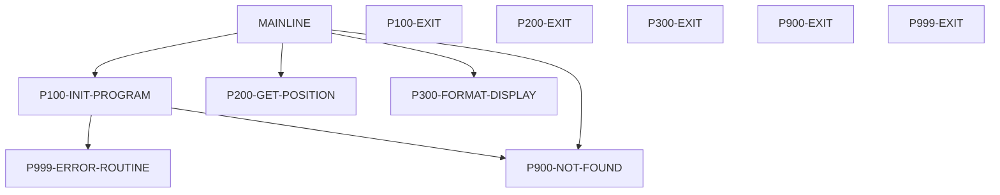

*Solid arrows are calls to the program's own paragraphs; dashed arrows are calls to other programs or paragraphs.*

### INQHIST

*Complexity: Medium · Rules: 5*

Online CICS transaction-history inquiry: DB2 connect + recovery, CURSMGR cursor over POSHIST, map HISMAP.

**Figure 6.2 — INQHIST process/call flow**

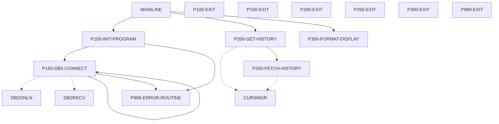

*Solid arrows are calls to the program's own paragraphs; dashed arrows are calls to other programs or paragraphs.*

### INQONLN

*Complexity: High · Rules: 7*

Online CICS main driver: session loop, dispatch to INQPORT/INQHIST, security via SECMGR, errors via ERRHNDL.

**Figure 6.3 — INQONLN process/call flow**

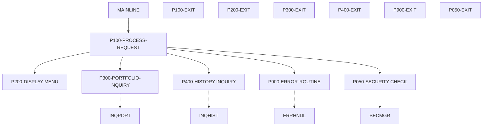

*Solid arrows are calls to the program's own paragraphs; dashed arrows are calls to other programs or paragraphs.*

### PORTADD

*Complexity: Medium · Rules: 7*

Batch: create portfolio records from input file with validation + add/dup/error counts.

**Figure 6.4 — PORTADD process/call flow**

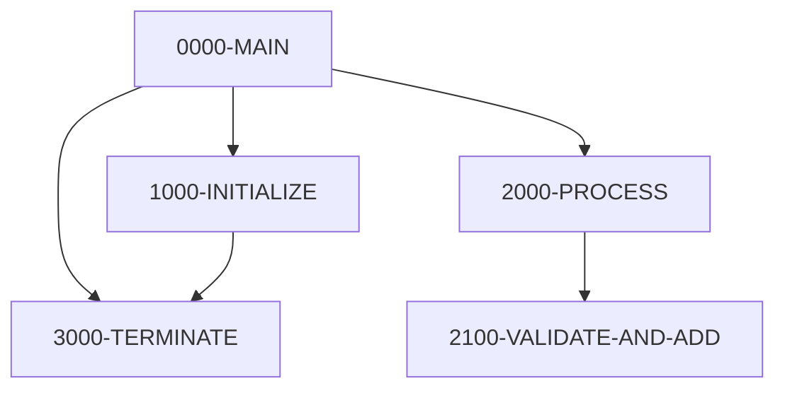

*Solid arrows are calls to the program's own paragraphs; dashed arrows are calls to other programs or paragraphs.*

### PORTREAD

*Complexity: Low · Rules: 3*

Batch: sequentially read and display all portfolio records (reporting utility).

**Figure 6.5 — PORTREAD process/call flow**

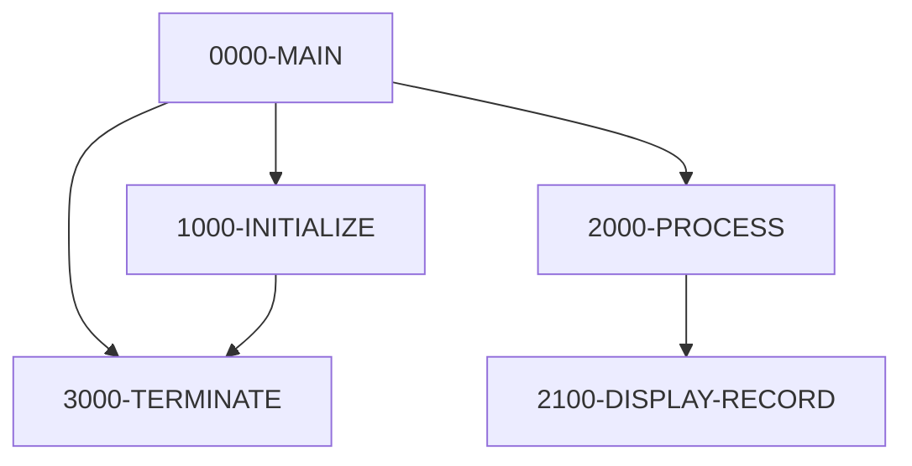

*Solid arrows are calls to the program's own paragraphs; dashed arrows are calls to other programs or paragraphs.*

### PORTMSTR

*Complexity: Medium · Rules: 10*

Callable portfolio CRUD service (C/R/U/D) with ID/name/status validation; 2 example stub paragraphs flagged.

**Figure 6.6 — PORTMSTR process/call flow**

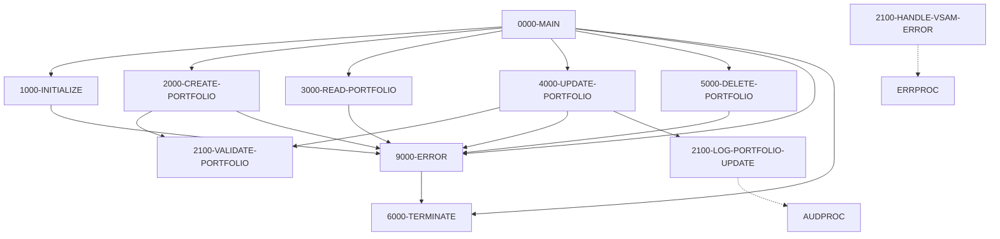

*Solid arrows are calls to the program's own paragraphs; dashed arrows are calls to other programs or paragraphs.*

### PORTUPDT

*Complexity: Medium · Rules: 6*

Batch: apply field-level updates (status/name/value) from an update file, REWRITE, count.

**Figure 6.7 — PORTUPDT process/call flow**

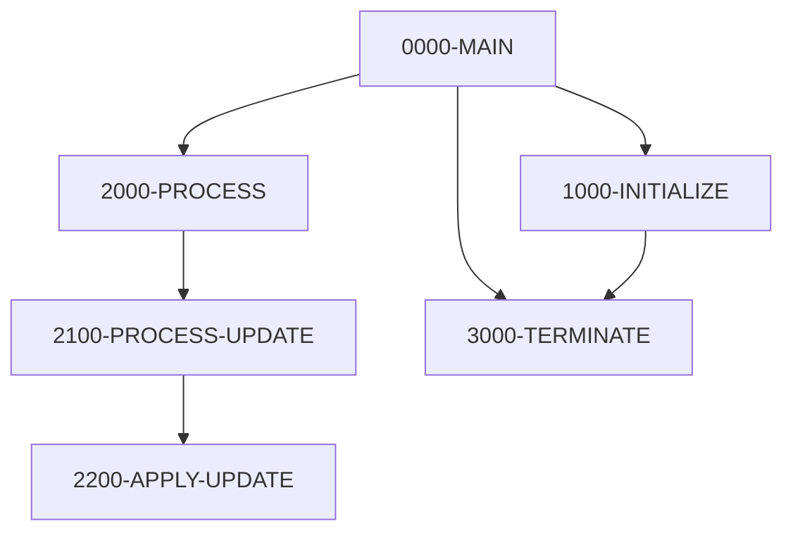

*Solid arrows are calls to the program's own paragraphs; dashed arrows are calls to other programs or paragraphs.*

### BCHCTL00

*Complexity: Medium · Rules: 6*

Callable Batch Control Processor (INIT/CHEK/UPDT/TERM) — SKELETON: sub-paragraphs unimplemented.

**Figure 6.8 — BCHCTL00 process/call flow**

```mermaid
flowchart TD
  0000_MAIN["0000-MAIN"]
  1000_PROCESS_INITIALIZE["1000-PROCESS-INITIALIZE"]
  2000_CHECK_PREREQUISITES["2000-CHECK-PREREQUISITES"]
  3000_UPDATE_STATUS["3000-UPDATE-STATUS"]
  4000_PROCESS_TERMINATE["4000-PROCESS-TERMINATE"]
  9000_ERROR_ROUTINE["9000-ERROR-ROUTINE"]
  0000_MAIN --> 1000_PROCESS_INITIALIZE
  0000_MAIN --> 2000_CHECK_PREREQUISITES
  0000_MAIN --> 3000_UPDATE_STATUS
  0000_MAIN --> 4000_PROCESS_TERMINATE
  0000_MAIN --> 9000_ERROR_ROUTINE
  1000_PROCESS_INITIALIZE -.-> 1100_OPEN_FILES
  1000_PROCESS_INITIALIZE -.-> 1200_READ_CONTROL_RECORD
  1000_PROCESS_INITIALIZE -.-> 1300_VALIDATE_PROCESS
  1000_PROCESS_INITIALIZE -.-> 1400_UPDATE_START_STATUS
  2000_CHECK_PREREQUISITES -.-> 2100_READ_CONTROL_RECORD
  2000_CHECK_PREREQUISITES -.-> 2200_CHECK_DEPENDENCIES
  3000_UPDATE_STATUS -.-> 3100_READ_CONTROL_RECORD
  3000_UPDATE_STATUS -.-> 3200_UPDATE_PROCESS_STATUS
  3000_UPDATE_STATUS -.-> 3300_WRITE_CONTROL_RECORD
  4000_PROCESS_TERMINATE -.-> 4100_UPDATE_COMPLETION
  4000_PROCESS_TERMINATE -.-> 4200_CLOSE_FILES
  9000_ERROR_ROUTINE -.-> ERRPROC
```

*Solid arrows are calls to the program's own paragraphs; dashed arrows are calls to other programs or paragraphs.*

### CKPRST

*Complexity: Medium · Rules: 7*

Callable Checkpoint/Restart service (INIT/TAKE/COMMIT/RESTART) — all operation bodies EMPTY stubs.

**Figure 6.9 — CKPRST process/call flow**

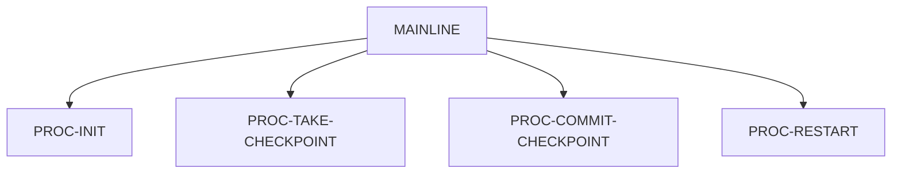

*Solid arrows are calls to the program's own paragraphs; dashed arrows are calls to other programs or paragraphs.*

### HISTLD00

*Complexity: Medium · Rules: 7*

Batch: load VSAM transaction history into DB2 POSHIST with commit-every-1000 + restartable checkpoints.

**Figure 6.10 — HISTLD00 process/call flow**

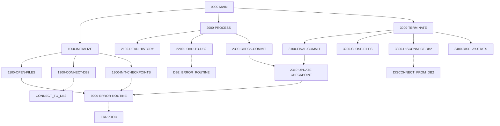

*Solid arrows are calls to the program's own paragraphs; dashed arrows are calls to other programs or paragraphs.*

### POSUPDT

*Complexity: Low · Rules: 0*

EMPTY source file — no COBOL, nothing to explain (flagged).

**Figure 6.11 — POSUPDT process/call flow**


*Solid arrows are calls to the program's own paragraphs; dashed arrows are calls to other programs or paragraphs.*

### PRCSEQ00

*Complexity: Medium · Rules: 25*

Callable batch scheduler / dependency engine: builds a process sequence, checks hard/soft deps + return codes, marks jobs active.

**Figure 6.12 — PRCSEQ00 process/call flow**

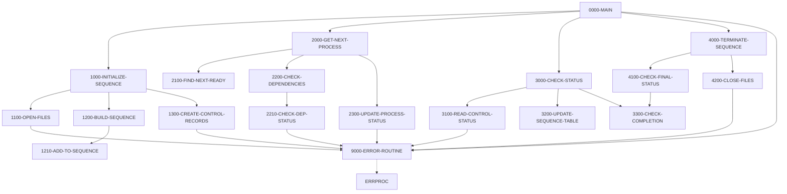

*Solid arrows are calls to the program's own paragraphs; dashed arrows are calls to other programs or paragraphs.*

### AUDPROC

*Complexity: Low · Rules: 3*

Shared audit-trail subroutine: append a timestamped before/after-image record to the audit log.

**Figure 6.13 — AUDPROC process/call flow**

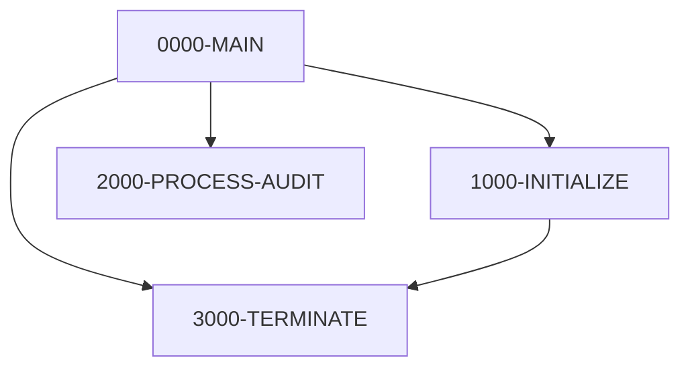

*Solid arrows are calls to the program's own paragraphs; dashed arrows are calls to other programs or paragraphs.*

### ERRPROC

*Complexity: Low · Rules: 0*

Shared error-processing subroutine: append to error log + print formatted error block; returns severity.

**Figure 6.14 — ERRPROC process/call flow**

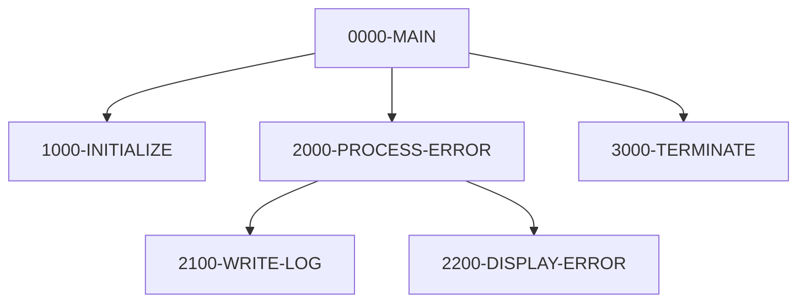

*Solid arrows are calls to the program's own paragraphs; dashed arrows are calls to other programs or paragraphs.*

### DB2CONN

*Complexity: Medium · Rules: 6*

Shared DB2 connection manager (CONN/DISC/STAT) with bounded retry + delay.

**Figure 6.15 — DB2CONN process/call flow**

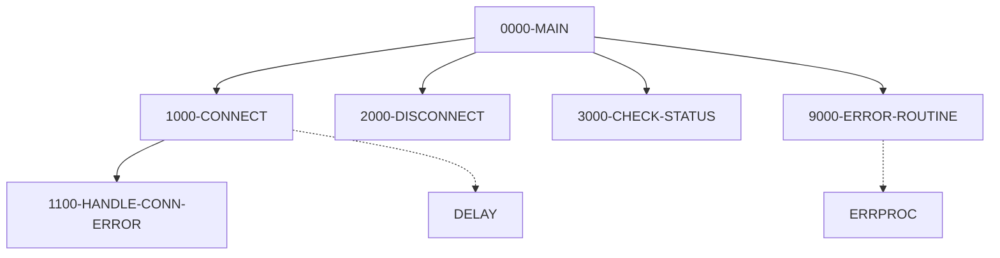

*Solid arrows are calls to the program's own paragraphs; dashed arrows are calls to other programs or paragraphs.*

### DB2CMT

*Complexity: Medium · Rules: 4*

Shared DB2 commit controller (commit-by-frequency, rollback, savepoint/restore, stats).

**Figure 6.16 — DB2CMT process/call flow**

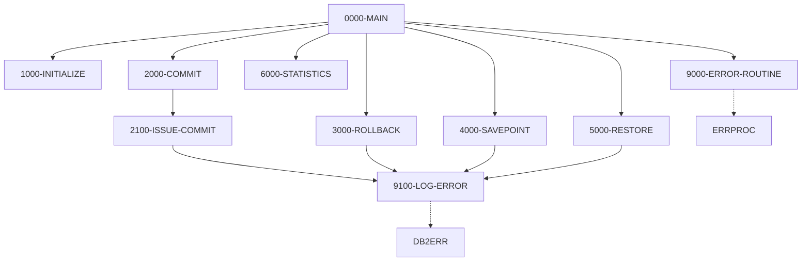

*Solid arrows are calls to the program's own paragraphs; dashed arrows are calls to other programs or paragraphs.*

### DB2ERR

*Complexity: Medium · Rules: 3*

Shared DB2 SQL error handler: log/diagnose/retrieve, classifies SQLCODEs + retry-ability.

**Figure 6.17 — DB2ERR process/call flow**

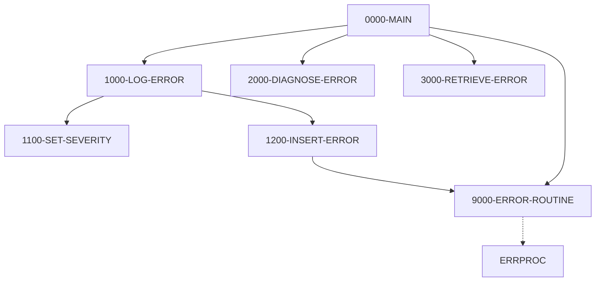

*Solid arrows are calls to the program's own paragraphs; dashed arrows are calls to other programs or paragraphs.*

### DB2STAT

*Complexity: Medium · Rules: 2*

Shared DB2 statistics collector via a session temp table; CPU time is a rough estimate (flagged).

**Figure 6.18 — DB2STAT process/call flow**

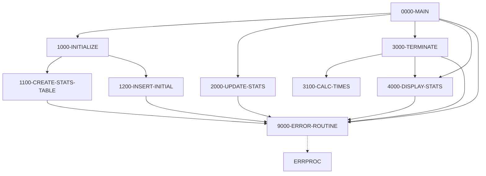

*Solid arrows are calls to the program's own paragraphs; dashed arrows are calls to other programs or paragraphs.*

### CURSMGR

*Complexity: Medium · Rules: 4*

Shared DB2 cursor manager (declare/open/fetch/close) — source TRUNCATED: fetch/close bodies missing (flagged).

**Figure 6.19 — CURSMGR process/call flow**

```mermaid
flowchart TD
  MAINLINE["MAINLINE"]
  P100_DECLARE_CURSOR["P100-DECLARE-CURSOR"]
  P100_EXIT["P100-EXIT"]
  P200_OPEN_CURSOR["P200-OPEN-CURSOR"]
  P200_EXIT["P200-EXIT"]
  MAINLINE --> P100_DECLARE_CURSOR
  MAINLINE --> P200_OPEN_CURSOR
  MAINLINE -.-> P300_FETCH_DATA
  MAINLINE -.-> P400_CLOSE_CURSOR
```

*Solid arrows are calls to the program's own paragraphs; dashed arrows are calls to other programs or paragraphs.*

### TSTVAL00

*Complexity: Medium · Rules: 5*

Batch test-validation suite skeleton: dispatch by test type, write report; test bodies unimplemented + divide-by-zero risk.

**Figure 6.20 — TSTVAL00 process/call flow**

```mermaid
flowchart TD
  0000_MAIN["0000-MAIN"]
  1000_INITIALIZE["1000-INITIALIZE"]
  1100_OPEN_FILES["1100-OPEN-FILES"]
  1200_WRITE_HEADERS["1200-WRITE-HEADERS"]
  1300_INIT_METRICS["1300-INIT-METRICS"]
  2000_PROCESS["2000-PROCESS"]
  2100_EXECUTE_TEST["2100-EXECUTE-TEST"]
  2900_WRITE_SUMMARY["2900-WRITE-SUMMARY"]
  3000_CLEANUP["3000-CLEANUP"]
  9999_ERROR_HANDLER["9999-ERROR-HANDLER"]
  0000_MAIN --> 1000_INITIALIZE
  0000_MAIN --> 2000_PROCESS
  0000_MAIN --> 3000_CLEANUP
  1000_INITIALIZE --> 1100_OPEN_FILES
  1000_INITIALIZE --> 1200_WRITE_HEADERS
  1000_INITIALIZE --> 1300_INIT_METRICS
  1100_OPEN_FILES --> 9999_ERROR_HANDLER
  2000_PROCESS --> 2100_EXECUTE_TEST
  2000_PROCESS --> 2900_WRITE_SUMMARY
  2100_EXECUTE_TEST -.-> 2200_RUN_FUNCTIONAL_TEST
  2100_EXECUTE_TEST -.-> 2300_RUN_INTEGRATION_TEST
  2100_EXECUTE_TEST -.-> 2400_RUN_PERFORMANCE_TEST
  2100_EXECUTE_TEST -.-> 2500_RUN_ERROR_TEST
  2100_EXECUTE_TEST -.-> 2600_VALIDATE_RESULTS
  2100_EXECUTE_TEST -.-> 2700_UPDATE_METRICS
  2100_EXECUTE_TEST -.-> 2800_WRITE_TEST_DETAIL
  2100_EXECUTE_TEST --> 9999_ERROR_HANDLER
```

*Solid arrows are calls to the program's own paragraphs; dashed arrows are calls to other programs or paragraphs.*

### UTLVAL00

*Complexity: Medium · Rules: 6*

Batch data-validation utility skeleton: dispatch by validation type; check bodies unimplemented.

**Figure 6.21 — UTLVAL00 process/call flow**

```mermaid
flowchart TD
  0000_MAIN["0000-MAIN"]
  1000_INITIALIZE["1000-INITIALIZE"]
  1100_OPEN_FILES["1100-OPEN-FILES"]
  1200_INIT_PROCESSING["1200-INIT-PROCESSING"]
  2000_PROCESS["2000-PROCESS"]
  2100_PROCESS_VALIDATION["2100-PROCESS-VALIDATION"]
  2200_CHECK_INTEGRITY["2200-CHECK-INTEGRITY"]
  2300_CHECK_XREF["2300-CHECK-XREF"]
  2400_CHECK_FORMAT["2400-CHECK-FORMAT"]
  2500_CHECK_BALANCE["2500-CHECK-BALANCE"]
  3000_CLEANUP["3000-CLEANUP"]
  9999_ERROR_HANDLER["9999-ERROR-HANDLER"]
  0000_MAIN --> 1000_INITIALIZE
  0000_MAIN --> 2000_PROCESS
  0000_MAIN --> 3000_CLEANUP
  1000_INITIALIZE --> 1100_OPEN_FILES
  1000_INITIALIZE --> 1200_INIT_PROCESSING
  1100_OPEN_FILES --> 9999_ERROR_HANDLER
  2000_PROCESS --> 2100_PROCESS_VALIDATION
  2100_PROCESS_VALIDATION --> 2200_CHECK_INTEGRITY
  2100_PROCESS_VALIDATION --> 2300_CHECK_XREF
  2100_PROCESS_VALIDATION --> 2400_CHECK_FORMAT
  2100_PROCESS_VALIDATION --> 2500_CHECK_BALANCE
  2100_PROCESS_VALIDATION --> 9999_ERROR_HANDLER
  2200_CHECK_INTEGRITY -.-> 2210_CHECK_POSITION_INTEGRITY
  2200_CHECK_INTEGRITY -.-> 2220_CHECK_TRANSACTION_INTEGRITY
  2300_CHECK_XREF -.-> 2310_CHECK_POSITION_XREF
  2300_CHECK_XREF -.-> 2320_CHECK_TRANSACTION_XREF
  2400_CHECK_FORMAT -.-> 2410_CHECK_POSITION_FORMAT
  2400_CHECK_FORMAT -.-> 2420_CHECK_TRANSACTION_FORMAT
  2500_CHECK_BALANCE -.-> 2510_ACCUMULATE_POSITIONS
  2500_CHECK_BALANCE -.-> 2520_VERIFY_BALANCES
```

*Solid arrows are calls to the program's own paragraphs; dashed arrows are calls to other programs or paragraphs.*

## 7. Component Architecture

**Most-called programs (hubs):** ERRHAND (10), ERRPROC (8), SQLCA (7), INQCOM (6), DBPROC (5), CURSMGR (4), PORTFLIO (4), BCHCTL (3).

**Most-shared copybooks:** ERRHAND (10), INQCOM (6), DBPROC (5), SQLCA (5), PORTFLIO (4), BCHCON (3).

## 8. Error Handling and Recovery

76 technical error-handling conditions were catalogued (file status, SQLCODE, CICS RESP and similar checks). These are handled by standard status-code checks after each I/O or SQL operation.

| Program | Paragraph | Condition |
|---|---|---|
| INQPORT | P100-INIT-PROGRAM | CICS HANDLE CONDITION: ERROR -> P999-ERROR-ROUTINE |
| INQPORT | P100-INIT-PROGRAM | CICS HANDLE CONDITION: NOTFND -> P900-NOT-FOUND |
| INQPORT | P200-GET-POSITION | IF WS-RESPONSE-CODE = DFHRESP(NORMAL)  -> POSITION-EXISTS else NO-POSI |
| INQHIST | P100-INIT-PROGRAM | CICS HANDLE CONDITION: ERROR -> P999-ERROR-ROUTINE |
| INQHIST | P150-DB2-CONNECT | IF DB2-RESPONSE-CODE <> 0 (connect failed) |
| INQHIST | P150-DB2-CONNECT | IF RECV-SUCCESS -> retry connect else -> error |
| INQHIST | P250-FETCH-HISTORY | IF fetch response >= 0 -> load rows |
| INQONLN | MAINLINE | CICS HANDLE CONDITION (ERROR/PGMIDERR/NOTFND) -> P900 |
| INQONLN | P100-PROCESS-REQUEST | IF SEC-RESPONSE-CODE <> 0 -> error + return |
| INQONLN | P900-ERROR-ROUTINE | IF ERR-ABEND -> CICS ABEND |
| PORTADD | 1000-INITIALIZE | IF file open failed (either file) -> terminate |
| PORTADD | 2000-PROCESS | READ ... AT END / NOT AT END |
| PORTADD | 2100-VALIDATE-AND-ADD | IF invalid (ID/client blank or status<>'A') -> count error + skip |
| PORTREAD | 1000-INITIALIZE | IF file open failed -> terminate |
| PORTREAD | 2000-PROCESS | READ NEXT ... AT END / NOT AT END |
| PORTMSTR | 1000-INITIALIZE | IF open failed -> 9000-ERROR (which GOBACKs) |
| PORTMSTR | 2000-CREATE-PORTFOLIO | IF validation failed -> error |
| PORTMSTR | 2000-CREATE-PORTFOLIO | IF PORT-DUP-KEY -> error |
| PORTMSTR | 2000-CREATE-PORTFOLIO | IF NOT PORT-SUCCESS -> error |
| PORTMSTR | 4000-UPDATE-PORTFOLIO | IF validation failed -> error |
| PORTMSTR | 4000-UPDATE-PORTFOLIO | IF PORT-NOT-FOUND -> error |
| PORTMSTR | 4000-UPDATE-PORTFOLIO | IF NOT PORT-SUCCESS -> error |
| PORTMSTR | 5000-DELETE-PORTFOLIO | IF PORT-NOT-FOUND -> error |
| PORTMSTR | 5000-DELETE-PORTFOLIO | IF NOT PORT-SUCCESS -> error |
| PORTUPDT | 1000-INITIALIZE | IF either open failed -> terminate |
| … | … | … and 51 more |

## 9. Gaps and Assumptions Register

This chapter lists everything static analysis could not fully resolve. Critical and high gaps should be resolved with SME input before this document drives modernisation or testing.

Total gaps: **26**  ·  critical: 0  ·  high: 3  ·  medium: 13  ·  low: 10

| Gap ID | Severity | Type | Description | Source |
|---|---|---|---|---|
| GAP-001 | HIGH | circular_copy | Circular COPY chain detected: CKPRST COPY CKPRST which COPYs CKPRST | inventory |
| GAP-002 | HIGH | empty_source | POSUPDT.cbl is empty — no program logic. | logic |
| GAP-003 | HIGH | truncated_source | CURSMGR.cbl truncated — fetch/close paragraphs missing though INQHIST depends on them. | logic |
| GAP-004 | MEDIUM | unresolved_reference | CALL target 'DELAY' not found in file registry — may be external or in load library | inventory |
| GAP-005 | MEDIUM | unresolved_reference | CICS_LINK target 'DB2ONLN' not found in file registry | inventory |
| GAP-006 | MEDIUM | unresolved_reference | CICS_LINK target 'DB2RECV' not found in file registry | inventory |
| GAP-007 | MEDIUM | unresolved_reference | CICS_LINK target 'ERRHNDL' not found in file registry | inventory |
| GAP-008 | MEDIUM | unresolved_reference | CICS_LINK target 'SECMGR' not found in file registry | inventory |
| GAP-009 | MEDIUM | unresolved_reference | CICS_LINK target 'SECMGR' not found in file registry | inventory |
| GAP-010 | MEDIUM | unresolved_reference | CICS_LINK target 'SECMGR' not found in file registry | inventory |
| GAP-011 | MEDIUM | unresolved_reference | SQL INCLUDE target 'SQLPOS' not found in file registry | inventory |
| GAP-012 | MEDIUM | skeletons | BCHCTL00, CKPRST, TSTVAL00, UTLVAL00 are skeletons — dispatch logic present but low-level sub-paragraphs / operation bodies unimplemented. | logic |
| GAP-013 | MEDIUM | rule_sme_review | BR-030 “Validate End Of Session (88 session Terminated)” — low confidence, requires SME confirmation. | rules |
| GAP-014 | MEDIUM | rule_sme_review | BR-032 “Validate End Of Tests” — low confidence, requires SME confirmation. | rules |
| GAP-015 | MEDIUM | rule_sme_review | BR-034 “Validate End Of Val” — low confidence, requires SME confirmation. | rules |
| GAP-016 | MEDIUM | rule_sme_review | BR-069 “Validate Position Found (88 position Exists)” — low confidence, requires SME confirmation. | rules |
| GAP-017 | LOW | complete_run | All 21 sample programs explained (no key, in-session). | logic |
| GAP-018 | LOW | notable_findings | INQONLN validates security AFTER dispatching the function; PORTADD/PORTREAD/PORTUPDT terminate-without-stopping on open failure; PORTUPDT/PORTMSTR EVALUATEs lack WHEN OTHER; INQHIST DB2 retry is unbounded recursion. | logic |
| GAP-019 | LOW | ambiguous_logic | INQHIST: 1 paragraph(s) flagged ambiguous during pseudocode extraction. | logic |
| GAP-020 | LOW | ambiguous_logic | PORTMSTR: 2 paragraph(s) flagged ambiguous during pseudocode extraction. | logic |
| GAP-021 | LOW | ambiguous_logic | BCHCTL00: 4 paragraph(s) flagged ambiguous during pseudocode extraction. | logic |
| GAP-022 | LOW | ambiguous_logic | CKPRST: 4 paragraph(s) flagged ambiguous during pseudocode extraction. | logic |
| GAP-023 | LOW | ambiguous_logic | DB2STAT: 1 paragraph(s) flagged ambiguous during pseudocode extraction. | logic |
| GAP-024 | LOW | ambiguous_logic | CURSMGR: 2 paragraph(s) flagged ambiguous during pseudocode extraction. | logic |
| GAP-025 | LOW | ambiguous_logic | TSTVAL00: 2 paragraph(s) flagged ambiguous during pseudocode extraction. | logic |
| GAP-026 | LOW | ambiguous_logic | UTLVAL00: 4 paragraph(s) flagged ambiguous during pseudocode extraction. | logic |

## Appendices

- **Appendix A — Full data dictionary:** see `outputs/data/data_artifact.json` (823 fields) and `outputs/data/data_layouts/`.
- **Appendix B — Program pseudocode:** see `outputs/logic/program_logic/*.json` (180 paragraphs).
- **Appendix C — Diagram index:** pending the Diagram agent.

